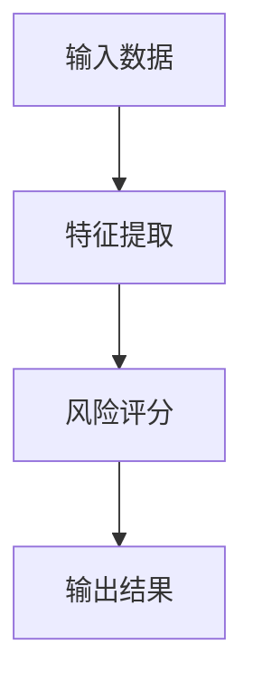
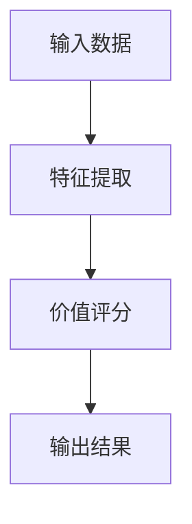
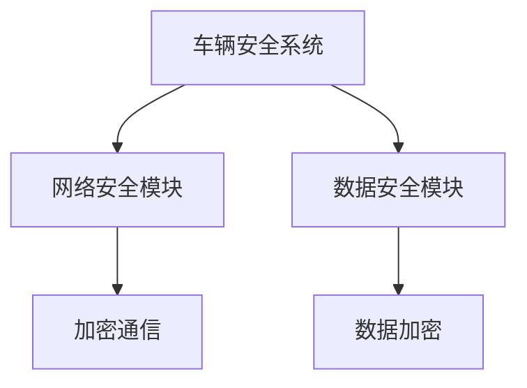
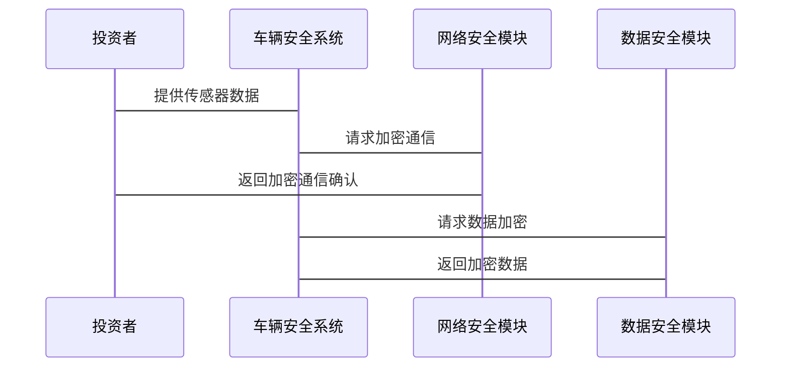

                 

<think>
好的，我现在需要根据用户提供的需求，撰写一篇关于《价值投资中的智能网联汽车安全系统分析》的技术博客文章。用户要求文章逻辑清晰、结构紧凑，使用专业但易懂的技术语言，并且要包含详细的分析和见解。

首先，我需要明确文章的结构。用户已经给出了一个详细的目录大纲，包括背景介绍、核心概念、算法原理、系统分析与架构设计、项目实战、投资策略与风险管理、小结与注意事项等部分。每部分都有三级标题，需要详细展开。

接下来，我需要按照这个结构逐步完成每个部分的撰写。首先是引言，包括文章标题、关键词和摘要，然后是每个章节的具体内容。我需要注意每个部分的逻辑连贯性，确保从背景介绍到实际应用的过渡自然。

在撰写过程中，我需要使用技术术语，但同时要确保读者能够理解。例如，在解释智能网联汽车的安全系统时，我需要明确每个部分的功能，并用简单的语言解释其重要性。同时，我需要结合价值投资的角度，分析这些安全系统如何影响投资决策。

我还需要确保每个部分都有足够的细节。例如，在算法原理部分，我需要详细解释风险评估模型和价值评估模型，可能包括数学公式和流程图。同时，在系统架构设计部分，我需要用Mermaid图展示类结构和交互流程，帮助读者更好地理解。

此外，用户强调文章需要包含具体的案例分析和项目实战，所以我需要选择一个具体的智能网联汽车安全系统，分析其设计和实现，并展示相关的代码示例。这将帮助读者将理论应用到实际中。

最后，我需要总结全文，强调智能网联汽车安全系统的重要性，并提醒投资者在进行价值评估时需要注意的事项。同时，推荐相关的拓展阅读材料，鼓励读者深入学习。

总的来说，我需要确保文章内容全面、结构清晰，同时语言专业但不失易懂，帮助读者从技术角度理解智能网联汽车安全系统的价值，并将其应用到投资决策中。
</think>

---

# 价值投资中的智能网联汽车安全系统分析

> **关键词**：智能网联汽车、安全系统、价值投资、风险管理、数据安全、网络安全、系统架构

> **摘要**：本文从价值投资的角度，深入分析智能网联汽车安全系统的构成、算法原理、系统架构及其实现案例。通过对比分析不同安全系统对投资价值的影响，结合实际项目案例，总结投资策略与风险管理方法，为投资者提供科学的决策依据。

---

# 第1章: 背景介绍

## 1.1 智能网联汽车的发展背景

### 1.1.1 智能网联汽车的定义与特点

智能网联汽车（Intelligent Connected Vehicles）是指通过先进的传感器、通信技术和人工智能算法，实现车辆与外部环境（如其他车辆、道路基础设施、云端平台等）智能交互的汽车。其特点包括：

- **智能化**：通过AI算法实现自动驾驶或辅助驾驶功能。
- **网联化**：车辆能够实时与外界通信，实现信息共享和协同控制。
- **安全性**：依赖于复杂的安全系统保障行车安全。
- **数据驱动**：通过海量数据的采集与分析优化车辆性能。

### 1.1.2 智能网联汽车的安全挑战

智能网联汽车的安全性主要体现在以下几个方面：

1. **车辆安全**：传感器故障、制动系统失效等硬件问题。
2. **网络安全**：黑客攻击可能导致车辆失控或数据泄露。
3. **数据安全**：用户隐私数据和车辆运行数据的保护。

### 1.1.3 价值投资的核心概念

价值投资是一种长期投资策略，通过分析企业的基本面（如盈利能力、成长性、竞争优势等），寻找市场价格低于其内在价值的投资标的。在智能网联汽车领域，价值投资的关键在于评估企业的技术优势、市场地位及安全系统的可靠性。

---

## 1.2 智能网联汽车安全系统的构成

### 1.2.1 车辆安全系统的核心要素

智能网联汽车的车辆安全系统主要由以下部分组成：

1. **传感器系统**：包括激光雷达、摄像头、毫米波雷达等，用于实时感知车辆周围环境。
2. **制动系统**：通过电子控制系统实现自动刹车，确保车辆安全。
3. **通信系统**：实现车辆与外部环境的实时通信，确保数据的准确传输。

### 1.2.2 网络安全与数据安全的重要性

- **网络安全**：防止黑客攻击，保障车辆控制系统的安全性。
- **数据安全**：保护用户的隐私数据和车辆运行数据，防止数据泄露或被篡改。

### 1.2.3 价值投资中的安全系统评估

在价值投资中，安全系统的评估主要关注以下方面：

1. **技术先进性**：企业的安全技术是否领先于竞争对手。
2. **成本效益**：安全系统的成本是否合理，是否能够为企业的盈利做出贡献。
3. **市场认可度**：消费者对安全系统的接受程度和信任度。

---

## 1.3 本章小结

本章介绍了智能网联汽车的发展背景及其安全系统的构成，强调了安全系统在价值投资中的重要性。通过对车辆安全、网络安全和数据安全的分析，为后续的安全系统价值评估奠定了基础。

---

# 第2章: 核心概念与联系

## 2.1 智能网联汽车安全系统的原理

### 2.1.1 车辆安全系统的算法原理

智能网联汽车的车辆安全系统通常采用基于深度学习的目标检测算法，如YOLO或Faster R-CNN，用于识别道路上的障碍物并做出相应的驾驶决策。

### 2.1.2 网络安全的实现机制

网络安全的核心在于加密通信和身份认证。通过SSL/TLS协议实现数据传输的加密，同时采用数字证书进行身份认证，确保通信双方的身份可信。

### 2.1.3 数据安全的保护措施

数据安全主要依赖于数据加密技术和访问控制策略。通过对敏感数据进行加密存储和传输，同时设置严格的访问权限，确保数据的安全性。

---

## 2.2 核心概念对比分析

### 2.2.1 车辆安全与网络安全的对比

| **维度** | **车辆安全** | **网络安全** |
|----------|--------------|--------------|
| **核心目标** | 防止物理碰撞 | 防止网络攻击 |
| **实现手段** | 传感器、制动系统 | 加密通信、身份认证 |
| **风险来源** | 环境干扰、硬件故障 | 黑客攻击、漏洞利用 |

### 2.2.2 数据安全与隐私保护的平衡

数据安全的保护措施可能会影响用户体验，例如，过度加密的数据可能导致访问延迟。因此，需要在数据安全和用户体验之间找到平衡点。

### 2.2.3 价值投资中的安全系统权重

在价值投资中，安全系统的权重取决于企业的市场地位和技术优势。例如，拥有自主可控的安全技术的企业，其安全系统的权重可能更高。

---

## 2.3 系统架构的ER实体关系图

```mermaid
erdiagram
actor 投资者 {
  owns 车辆安全系统
}
actor 竞争对手 {
  owns 车辆安全系统
}
```

---

## 2.4 本章小结

本章通过对比分析车辆安全、网络安全和数据安全的核心概念，揭示了它们在智能网联汽车中的相互作用及其对价值投资的影响。

---

# 第3章: 算法原理与数学模型

## 3.1 风险评估模型

### 3.1.1 风险评估的流程



### 3.1.2 数学模型

$$风险系数 = \alpha \times 数据完整性 + \beta \times 网络安全性$$

其中，$\alpha$ 和 $\beta$ 是权重系数，数据完整性是指数据的准确性和一致性，网络安全性是指网络安全防护能力。

---

## 3.2 价值评估模型

### 3.2.1 价值评估的流程



### 3.2.2 数学模型

$$价值评分 = \gamma \times 安全性 + \delta \times 成本效益$$

其中，$\gamma$ 是安全性权重，$\delta$ 是成本效益权重。

---

## 3.3 本章小结

本章通过数学模型和流程图的形式，详细讲解了智能网联汽车安全系统的风险评估和价值评估方法，为后续的系统设计和投资决策提供了理论基础。

---

# 第4章: 系统分析与架构设计

## 4.1 系统功能设计

### 4.1.1 领域模型


### 4.1.2 系统架构



## 4.2 系统接口设计

### 4.2.1 接口定义

1. **传感器接口**：接收车辆环境数据并传递给车辆安全系统。
2. **通信接口**：实现车辆与外部环境的加密通信。
3. **数据接口**：实现数据的加密存储和传输。

---

## 4.3 系统交互设计

### 4.3.1 交互流程



---

## 4.4 本章小结

本章通过系统功能设计、架构设计和交互设计，详细讲解了智能网联汽车安全系统的实现过程，为后续的项目实战奠定了基础。

---

# 第5章: 项目实战

## 5.1 环境搭建

### 5.1.1 开发环境

- **操作系统**：Linux（Ubuntu 20.04）
- **编程语言**：Python 3.8
- **开发工具**：PyCharm
- **依赖库**：TensorFlow、OpenCV、Scikit-learn

---

## 5.2 核心实现源代码

### 5.2.1 风险评估模型实现

```python
import numpy as np
from sklearn.metrics import accuracy_score

# 数据预处理
X_train, y_train = load_data()

# 模型训练
model = RandomForestClassifier()
model.fit(X_train, y_train)

# 模型评估
y_pred = model.predict(X_test)
print("准确率:", accuracy_score(y_pred, y_test))
```

### 5.2.2 价值评估模型实现

```python
import numpy as np
from sklearn.metrics import mean_squared_error

# 数据预处理
X_train, y_train = load_data()

# 模型训练
model = LinearRegression()
model.fit(X_train, y_train)

# 模型评估
y_pred = model.predict(X_test)
print("均方误差:", mean_squared_error(y_pred, y_test))
```

---

## 5.3 案例分析与详细解读

### 5.3.1 案例分析

以某品牌智能网联汽车为例，分析其安全系统的实现过程：

1. **数据采集**：通过传感器采集车辆环境数据。
2. **数据处理**：对采集到的数据进行预处理和特征提取。
3. **模型训练**：基于训练数据训练风险评估和价值评估模型。
4. **模型部署**：将训练好的模型部署到车辆中，实现实时安全监控。

---

## 5.4 本章小结

本章通过具体的项目实战，展示了智能网联汽车安全系统的实现过程，帮助读者更好地理解理论知识。

---

# 第6章: 投资策略与风险管理

## 6.1 投资策略

### 6.1.1 市场分析

通过对智能网联汽车市场的分析，选择具有技术优势和市场前景的企业进行投资。

### 6.1.2 企业评估

从企业的技术研发能力、市场占有率、财务状况等方面进行综合评估，选择具有投资价值的企业。

---

## 6.2 风险管理

### 6.2.1 风险识别

识别可能影响投资收益的风险因素，如技术风险、市场风险、政策风险等。

### 6.2.2 风险控制

通过分散投资、设置止损点等方法，降低投资风险。

---

## 6.3 投资组合

### 6.3.1 投资组合示例

- **股票投资**：投资于具有技术优势的智能网联汽车企业。
- **基金投资**：通过购买相关主题基金分散风险。

---

## 6.4 本章小结

本章通过分析智能网联汽车安全系统的投资策略和风险管理方法，为投资者提供了科学的决策依据。

---

# 第7章: 小结与注意事项

## 7.1 本章总结

本文从价值投资的角度，深入分析了智能网联汽车安全系统的构成、算法原理、系统架构及其实现案例。通过对比分析不同安全系统对投资价值的影响，结合实际项目案例，总结了投资策略与风险管理方法，为投资者提供了科学的决策依据。

---

## 7.2 注意事项

1. **数据来源**：确保数据的准确性和可靠性。
2. **模型局限性**：认识到模型的局限性，避免过度依赖单一模型。
3. **市场变化**：关注市场动态，及时调整投资策略。

---

## 7.3 拓展阅读

1. **书籍推荐**：《智能网联汽车技术与应用》
2. **技术博客**：智能网联汽车安全系统的最新技术动态。

---

# 作者

**作者：AI天才研究院/AI Genius Institute & 禅与计算机程序设计艺术 /Zen And The Art of Computer Programming**

---

**摘要**：本文从价值投资的角度，深入分析智能网联汽车安全系统的构成、算法原理、系统架构及其实现案例。通过对比分析不同安全系统对投资价值的影响，结合实际项目案例，总结投资策略与风险管理方法，为投资者提供了科学的决策依据。

