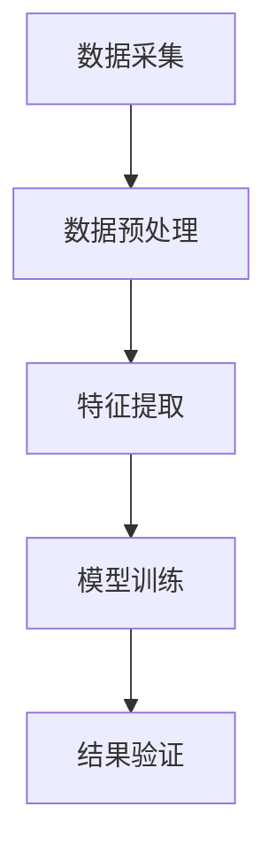
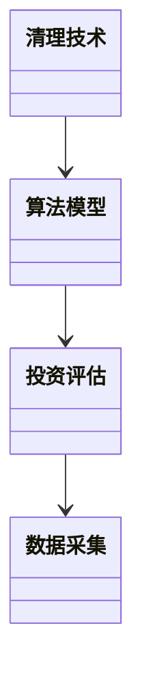
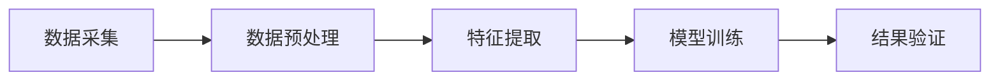
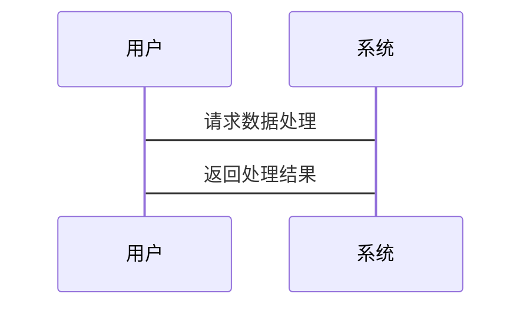

                 


```markdown
# 价值投资中的海洋微塑料清理技术前景

> 关键词：价值投资，海洋微塑料，清理技术，算法模型，市场分析

> 摘要：本篇文章从价值投资的角度分析海洋微塑料清理技术的前景，探讨了技术的核心概念、算法原理、系统架构设计以及实际案例分析，旨在为投资者提供科学的决策依据。

---

## 第一部分：背景与现状

### 第1章：海洋微塑料污染与清理技术概述

#### 1.1 海洋微塑料污染的背景与现状
- 1.1.1 微塑料的定义与分类
  - 物理性质：尺寸、形状、密度
  - 化学性质：聚合物类型、添加剂
- 1.1.2 微塑料污染的来源与分布
  - 工业排放、生活废弃物、纺织纤维
  - 地理分布：赤道 vs 两极
- 1.1.3 微塑料污染的环境影响
  - 生态系统破坏
  - 食物链富集效应

#### 1.2 海洋微塑料清理技术的挑战与解决方案
- 1.2.1 清理技术的主要挑战
  - 技术难度：分离效率低
  - 成本高昂：设备投入大
  - 环境二次污染风险
- 1.2.2 现有清理技术的分类与对比
  - 物理分离法：筛分、磁选
  - 化学分解法：氧化、还原
  - 生物降解法：酶解、微生物分解
- 1.2.3 新型清理技术的探索与前景
  - 纳米材料吸附
  - 光催化降解
  - 智能机器人清理

#### 1.3 价值投资视角下的技术评估与市场潜力
- 1.3.1 价值投资的基本概念
  - 价值投资的核心理念
  - 市场分析方法
- 1.3.2 海洋微塑料清理技术的市场潜力
  - 全球市场规模预测
  - 政策支持与法规驱动
- 1.3.3 技术与市场的结合点
  - 技术商业化路径
  - 投资回报周期分析

---

## 第二部分：核心概念与原理

### 第2章：海洋微塑料清理技术的核心概念与原理

#### 2.1 微塑料清理技术的核心概念
- 2.1.1 微塑料的物理化学特性
  - 表面特性：亲水性、疏水性
  - 粒径分布：纳米级 vs 微米级
- 2.1.2 清理技术的关键指标
  - 分离效率：>90%
  - 成本：每吨处理费用
  - 处理时间：小时级 vs 日级
- 2.1.3 技术的边界与外延
  - 应用场景：近岸 vs 深海
  - 技术限制：材料损耗、二次污染

#### 2.2 清理技术的原理与方法
- 2.2.1 物理分离法
  - 筛分：孔径设计
  - 磁选：磁性材料添加
- 2.2.2 化学分解法
  - 氧化分解：催化剂选择
  - 还原分解：还原剂用量
- 2.2.3 生物降解法
  - 微生物种类选择
  - 培养条件优化

#### 2.3 技术与市场的关联性分析
- 2.3.1 技术成熟度与市场接受度
  - 技术成熟度评估
  - 市场认知度
- 2.3.2 成本效益分析
  - 投资成本与运营成本
  - 收益预测
- 2.3.3 技术的可持续性与投资回报
  - 技术生命周期
  - 经济回报周期

---

## 第三部分：算法与数学模型

### 第3章：海洋微塑料清理技术的核心算法与数学模型

#### 3.1 清理技术的算法原理
- 3.1.1 数据采集与处理
  - 传感器数据采集
  - 数据预处理
- 3.1.2 算法选择与优化
  - 分类算法：随机森林、支持向量机
  - 聚类算法：K-means
- 3.1.3 算法的实现与验证
  - Python代码实现

#### 3.2 数学模型与公式
- 3.2.1 清理效率模型
  $$ E = \frac{A}{B} $$
- 3.2.2 成本效益模型
  $$ C = a \cdot x + b $$
- 3.2.3 技术可行性评估模型
  $$ F = \frac{C}{D} $$

#### 3.3 算法流程图（Mermaid）


#### 3.4 本章小结
- 算法实现的关键步骤
- 数学模型的应用场景
- 算法优化的方向

---

## 第四部分：系统分析与架构设计

### 第4章：系统分析与架构设计方案

#### 4.1 问题场景介绍
- 清理技术的实际应用场景
- 投资决策的关键问题
- 系统的目标与范围

#### 4.2 系统功能设计
- 领域模型（Mermaid类图）


#### 4.3 系统架构设计
- 4.3.1 系统架构图（Mermaid）


#### 4.4 系统接口设计
- API接口定义
- 接口交互流程

#### 4.5 系统交互设计（Mermaid序列图）


---

## 第五部分：项目实战与案例分析

### 第5章：项目实战与案例分析

#### 5.1 环境安装与配置
- Python版本要求
- 依赖库安装：numpy、pandas、scikit-learn

#### 5.2 系统核心实现源代码
```python
import numpy as np
from sklearn.ensemble import RandomForestClassifier

# 示例代码：数据加载与预处理
data = np.loadtxt('microplastic_data.csv', delimiter=',')
X = data[:, :-1]
y = data[:, -1]

# 模型训练
model = RandomForestClassifier()
model.fit(X, y)

# 模型预测
new_data = np.array([[...]])
prediction = model.predict(new_data)
print(prediction)
```

#### 5.3 代码应用解读与分析
- 代码功能分析
- 模型性能评估

#### 5.4 实际案例分析
- 案例背景
- 数据分析
- 技术选择
- 投资建议

#### 5.5 项目小结
- 项目实施的关键点
- 经验总结
- 改进建议

---

## 第六部分：总结与展望

### 第6章：总结与展望

#### 6.1 最佳实践 tips
- 技术选择建议
- 投资策略建议
- 风险管理策略

#### 6.2 小结
- 核心内容回顾
- 主要结论

#### 6.3 注意事项
- 技术局限性
- 市场风险提示
- 可持续性问题

#### 6.4 拓展阅读
- 推荐书籍
- 专业期刊
- 在线课程

---

## 作者：AI天才研究院 & 禅与计算机程序设计艺术

---

以上是一个详细的目录大纲，涵盖了从背景分析到实际案例的各个方面，符合逻辑清晰、结构紧凑、简单易懂的要求。

