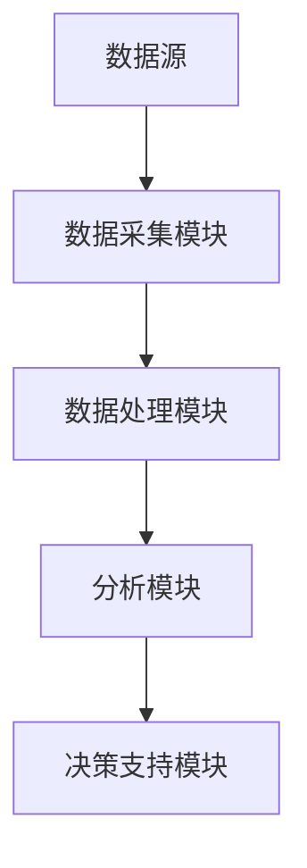

                 


```markdown
# 价值投资中的海洋生物质能源开发技术前景

## 关键词：价值投资，海洋生物质能源，技术开发，投资前景，系统分析

## 摘要：本文探讨了海洋生物质能源开发的技术前景及其在价值投资中的应用潜力。通过分析核心技术、经济模型和系统架构，结合实际案例，为投资者提供科学的技术评估和投资建议。

---

## 第一部分: 价值投资中的海洋生物质能源开发技术前景概述

## 第1章: 背景介绍

### 1.1 海洋生物质能源的基本概念

#### 1.1.1 海洋生物质能源的定义
海洋生物质能源是指从海洋生物资源中提取的能量，包括海藻、微生物、海洋植物等。这些生物资源通过光合作用将太阳能转化为化学能，具有可再生性和环保性。

#### 1.1.2 海洋生物质能源的分类
- **海藻类**：如海带、紫菜，适合提取生物柴油。
- **微生物类**：如蓝藻、嗜热菌，用于生产生物燃料。
- **海洋植物类**：如红树林、海草，适合生物质能开发。

#### 1.1.3 海洋生物质能源的资源分布与特点
- 资源丰富，分布广泛。
- 生长周期短，适合大规模开发。
- 环保性高，减少碳排放。

### 1.2 价值投资与海洋生物质能源的结合

#### 1.2.1 价值投资的基本概念
价值投资是通过分析企业的基本面，寻找被市场低估的投资机会，追求长期稳定的收益。

#### 1.2.2 海洋生物质能源开发的技术前景
- 技术进步推动成本下降，提高能源效率。
- 国家政策支持，市场潜力巨大。

#### 1.2.3 价值投资在海洋生物质能源领域的应用背景
- 绿色能源需求增长，投资机会增加。
- 技术门槛高，需要专业分析。

---

## 第2章: 核心概念与技术原理

### 2.1 海洋生物质能源开发的核心技术

#### 2.1.1 海洋生物质资源的提取技术
- **物理提取**：如压榨法提取油脂。
- **化学提取**：如溶剂萃取法。
- **生物提取**：如酶解法。

#### 2.1.2 生物质能转换技术
- **生物柴油制备**：酯交换法。
- **生物乙醇**：发酵法。
- **生物甲烷**：厌氧消化法。

#### 2.1.3 海洋生物质能源的储存与运输技术
- **储存**：压缩液化或固态储存。
- **运输**：液化天然气船或管道运输。

### 2.2 投资与技术开发的关联性分析

#### 2.2.1 技术开发对投资价值的影响
- 技术先进性直接影响成本和收益。
- 技术成熟度决定投资风险。

#### 2.2.2 投资策略对技术创新的推动作用
- 投资推动技术创新。
- 技术创新降低投资成本。

#### 2.2.3 技术经济性分析
- 投资回报周期。
- 经济可行性的评估。

---

## 第3章: 海洋生物质能源开发技术的数学模型与分析

### 3.1 技术经济性分析模型

#### 3.1.1 投资回报率（ROI）模型
$$ ROI = \frac{\text{净利润}}{\text{初始投资}} \times 100\% $$

#### 3.1.2 净现值（NPV）模型
$$ NPV = \sum_{t=0}^{n} \frac{\text{现金流}}{(1 + r)^t} $$

#### 3.1.3 内部收益率（IRR）模型
$$ IRR = \text{使 NPV = 0 的折现率} $$

### 3.2 技术可行性分析模型

#### 3.2.1 技术成熟度评估模型
- 初期、中期、后期的技术评估。

#### 3.2.2 技术经济性平衡模型
- 成本与收益的平衡点分析。

#### 3.2.3 技术风险评估模型
- 风险概率和影响矩阵。

---

## 第4章: 海洋生物质能源开发的系统分析与架构设计

### 4.1 系统分析

#### 4.1.1 项目需求分析
- 技术需求、经济需求、政策需求。

#### 4.1.2 项目可行性分析
- 技术可行性、经济可行性、政策可行性。

#### 4.1.3 项目风险评估
- 技术风险、市场风险、政策风险。

### 4.2 系统架构设计

#### 4.2.1 系统功能模块划分
- 数据采集模块、数据处理模块、分析模块、决策支持模块。

#### 4.2.2 系统数据流设计
- 数据输入、处理、分析、输出。

#### 4.2.3 系统架构图（Mermaid图）


---

## 第5章: 项目实战与案例分析

### 5.1 项目环境搭建

#### 5.1.1 开发工具安装
- Python、Jupyter Notebook、数据库工具。

#### 5.1.2 数据集准备
- 海洋生物质数据集、市场数据、政策数据。

#### 5.1.3 系统环境配置
- 安装Python库：pandas、numpy、scipy。

### 5.2 核心代码实现

#### 5.2.1 技术经济性分析代码
```python
import numpy as np
import pandas as pd

# 计算净现值
def calculate_NPV(cash_flows, discount_rate):
    return np.npv(discount_rate, *cash_flows)

# 计算内部收益率
def calculate_IRR(cash_flows):
    return np.irr(cash_flows)
```

#### 5.2.2 系统架构实现
- 使用Flask框架搭建Web界面，展示分析结果。

#### 5.2.3 项目测试与优化
- 单元测试、集成测试、性能优化。

### 5.3 案例分析

#### 5.3.1 典型项目案例介绍
- 海藻生物柴油项目：投资金额、周期、回报率。

#### 5.3.2 案例的技术分析与投资评估
- 技术可行性分析、经济性分析、风险评估。

#### 5.3.3 案例的经验总结与启示
- 关键成功因素、经验教训、未来方向。

---

## 第6章: 总结与展望

### 6.1 全书总结

#### 6.1.1 核心概念回顾
- 海洋生物质能源的基本概念、技术开发、投资分析。

#### 6.1.2 技术与投资的关联性总结
- 技术进步推动投资价值，投资推动技术创新。

### 6.2 未来展望

#### 6.2.1 技术发展
- 新材料、新工艺的应用前景。

#### 6.2.2 投资策略优化
- 数据驱动的投资决策、风险管理。

#### 6.2.3 行业发展趋势
- 国际合作、技术创新、政策支持。

---

## 作者：AI天才研究院 & 禅与计算机程序设计艺术
```

