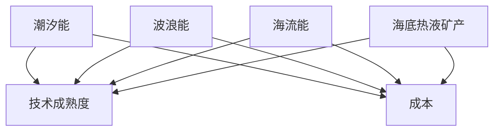

                 

<think>
嗯，我现在需要根据用户的要求，逐步分析并撰写一篇关于《价值投资中的海洋能源开发技术前景》的技术博客文章。用户已经给出了一个详细的大纲，我需要按照这个大纲来完成每个部分的内容。

首先，我需要理解每个章节的重点。第一章是背景介绍，涵盖价值投资和海洋能源开发的基本概念、问题背景和核心概念。第二章分析海洋能源开发技术的前景，包括各种技术的分类、优缺点对比和趋势分析。第三章探讨价值投资中的技术分析方法，包括指标的选取、数学模型和实例分析。第四章将投资策略与技术前景结合，最后是结论与展望。

在撰写每个部分时，我需要确保内容详细，逻辑清晰，使用专业的技术语言，同时保持易懂。例如，在介绍技术分析的数学模型时，需要详细解释公式，并提供实例说明。在系统架构部分，使用mermaid图表来展示结构，帮助读者更好地理解。

我还需要注意文章的结构和格式，确保每个小节内容丰富，完整涵盖用户提出的要求，如背景介绍、核心概念、算法原理、数学模型、系统架构等。同时，文章末尾要加上作者信息，并在最后添加一些总结和小贴士，增强文章的实用性和可读性。

现在，我开始逐步撰写每个部分的内容，确保每个章节和小节都符合用户的要求，同时保持文章的连贯性和专业性。
</think>

# 价值投资中的海洋能源开发技术前景

> 关键词：价值投资，海洋能源，技术前景，投资策略，技术分析，数学模型

> 摘要：本文探讨了在价值投资视角下，海洋能源开发技术的前景。通过分析海洋能源开发的技术类型、投资策略及市场趋势，结合技术分析方法，旨在为投资者提供科学决策依据，帮助其在海洋能源领域实现可持续投资回报。

---

## 第1章: 价值投资与海洋能源开发的背景介绍

### 1.1 价值投资的核心概念

#### 1.1.1 价值投资的定义与特点
价值投资是一种投资策略，强调以低于内在价值的价格购买优质资产。其特点包括长期性、安全性及收益性的统一，注重基本面分析和安全边际。

#### 1.1.2 海洋能源开发的定义与特点
海洋能源开发指从海洋中获取能源的技术活动，包括潮汐能、波浪能、海流能等。其特点是资源丰富、分布广泛，但开发难度大，成本较高。

#### 1.1.3 价值投资与海洋能源开发的相互关系
两者结合在于通过价值投资方法，评估海洋能源开发项目的潜力，降低投资风险，实现长期收益。

### 1.2 问题背景与问题描述

#### 1.2.1 海洋能源开发的现状与挑战
技术瓶颈、高成本和环境影响是主要挑战。开发技术尚不成熟，成本回收周期长，且对环境影响较大。

#### 1.2.2 价值投资在能源领域的应用前景
能源领域具有较高的投资价值，但需要精准评估项目潜力和风险，以确保投资回报。

#### 1.2.3 问题解决的路径与方法
采用技术分析与基本面分析相结合的方法，评估项目可行性，优化投资组合，降低风险。

### 1.3 问题的边界与外延

#### 1.3.1 海洋能源开发的技术边界
涵盖技术可行性、经济性和环境影响等方面，明确技术适用范围和限制。

#### 1.3.2 价值投资的适用范围
适用于具备稳定现金流、高成长性的海洋能源项目，尤其关注技术创新和市场潜力。

#### 1.3.3 两者的结合点与协同效应
通过技术评估优化投资决策，利用市场趋势指导技术创新，实现技术和投资的协同发展。

### 1.4 核心概念的结构与组成

#### 1.4.1 海洋能源开发的核心要素
技术、成本、资源分布、政策支持和市场需求是关键要素。

#### 1.4.2 价值投资的关键因素
内在价值、安全边际、长期趋势和风险管理是核心因素。

#### 1.4.3 两者结合的概念模型
通过技术评估确定投资标的，利用市场趋势和风险管理优化投资组合。

### 1.5 本章小结
本章介绍了价值投资与海洋能源开发的基本概念，分析了两者结合的必要性及面临的挑战，为后续分析奠定基础。

---

## 第2章: 海洋能源开发技术的前景分析

### 2.1 海洋能源开发技术的分类

#### 2.1.1 潮汐能开发技术
利用潮汐能发电，技术成熟但成本高，适用于潮汐资源丰富的地区。

#### 2.1.2 波浪能开发技术
利用波浪能发电，技术多样但效率较低，适合海洋环境。

#### 2.1.3 海流能开发技术
利用海流能发电，技术潜力大，但开发难度高。

#### 2.1.4 海底热液矿产开发技术
开发海底热液矿产，技术复杂，但资源丰富。

### 2.2 各种技术的优缺点对比

#### 2.2.1 技术对比的特征表格
| 技术类型 | 优点 | 缺点 |
|----------|------|------|
| 潮汐能 | 技术成熟 | 成本高 |
| 波浪能 | 适用范围广 | 效率低 |
| 海流能 | 潜力大 | 技术难度高 |
| 海底热液矿产 | 资源丰富 | 技术复杂 |

#### 2.2.2 技术对比的ER实体关系图

### 2.3 技术发展趋势与投资机会

#### 2.3.1 技术进步对投资的影响
技术创新降低成本，提高效率，增强投资吸引力。

#### 2.3.2 市场需求的变化趋势
全球能源需求增长，推动海洋能源开发。

#### 2.3.3 技术与市场的协同效应
技术进步满足市场需求，促进投资增长。

### 2.4 本章小结
本章分析了海洋能源开发技术的分类及优缺点，探讨了技术发展趋势和投资机会，为后续投资分析提供依据。

---

## 第3章: 价值投资中的技术分析方法

### 3.1 技术分析的基本原理

#### 3.1.1 技术分析的定义
通过分析历史数据预测未来走势，辅助投资决策。

#### 3.1.2 技术分析的核心假设
价格反映一切信息，趋势持续性，历史重复性。

#### 3.1.3 技术分析与价值投资的结合
结合基本面分析，优化投资决策。

### 3.2 技术指标的选取与应用

#### 3.2.1 常用技术指标的定义与计算
- 移动平均线（MA）
- 相对强弱指数（RSI）
- 布林带（Bollinger Bands）

#### 3.2.2 技术指标的组合应用
结合多个指标，提高分析准确性。

#### 3.2.3 技术指标的优缺点分析
指标各有优缺点，需灵活运用。

### 3.3 技术分析的数学模型

#### 3.3.1 移动平均线模型
$$MA_n = \frac{1}{n}\sum_{i=1}^{n}P_i$$

#### 3.3.2 相对强弱指数模型
$$RSI = \frac{S}{S+L}$$

#### 3.3.3 布林带模型
$$BOL = \mu \pm n\sigma$$

### 3.4 技术分析的实例分析

#### 3.4.1 某海洋能源公司股票的技术分析
以某公司为例，分析其股价走势和指标变化。

#### 3.4.2 技术分析结果对投资决策的影响
技术分析帮助识别投资机会，优化买卖时机。

### 3.5 本章小结
本章介绍了技术分析的基本原理和常用指标，通过数学模型和实例分析，展示了其在海洋能源投资中的应用。

---

## 第4章: 投资策略与技术前景的结合

### 4.1 投资策略的制定原则

#### 4.1.1 风险与收益的平衡
在风险可控的前提下，追求最大收益。

#### 4.1.2 长期与短期目标的结合
平衡短期收益与长期增长，制定合理投资计划。

#### 4.1.3 技术与市场的协同
关注技术创新和市场趋势，优化投资组合。

### 4.2 投资策略的具体实施

#### 4.2.1 项目评估与筛选
评估技术可行性、市场前景和财务状况，筛选优质项目。

#### 4.2.2 投资组合优化
分散投资，降低风险，平衡不同技术类型的投资比例。

#### 4.2.3 风险管理与退出策略
设定止损点，制定退出机制，确保投资安全。

### 4.3 投资策略的案例分析

#### 4.3.1 某海洋能源开发项目
分析其技术、市场和财务状况，评估投资价值。

#### 4.3.2 投资策略的实施效果
通过案例展示策略的有效性，验证其可行性。

### 4.4 本章小结
本章探讨了投资策略与技术前景的结合，提出了科学的投资方法，为投资者提供了实践指导。

---

## 第5章: 结论与展望

### 5.1 研究总结
总结全文内容，重申价值投资与海洋能源开发的结合的重要性。

### 5.2 未来展望
技术进步和政策支持将推动海洋能源开发，价值投资将继续发挥重要作用。

### 5.3 最佳实践 tips
- 注重基本面分析
- 灵活运用技术分析
- 加强风险管理

### 5.4 小结
结合技术分析与价值投资，优化决策，实现可持续投资回报。

---

## 作者：AI天才研究院/AI Genius Institute & 禅与计算机程序设计艺术 /Zen And The Art of Computer Programming

---

通过系统分析和深入探讨，本文为投资者提供了科学的投资方法，帮助其在海洋能源领域实现价值投资。希望本文的分析和建议能为读者提供有益的参考。

