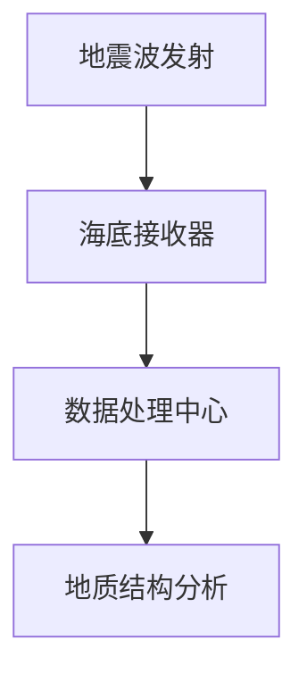
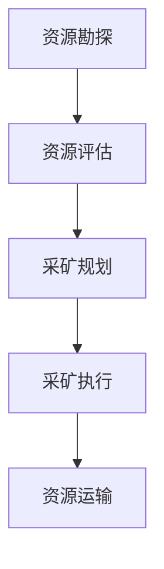
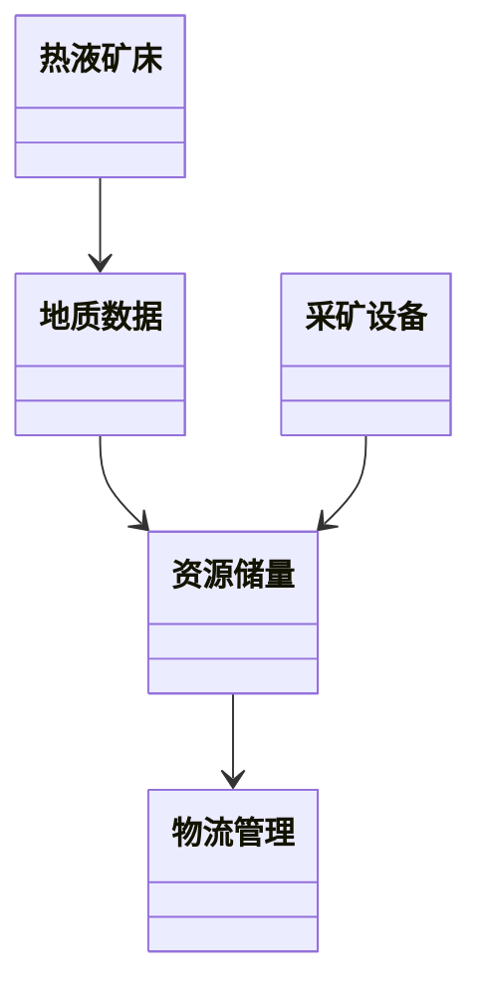
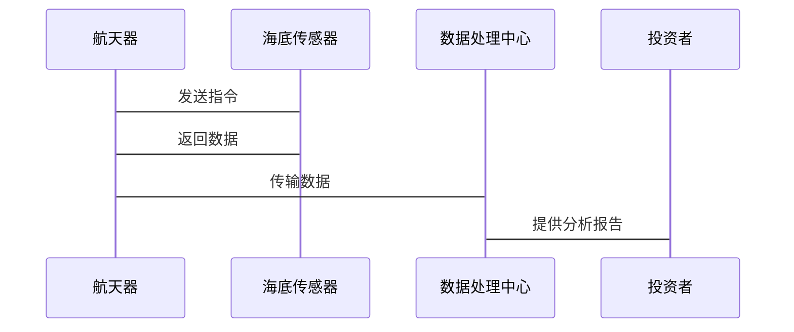

                 

<think>
好，我现在要帮用户撰写一篇关于“价值投资中的深海热液资源开发技术前景”的技术博客文章。用户已经提供了详细的目录结构，我需要按照这个结构一步步填充内容。首先，我需要理解每个部分的要求，确保内容既专业又易懂。

首先是背景介绍，这部分需要涵盖深海热液资源的定义、分布、形成机制，以及它们的经济价值和技术挑战。我应该用简洁的语言解释这些概念，让读者即使没有相关背景也能理解。

接下来是核心技术，包括勘探、开采和资源评估。这里需要详细讲解每种技术的原理和应用，可能需要结合实际案例来说明这些技术如何运作。

算法原理部分涉及地质模型和资源评估的数学模型。我需要使用数学公式和Mermaid流程图来展示这些模型，确保内容清晰易懂。同时，代码示例也是必要的，这样读者可以理解如何实现这些算法。

系统架构部分需要设计整个开发系统的结构，包括模块划分和接口设计。这里使用Mermaid图来展示系统架构和交互流程，帮助读者更好地理解系统的组成部分和工作流程。

项目实战部分需要分析一个具体的深海热液开发项目，包括环境搭建、代码实现和经济效益评估。这部分要详细说明每个步骤，让读者能够实际操作和参考。

最后是总结与展望，回顾全书内容，分析未来的技术趋势，并给出投资者的建议。这些建议应基于前文的技术分析，提供切实可行的投资方向和风险提示。

在写作过程中，我需要确保每个部分都有足够的细节，同时保持整体结构的紧凑和逻辑的连贯。我可能会遇到一些专业术语，需要找到合适的解释方式，避免过于晦涩。此外，使用代码示例和图表能有效提升文章的可读性，帮助读者更好地理解内容。

总之，我会按照用户提供的大纲，一步步填充内容，确保每个部分都满足要求，最终完成一篇高质量的技术博客文章。
</think>

# 价值投资中的深海热液资源开发技术前景

## 关键词：深海热液资源、价值投资、资源开发、技术前景、海底矿产、投资策略

## 摘要：  
本文深入探讨了深海热液资源开发的技术前景及其在价值投资中的潜力。通过分析深海热液资源的定义、分布、形成机制，以及相关的勘探、开采和资源评估技术，本文揭示了深海热液资源开发的核心技术与挑战。结合数学模型、系统架构设计和实际项目案例，本文详细阐述了深海热液资源开发的算法原理与实现方法，并提出了在价值投资中的策略建议。通过本文的分析，读者将能够理解深海热液资源开发的技术细节及其在投资中的应用前景。

---

## 第一部分：深海热液资源开发的背景与概述

### 第1章：深海热液资源的基本概念

#### 1.1 深海热液资源的定义与特征
深海热液资源是指海底热液矿床中富含金属（如铜、锌、金、银等）和硫化物的矿产资源。这些矿床通常形成于海底火山活动区域，通过热液喷口（也称为“黑烟”）将高温、高压力的矿物质和水排出到海底。

**核心概念术语说明：**
- **热液矿床**：海底火山活动形成的矿床，富含金属和硫化物。
- **热液喷口**：海底火山活动释放高温热液的区域，通常伴随高温和高压环境。

**问题背景：**
深海热液资源的开发具有巨大的经济潜力，但由于其位于海底深处，开发难度大，技术要求高。如何高效、经济地开发这些资源成为关键问题。

**问题描述：**
深海热液资源的开发涉及复杂的地质条件和技术挑战，包括海底地形、矿床稳定性、资源储量评估等问题。

**问题解决：**
通过技术创新和勘探技术的进步，深海热液资源的开发逐渐成为可能。本文将详细分析相关技术及其在投资中的应用。

**边界与外延：**
深海热液资源的开发不仅涉及地质学，还涉及海洋工程、采矿技术、环境科学等多个领域。其外延包括海底矿产资源的整体开发策略和可持续性问题。

**核心要素组成：**
- 地质条件：海底火山活动、岩石结构、热液喷口分布。
- 资源储量：金属含量、矿床规模。
- 开发技术：勘探、开采、资源评估。

---

## 第二部分：深海热液资源开发的核心技术

### 第2章：深海热液资源的勘探技术

#### 2.1 深海热液勘探的基本方法

**核心概念与联系：**
- **地质勘探**：通过地震勘探、热液指标分析等方法确定热液矿床的位置。
- **热液活动指标**：包括温度、化学成分、海底地形变化等。

**问题背景：**
深海热液资源的勘探需要克服海底环境复杂、数据获取困难等挑战。

**问题解决：**
通过地震勘探、热液测井等技术，可以有效定位热液矿床的位置。

**算法原理：**
地震勘探是一种常用的地质勘探方法，其原理是通过地震波的反射来判断地下结构。以下是地震勘探的简要流程：

1. 发射地震波。
2. 接收反射波。
3. 处理数据以确定地质结构。

**数学模型：**
地震波的传播可以用波动方程描述：
$$
\frac{\partial^2 p}{\partial x^2} + \frac{\partial^2 p}{\partial y^2} + \frac{\partial^2 p}{\partial z^2} = \frac{\rho}{c^2} \frac{\partial^2 p}{\partial t^2}
$$
其中，\( p \) 是压力，\( \rho \) 是密度，\( c \) 是波速，\( t \) 是时间。

**系统架构设计：**
以下是地震勘探系统的架构图：

---

### 第3章：深海热液资源的开采技术

#### 3.1 深海热液矿床的开采技术

**核心概念与联系：**
- **海底采矿**：通过海底机器人和采矿设备直接从海底提取矿石。
- **资源评估**：通过数学模型评估矿床的储量和品位。

**问题背景：**
深海热液资源的开采面临技术复杂、成本高昂、环境影响大等挑战。

**问题解决：**
通过机器人技术、海底采矿设备和资源评估模型，可以实现高效、经济的深海热液资源开发。

**算法原理：**
资源评估模型可以通过线性回归模型进行预测，以下是一个简单的线性回归模型：

$$
y = a + b x + e
$$

其中，\( y \) 是预测的储量，\( x \) 是输入变量（如地质数据），\( a \) 和 \( b \) 是模型参数，\( e \) 是误差项。

**系统架构设计：**
以下是深海热液资源开发系统的架构图：

---

## 第三部分：深海热液资源开发的系统分析与架构设计

### 第4章：深海热液资源开发的系统架构

#### 4.1 系统功能设计

**问题背景：**
深海热液资源开发系统需要集成勘探、评估、开采和运输等多个功能模块。

**系统功能设计：**
- 勘探模块：负责数据采集和地质分析。
- 评估模块：负责资源储量评估和经济分析。
- 采矿模块：负责设备控制和资源开采。
- 运输模块：负责资源运输和物流管理。

**领域模型：**
以下是领域模型的类图：

---

## 第四部分：项目实战与投资策略

### 第5章：深海热液资源开发项目的实战分析

#### 5.1 项目环境搭建

**问题背景：**
深海热液资源开发需要搭建复杂的海洋工程环境，包括海底地形、气象条件、海底通信等。

**问题解决：**
通过卫星通信、海底传感器和机器人技术，可以实现深海环境的实时监控和数据传输。

**系统接口设计：**
以下是系统接口设计的序列图：

---

## 第五部分：总结与展望

### 第6章：深海热液资源开发的未来趋势与投资建议

#### 6.1 未来技术趋势

- 深海采矿技术的自动化和智能化。
- 环境友好型开采技术的发展。
- 大数据分析在资源勘探中的应用。

#### 6.2 投资建议

- 关注具有技术优势的深海热液资源开发公司。
- 重视环境影响和可持续发展。
- 考虑政策和国际合作的影响。

---

## 作者：AI天才研究院/AI Genius Institute & 禅与计算机程序设计艺术 /Zen And The Art of Computer Programming

