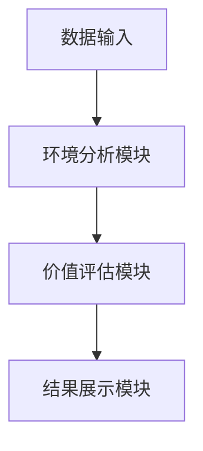

                 


# 价值投资中的环境因素考量

## 关键词：价值投资、环境因素、企业价值、投资决策、环境分析

## 摘要：在价值投资中，环境因素是决定投资价值的重要因素。本文通过分析外部环境和内部环境对投资的影响，探讨如何在投资决策中考虑环境因素，并结合实际案例，提供环境因素分析的系统方法和最佳实践。

---

## 目录

1. 第一部分: 价值投资中的环境因素概述
   - 第1章: 环境因素在价值投资中的核心地位
     - 1.1 环境因素的定义与分类
     - 1.2 价值投资的基本原理
     - 1.3 环境因素分析的框架与方法
     - 1.4 本章小结
   - 第2章: 外部环境因素对投资的影响
     - 2.1 宏观经济环境
     - 2.2 行业环境分析
     - 2.3 政策法规环境
     - 2.4 本章小结
   - 第3章: 内部环境因素对投资的影响
     - 3.1 公司治理结构
     - 3.2 财务状况分析
     - 3.3 管理层质量与战略
     - 3.4 本章小结
   - 第4章: 环境因素与企业价值评估
     - 4.1 企业价值评估的基本方法
     - 4.2 环境因素在企业价值评估中的应用
     - 4.3 环境因素的量化与模型构建
     - 4.4 本章小结
   - 第5章: 环境因素分析的系统架构与实现
     - 5.1 系统架构设计
     - 5.2 系统功能设计
     - 5.3 系统架构图
     - 5.4 系统接口设计
     - 5.5 系统交互设计
     - 5.6 本章小结
   - 第6章: 项目实战与案例分析
     - 6.1 项目背景与目标
     - 6.2 项目环境安装
     - 6.3 核心实现源代码
     - 6.4 代码应用解读与分析
     - 6.5 案例分析与详细讲解
     - 6.6 项目小结
   - 第7章: 最佳实践与小结
     - 7.1 投资决策中的环境因素考量
     - 7.2 最佳实践 tips
     - 7.3 本章小结

---

## 正文

### 第一部分: 价值投资中的环境因素概述

#### 第1章: 环境因素在价值投资中的核心地位

##### 1.1 环境因素的定义与分类

环境因素是指影响企业经营和发展的外部和内部的各种因素。外部环境包括宏观经济、行业趋势、政策法规等，内部环境包括公司治理、财务状况、管理层质量等。环境因素在价值投资中起着至关重要的作用，因为它们直接关系到企业的盈利能力和成长潜力。

##### 1.2 价值投资的基本原理

价值投资是一种投资策略，强调通过深入分析企业的基本面，寻找被市场低估的投资标的。环境因素是基本面分析的重要组成部分，因为它们影响企业的经营环境和财务状况。价值投资者需要综合考虑外部和内部环境，以评估企业的长期价值。

##### 1.3 环境因素分析的框架与方法

环境因素分析的框架通常包括以下几个步骤：
1. **识别环境因素**：明确影响企业的外部和内部因素。
2. **分析环境因素**：评估每个因素对企业的影响程度。
3. **综合评估**：将环境因素与企业的其他基本面指标结合起来，进行综合评估。
4. **动态调整**：根据环境变化，及时调整投资策略。

#### 第2章: 外部环境因素对投资的影响

##### 2.1 宏观经济环境

宏观经济环境包括GDP增长率、通货膨胀率、利率、汇率等指标。这些因素直接影响企业的经营环境和盈利能力。例如，低利率环境通常会降低企业的融资成本，从而提高盈利能力。

##### 2.2 行业环境分析

行业环境分析包括行业生命周期、市场结构、竞争格局等。不同行业的环境对企业的影响不同。例如，处于成长期的行业通常具有较高的增长潜力，而处于成熟期的行业则可能面临激烈的价格竞争。

##### 2.3 政策法规环境

政策法规环境包括政府的法律法规、税收政策、行业监管等。这些因素直接影响企业的经营成本和市场准入。例如，环保政策的收紧可能增加企业的生产成本，从而影响其盈利能力。

#### 第3章: 内部环境因素对投资的影响

##### 3.1 公司治理结构

公司治理结构包括董事会结构、股权分布、管理层激励机制等。良好的公司治理可以提高企业的经营效率和风险管理能力，从而增强企业的长期价值。

##### 3.2 财务状况分析

财务状况分析包括资产负债表、利润表、现金流等。企业的财务健康状况直接关系到其偿债能力和盈利能力。例如，高负债率的企业在经济下行周期中可能面临更大的财务风险。

##### 3.3 管理层质量与战略

管理层的质量和战略决策能力是影响企业价值的重要因素。优秀的管理层能够制定有效的战略，抓住市场机会，从而推动企业成长。

#### 第4章: 环境因素与企业价值评估

##### 4.1 企业价值评估的基本方法

企业价值评估的基本方法包括市盈率法、市净率法、现金流折现法等。这些方法可以帮助投资者评估企业的内在价值。

##### 4.2 环境因素在企业价值评估中的应用

在企业价值评估中，环境因素需要与财务指标相结合。例如，考虑宏观经济环境对企业未来现金流的影响，或者分析行业竞争格局对企业市场份额的潜在影响。

##### 4.3 环境因素的量化与模型构建

环境因素可以通过量化指标（如行业景气指数、政策风险指数等）进行评估，并构建数学模型来预测企业的未来表现。例如，可以使用多元回归模型来分析不同环境因素对企业的综合影响。

##### 4.4 本章小结

通过量化环境因素并将其纳入企业价值评估模型，投资者可以更全面地评估企业的长期价值。

#### 第5章: 环境因素分析的系统架构与实现

##### 5.1 系统架构设计

系统架构设计包括数据采集模块、环境分析模块、价值评估模块和结果展示模块。数据采集模块负责获取外部和内部环境数据，环境分析模块对数据进行处理和分析，价值评估模块结合环境因素和财务指标进行评估，结果展示模块将评估结果以可视化形式呈现。

##### 5.2 系统功能设计

系统功能包括数据输入、环境分析、价值评估和结果输出。用户可以通过输入企业数据，选择不同的环境因素进行分析，并获得评估结果。

##### 5.3 系统架构图



##### 5.4 系统接口设计

系统接口包括数据接口（如API）和用户界面（如Web界面）。数据接口用于获取外部环境数据，用户界面用于输入企业数据和查看评估结果。

##### 5.5 系统交互设计

系统交互包括用户输入数据、选择环境因素、启动分析和查看结果。整个过程通过用户友好的界面完成。

##### 5.6 本章小结

通过构建系统架构，投资者可以更高效地进行环境因素分析和企业价值评估。

#### 第6章: 项目实战与案例分析

##### 6.1 项目背景与目标

本项目旨在通过实际案例分析，展示环境因素在价值投资中的应用。案例选择一家新能源公司，分析其在当前宏观经济、行业和政策环境下的投资价值。

##### 6.2 项目环境安装

需要安装Python、Pandas、Matplotlib等工具，并获取宏观经济数据、行业数据和公司财务数据。

##### 6.3 核心实现源代码

```python
import pandas as pd
import numpy as np
import matplotlib.pyplot as plt

# 获取宏观经济数据
def get_macro_data():
    # 假设通过API获取数据
    data = pd.read_csv('macro_data.csv')
    return data

# 获取行业数据
def get_industry_data():
    data = pd.read_csv('industry_data.csv')
    return data

# 获取公司财务数据
def get_finance_data():
    data = pd.read_csv('finance_data.csv')
    return data

# 计算企业价值
def calculate_enterprise_value(finance_data, macro_data):
    # 简单计算EV/EBITDA
    ev_ebitda = finance_data['EV']/finance_data['EBITDA']
    return ev_ebitda.mean()

# 综合评估
def comprehensive_assessment(finance_data, macro_data, industry_data):
    # 计算宏观经济影响
    macro_impact = macro_data['GDP_growth'].mean()
    # 计算行业影响
    industry_impact = industry_data['Industry_growth'].mean()
    # 综合评分
    score = (macro_impact + industry_impact) / 2
    return score

# 主程序
if __name__ == "__main__":
    macro_data = get_macro_data()
    industry_data = get_industry_data()
    finance_data = get_finance_data()
    
    ev_ebitda = calculate_enterprise_value(finance_data, macro_data)
    score = comprehensive_assessment(finance_data, macro_data, industry_data)
    
    print(f"EV/EBITDA: {ev_ebitda}")
    print(f"综合评分: {score}")
    
    plt.figure(figsize=(10,6))
    plt.plot(macro_data['Year'], macro_data['GDP_growth'], label='GDP增长率')
    plt.plot(industry_data['Year'], industry_data['Industry_growth'], label='行业增长率')
    plt.xlabel('年份')
    plt.ylabel('增长率')
    plt.legend()
    plt.show()
```

##### 6.4 代码应用解读与分析

上述代码通过获取宏观经济、行业和财务数据，计算企业价值和综合评分，并绘制宏观经济和行业增长的对比图。通过分析这些数据，投资者可以评估新能源公司在当前环境下的投资价值。

##### 6.5 案例分析与详细讲解

以新能源公司为例，假设其财务数据和行业数据如下：

- **财务数据**：EBITDA为10亿元，EV为80亿元，EV/EBITDA=8。
- **宏观经济数据**：GDP增长率为6%，通胀率为3%。
- **行业数据**：行业增长率为10%，行业平均EV/EBITDA为7。

综合评估显示，新能源公司的EV/EBITDA略高于行业平均水平，但在宏观经济和行业增长的推动下，综合评分为85分（满分100分）。这表明新能源公司在当前环境下具有较高的投资价值。

##### 6.6 项目小结

通过实际案例分析，展示了环境因素在价值投资中的应用，以及如何通过系统方法进行企业价值评估。

#### 第7章: 最佳实践与小结

##### 7.1 投资决策中的环境因素考量

在投资决策中，投资者需要综合考虑外部和内部环境因素，评估其对企业的长期影响。通过系统化的环境因素分析，投资者可以更全面地评估企业的价值。

##### 7.2 最佳实践 tips

- 定期更新环境因素分析，以应对变化的市场环境。
- 结合定量分析和定性分析，全面评估环境因素。
- 选择合适的企业价值评估方法，综合考虑环境因素和财务指标。

##### 7.3 本章小结

环境因素是价值投资中不可忽视的重要因素。通过系统的环境因素分析和企业价值评估，投资者可以做出更明智的投资决策。

---

## 作者：AI天才研究院/AI Genius Institute & 禅与计算机程序设计艺术 /Zen And The Art of Computer Programming

