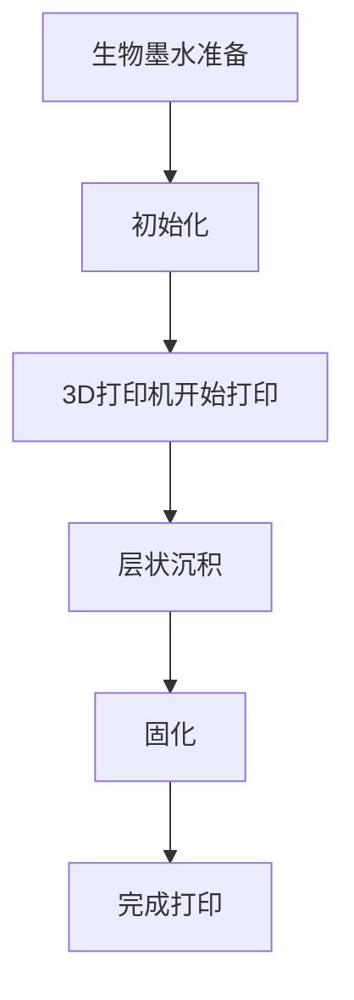
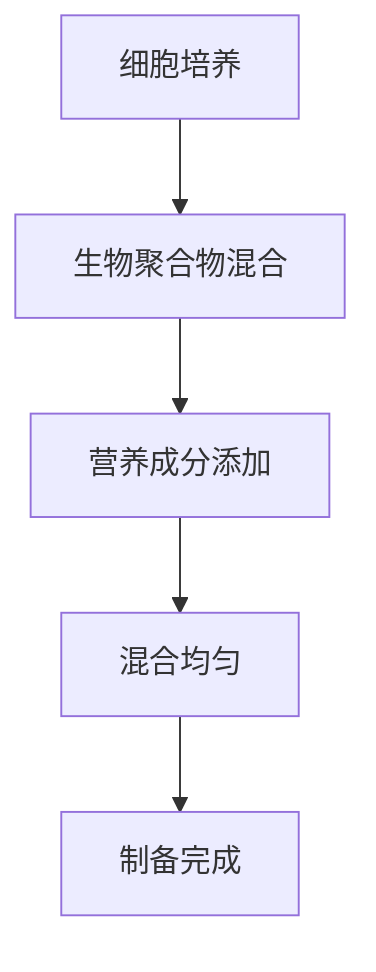
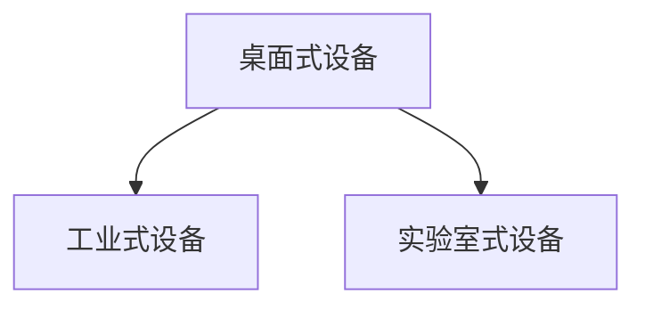

                 

# 价值投资中的生物3D打印器官技术前景

---

## 关键词：
生物3D打印，器官打印，价值投资，医疗科技，再生医学，投资分析，技术前景

---

## 摘要：
生物3D打印技术正在 revolutionize 医疗行业，尤其是在器官打印领域。本文深入分析了生物3D打印技术的核心原理、当前技术水平、市场应用及投资机会。结合价值投资的视角，探讨了该领域的投资策略、风险评估及未来发展前景。通过案例分析和数学模型，为投资者提供了科学的决策依据。

---

# 第1章: 生物3D打印技术的核心概念与价值投资概述

## 1.1 生物3D打印技术的基本概念

### 1.1.1 生物3D打印的定义
生物3D打印是一种通过逐层构建三维结构的技术，利用生物材料（如细胞、蛋白质和多糖）制造复杂的生物结构，如组织、器官或骨骼。其核心在于模仿自然生物过程，通过精确控制材料的沉积和固化，实现对复杂结构的精确复制。

**Mermaid图：生物3D打印的基本流程**

### 1.1.2 生物3D打印的核心技术原理
生物3D打印的技术原理涉及多学科的交叉，包括材料科学、机械工程和生物医学。其核心是将生物材料（如细胞悬液或生物聚合物）通过3D打印机的喷嘴逐层沉积，并通过紫外固化或化学交联等方法实现结构的固定化。

**公式：生物墨水的基本组成比例**

$$
\text{细胞浓度} = \frac{\text{细胞总数}}{\text{体积}}
$$

### 1.1.3 生物3D打印与传统医疗技术的对比

| 技术特点 | 生物3D打印 | 传统医疗技术 |
|----------|------------|---------------|
| 制造精度 | 高          | 中            |
| 成本     | 高          | 低            |
| 个性化  | 高          | 低            |
| 生产周期 | 长          | 短            |

---

## 1.2 价值投资的基本原理

### 1.2.1 价值投资的定义
价值投资是一种投资策略，强调以低于公允价值的价格购买优质资产。其核心在于寻找市场低估的公司，并长期持有，等待其价值回归。

### 1.2.2 价值投资的核心理念
价值投资的核心理念包括：
1. **安全边际**：买入价格低于内在价值。
2. **长期视角**：关注公司的长期盈利能力。
3. **基本面分析**：深入研究公司的财务状况、行业地位和竞争优势。

### 1.2.3 价值投资在医疗科技领域的应用
医疗科技行业因其高壁垒和高利润 margins，成为价值投资者的理想选择。生物3D打印技术作为医疗科技的重要组成部分，具备较高的投资价值。

---

## 1.3 生物3D打印与价值投资的结合点

### 1.3.1 生物3D打印技术的市场潜力
生物3D打印技术在医疗领域的应用前景广阔，尤其是在器官打印、再生医学和个性化治疗方面。根据 Grand View Research 的数据，全球生物3D打印市场规模预计将从2023年的30亿美元增长到2030年的150亿美元。

### 1.3.2 价值投资在生物3D打印领域的应用前景
价值投资者可以通过分析生物3D打印公司的财务状况、技术研发能力、市场地位和竞争优势，找到具有长期增长潜力的投资标的。

### 1.3.3 生物3D打印技术对医疗行业的深远影响
生物3D打印技术将推动医疗行业的变革，降低医疗成本，提高治疗效果，同时为患者提供个性化的医疗解决方案。

---

## 1.4 本章小结
本章介绍了生物3D打印技术的基本概念、核心原理以及与价值投资的结合点。通过对比生物3D打印与传统医疗技术，揭示了其在医疗科技领域的巨大潜力。

---

# 第2章: 生物3D打印器官技术的核心原理

## 2.1 生物3D打印的材料科学

### 2.1.1 生物墨水的组成与特性
生物墨水是生物3D打印的核心材料，主要由细胞、生物聚合物和营养成分组成。其性能直接影响打印器官的质量和功能。

**Mermaid图：生物墨水的制备流程**

### 2.1.2 生物墨水的制备过程
生物墨水的制备过程包括细胞培养、材料混合和性能测试等步骤。其制备过程需要严格控制温度、湿度和时间。

**公式：生物墨水的流变性能**

$$
\text{流变性能} = \text{剪切应力} / \text{剪切率}
$$

### 2.1.3 生物墨水的性能测试
生物墨水的性能测试包括流变性能测试、细胞活性测试和生物相容性测试等。这些测试是评估生物墨水质量的重要指标。

---

## 2.2 生物3D打印的设备与工艺

### 2.2.1 生物3D打印设备的分类
生物3D打印设备主要分为桌面式、工业式和实验室式三种类型。每种设备适用于不同的应用场景。

**Mermaid图：生物3D打印设备的分类**

### 2.2.2 生物3D打印工艺的流程
生物3D打印的工艺流程包括准备生物墨水、初始化打印机、逐层沉积和固化等步骤。

**公式：打印速度**

$$
\text{打印速度} = \frac{\text{打印体积}}{\text{时间}}
$$

### 2.2.3 生物3D打印技术的优缺点
生物3D打印技术的优点包括高精度、个性化和高效性。其缺点包括高成本、技术复杂性和监管严格性。

---

## 2.3 生物3D打印的生物相容性与安全性

### 2.3.1 生物相容性的定义与测试方法
生物相容性是指材料与生物组织接触时的生物适应性。测试方法包括细胞毒性测试和血液相容性测试。

### 2.3.2 生物3D打印材料的安全性评估
生物3D打印材料的安全性评估需要通过ISO 10993等国际标准。这些标准包括材料的无毒性、无致敏性和无致癌性。

### 2.3.3 生物3D打印技术的监管要求
生物3D打印技术需要通过 FDA 和 CE 等监管机构的认证。这些认证要求包括产品质量、生产过程和标签合规性。

---

## 2.4 本章小结
本章详细介绍了生物3D打印技术的核心原理，包括材料科学、设备与工艺以及生物相容性与安全性等方面。这些内容为后续的市场分析和投资策略提供了基础。

---

# 第3章: 生物3D打印器官的现状与挑战

## 3.1 生物3D打印器官的当前技术水平

### 3.1.1 现有技术的突破与成果
目前，生物3D打印技术已经在皮肤、软骨和血管等组织的打印方面取得了突破性进展。例如，Organovo 公司成功打印了人类肝脏组织。

### 3.1.2 生物3D打印器官的成功案例
2020年， researchers 在 Nature Biotechnology 上报道了利用生物3D打印技术成功打印出功能性的肝脏组织。

### 3.1.3 生物3D打印技术的瓶颈与限制
当前生物3D打印技术的主要挑战包括打印精度不足、生物墨水的稳定性差以及器官功能的不完善。

---

## 3.2 生物3D打印器官的市场应用

### 3.2.1 医疗领域的应用前景
生物3D打印技术在整形外科、器官修复和再生医学领域具有广阔的应用前景。例如，可以用于修复受损的骨骼和软组织。

### 3.2.2 生物3D打印技术在制药行业的应用
生物3D打印技术可以用于药物研发，例如制造三维药物释放系统。

### 3.2.3 生物3D打印技术在个性化医疗中的潜力
个性化医疗是生物3D打印技术的重要应用领域，例如为患者定制个性化的药物释放系统和组织修复材料。

---

## 3.3 生物3D打印技术的未来发展方向

### 3.3.1 新型材料的研发
未来，研究人员将致力于开发新型生物墨水，例如基于干细胞的生物墨水，以提高打印器官的功能性和生物相容性。

### 3.3.2 打印精度的提升
通过改进打印设备和算法，未来将实现更高精度的生物3D打印，以制造更复杂的器官结构。

### 3.3.3 生物3D打印技术的智能化与自动化
人工智能和机器人技术的结合将推动生物3D打印技术的智能化和自动化，从而提高生产效率和降低成本。

---

## 3.4 本章小结
本章分析了生物3D打印器官技术的现状与挑战，探讨了其在医疗和制药领域的应用前景，并展望了未来的发展方向。

---

# 第4章: 生物3D打印器官技术的市场分析与投资机会

## 4.1 生物3D打印市场的现状与规模

### 4.1.1 全球生物3D打印市场的规模
根据 IDTechEx 的数据，全球生物3D打印市场的规模预计将在2023年达到30亿美元，年均增长率为25%。

### 4.1.2 区域市场的分布与特点
北美地区是生物3D打印技术的主要市场，其次是欧洲和亚洲。亚洲市场增长最快，主要得益于中国政府的政策支持和企业投资。

### 4.1.3 市场增长的主要驱动因素
生物3D打印市场的增长主要驱动力包括医疗需求的增加、技术进步和政策支持。

---

## 4.2 生物3D打印技术的主要参与者

### 4.2.1 主要企业的市场份额
全球生物3D打印市场的主要参与者包括3D Systems、Stratasys、Organovo 和 Carbon。这些公司在技术和市场上占据领先地位。

### 4.2.2 技术研发与合作
生物3D打印领域的技术研发主要通过企业内部研发和产学研合作。例如，Organovo 与多家医院和研究机构合作，推动技术的临床应用。

### 4.2.3 市场竞争格局
生物3D打印市场目前呈现寡头垄断格局，主要由几家大型企业主导。未来，随着更多企业的进入，市场竞争将更加激烈。

---

## 4.3 生物3D打印技术的投资机会

### 4.3.1 技术研发领域的投资机会
生物3D打印技术的研发需要大量的资金投入，特别是在新型材料和设备研发方面。投资者可以通过投资初创公司或研发项目获得高回报。

### 4.3.2 市场应用领域的投资机会
生物3D打印技术在医疗和制药领域的应用前景广阔。投资者可以关注那些专注于器官打印和药物研发的公司。

### 4.3.3 产业链整合的投资机会
生物3D打印产业链包括材料供应商、设备制造商、技术服务提供商和医疗机构。投资者可以通过整合产业链资源，获得更大的竞争优势。

---

## 4.4 本章小结
本章分析了生物3D打印技术的市场现状与规模，探讨了主要企业的市场份额和技术研发进展，并提出了投资机会。

---

# 第5章: 价值投资策略与生物3D打印技术的结合

## 5.1 价值投资在生物3D打印领域的应用策略

### 5.1.1 投资标的选择标准
价值投资者在选择生物3D打印领域的投资标时，需要重点关注公司的财务状况、技术研发能力、市场地位和竞争优势。

### 5.1.2 财务分析的核心指标
财务分析的核心指标包括市盈率、市净率、ROE和现金流等。投资者需要通过这些指标评估公司的财务健康状况和投资价值。

### 5.1.3 行业趋势与市场定位
行业趋势和市场定位是价值投资的重要考虑因素。投资者需要关注生物3D打印技术的行业发展趋势和公司在市场中的定位。

---

## 5.2 生物3D打印技术的估值与风险评估

### 5.2.1 估值方法的选择
生物3D打印技术的估值方法主要包括相对估值法和绝对估值法。相对估值法包括市盈率和市净率等指标，绝对估值法包括DCF模型和折现现金流模型。

### 5.2.2 技术风险与市场风险
生物3D打印技术的主要风险包括技术失败、市场竞争和政策监管等。投资者需要通过全面的分析和评估，制定有效的风险管理策略。

### 5.2.3 投资组合的构建
价值投资者可以通过构建多元化的投资组合，降低投资风险。例如，可以同时投资于生物3D打印技术和传统医疗技术。

---

## 5.3 价值投资与生物3D打印技术的长期展望

### 5.3.1 长期投资机会
生物3D打印技术的长期投资机会主要来自于其在医疗和制药领域的广泛应用。随着技术的成熟和市场的扩大，生物3D打印技术将成为医疗科技的重要组成部分。

### 5.3.2 价值投资的未来发展趋势
未来，价值投资将更加注重技术创新和长期增长潜力。生物3D打印技术作为医疗科技的重要创新，将成为价值投资者的重点关注领域。

---

## 5.4 本章小结
本章探讨了价值投资策略与生物3D打印技术的结合，分析了投资标的选择、估值与风险评估以及长期投资机会。

---

# 第6章: 生物3D打印器官技术的案例分析与投资启示

## 6.1 成功案例分析

### 6.1.1 公司背景与主营业务
以 Organovo 公司为例，该公司专注于生物3D打印技术的研发和应用，主要业务包括器官打印和药物研发。

### 6.1.2 财务表现与市场定位
Organovo 的财务表现显示其在生物3D打印领域具有较高的市场地位。然而，其高研发投入和较低的收入水平也面临一定的财务压力。

### 6.1.3 投资启示
Organovo 的成功案例表明，生物3D打印技术具有较高的投资价值，但也需要关注公司的财务状况和市场定位。

---

## 6.2 失败案例分析

### 6.2.1 公司背景与主营业务
以某生物3D打印初创公司为例，该公司因技术失败和市场定位不当而退出市场。

### 6.2.2 财务表现与市场定位
该公司的财务表现显示其在技术研发和市场推广方面投入不足，导致市场定位不明确。

### 6.2.3 投资启示
失败案例表明，生物3D打印技术的投资需要注重技术研发和市场推广，避免技术失败和市场定位不当。

---

## 6.3 投资启示

### 6.3.1 关注技术研发
生物3D打印技术的核心竞争力在于技术研发。投资者需要关注公司的技术研发能力和技术壁垒。

### 6.3.2 注重市场定位
市场定位是生物3D打印技术成功的关键。投资者需要关注公司如何在市场中找到自己的定位，并制定有效的市场策略。

### 6.3.3 关注政策支持
政策支持是生物3D打印技术发展的重要因素。投资者需要关注相关政策的变化，并利用政策支持获取投资机会。

---

## 6.4 本章小结
本章通过成功和失败案例分析，总结了生物3D打印技术在投资中的启示，并提出了未来投资的注意事项。

---

# 第7章: 生物3D打印技术的未来展望与投资建议

## 7.1 生物3D打印技术的未来发展趋势

### 7.1.1 新材料的应用
未来，生物3D打印技术将更加注重新型材料的研发，例如基于干细胞的生物墨水，以提高打印器官的功能性和生物相容性。

### 7.1.2 技术的智能化与自动化
人工智能和机器人技术的结合将推动生物3D打印技术的智能化和自动化，从而提高生产效率和降低成本。

### 7.1.3 市场的扩展与应用
随着技术的进步和市场的扩展，生物3D打印技术将在更多领域得到应用，例如再生医学和个性化治疗。

---

## 7.2 生物3D打印技术的投资建议

### 7.2.1 关注技术创新
投资者需要关注生物3D打印技术的创新，特别是新型材料和设备的研发。

### 7.2.2 投资多元化
通过多元化投资，降低投资风险。例如，可以同时投资于生物3D打印技术和传统医疗技术。

### 7.2.3 关注政策支持
政策支持是生物3D打印技术发展的重要因素。投资者需要关注相关政策的变化，并利用政策支持获取投资机会。

---

## 7.3 本章小结
本章探讨了生物3D打印技术的未来发展趋势，并提出了投资建议，为投资者提供了科学的决策依据。

---

# 结论

生物3D打印技术作为医疗科技的重要创新，具有广阔的应用前景和投资价值。通过价值投资的视角，投资者可以更好地把握该领域的投资机会，实现长期稳定的收益。未来，随着技术的进步和市场的扩展，生物3D打印技术将在更多领域得到应用，为投资者带来更多的投资机会。

---

# 作者

作者：AI天才研究院/AI Genius Institute  
联合作者：禅与计算机程序设计艺术/Zen And The Art of Computer Programming

