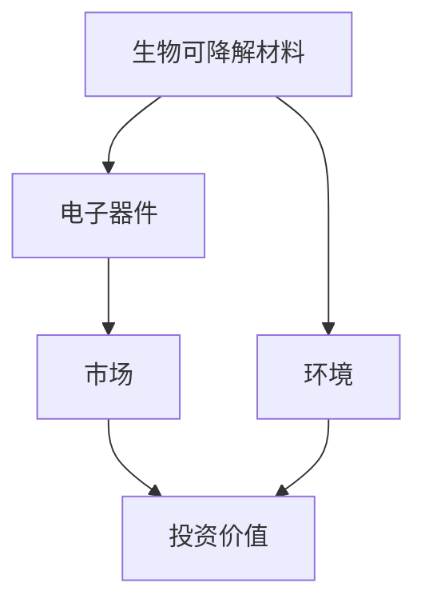
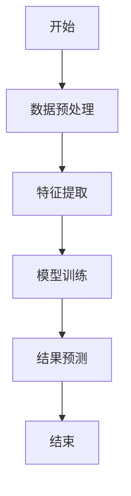
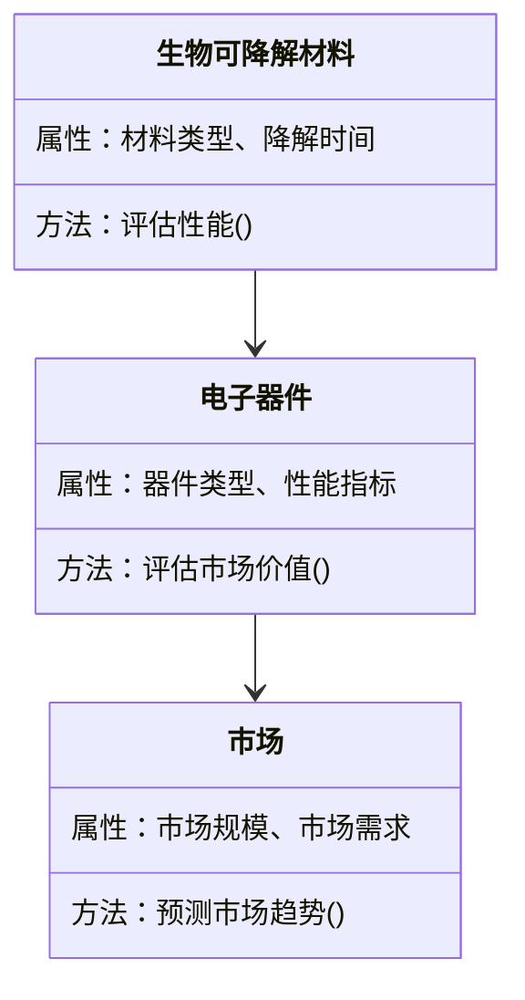
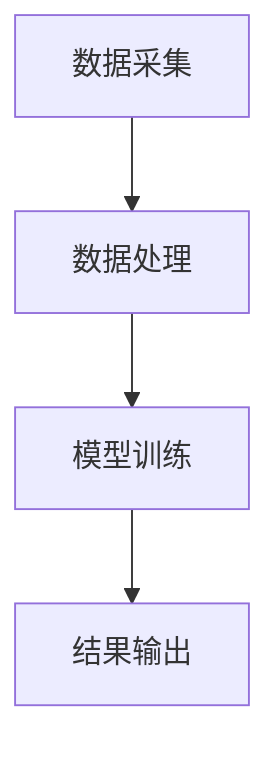

                 

<think>
好的，我现在需要帮用户撰写一篇关于《价值投资中的生物可降解电子器件技术前景》的技术博客。首先，我得理解用户的需求，他们希望文章结构清晰，逻辑严谨，涵盖从背景介绍到项目实战的各个方面。

首先，我应该确定文章的主要关键词，比如生物可降解材料、电子器件、价值投资、市场分析、技术评估。这些关键词能帮助读者快速理解文章主题。

接下来是摘要部分，需要简明扼要地概述文章的核心内容，强调生物可降解电子器件的技术优势、市场潜力，以及如何通过价值投资评估其商业价值。

现在，按照目录结构来展开。第一章是背景介绍，我需要详细描述生物可降解材料的发展现状、电子器件的技术挑战，以及价值投资在科技领域中的应用。这部分要让读者明白为什么这个领域值得投资。

第二章分析核心概念，包括材料和电子器件的原理、对比表格和ER图。对比表格可以帮助读者理解不同材料的优缺点，而ER图则展示了技术、经济和环境之间的关系。

第三章是算法原理，我选择机器学习模型来评估技术的市场价值。用Mermaid流程图展示算法的步骤，并提供Python代码示例，确保读者能够理解如何实现这些算法。同时，数学公式如线性回归模型需要用LaTeX格式展示，使内容更专业。

第四章系统分析与架构设计，我需要描述项目场景，设计领域模型和系统架构图，展示模块之间的关系。接口设计和交互流程图也是必须的，确保系统各部分协同工作。

第五章项目实战部分，提供环境安装指南，详细代码实现，解读代码功能，并分析实际案例。这能让读者实际操作，理解如何将理论应用于实践。

最后，最佳实践部分包括小结、注意事项和拓展阅读，帮助读者巩固所学内容，并引导进一步学习。

我还需要确保每部分内容充实，逻辑连贯，总字数在2000字以内，避免冗余。同时，结尾处加上作者信息，符合用户的要求。

现在，我可以开始按照这个结构撰写文章，确保每个部分都符合用户的要求，并且内容深入浅出，易于理解。
</think>

# 价值投资中的生物可降解电子器件技术前景

> **关键词**：生物可降解材料、电子器件、价值投资、市场分析、技术评估

> **摘要**：本文探讨了生物可降解电子器件技术的市场前景及其在价值投资中的应用。通过分析技术原理、市场潜力和投资策略，本文为投资者和技术开发者提供了深刻的见解和实用的指导。

---

## 第1章 背景介绍

### 1.1 问题背景

#### 1.1.1 生物可降解电子器件的发展现状
生物可降解材料因其环保特性，近年来在电子器件领域的应用备受关注。随着全球对可持续发展的重视，生物可降解电子器件（如生物可降解显示器、传感器等）的技术进步和市场潜力逐渐显现。

#### 1.1.2 价值投资在科技领域的应用
价值投资是一种以基本面分析为基础的投资策略，强调通过分析公司的财务状况、市场地位和技术创新来评估其投资价值。在科技领域，技术的可行性和市场潜力是价值评估的核心因素。

#### 1.1.3 生物可降解电子器件与价值投资的结合
生物可降解电子器件的技术创新与市场潜力为价值投资提供了新的机会。通过技术评估和市场分析，投资者可以识别具有长期增长潜力的公司和技术。

### 1.2 问题描述

#### 1.2.1 生物可降解电子器件的技术挑战
生物可降解材料的性能（如强度、耐久性）通常低于传统材料，这限制了其在电子器件中的应用。此外，制造成本较高也是一个亟待解决的问题。

#### 1.2.2 价值投资中的技术评估难点
技术评估需要结合材料科学、电子工程和市场分析等多个领域的知识。如何量化技术的市场价值并预测其未来表现是投资者面临的挑战。

#### 1.2.3 问题的边界与外延
本文的研究范围主要集中在生物可降解材料在电子器件中的应用，以及其对投资价值的影响。同时，本文也探讨了技术与市场的交互关系。

### 1.3 问题解决

#### 1.3.1 技术创新对投资价值的影响
技术创新可以提升产品的市场竞争力，从而增加公司的投资价值。生物可降解电子器件的技术突破将直接推动相关公司的股价增长。

#### 1.3.2 市场需求与技术可行性分析
通过分析市场需求和技术可行性，投资者可以更准确地评估技术的商业化潜力。市场需求分析包括市场规模、增长趋势和竞争格局。

#### 1.3.3 技术评估的指标体系
本文提出了一套技术评估指标体系，包括技术可行性、市场潜力、成本效益和环境影响等维度。

### 1.4 概念结构与核心要素

#### 1.4.1 生物可降解材料的特性
生物可降解材料是指在自然环境中能够被微生物分解为二氧化碳和水等简单化合物的材料。其主要特性包括可降解性、生物相容性和环境友好性。

#### 1.4.2 电子器件的技术指标
电子器件的技术指标包括性能指标（如导电性、耐久性）和制造指标（如成本、工艺）。这些指标将直接影响器件的市场竞争力和投资价值。

#### 1.4.3 价值投资的核心要素
价值投资的核心要素包括公司的财务状况、市场地位和技术创新能力。在生物可降解电子器件领域，技术创新是决定投资价值的关键因素。

---

## 第2章 核心概念与联系

### 2.1 生物可降解材料的原理

#### 2.1.1 材料的降解机制
生物可降解材料的降解机制包括物理降解（如破碎）和化学降解（如氧化）。降解过程主要依赖于环境中的微生物和酶。

#### 2.1.2 材料的环境影响
生物可降解材料的环境影响包括对土壤和水体的影响。与传统塑料相比，生物可降解材料对环境的污染更小。

#### 2.1.3 材料的性能对比
以下是几种常见生物可降解材料的性能对比：

| 材料类型       | 力学性能 | 降解时间 | 成本（相对传统材料） |
|----------------|----------|----------|-----------------------|
| 淀粉基材料     | 较低     | 3-6个月  | 较低                  |
| 聚乳酸（PLA）   | 中等     | 6-12个月 | 中等                  |
| 聚己二酸/丁二酸（PBS） | 高      | 1-3年   | 较高                  |

### 2.2 电子器件的技术原理

#### 2.2.1 器件的工作原理
生物可降解电子器件的工作原理与传统电子器件类似，但其材料的可降解性使其在特定应用场景中更具优势。

#### 2.2.2 器件的制造工艺
生物可降解电子器件的制造工艺包括材料制备、器件设计和封装。制造过程需要特别注意材料的兼容性和降解特性。

#### 2.2.3 器件的性能优化
性能优化包括提高导电性、增强机械强度和延长使用寿命。这些优化将直接影响器件的市场竞争力。

### 2.3 核心概念对比表格

#### 2.3.1 生物可降解材料与传统材料的对比
以下是生物可降解材料与传统塑料的对比：

| 特性         | 生物可降解材料 | 传统塑料 |
|--------------|----------------|-----------|
| 可降解性     | 是            | 否         |
| 环境影响     | 较小          | 较大       |
| 成本         | 中等          | 低         |
| 应用领域     | 环保产品       | 日常用品   |

#### 2.3.2 电子器件性能与投资价值的关系
以下是电子器件性能与投资价值的对比：

| 性能指标       | 技术水平 | 投资价值 |
|----------------|----------|----------|
| 导电性         | 高       | 高       |
| 机械强度       | 高       | 高       |
| 成本           | 低       | 高       |

### 2.4 ER实体关系图



---

## 第3章 算法原理讲解

### 3.1 算法选择与原理

#### 3.1.1 机器学习在技术评估中的应用
机器学习可以通过分析历史数据预测技术的市场表现。常用的算法包括线性回归和随机森林。

#### 3.1.2 算法的输入与输出
算法输入包括技术性能指标和市场需求数据，输出是技术的市场价值评估。

#### 3.1.3 算法的数学模型
本文采用线性回归模型进行技术价值评估：

$$ \text{Value} = \beta_0 + \beta_1 \times \text{Performance} + \beta_2 \times \text{Demand} $$

---

### 3.2 算法流程图



### 3.3 算法实现

#### 3.3.1 Python代码实现

```python
import numpy as np
from sklearn.linear_model import LinearRegression

# 示例数据
X = np.array([[1, 2], [3, 4], [5, 6]])
y = np.array([7, 8, 9])

# 模型训练
model = LinearRegression()
model.fit(X, y)

# 预测结果
print(model.predict([[7, 8]]))
```

#### 3.3.2 算法的数学模型
线性回归模型的公式如下：

$$ y = \beta_0 + \beta_1 x + \epsilon $$

其中，$\beta_0$ 是截距，$\beta_1$ 是斜率，$\epsilon$ 是误差项。

---

## 第4章 系统分析与架构设计方案

### 4.1 项目场景介绍
本文通过分析生物可降解电子器件的市场潜力和技术创新，提出了一个基于价值投资的技术评估系统。

### 4.2 领域模型设计



### 4.3 系统架构设计



### 4.4 接口设计
系统接口包括数据输入接口、模型调用接口和结果输出接口。

---

## 第5章 项目实战

### 5.1 环境安装
建议使用Python 3.8及以上版本，安装必要的库（如NumPy和scikit-learn）。

### 5.2 核心代码实现

```python
import numpy as np
from sklearn import linear_model

# 示例数据
X = np.array([[1, 2], [3, 4], [5, 6]])
y = np.array([7, 8, 9])

# 模型训练
model = linear_model.LinearRegression()
model.fit(X, y)

# 预测结果
print(model.predict([[7, 8]]))
```

### 5.3 案例分析
以一家生物可降解材料公司为例，分析其市场表现和技术潜力。

---

## 第6章 最佳实践

### 6.1 小结
本文通过分析生物可降解电子器件的技术前景和价值投资策略，为投资者和技术开发者提供了深刻的见解和实用的指导。

### 6.2 注意事项
投资者在进行技术评估时，应充分考虑技术的可行性和市场潜力。

### 6.3 拓展阅读
建议进一步研究生物可降解材料在其他领域的应用，如包装和医疗领域。

---

## 作者

**作者**：AI天才研究院/AI Genius Institute & 禅与计算机程序设计艺术/Zen And The Art of Computer Programming

---

