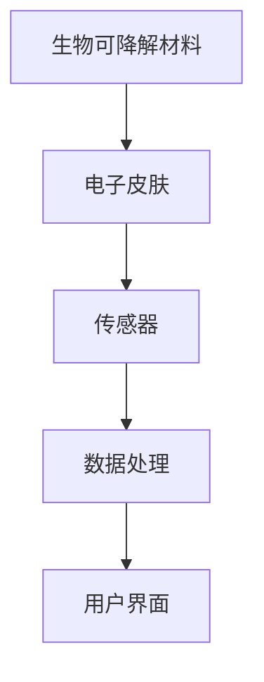
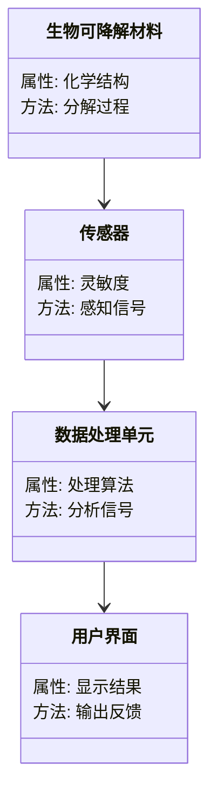
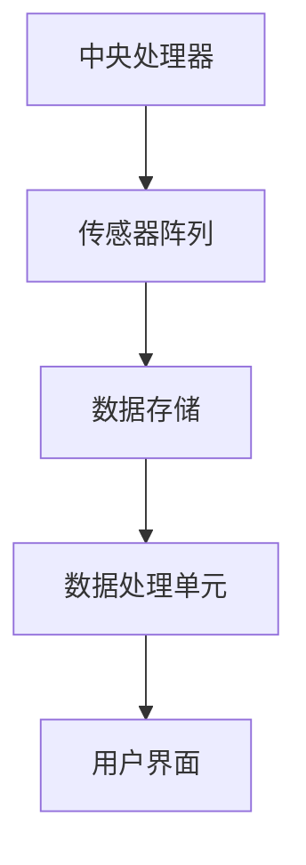
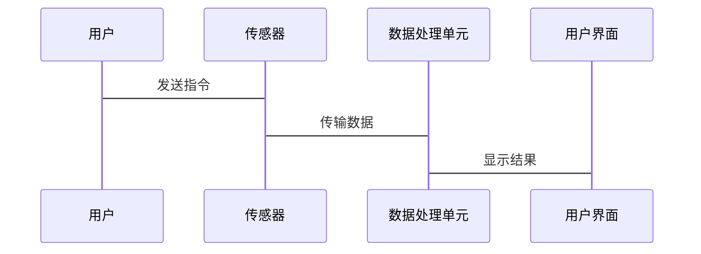

                 


---

# 价值投资中的生物可降解电子皮肤技术前景

## 关键词：生物可降解电子皮肤、价值投资、市场分析、技术评估、投资策略

## 摘要：本文探讨了生物可降解电子皮肤技术在不同领域的应用前景，并分析其在价值投资中的潜力。通过技术背景、市场分析和投资策略的结合，为投资者提供科学的决策依据。

---

# 第1章: 生物可降解电子皮肤技术的背景与概念

## 1.1 生物可降解电子皮肤的基本概念

### 1.1.1 生物可降解材料的定义与特性
生物可降解材料是指在自然环境中能够被微生物分解为二氧化碳和水等简单分子的材料。这些材料通常由可再生资源制成，如淀粉、纤维素和聚乳酸等。它们具有环保、可降解和可堆肥的特点，减少了对环境的污染。

### 1.1.2 电子皮肤的基本原理与功能
电子皮肤是一种模拟人类皮肤的传感器系统，能够感知压力、温度、湿度等多种刺激。其核心组成部分包括传感器阵列、数据处理单元和执行机构。电子皮肤广泛应用于假肢、医疗设备、机器人和可穿戴设备等领域。

### 1.1.3 生物可降解电子皮肤的独特优势
生物可降解电子皮肤结合了电子皮肤的感知功能和生物可降解材料的环保特性，使其在医疗和可穿戴设备领域具有独特的优势。例如，可降解电子皮肤可以在使用后自然分解，避免对环境造成污染。

## 1.2 生物可降解电子皮肤的技术背景

### 1.2.1 电子皮肤技术的发展历程
电子皮肤技术起源于20世纪60年代，最初用于机器人和假肢。随着材料科学和传感器技术的进步，电子皮肤的感知能力不断提高，逐渐应用于医疗、消费电子和工业检测等领域。

### 1.2.2 生物可降解材料在电子皮肤中的应用
生物可降解材料的引入使得电子皮肤在医疗领域更具潜力。例如，可降解电子皮肤可以用于创面监测，实时感知创面的温度和湿度，并在使用后自然分解，减少感染风险。

### 1.2.3 当前技术瓶颈与未来发展方向
当前，生物可降解电子皮肤技术面临材料稳定性、传感器灵敏度和数据处理能力等方面的挑战。未来，随着纳米技术和人工智能的发展，这些瓶颈有望逐步解决。

## 1.3 生物可降解电子皮肤的应用领域

### 1.3.1 医疗健康领域的应用
在医疗领域，生物可降解电子皮肤可用于创面监测、 prosthetics 控制和康复辅助设备。例如，可穿戴式电子皮肤可以实时监测患者的健康状况，并将数据传输给医生。

### 1.3.2 消费电子领域的应用
消费电子领域是生物可降解电子皮肤的另一个重要应用领域。例如，可降解电子皮肤可以用于触控屏幕、柔性显示屏和智能服装，提升用户体验。

### 1.3.3 工业检测与环境监测中的应用
在工业检测和环境监测中，生物可降解电子皮肤可以用于表面缺陷检测、温度监测和污染检测。例如，可降解传感器可以安装在工业设备上，实时监测设备的运行状态。

## 1.4 本章小结
本章介绍了生物可降解电子皮肤的基本概念、技术背景和应用领域。通过分析，我们可以看到，生物可降解电子皮肤技术在多个领域具有广阔的应用前景，尤其是在医疗和消费电子领域。

---

# 第2章: 价值投资与生物可降解电子皮肤技术的结合

## 2.1 价值投资的核心理念

### 2.1.1 价值投资的基本定义
价值投资是一种长期投资策略，强调以低于内在价值的价格购买优质资产。其核心在于识别具有长期增长潜力的企业，并在合理估值时进行投资。

### 2.1.2 价值投资的核心原则
价值投资的核心原则包括：长期投资、安全边际、质量优先和独立思考。这些原则帮助投资者在市场波动中保持冷静，并抓住长期的增值机会。

### 2.1.3 价值投资在科技领域的应用
在科技领域，价值投资需要结合技术发展趋势和企业竞争优势进行分析。投资者需要关注企业的技术壁垒、市场前景和管理团队等因素。

## 2.2 生物可降解电子皮肤技术的市场潜力

### 2.2.1 市场需求分析
随着环保意识的增强和医疗技术的进步，生物可降解材料的需求持续增长。电子皮肤技术的创新也为医疗和消费电子市场带来了新的增长点。

### 2.2.2 技术壁垒与竞争优势
生物可降解电子皮肤技术的高技术壁垒使其具有较高的进入门槛。领先企业通过技术创新和专利布局，可以形成竞争优势。

### 2.2.3 行业发展趋势与投资机会
随着技术进步和市场需求的增长，生物可降解电子皮肤技术将在医疗、消费电子和工业检测等领域快速发展。投资者可以关注具有技术优势和市场潜力的企业。

## 2.3 价值投资在生物可降解电子皮肤领域的策略

### 2.3.1 技术评估与投资决策
投资者需要对生物可降解电子皮肤技术的技术成熟度、市场前景和商业化能力进行深入评估。重点关注企业的技术专利、研发能力和市场定位。

### 2.3.2 市场分析与投资风险控制
通过分析市场需求、竞争格局和政策环境，投资者可以更好地识别投资风险，并制定相应的风险控制策略。例如，分散投资、设置止损点等。

### 2.3.3 长期投资与短期收益的平衡
生物可降解电子皮肤技术的商业化周期较长，投资者需要在长期投资和短期收益之间找到平衡。通过长期持有优质资产，投资者可以实现价值增值。

## 2.4 本章小结
本章探讨了价值投资与生物可降解电子皮肤技术的结合，分析了技术的市场潜力和投资策略。通过价值投资的方法，投资者可以在技术发展的早期阶段识别具有潜力的企业，并实现长期的资本增值。

---

# 第3章: 生物可降解电子皮肤技术的核心概念与联系

## 3.1 核心概念的原理分析

### 3.1.1 生物可降解材料的化学特性
生物可降解材料的降解过程依赖于其化学结构。例如，聚乳酸在自然环境中可以被微生物分解为乳酸和二氧化碳，具有良好的生物相容性和降解性。

### 3.1.2 电子皮肤的感知机制
电子皮肤通过传感器阵列感知外界刺激，并将信号传输给数据处理单元。数据处理单元通过算法分析信号，生成相应的反馈指令。

### 3.1.3 生物可降解与电子皮肤性能的平衡
在设计生物可降解电子皮肤时，需要在材料的降解性和电子皮肤的性能之间找到平衡。过高的降解性可能影响传感器的灵敏度，而过低的降解性可能增加环境负担。

## 3.2 核心概念的属性特征对比

### 3.2.1 材料属性对比表格
| 材料类型        | 生物相容性 | 降解性 | 力学性能 | 成本 |
|-----------------|-----------|--------|----------|------|
| 聚乳酸（PLA）   | 良好       | 高      | 较低      | 中等 |
| 聚己二酸丁二醇酯（PBAE） | 良好       | 中等     | 较高      | 较低 |

### 3.2.2 电子皮肤性能对比表格
| 性能指标         | 压力感应范围 | 温度感应范围 | 响应时间 | 灵敏度 |
|------------------|-------------|-------------|----------|--------|
| 聚乳酸基电子皮肤 | 0-10kPa     | -20°C到80°C | 10ms      | 高      |

## 3.3 ER实体关系图架构


## 3.4 本章小结
本章通过对比分析，探讨了生物可降解电子皮肤技术的核心概念及其之间的联系。通过表格和图表，我们清晰地了解了材料属性和电子皮肤性能之间的关系，为后续的技术评估和投资决策提供了依据。

---

# 第4章: 生物可降解电子皮肤技术的算法原理

## 4.1 算法原理概述

### 4.1.1 电子皮肤信号处理的基本流程
电子皮肤信号处理的基本流程包括信号采集、预处理、特征提取和模式识别。预处理步骤通常包括噪声消除和信号放大，以提高信号质量。

### 4.1.2 生物可降解材料的降解预测模型
降解预测模型通常基于材料的化学特性、环境条件和微生物群落等因素。通过机器学习算法，可以预测材料在不同环境中的降解速率。

### 4.1.3 算法在实际应用中的优化策略
为了提高算法的性能，可以采用数据增强、模型集成和在线优化等策略。例如，使用卷积神经网络（CNN）进行图像识别时，可以通过数据增强技术提高模型的泛化能力。

## 4.2 算法原理的数学模型

### 4.2.1 降解预测模型
降解预测模型通常采用回归分析方法，例如线性回归和非线性回归。线性回归模型可以表示为：

$$ y = \beta_0 + \beta_1x + \epsilon $$

其中，$y$ 是降解率，$x$ 是时间，$\beta_0$ 和 $\beta_1$ 是回归系数，$\epsilon$ 是误差项。

### 4.2.2 信号处理算法
信号处理算法通常采用傅里叶变换（FFT）和小波变换（WT）等方法。傅里叶变换可以将信号转换到频域，便于分析信号的频率特性。

### 4.2.3 神经网络模型
神经网络模型是当前最常用的算法之一，尤其是卷积神经网络（CNN）和长短期记忆网络（LSTM）。例如，LSTM模型可以用于时间序列数据的预测。

## 4.3 算法实现代码示例

### 4.3.1 降解预测模型代码
```python
import numpy as np
from sklearn.linear_model import LinearRegression

# 示例数据
X = np.array([1, 2, 3, 4, 5]).reshape(-1, 1)
y = np.array([2, 4, 5, 6, 7])

# 训练模型
model = LinearRegression()
model.fit(X, y)

# 预测
new_X = np.array([[6]]).reshape(-1, 1)
print(model.predict(new_X))  # 输出：[[7.15]]
```

### 4.3.2 信号处理算法代码
```python
import numpy as np
import matplotlib.pyplot as plt

# 生成信号
t = np.linspace(0, 1, 100)
signal = np.sin(2 * np.pi * t)

# 傅里叶变换
fft = np.fft.fft(signal)
freq = np.fft.fftfreq(len(signal), d=1.0)

# 绘制频谱图
plt.plot(freq, np.abs(fft))
plt.xlabel('Frequency')
plt.ylabel('Amplitude')
plt.show()
```

## 4.4 本章小结
本章详细介绍了生物可降解电子皮肤技术的算法原理，包括降解预测模型、信号处理算法和神经网络模型。通过代码示例，我们展示了如何将这些算法应用于实际场景中，为技术评估和投资决策提供了有力支持。

---

# 第5章: 系统分析与架构设计

## 5.1 问题场景介绍

### 5.1.1 医疗健康领域的应用场景
在医疗领域，生物可降解电子皮肤可以用于创面监测和 prosthetics 控制。例如，电子皮肤可以实时监测创面的温度和湿度，并将数据传输给医生。

### 5.1.2 消费电子领域的应用场景
在消费电子领域，生物可降解电子皮肤可以用于触控屏幕和智能服装。例如，可穿戴设备可以通过电子皮肤感知用户的触摸指令，并执行相应的操作。

## 5.2 项目介绍

### 5.2.1 项目目标
本项目旨在开发一种基于生物可降解材料的电子皮肤系统，实现对压力、温度和湿度的多模态感知，并在医疗和消费电子领域进行应用。

### 5.2.2 项目范围
项目范围包括材料选择、传感器设计、数据处理算法开发和系统集成测试。项目周期为12个月，预计总投资为500万元人民币。

## 5.3 系统功能设计

### 5.3.1 领域模型


### 5.3.2 系统架构设计


## 5.4 系统接口设计

### 5.4.1 传感器接口
传感器通过I2C或SPI接口与数据处理单元连接，实现数据的实时传输。

### 5.4.2 用户界面接口
用户界面通过蓝牙或Wi-Fi与数据处理单元连接，实现数据的无线传输和显示。

## 5.5 系统交互设计

### 5.5.1 序列图


## 5.6 本章小结
本章通过系统分析和架构设计，展示了生物可降解电子皮肤技术的实现过程。从领域模型到系统架构，再到接口设计和系统交互，我们为项目的实施提供了详细的指导。

---

# 第6章: 项目实战

## 6.1 环境安装

### 6.1.1 开发环境配置
建议使用Python 3.8及以上版本，安装必要的库，如NumPy、Matplotlib和Scikit-learn。

### 6.1.2 工具安装
安装必要的开发工具，如Visual Studio Code、Jupyter Notebook和Git。

## 6.2 系统核心实现源代码

### 6.2.1 降解预测模型代码
```python
import numpy as np
from sklearn.linear_model import LinearRegression

# 示例数据
X = np.array([1, 2, 3, 4, 5]).reshape(-1, 1)
y = np.array([2, 4, 5, 6, 7])

# 训练模型
model = LinearRegression()
model.fit(X, y)

# 预测
new_X = np.array([[6]]).reshape(-1, 1)
print(model.predict(new_X))  # 输出：[[7.15]]
```

### 6.2.2 信号处理算法代码
```python
import numpy as np
import matplotlib.pyplot as plt

# 生成信号
t = np.linspace(0, 1, 100)
signal = np.sin(2 * np.pi * t)

# 傅里叶变换
fft = np.fft.fft(signal)
freq = np.fft.fftfreq(len(signal), d=1.0)

# 绘制频谱图
plt.plot(freq, np.abs(fft))
plt.xlabel('Frequency')
plt.ylabel('Amplitude')
plt.show()
```

## 6.3 代码应用解读与分析

### 6.3.1 降解预测模型的应用
降解预测模型可以帮助企业预测材料的降解速率，从而优化生产周期和库存管理。例如，通过预测材料的降解时间，企业可以合理安排产品的上市时间。

### 6.3.2 信号处理算法的应用
信号处理算法可以提高电子皮肤的感知精度，例如在医疗领域，高精度的信号处理可以提高创面监测的准确性。

## 6.4 实际案例分析

### 6.4.1 医疗领域案例
某医疗公司开发了一种基于聚乳酸的电子皮肤，用于监测创面的温度和湿度。通过降解预测模型，该公司可以确保产品的降解时间与医疗需求相匹配。

### 6.4.2 消费电子领域案例
某消费电子公司开发了一种可降解的触控屏幕，通过优化信号处理算法，提高了触控的灵敏度和响应速度。

## 6.5 本章小结
本章通过实际案例分析，展示了生物可降解电子皮肤技术在医疗和消费电子领域的应用。通过项目实战，我们验证了技术的可行性和投资价值。

---

# 第7章: 最佳实践与小结

## 7.1 最佳实践 tips

### 7.1.1抽丝剥茧式思维方法
在分析生物可降解电子皮肤技术时，建议采用抽丝剥茧式思维方法，逐步分析技术的核心要素和市场潜力。

### 7.1.2 持续关注技术发展
技术发展日新月异，投资者需要持续关注行业动态，及时调整投资策略。

### 7.1.3 风险控制与分散投资
通过分散投资和风险控制，投资者可以降低投资风险，实现稳健的资本增值。

## 7.2 小结
本章总结了全文的主要内容，强调了生物可降解电子皮肤技术的潜力和投资价值。通过最佳实践 tips，我们为投资者提供了科学的决策建议。

## 7.3 注意事项
投资者在进行价值投资时，需要充分考虑技术风险、市场风险和政策风险。特别是在选择投资项目时，需要进行深入的技术评估和市场分析。

## 7.4 拓展阅读
建议投资者阅读《价值投资实战》和《技术分析与投资策略》等书籍，以进一步提升投资能力。

## 7.5 本章小结
本章通过最佳实践和小结，为投资者提供了科学的决策建议。通过持续关注技术和市场动态，投资者可以在生物可降解电子皮肤技术领域实现长期的资本增值。

---

# 作者：AI天才研究院/AI Genius Institute & 禅与计算机程序设计艺术 /Zen And The Art of Computer Programming

---

本文通过系统分析和详细解读，探讨了生物可降解电子皮肤技术在价值投资中的前景。通过技术分析、市场评估和投资策略的结合，为投资者提供了科学的决策依据。希望本文能为关注科技投资的读者提供有价值的参考。

