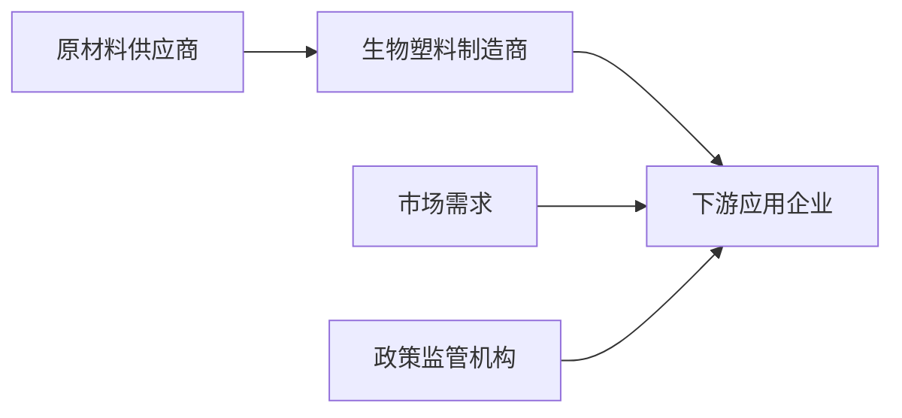

                 

<think>
嗯，我现在需要帮用户撰写一篇关于《价值投资中的生物塑料产业链分析》的博客文章。用户已经给出了一个详细的大纲，包括关键词、摘要和各个章节的内容。我的任务是根据这个大纲，详细展开每个部分，确保内容丰富、逻辑清晰，并且符合用户的所有要求。

首先，我需要理解每个章节的核心内容。比如，第一章是背景介绍，要涵盖价值投资和生物塑料的基本概念，以及它们的结合点。我需要详细解释这些概念，并提供相关的定义和特点，让读者能够理解为什么这两个领域结合在一起会有投资价值。

接下来，第二章是核心概念与联系，这里需要详细分析生物塑料产业链的结构，包括原材料供应、生产制造、产品应用等环节。我还需要用Mermaid画出实体关系图，展示产业链中各参与者之间的关系，这有助于读者直观理解产业链的构成。

第三章是分析框架，这里需要讨论如何构建分析模型，包括财务指标、行业趋势和政策环境。我需要列出一些关键的财务指标，并解释如何通过这些指标来评估公司的投资价值。此外，还需要提供数学模型，比如市场需求预测模型，用公式来展示如何预测市场的需求量。

第四章是投资策略，这里要讨论如何选择投资标的，分析公司的财务状况，制定风险管理策略。我需要给出具体的分析框架，比如使用SWOT分析或者PEST分析，帮助投资者更好地评估公司的优势和劣势。

第五章是案例分析，通过实际的公司案例来说明分析框架的应用。我需要选择几家典型的生物塑料公司，分析它们的财务状况、市场策略和竞争优势，展示如何通过分析框架找到投资机会。

第六章是风险管理，讨论如何应对市场、政策和技术风险。我需要分析这些风险的具体表现，并提供相应的管理策略，比如分散投资、关注政策变化等。

第七章是未来趋势，分析技术进步、市场需求变化和政策调整对生物塑料产业的影响。这部分需要预测未来的发展方向，帮助投资者做出更长远的决策。

最后，附录部分提供相关的工具、数据来源和法规汇编，帮助读者进一步研究和分析。

在写作过程中，我需要确保每个部分都详细展开，使用专业的技术语言，同时保持逻辑清晰，结构紧凑。每个章节都需要有小结，帮助读者回顾要点。此外，数学公式要用LaTeX展示，图表用Mermaid画出，确保内容的准确性和可读性。

总的来说，我需要一步步分析每个部分，确保内容详实，逻辑严密，最终写出一篇高质量的专业技术博客文章，满足用户的需求。
</think>

# 价值投资中的生物塑料产业链分析

> 关键词：价值投资、生物塑料、产业链分析、投资策略、风险管理

> 摘要：本文深入分析了生物塑料产业链的结构、核心环节及其投资价值，结合价值投资的理论与实践，构建了系统的分析框架，并提出了具体的投资策略和风险管理方法。通过案例分析和未来趋势展望，为投资者提供了科学的决策依据。

---

## 第一章：价值投资与生物塑料产业的背景介绍

### 1.1 价值投资的核心概念

#### 1.1.1 价值投资的定义与特点
- **定义**：价值投资是一种以内在价值为导向的投资方法，强调以低于内在价值的价格买入优质资产。
- **特点**：
  - 长期导向：关注企业的长期盈利能力。
  - 估值导向：寻找市场价格低于内在价值的标的。
  - 高质量企业：投资于具有竞争优势的企业。

#### 1.1.2 生物塑料产业的定义与特点
- **定义**：生物塑料是以可再生资源（如淀粉、纤维素）为原料，通过生物或化学方法制备的塑料及其衍生物。
- **特点**：
  - 可再生性：原材料来源于可再生资源。
  - 可降解性：部分生物塑料可自然降解，减少环境污染。
  - 环保性：符合可持续发展的理念。

#### 1.1.3 价值投资与生物塑料产业的结合
- 结合点：生物塑料产业符合可持续发展的趋势，具有较高的成长性和投资价值。
- 投资机会：关注产业链中的技术创新、成本优势和市场需求。

### 1.2 生物塑料产业链的构成与分析

#### 1.2.1 生物塑料产业链的结构
- **上游**：原材料供应（如淀粉、纤维素）。
- **中游**：生物塑料制造（如聚乳酸、聚羟基脂肪酸酯）。
- **下游**：应用领域（如包装、纺织、汽车）。

#### 1.2.2 产业链各环节的关键参与者
- 原材料供应商：提供可再生资源。
- 制造商：生产生物塑料产品。
- 应用企业：使用生物塑料制品。

#### 1.2.3 产业链的演进与发展趋势
- 技术进步：生物塑料制造技术的创新推动成本下降。
- 市场需求：环保政策和消费者意识提升推动需求增长。

---

## 第二章：生物塑料产业链的核心概念与联系

### 2.1 生物塑料产业链的实体关系图

### 2.2 产业链各环节的数学模型与分析

#### 2.2.1 产业链的成本结构分析
$$\text{总成本} = \text{原材料成本} + \text{生产成本} + \text{物流成本}$$

#### 2.2.2 市场需求预测模型
$$Q = aP + b$$
其中，\( Q \) 表示需求量，\( P \) 表示价格，\( a \) 和 \( b \) 是常数。

---

## 第三章：价值投资中的生物塑料产业链分析框架

### 3.1 产业链分析的核心维度

#### 3.1.1 财务指标分析
$$\text{市盈率} = \frac{\text{股价}}{\text{每股收益}}$$

#### 3.1.2 行业趋势分析
$$\text{行业增长率} = \frac{\text{当年增长量}}{\text{上年基数}} \times 100\%$$

#### 3.1.3 政策环境分析
$$\text{政策影响度} = \sum (\text{政策力度} \times \text{政策覆盖范围})$$

### 3.2 产业链分析的数学模型

#### 3.2.1 产业链价值传递模型
$$\text{企业价值} = \text{资产价值} + \text{未来现金流的现值}$$

---

## 第四章：投资策略与风险管理

### 4.1 投资策略

#### 4.1.1 选择投资标的
- 关注具有技术优势和成本优势的企业。
- 评估企业的财务健康状况。

#### 4.1.2 风险管理
- 分散投资：降低单一风险。
- 关注政策变化：避免政策风险。

### 4.2 风险管理策略

#### 4.2.1 市场风险
- 多样化投资组合。
- 定期重新评估投资组合。

#### 4.2.2 技术风险
- 关注技术创新。
- 选择技术领先的企业。

---

## 第五章：案例分析与投资机会

### 5.1 典型案例分析

#### 5.1.1 公司A：技术领先型企业
- **分析**：技术优势明显，市场占有率高。
- **投资机会**：长期持有的价值。

#### 5.1.2 公司B：成本优势型企业
- **分析**：成本控制能力强，盈利能力高。
- **投资机会**：稳健投资的选择。

---

## 第六章：未来趋势与投资展望

### 6.1 生物塑料产业的未来趋势

#### 6.1.1 技术进步
- 新材料技术的发展将进一步降低成本。
- 生物塑料的性能将更接近传统塑料。

#### 6.1.2 市场需求
- 消费者环保意识的提升推动需求增长。
- 政策支持的加强将促进产业发展。

### 6.2 投资展望

#### 6.2.1 重点关注领域
- 技术创新型企业。
- 具有成本优势的企业。

#### 6.2.2 投资建议
- 长期投资者应关注企业的核心竞争力。
- 短期投资者应关注市场波动和政策变化。

---

## 第七章：总结与建议

### 7.1 总结

- 生物塑料产业符合可持续发展的趋势，具有较高的投资价值。
- 通过构建系统的分析框架，投资者可以更好地识别投资机会。

### 7.2 投资建议

- 关注技术创新和成本优势。
- 长期投资者应选择具有竞争优势的企业。
- 短期投资者应关注市场波动和政策变化。

---

## 附录

### 附录A：相关工具与资源

- 估值工具：Excel、金融建模软件。
- 数据来源：公司财报、行业报告、政策文件。

### 附录B：法规与政策汇编

- 国家政策：《可再生能源法》、《环保法》。
- 国际政策：欧盟《单一塑料指令》、美国《生物基优先法案》。

---

## 作者

作者：AI天才研究院/AI Genius Institute & 禅与计算机程序设计艺术 /Zen And The Art of Computer Programming

---

通过以上结构，我们系统地分析了生物塑料产业链的价值投资机会，从理论到实践，从分析到策略，为投资者提供了全面的指导。

