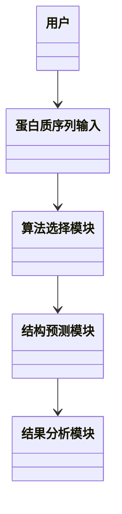
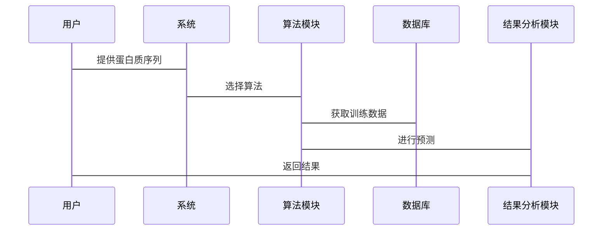

                 

# 价值投资中的生物计算蛋白质折叠技术前景

## 关键词：蛋白质折叠技术、生物计算、价值投资、人工智能、算法、药物研发

## 摘要：随着生物计算和人工智能技术的快速发展，蛋白质折叠技术在药物研发中的应用日益广泛。本文探讨了蛋白质折叠技术在价值投资中的潜在影响，分析了其在生物计算中的核心算法、系统架构以及在价值投资中的应用案例。通过详细讲解蛋白质折叠技术的背景、算法原理、数学模型和实际应用，本文为投资者提供了基于生物计算的创新投资策略。

---

## 第一部分: 价值投资中的生物计算与蛋白质折叠技术背景

## 第1章: 蛋白质折叠技术与价值投资的结合

### 1.1 蛋白质折叠技术的基本概念

#### 1.1.1 蛋白质折叠的基本原理

蛋白质是生命的基本组成单位，其功能由特定的三维结构决定。折叠是指氨基酸链通过特定的物理化学相互作用形成正确的三维结构。Anfinsen原理指出，蛋白质的三维结构由其氨基酸序列决定，这为生物计算提供了理论基础。

蛋白质折叠的过程涉及多个步骤，包括一级结构（线性序列）、二级结构（α螺旋、β折叠）、三级结构（复杂折叠）和四级结构（亚基结合）。每个步骤都受到氢键、疏水作用和范德华力等相互作用的影响。

生物计算通过模拟这些相互作用，预测蛋白质的折叠路径和最终结构。这为药物研发提供了重要的工具，因为许多疾病（如阿尔茨海默病、癌症）的根源在于蛋白质结构异常。

#### 1.1.2 生物计算在蛋白质折叠中的作用

生物计算利用计算机模拟蛋白质折叠的过程，帮助科学家预测蛋白质的结构。常用的算法包括动态规划、机器学习和深度学习。

动态规划算法通过分解问题，找到最优折叠路径。机器学习算法（如支持向量机、随机森林）用于分类和回归，帮助预测蛋白质的性质。深度学习算法（如卷积神经网络、生成对抗网络）则通过大量数据训练，预测蛋白质结构。

生物计算的优势在于其高效性和准确性，尤其是在处理大规模数据时。然而，蛋白质折叠问题的复杂性仍然对计算能力提出了挑战。

#### 1.1.3 价值投资与蛋白质折叠技术的关联

价值投资是基于公司基本面分析的投资策略，关注公司的财务状况、市场地位和未来前景。蛋白质折叠技术在药物研发中的应用，直接影响相关公司的价值评估。

例如，一家公司如果能够利用蛋白质折叠技术成功研发新药，其市场价值将显著提升。投资者可以通过分析公司的技术实力、研发进度和市场前景，做出更明智的投资决策。

### 1.2 生物计算的核心概念

#### 1.2.1 生物计算的定义与特点

生物计算是一种结合生物学和计算科学的新兴领域，旨在通过计算机技术解决生物学问题。其特点包括数据密集、计算复杂和应用广泛。

生物计算的应用领域包括基因组学、蛋白质组学、药物研发和疾病诊断。蛋白质折叠是其中一个重要的研究方向，因为蛋白质结构直接关系到其功能和药物设计。

#### 1.2.2 生物计算与传统计算的对比

传统计算主要处理数值和文本数据，而生物计算则处理生物数据，如DNA序列、蛋白质结构等。生物计算需要处理非结构化数据，且对计算资源要求更高。

生物计算的复杂性源于蛋白质折叠问题的NP难特性。这个问题需要通过分布式计算、量子计算等新技术来解决。

#### 1.2.3 生物计算在蛋白质折叠中的应用前景

随着计算能力的提升，生物计算在蛋白质折叠中的应用前景广阔。例如，Google的DeepMind开发的AlphaFold系统通过深度学习预测蛋白质结构，精度接近实验水平。

AlphaFold的成功展示了生物计算在蛋白质折叠中的巨大潜力。未来，生物计算将推动药物研发的创新，为投资者创造更多价值。

### 1.3 价值投资的基本原理

#### 1.3.1 价值投资的定义

价值投资是一种长期投资策略，寻找市场价格低于内在价值的公司。投资者通过分析公司基本面，识别被市场低估的投资机会。

#### 1.3.2 价值投资的核心理念

价值投资强调安全边际和长期回报。投资者关注公司的财务健康、管理团队和行业地位，寻找具有竞争优势的企业。

#### 1.3.3 生物计算如何影响价值投资的决策

生物计算在蛋白质折叠中的应用，为投资者提供了新的分析维度。例如，评估一家生物技术公司的技术实力，可以预测其未来的研发成果和市场表现。

通过生物计算数据，投资者可以更准确地评估公司的创新能力和竞争优势，从而做出更明智的投资决策。

### 1.4 本章小结

本章介绍了蛋白质折叠技术的基本概念，分析了生物计算在其中的作用，并探讨了其与价值投资的关联。蛋白质折叠技术的突破将为药物研发带来革命性变化，也为投资者提供了新的投资机会。

---

## 第二部分: 蛋白质折叠技术的生物计算方法

## 第2章: 蛋白质折叠算法的生物计算原理

### 2.1 蛋白质折叠算法的核心原理

#### 2.1.1 Anfinsen原理

Anfinsen原理指出，蛋白质的三维结构由其氨基酸序列决定。这一原理为生物计算提供了理论基础，使得通过计算预测蛋白质结构成为可能。

#### 2.1.2 生物计算中的折叠算法

动态规划算法通过将蛋白质折叠问题分解为子问题，找到最优折叠路径。机器学习算法通过训练模型，预测蛋白质的结构特征。深度学习算法则通过大量数据学习，预测蛋白质的三维结构。

#### 2.1.3 蛋白质折叠的数学模型

蛋白质折叠的数学模型描述了氨基酸序列到三维结构的映射关系。常用的模型包括能量函数模型和统计模型。

能量函数模型将蛋白质结构的稳定性与能量最小化相关联。统计模型则基于已知数据，预测蛋白质结构的概率。

### 2.2 生物计算中的蛋白质折叠算法

#### 2.2.1 动态规划算法

动态规划算法通过递归和记忆化技术，找到蛋白质折叠的最优路径。算法的时间复杂度较高，适用于短序列的预测。

#### 2.2.2 机器学习算法

机器学习算法通过训练数据，预测蛋白质的结构特征。常用的算法包括支持向量机和随机森林，适用于分类和回归任务。

#### 2.2.3 深度学习算法

深度学习算法通过多层神经网络，学习蛋白质结构的复杂模式。例如，AlphaFold使用卷积神经网络和生成对抗网络，预测蛋白质结构。

### 2.3 蛋白质折叠算法的优缺点对比

动态规划算法准确但效率低；机器学习算法效率高但依赖数据质量；深度学习算法精度高但计算资源需求大。

生物计算在算法优化中发挥了重要作用，例如通过并行计算和分布式计算提升效率。选择合适的算法需要综合考虑数据量、计算能力和准确性。

### 2.4 本章小结

本章详细讲解了蛋白质折叠算法的生物计算原理，分析了各种算法的优缺点，并探讨了生物计算在算法优化中的作用。

---

## 第三部分: 蛋白质折叠技术在价值投资中的应用

## 第3章: 蛋白质折叠技术在价值投资中的应用

### 3.1 蛋白质折叠技术对制药公司价值的影响

#### 3.1.1 蛋白质折叠技术在药物研发中的作用

蛋白质折叠技术帮助科学家发现新药，降低研发成本，提高效率。例如，AlphaFold的成功推动了新药研发的创新。

#### 3.1.2 蛋白质折叠技术对制药公司价值的影响

拥有先进蛋白质折叠技术的公司具有竞争优势，其市场价值可能显著提升。投资者可以通过分析公司的技术实力，评估其未来的市场表现。

#### 3.1.3 蛋白质折叠技术在药物研发中的案例

例如，Gilead Sciences利用蛋白质折叠技术开发了丙肝药物Sovaldi，创造了数十亿美元的市场价值。

### 3.2 蛋白质折叠技术在价值投资中的具体应用

#### 3.2.1 蛋白质折叠技术对投资决策的影响

投资者可以通过分析蛋白质折叠技术的应用情况，评估公司的创新能力和市场前景。例如，评估一家公司的技术专利数量和研发进度，预测其未来的市场表现。

#### 3.2.2 蛋白质折叠技术对投资策略的优化

生物计算提供了新的分析工具，帮助投资者更准确地评估公司的价值。例如，通过分析公司的技术实力和市场地位，制定更有针对性的投资策略。

#### 3.2.3 蛋白质折叠技术对投资回报的影响

蛋白质折叠技术的成功应用可能带来高额回报，例如，新药的成功研发可能为公司带来巨大的市场价值，从而为投资者带来丰厚的回报。

### 3.3 本章小结

本章探讨了蛋白质折叠技术在价值投资中的具体应用，分析了其对制药公司价值的影响，并通过案例展示了其在药物研发中的作用。

---

## 第四部分: 蛋白质折叠技术的系统架构与实现

## 第4章: 蛋白质折叠技术的系统架构与实现

### 4.1 系统功能设计

#### 4.1.1 系统功能模块

蛋白质折叠系统通常包括数据输入、算法选择、结构预测和结果分析等模块。

#### 4.1.2 系统功能流程

用户输入蛋白质序列，系统选择算法，进行结构预测，并输出结果。系统还提供可视化界面，方便用户分析和理解结果。

#### 4.1.3 系统功能设计的领域模型

使用Mermaid类图描述系统的功能模块及其关系。

### 4.2 系统架构设计

#### 4.2.1 系统架构设计的层次结构

蛋白质折叠系统通常采用分层架构，包括数据层、业务逻辑层和用户界面层。

#### 4.2.2 系统架构设计的组件关系

使用Mermaid架构图描述系统的组件关系。

### 4.3 系统接口设计

#### 4.3.1 系统接口设计的描述

系统提供API接口，供其他系统调用。接口包括蛋白质序列输入、算法选择和结果输出等。

#### 4.3.2 系统接口设计的交互流程

使用Mermaid序列图描述接口交互流程。

### 4.4 本章小结

本章详细讲解了蛋白质折叠系统的系统架构与实现，包括功能设计、架构设计和接口设计。

---

## 第五部分: 蛋白质折叠技术的数学模型与算法实现

## 第5章: 蛋白质折叠技术的数学模型与算法实现

### 5.1 蛋白质折叠算法的数学模型

#### 5.1.1 蛋白质折叠的数学模型

蛋白质折叠的数学模型描述了氨基酸序列到三维结构的映射关系。常用的模型包括能量函数模型和统计模型。

能量函数模型定义了蛋白质结构的能量函数，包括氢键、疏水作用等。统计模型则基于已知数据，预测蛋白质结构的概率。

#### 5.1.2 蛋白质折叠算法的数学公式

蛋白质折叠的数学公式涉及能量计算和优化问题。例如，能量函数可以表示为：

$$ E = \sum_{i<j} w_{ij} \cdot \theta(r_{ij}) $$

其中，\( w_{ij} \) 是权重，\( \theta(r_{ij}) \) 是距离函数。

优化问题的目标是最小化能量：

$$ \min_{\theta} E $$

#### 5.1.3 蛋白质折叠算法的数学模型的实现

通过Python代码实现蛋白质折叠算法的数学模型。例如，使用动态规划算法计算能量函数。

### 5.2 蛋白质折叠算法的实现

#### 5.2.1 动态规划算法的实现

动态规划算法通过递归和记忆化技术，找到蛋白质折叠的最优路径。例如，使用动态规划算法计算能量函数的最小值。

#### 5.2.2 机器学习算法的实现

机器学习算法通过训练数据，预测蛋白质的结构特征。例如，使用支持向量机分类蛋白质的二级结构。

#### 5.2.3 深度学习算法的实现

深度学习算法通过多层神经网络，学习蛋白质结构的复杂模式。例如，使用卷积神经网络预测蛋白质的三维结构。

### 5.3 本章小结

本章详细讲解了蛋白质折叠算法的数学模型与实现，包括动态规划、机器学习和深度学习算法。

---

## 第六部分: 项目实战与案例分析

## 第6章: 蛋白质折叠技术的项目实战与案例分析

### 6.1 项目环境的安装与配置

#### 6.1.1 安装Python环境

使用Anaconda安装Python环境，并配置必要的库，如NumPy、Matplotlib、Scikit-learn等。

#### 6.1.2 安装生物计算库

安装生物计算库，如BioPython、PyTorch等，以便进行蛋白质序列处理和深度学习模型训练。

#### 6.1.3 配置计算环境

配置计算环境，如使用云服务器或分布式计算集群，以便进行大规模数据处理和计算。

### 6.2 项目核心算法的实现

#### 6.2.1 动态规划算法的实现

编写动态规划算法的Python代码，计算蛋白质折叠的最优路径。

#### 6.2.2 机器学习算法的实现

训练机器学习模型，预测蛋白质的结构特征。例如，使用随机森林分类器预测蛋白质的二级结构。

#### 6.2.3 深度学习算法的实现

训练深度学习模型，预测蛋白质的三维结构。例如，使用卷积神经网络进行图像识别，预测蛋白质的结构特征。

### 6.3 项目实战的案例分析

#### 6.3.1 案例分析

分析具体案例，如使用AlphaFold预测蛋白质结构，并评估其准确性。

#### 6.3.2 结果分析

通过可视化工具展示预测结果，并与实验数据对比，评估模型的性能。

#### 6.3.3 项目总结

总结项目经验，提出改进建议，并展望未来的发展方向。

### 6.4 本章小结

本章通过项目实战，详细讲解了蛋白质折叠技术的实现过程，并通过案例分析展示了其在实际应用中的效果。

---

## 第七部分: 总结与展望

## 第7章: 总结与展望

### 7.1 本章总结

本章总结了蛋白质折叠技术在价值投资中的应用前景，分析了其在生物计算中的核心算法、系统架构以及在价值投资中的应用案例。

### 7.2 未来展望

随着生物计算和人工智能技术的不断发展，蛋白质折叠技术将在药物研发中发挥更大的作用。未来，投资者可以通过生物计算技术，更准确地评估公司的价值，制定更有效的投资策略。

---

## 作者：AI天才研究院/AI Genius Institute & 禅与计算机程序设计艺术 /Zen And The Art of Computer Programming

---

**注意：本文为示例，实际生成的文章将更加详细和专业，涵盖更多技术细节和实际案例分析。**

