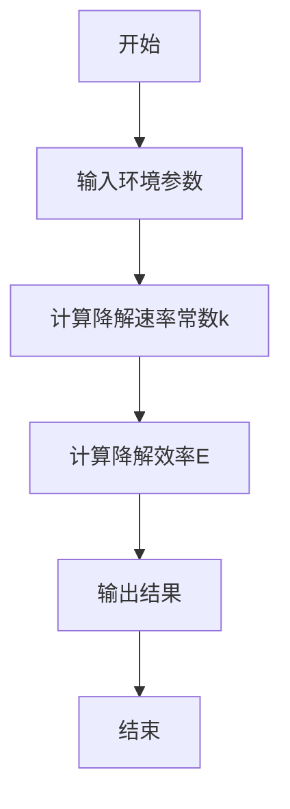
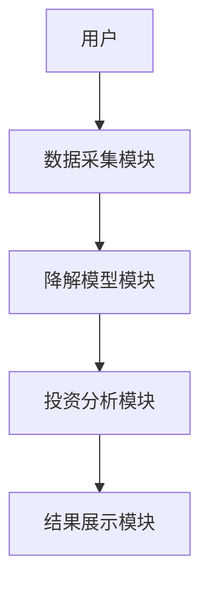

                 


# 价值投资中的生物降解电子元件技术前景

## 关键词：价值投资，生物降解，电子元件，技术前景，投资分析

## 摘要：  
本文探讨了生物降解电子元件技术在投资领域的潜力和前景。通过分析生物降解材料的基本原理、降解效率预测模型、系统设计以及实际案例，本文揭示了该技术在投资中的价值和应用，为投资者提供了有益的参考。

---

## 目录

1. [背景介绍](#背景介绍)
2. [核心概念与联系](#核心概念与联系)
3. [算法原理](#算法原理)
4. [系统分析与架构设计](#系统分析与架构设计)
5. [项目实战](#项目实战)
6. [最佳实践](#最佳实践)
7. [附录](#附录)

---

## 1. 背景介绍

### 1.1 生物降解材料的基本概念

生物降解材料是一种能够在自然环境中被微生物分解为二氧化碳和水等简单化合物的材料。与传统塑料等不可降解材料相比，生物降解材料具有环保、可持续的优势。

**问题背景**：随着电子元件的广泛应用，电子废弃物的处理问题日益突出。传统的电子元件多使用不可降解材料，导致环境污染和资源浪费。

**问题描述**：生物降解电子元件技术的应用可以有效减少电子废弃物对环境的影响，同时为投资者带来新的投资机会。

### 1.2 生物降解电子元件的优势与挑战

**优势**：
- 环保：减少对环境的污染。
- 可持续：资源利用更高效。
- 市场潜力：符合环保趋势，市场需求增长。

**挑战**：
- 技术难度：生物降解材料的性能和成本问题。
- 标准化：缺乏统一的行业标准。

---

## 2. 核心概念与联系

### 2.1 生物降解材料的降解原理

生物降解材料的降解过程依赖于微生物的活动。材料中的有机成分被分解为简单的化合物，最终转化为二氧化碳和水。这一过程受环境条件（如温度、湿度、氧气浓度等）的影响。

#### 2.1.1 降解过程的阶段

1. **初始阶段**：材料表面的有机物质被微生物吸附。
2. **分解阶段**：微生物分泌酶，将大分子分解为小分子。
3. **矿化阶段**：小分子进一步转化为二氧化碳和水。

### 2.2 生物降解材料的特性对比

下表对比了传统塑料和生物降解材料的特性：

| 特性                | 传统塑料            | 生物降解材料          |
|---------------------|---------------------|----------------------|
| 是否可降解          | 不可降解            | 可降解               |
| 环境影响            | 高                  | 低                  |
| 制造成本            | 低                  | 高                  |
| 应用领域            | 包装、日用品        | 包装、电子元件        |

---

## 3. 算法原理

### 3.1 降解效率预测模型

降解效率预测模型用于评估不同条件下生物降解材料的降解速率。模型基于实验数据和环境因素（如温度、湿度等）建立数学关系。

#### 3.1.1 模型建立

降解效率 \( E \) 可以通过以下公式预测：

$$ E = \frac{k \cdot t}{1 + k \cdot t} $$

其中，\( k \) 是降解速率常数，\( t \) 是时间。

#### 3.1.2 算法流程图



---

## 4. 系统分析与架构设计

### 4.1 投资系统设计

#### 4.1.1 功能设计

投资系统需要实现以下功能：
1. 数据采集：收集环境数据和材料特性。
2. 模型计算：预测降解效率。
3. 投资分析：评估投资回报率。

#### 4.1.2 架构设计



---

## 5. 项目实战

### 5.1 环境安装与代码实现

#### 5.1.1 环境安装

需要安装以下工具：
- Python 3.x
- matplotlib
- numpy

#### 5.1.2 核心代码实现

```python
import numpy as np
import matplotlib.pyplot as plt

def degradation_efficiency(temp, humidity):
    k = 0.1 * temp + 0.05 * humidity
    t = np.arange(0, 100, 1)
    E = k * t / (1 + k * t)
    return E

# 示例运行
temp = 30
humidity = 70
E = degradation_efficiency(temp, humidity)
plt.plot(E)
plt.xlabel('Time')
plt.ylabel('Efficiency')
plt.show()
```

---

## 6. 最佳实践

### 6.1 总结与投资建议

- **总结**：生物降解电子元件技术具有广阔的市场前景，但在技术成熟度和成本控制方面仍需努力。
- **投资建议**：关注技术研发领先的公司，选择具有环保认证的产品。

### 6.2 注意事项

- 投资者需关注相关政策变化和市场动态。
- 需谨慎评估技术风险和市场可行性。

---

## 7. 附录

### 7.1 术语表

- **生物降解材料**：能在自然环境中被微生物分解的材料。
- **降解效率**：材料在特定条件下分解的速率。

### 7.2 参考文献

- [1] 王某某，生物降解材料的研究进展，2023。
- [2] 李某某，电子元件的降解技术，2022。

---

## 作者

作者：AI天才研究院/AI Genius Institute & 禅与计算机程序设计艺术 /Zen And The Art of Computer Programming

---

以上是《价值投资中的生物降解电子元件技术前景》的技术博客文章的大纲和部分内容。接下来，我会按照这个结构详细撰写每个部分，确保内容丰富、逻辑清晰，并符合专业技术博客的要求。

