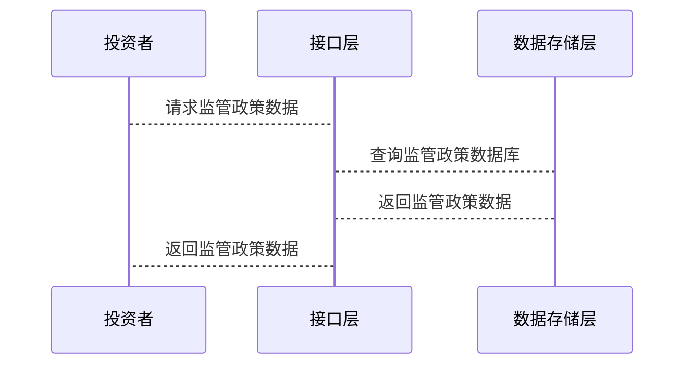
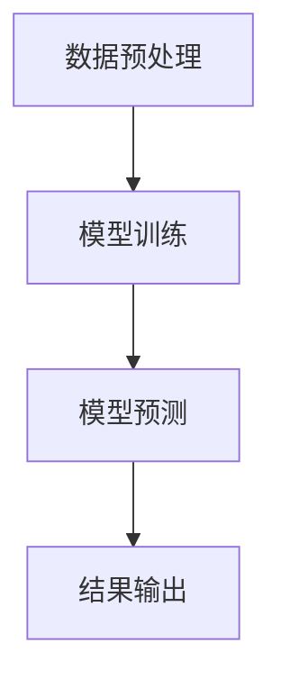

                 

<think>
好的，我需要帮助用户完成一篇关于《价值投资中的监管环境变化应对》的技术博客文章。用户已经提供了详细的目录结构，现在我需要根据这个结构一步步填充内容。

首先，我应该从背景介绍开始。这部分需要解释价值投资的基本概念、监管环境的重要性以及它们之间的关系。接着，我会分析监管环境的变化如何影响投资，包括变化的周期性、对行业的影响以及投资者的应对策略。

接下来，核心概念部分需要详细探讨监管环境变化的定义、分类及其对投资的影响机制。这里可能需要一些图表，比如用Mermaid绘制监管变化的分类图和影响机制的流程图。

然后，我会讨论监管环境变化的预测与分析，包括预测方法和案例分析。这部分可能需要引入一些数学模型，比如监管变化的概率模型，并用Python代码实现。

在价值投资中的监管合规性部分，我需要解释合规性的定义与重要性，以及如何实现合规性管理。这部分可能涉及到企业合规性管理和投资者合规性管理的不同策略。

接下来，我会探讨监管环境变化下的投资策略，包括策略的分类、制定和优化。这部分可以结合实际案例，分析不同策略在不同监管环境下的表现。

为了使读者更好地理解，我需要在系统分析与架构设计部分，构建一个应对监管环境变化的系统。这可能包括系统功能设计、架构设计和接口设计，并用Mermaid图展示。

最后，我会通过项目实战部分，展示一个具体的案例，说明如何应对监管变化。这包括环境配置、代码实现和案例分析。

整个过程中，我需要确保内容逻辑清晰，结构紧凑，并且语言专业但易懂。此外，按照用户的要求，使用适当的数学公式和图表来支持讲解，同时在结尾处加上作者信息。

现在，我开始按照目录结构逐步填充内容，确保每个部分都详细且符合要求。
</think>

# 价值投资中的监管环境变化应对

## 关键词：价值投资、监管环境、投资策略、风险评估、合规性管理

## 摘要：  
在价值投资中，监管环境的变化对投资决策和风险控制具有重要影响。本文通过分析监管环境变化的核心概念、影响机制、预测方法和应对策略，帮助投资者更好地理解和应对监管变化，优化投资组合，确保投资的合规性和稳健性。

---

# 第1章: 价值投资与监管环境概述

## 1.1 价值投资的基本概念

### 1.1.1 价值投资的定义与核心理念  
价值投资是一种以基本面分析为基础的投资策略，强调以低于内在价值的价格买入优质资产。其核心理念是寻找市场低估的公司，长期持有，等待价值回归。  

### 1.1.2 价值投资与监管环境的关系  
监管环境是影响市场的重要外部因素，价值投资者需要关注监管政策的变化，因为这些变化可能影响市场的流动性、资产价格和投资标的的合规性。  

### 1.1.3 监管环境对投资的影响  
监管政策的变化可能直接影响投资标的的估值、行业的竞争格局以及市场的整体表现。投资者需要通过分析监管环境的变化，调整投资策略，规避风险。  

---

## 1.2 监管环境的现状与趋势

### 1.2.1 全球监管环境的演变  
近年来，全球监管环境趋向严格，尤其是在金融领域。例如，全球金融监管机构加强了对资本流动、金融创新和数据隐私的监管。  

### 1.2.2 中国监管环境的特点  
中国监管环境具有明显的政策导向性，监管政策的变化往往与国家经济发展战略密切相关。例如，近年来对科技行业的监管加强，旨在促进行业健康发展。  

### 1.2.3 监管政策对投资的影响  
监管政策的变化可能对行业产生深远影响。例如，金融监管收紧可能导致市场流动性下降，影响资产价格；而环保政策的加强可能提升环保产业的市场地位。  

---

## 1.3 监管环境变化对投资的影响

### 1.3.1 监管变化的周期性分析  
监管环境的变化具有一定的周期性。通常，监管放松可能带来市场的繁荣，而监管收紧可能导致市场的调整。投资者需要识别监管变化的周期，合理调整投资策略。  

### 1.3.2 监管变化对行业的影响  
监管政策的变化可能对行业产生结构性影响。例如，金融行业的监管加强可能导致银行和证券公司业务模式的调整，从而影响其投资价值。  

### 1.3.3 投资者如何应对监管变化  
投资者需要通过持续关注监管政策的变化，及时调整投资组合，选择符合监管导向的行业和公司。同时，应加强与监管机构的沟通，确保投资行为的合规性。  

---

## 1.4 本章小结  
本章介绍了价值投资的基本概念，分析了监管环境的现状与趋势，探讨了监管环境变化对投资的影响。投资者需要关注监管政策的变化，合理调整投资策略，确保投资的稳健性。  

---

# 第2章: 监管环境变化的核心概念

## 2.1 监管环境变化的定义与分类

### 2.1.1 监管环境变化的定义  
监管环境变化指的是监管政策、法规和监管力度的变化，这些变化可能影响市场结构、行业竞争和投资行为。  

### 2.1.2 监管环境变化的分类  
根据变化的范围和影响程度，监管环境变化可以分为局部变化和全局变化。局部变化影响特定行业，而全局变化影响整个市场。  

### 2.1.3 监管环境变化的特征  
监管环境变化具有突发性、周期性和累积性。突发性意味着变化可能在短时间内发生，周期性指变化具有一定的规律性，累积性则指多次变化可能对市场产生叠加效应。  

---

## 2.2 监管环境变化对投资的影响机制

### 2.2.1 监管政策对市场的影响  
监管政策的变化可能影响市场的流动性、资产价格和投资者行为。例如，金融监管收紧可能导致市场流动性下降，影响资产价格。  

### 2.2.2 监管政策对行业的影响  
监管政策的变化可能改变行业的竞争格局。例如，环保政策的加强可能导致环保行业的需求增加，从而提升相关公司的投资价值。  

### 2.2.3 监管政策对投资者行为的影响  
投资者需要根据监管政策的变化调整投资策略。例如，监管收紧可能导致投资者更加注重合规性，选择符合监管导向的行业和公司。  

---

## 2.3 监管环境变化的预测与分析

### 2.3.1 监管环境变化的预测方法  
投资者可以通过分析政策动向、行业趋势和市场反馈，预测监管环境的变化。例如，观察政府工作报告和行业监管动态，可以初步判断监管政策的变化方向。  

### 2.3.2 监管环境变化的分析框架  
监管环境变化的分析框架包括政策解读、行业影响和投资策略调整三个部分。投资者需要从政策解读出发，分析行业影响，最终制定相应的投资策略。  

### 2.3.3 监管环境变化的案例分析  
以近年来中国的科技行业监管为例，监管政策的变化对行业产生了深远影响。投资者需要通过案例分析，理解监管环境变化对投资的影响。  

---

## 2.4 本章小结  
本章详细探讨了监管环境变化的核心概念，分析了其对投资的影响机制，并提出了监管环境变化的预测与分析方法。投资者需要通过持续关注监管政策的变化，合理调整投资策略，确保投资的稳健性。  

---

# 第3章: 价值投资中的监管合规性

## 3.1 监管合规性的定义与重要性

### 3.1.1 监管合规性的定义  
监管合规性指的是投资行为符合相关法律法规和监管要求。合规性是投资行为合法性的基础，也是投资者规避风险的重要保障。  

### 3.1.2 监管合规性的重要性  
合规性是投资者保护自身利益的重要手段。通过合规性管理，投资者可以避免因违规操作导致的法律风险和经济损失。  

### 3.1.3 监管合规性与投资的关系  
合规性管理贯穿于投资的全过程，从投资决策到投资执行，投资者需要确保每一步都符合监管要求。  

---

## 3.2 监管合规性的实现路径

### 3.2.1 企业合规性管理  
企业需要建立合规性管理体系，确保业务操作符合监管要求。例如，企业可以通过内部审计和合规培训，提升员工的合规意识。  

### 3.2.2 投资者合规性管理  
投资者需要加强合规性管理，确保投资行为的合法性。例如，投资者可以通过合规性评估和风险排查，识别潜在的合规风险。  

### 3.2.3 监管政策的解读与应用  
投资者需要深入解读监管政策，理解政策的变化对投资的影响。例如，投资者可以通过政策解读，调整投资策略，规避监管风险。  

---

## 3.3 监管合规性管理的挑战与解决方案

### 3.3.1 监管合规性管理的挑战  
监管政策的变化频繁，合规性管理的难度较大。同时，合规性管理需要投入大量的资源，包括人力、时间和资金。  

### 3.3.2 监管合规性管理的解决方案  
投资者可以通过建立合规性管理系统，实现对合规性风险的全面管理。例如，投资者可以通过引入合规性管理工具，提高合规性管理的效率。  

### 3.3.3 监管合规性管理的案例分析  
以金融行业为例，监管合规性管理的案例分析可以帮助投资者更好地理解合规性管理的重要性。例如，某金融机构通过建立合规性管理体系，成功规避了监管风险。  

---

## 3.4 本章小结  
本章探讨了监管合规性的定义与重要性，分析了监管合规性管理的实现路径，并提出了合规性管理的挑战与解决方案。投资者需要通过加强合规性管理，确保投资行为的合法性，规避监管风险。  

---

# 第4章: 监管环境变化下的投资策略

## 4.1 投资策略的定义与分类

### 4.1.1 投资策略的定义  
投资策略是投资者为实现投资目标而采取的一系列行为和方法。  

### 4.1.2 投资策略的分类  
根据不同的市场环境和投资目标，投资策略可以分为保守型、稳健型和激进型。  

### 4.1.3 监管环境变化对投资策略的影响  
监管环境的变化可能影响投资策略的有效性。例如，监管收紧可能导致激进型策略的风险增加，投资者需要调整策略，选择更稳健的投资方式。  

---

## 4.2 投资策略的制定与优化

### 4.2.1 投资目标的设定  
投资者需要根据自身的风险承受能力和收益预期，设定合理的投资目标。  

### 4.2.2 投资策略的制定  
投资者需要根据市场环境和监管政策的变化，制定相应的投资策略。例如，监管收紧时，投资者可以选择防御性更强的行业和公司。  

### 4.2.3 投资策略的优化  
投资者需要根据市场变化和监管政策的变化，不断优化投资策略。例如，通过动态调整投资组合，降低监管变化带来的风险。  

---

## 4.3 投资策略的实施与监控

### 4.3.1 投资组合的构建  
投资者需要根据监管环境的变化，构建合理投资组合。例如，监管收紧时，投资者可以增加低风险资产的配置比例。  

### 4.3.2 投资组合的监控与调整  
投资者需要定期监控投资组合的表现，根据监管环境的变化，及时调整投资策略。  

### 4.3.3 投资风险的管理  
投资者需要通过分散投资、风险对冲等方法，降低投资风险。  

---

## 4.4 本章小结  
本章探讨了监管环境变化下的投资策略，分析了投资策略的制定与优化，提出了投资策略的实施与监控方法。投资者需要根据监管环境的变化，灵活调整投资策略，确保投资目标的实现。  

---

# 第5章: 监管环境变化的系统分析与架构设计

## 5.1 问题场景介绍  
监管环境的变化可能对投资行为产生深远影响。为了应对监管环境的变化，投资者需要构建一个灵活的系统，能够实时监控监管政策的变化，及时调整投资策略。  

## 5.2 系统功能设计

### 5.2.1 领域模型设计  
以下是领域模型设计的Mermaid类图：  


### 5.2.2 系统架构设计  
以下是系统架构设计的Mermaid架构图：  


### 5.2.3 系统接口设计  
以下是系统接口设计的Mermaid序列图：  



---

## 5.3 本章小结  
本章通过系统分析与架构设计，提出了应对监管环境变化的系统解决方案。投资者可以通过构建灵活的系统，实时监控监管政策的变化，及时调整投资策略，确保投资的稳健性。  

---

# 第6章: 监管环境变化的项目实战

## 6.1 项目背景与目标  
本项目旨在通过构建一个监管环境变化应对系统，帮助投资者实时监控监管政策的变化，及时调整投资策略。  

## 6.2 项目核心实现

### 6.2.1 环境配置  
以下是环境配置代码：  

```python
# 环境配置代码
import os

# 设置环境变量
os.environ['REGULATION_DATA_PATH'] = 'data/regulation'
os.environ['INVESTMENT_STRATEGY_PATH'] = 'data/strategy'
```

### 6.2.2 核心算法实现  
以下是核心算法实现代码：  

```python
# 监管环境变化预测算法
def regulation_change_prediction(data):
    # 数据预处理
    import pandas as pd
    import numpy as np
    from sklearn.model_selection import train_test_split
    from sklearn.linear_model import LinearRegression

    # 划分训练集和测试集
    X_train, X_test, y_train, y_test = train_test_split(data[['time', 'policy']], data['change'], test_size=0.2)

    # 构建线性回归模型
    model = LinearRegression()
    model.fit(X_train, y_train)

    # 预测监管环境变化
    prediction = model.predict(X_test)
    return prediction
```

### 6.2.3 算法原理与流程图  
以下是算法原理的流程图：  



---

## 6.3 项目小结  
本章通过项目实战，展示了如何应对监管环境变化。投资者可以通过构建监管环境变化应对系统，实时监控监管政策的变化，及时调整投资策略，确保投资的稳健性。  

---

# 第7章: 总结与展望

## 7.1 总结  
本文从价值投资的基本概念出发，分析了监管环境变化的核心概念、影响机制和应对策略。投资者需要通过加强合规性管理，优化投资策略，构建灵活的系统，应对监管环境的变化。  

## 7.2 展望  
未来，随着监管环境的不断变化，投资者需要更加注重监管政策的变化，灵活调整投资策略。同时，随着技术的发展，投资者可以通过引入人工智能和大数据分析等技术，进一步提升监管环境变化应对的能力。  

---

# 作者：AI天才研究院/AI Genius Institute & 禅与计算机程序设计艺术 /Zen And The Art of Computer Programming

