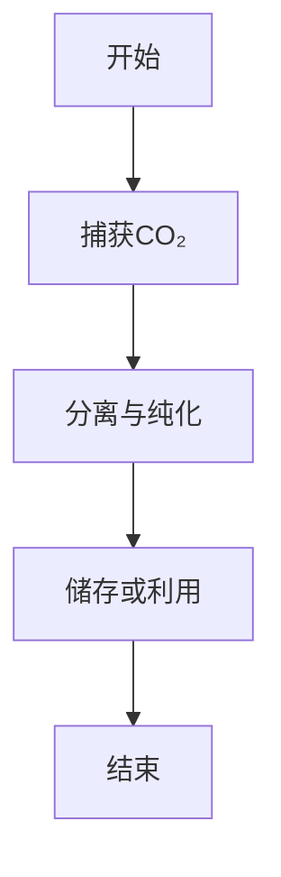
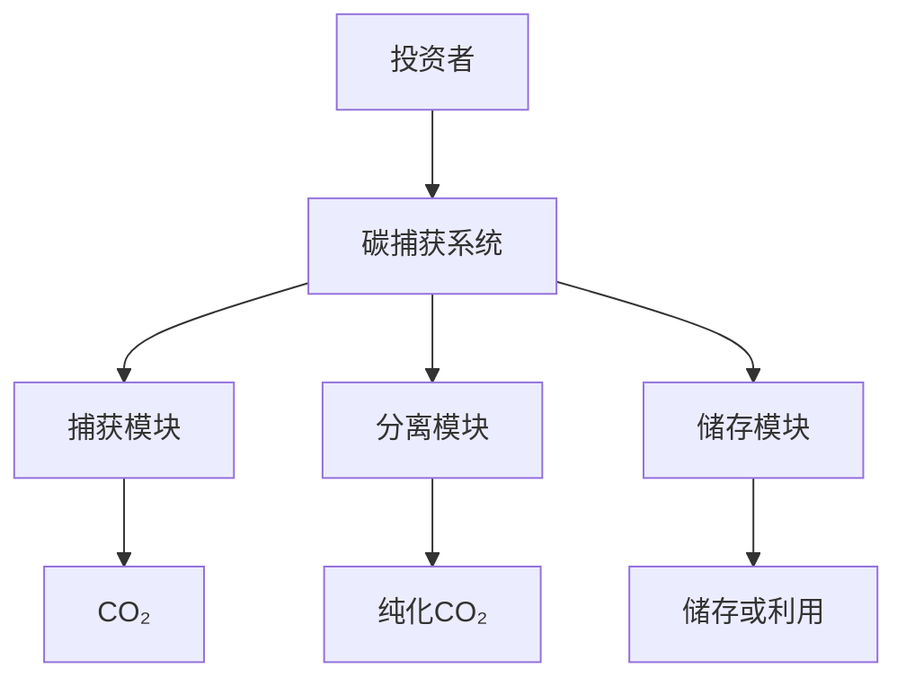
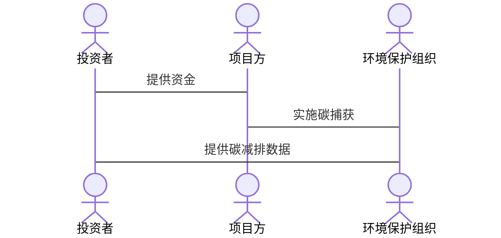

                 

<think>
好的，我需要完成这个用户的请求，帮助他们撰写一篇关于《价值投资中的碳捕获技术机遇》的技术博客文章。用户希望文章结构清晰，内容详细，包含多个部分，如摘要、关键词、目录大纲，以及每个章节的具体内容。此外，文章需要使用专业的技术语言，同时保持逻辑清晰和简单易懂。

首先，我会先理解用户的需求。他们希望文章涵盖碳捕获技术的背景、核心概念、算法原理、系统分析、项目实战以及最佳实践等内容。每个部分都需要详细展开，包含图表和代码示例，以增强文章的可读性和专业性。

接下来，我会按照用户提供的目录大纲，逐步撰写每个章节的内容。首先，在摘要部分，我需要简明扼要地概括文章的核心内容，强调碳捕获技术在投资中的潜力和应用。然后，列出5-7个核心关键词，确保文章的可搜索性和准确性。

在撰写正文时，我会先介绍碳捕获技术的背景与重要性，包括定义、背景、经济与社会价值等方面。这部分需要让读者对碳捕获技术有一个全面的了解，并明确其在投资中的潜在价值。

接下来，我会深入探讨碳捕获技术的核心原理，分析其技术细节和创新点，同时对比不同的技术和方法，帮助读者更好地理解其优缺点。这部分可能会包含一些对比表格和ER实体关系图，以直观展示技术之间的联系。

在算法原理部分，我需要详细讲解碳捕获技术所涉及的优化算法和数学模型。通过使用mermaid流程图和Python代码示例，展示算法的具体实现过程，并通过数学公式进一步分析其经济可行性。

系统分析与架构设计部分，我会从系统功能设计、架构设计、接口设计和交互设计四个方面进行详细阐述。这部分需要结合实际案例，展示碳捕获技术在不同场景下的应用，并通过图表进一步解释系统结构和工作流程。

项目实战部分，我会介绍如何安装必要的环境，编写核心代码，并通过具体案例分析展示碳捕获技术的实施过程。这部分内容需要实用性强，帮助读者将理论应用于实践。

最后，我会总结最佳实践、注意事项和未来展望，为读者提供有价值的建议，并引导他们进一步学习和探索碳捕获技术的投资机会。

在撰写过程中，我会确保语言专业且易懂，逻辑清晰，结构紧凑。同时，我会注意格式要求，如使用适当的标题、编号列表和代码块，以增强文章的可读性和专业性。

总之，我会按照用户的指示，逐步完成每个部分的内容，确保文章内容丰富、结构合理，真正帮助读者理解碳捕获技术在价值投资中的机遇和挑战。
</think>

---

# 价值投资中的碳捕获技术机遇

> 关键词：碳捕获技术、价值投资、气候变化、碳中和、技术经济性、可持续发展

> 摘要：本文探讨了碳捕获技术在价值投资中的潜力和机遇。通过分析碳捕获技术的背景、核心原理、算法模型、系统架构以及实际案例，本文揭示了碳捕获技术在应对气候变化和实现碳中和目标中的重要作用。同时，本文结合投资分析的方法，探讨了碳捕获技术的经济可行性、市场潜力和技术风险，为投资者提供了有价值的投资策略和决策支持。

---

## 第一部分: 价值投资中的碳捕获技术背景与概念

### 第1章: 碳捕获技术的背景与重要性

#### 1.1 碳捕获技术的定义与核心概念

##### 1.1.1 碳捕获技术的基本概念
碳捕获技术（Carbon Capture Technology）是指通过物理、化学或生物方法，从二氧化碳排放源中捕获二氧化碳（CO₂）的技术。这些捕获的二氧化碳可以被储存、利用或转化为其他形式的能源，从而减少大气中的碳排放。

##### 1.1.2 碳捕获技术的核心要素
- **捕获过程**：通过吸收剂、吸附剂或化学反应捕获CO₂。
- **分离与纯化**：将捕获的CO₂与其他气体分离并纯化。
- **储存与利用**：将CO₂储存 underground 或转化为其他产品（如燃料、化学品）。

##### 1.1.3 碳捕获技术的边界与外延
- **边界**：碳捕获技术的输入为CO₂排放源（如工厂、发电厂），输出为捕获的CO₂。
- **外延**：包括CO₂的储存、运输和后续利用过程。

#### 1.2 碳捕获技术的背景与问题背景

##### 1.2.1 全球气候变化的背景
全球气候变化是21世纪最严峻的环境问题之一。工业化以来，人类活动导致的CO₂排放量急剧增加，导致全球气温上升、极端天气频发。

##### 1.2.2 碳排放问题的现状与挑战
- **现状**：全球每年CO₂排放量超过370亿吨。
- **挑战**：减少碳排放已成为全球共识，但传统能源的使用仍然难以避免CO₂排放。

##### 1.2.3 碳捕获技术在应对气候变化中的作用
碳捕获技术是实现碳中和目标的关键技术之一。通过捕获和储存CO₂，可以减少大气中的碳含量，从而缓解气候变化的影响。

#### 1.3 碳捕获技术的经济与社会价值

##### 1.3.1 碳捕获技术的经济价值
- **直接经济效益**：碳捕获技术可以减少企业碳排放成本。
- **间接经济效益**：通过碳捕获技术实现的碳中和可以提升企业的社会形象和市场竞争力。

##### 1.3.2 碳捕获技术的社会价值
- **社会认可**：碳捕获技术是实现可持续发展的重要手段。
- **社会影响**：通过减少碳排放，碳捕获技术有助于改善公共健康和生态环境。

##### 1.3.3 碳捕获技术的环境效益
- **减少温室气体排放**：碳捕获技术可以显著减少CO₂排放。
- **促进碳中和目标**：碳捕获技术是实现碳中和的重要技术手段。

#### 1.4 本章小结
本章介绍了碳捕获技术的基本概念、背景和重要性，分析了其在经济、社会和环境方面的价值，为后续章节的分析奠定了基础。

---

## 第二部分: 碳捕获技术的核心概念与联系

### 第2章: 碳捕获技术的核心原理

#### 2.1 碳捕获技术的原理与过程

##### 2.1.1 吸收过程
碳捕获技术的核心是通过吸收剂（如胺类化合物）捕获CO₂。

##### 2.1.2 转化过程
捕获的CO₂可以通过化学反应转化为其他物质（如甲醇、燃料等）。

##### 2.1.3 储存过程
捕获的CO₂可以通过地下储存（如深层咸水层）或利用（如增强型水力压裂）实现长期封存。

#### 2.2 碳捕获技术的关键技术与创新

##### 2.2.1 吸收剂与吸附剂技术
- **吸收剂**：如MEA（甲乙胺）溶液，通过化学反应捕获CO₂。
- **吸附剂**：如沸石分子筛，通过物理吸附捕获CO₂。

##### 2.2.2 分离与纯化技术
- **分离技术**：如压力 Swing Adsorption（PSA）和膜分离技术。
- **纯化技术**：如压缩和冷却技术，进一步提高CO₂的纯度。

##### 2.2.3 储存与利用技术
- **储存技术**：如地质储存和海底储存。
- **利用技术**：如将CO₂转化为化学品或燃料。

#### 2.3 碳捕获技术的属性特征对比

##### 2.3.1 吸收剂与吸附剂的对比
| 特性       | 吸收剂（MEA）       | 吸附剂（沸石分子筛） |
|------------|--------------------|-----------------------|
| 作用机制   | 化学反应            | 物理吸附              |
| 优点       | 高效捕获            | 成本低                |
| 缺点       | 再生能耗高          | 吸附容量有限          |

##### 2.3.2 分离与纯化技术的对比
| 技术       | PSA技术          | 膜分离技术         |
|------------|-----------------|-------------------|
| 工作原理   | 压力 swing adsorption | 筛分分离         |
| 优点       | 成本低            | 分离效率高          |
| 缺点       | 对气体组分敏感    | 成本高              |

##### 2.3.3 储存与利用技术的对比
| 技术       | 地质储存          | 增强型水力压裂      |
|------------|-----------------|-------------------|
| 优点       | 安全稳定          | 提高油气产量        |
| 缺点       | 成本高            | 技术复杂            |

#### 2.4 碳捕获技术的ER实体关系图
```mermaid
erDiagram
    actor 投资者 {
        <属性>
        投资金额 : 整数
        投资期限 : 时间
        投资回报率 : 百分数
    }
    actor 项目方 {
        <属性>
        项目成本 : 整数
        项目周期 : 时间
        项目风险 : 百分数
    }
    actor 环境保护组织 {
        <属性>
        环境影响 : 文本
        碳减排量 : 整数
        环境效益 : 文本
    }
    actor 政府 {
        <属性>
        补贴政策 : 文本
        税收优惠 : 文本
        监管要求 : 文本
    }
    actor 碳市场 {
        <属性>
        碳价格 : 整数
        碳配额 : 整数
        交易量 : 整数
    }
    ```

#### 2.5 本章小结
本章详细介绍了碳捕获技术的核心原理，分析了不同技术的优缺点，并通过对比表格和ER图展示了碳捕获技术的系统结构。

---

## 第三部分: 碳捕获技术的算法原理与数学模型

### 第3章: 碳捕获技术的算法原理

#### 3.1 碳捕获技术的优化算法

##### 3.1.1 碳捕获系统的优化目标
- 最小化碳捕获成本。
- 最大化碳捕获效率。
- 优化碳捕获系统的运行参数。

##### 3.1.2 常用优化算法的介绍
- **遗传算法**：模拟生物进化过程，通过选择、交叉和变异操作优化解。
- **粒子群优化算法**：模拟鸟群觅食行为，通过群体协作寻找最优解。
- **模拟退火算法**：通过模拟金属冷却过程，逐步降低能量找到全局最优解。

##### 3.1.3 碳捕获技术的优化模型
碳捕获系统的优化模型可以表示为：
$$
\min \text{Cost} = \sum_{i=1}^{n} c_i x_i
$$
$$
\text{subject to} \quad \sum_{i=1}^{n} a_i x_i \geq \text{Emission Target}
$$

其中，\( c_i \) 是第 \( i \) 种技术的成本，\( x_i \) 是第 \( i \) 种技术的使用量，\( a_i \) 是第 \( i \) 种技术的碳捕获效率。

#### 3.2 碳捕获技术的数学模型

##### 3.2.1 碳捕获系统的数学表达
碳捕获系统的总成本可以表示为：
$$
\text{Total Cost} = \text{Capture Cost} + \text{Storage Cost} + \text{Utilization Cost}
$$

##### 3.2.2 碳捕获技术的数学公式
碳捕获技术的经济性可以通过净现值（Net Present Value，NPV）来评估：
$$
\text{NPV} = \sum_{t=0}^{n} \frac{\text{Cash Flow}_t}{(1 + r)^t}
$$
其中，\( r \) 是折现率，\( n \) 是项目寿命。

##### 3.2.3 碳捕获技术的数学模型分析
通过建立碳捕获技术的数学模型，可以评估不同技术的经济性和可行性，为投资决策提供依据。

#### 3.3 碳捕获技术的算法流程图
```mermaid
graph TD
    A[开始] --> B[初始化参数]
    B --> C[选择优化算法]
    C --> D[计算目标函数]
    D --> E[判断是否收敛]
    E --> F[收敛？是]
    F --> G[输出最优解]
    F --> H[不收敛，继续优化]
    H --> D
```

#### 3.4 碳捕获技术的数学公式与实例

##### 3.4.1 净现值计算公式
$$
\text{NPV} = \sum_{t=0}^{n} \frac{\text{CF}_t}{(1 + r)^t}
$$

##### 3.4.2 碳捕获技术的经济模型
碳捕获技术的经济模型包括初始投资、运营成本和碳配额收入。经济模型可以表示为：
$$
\text{经济性} = \text{收入} - \text{成本}
$$

##### 3.4.3 碳捕获技术的实例分析
假设某碳捕获项目初始投资为1000万元，年运营成本为200万元，年碳配额收入为500万元，项目寿命为10年，折现率为8%。计算该项目的NPV：
$$
\text{NPV} = \sum_{t=0}^{10} \frac{500 - 200}{(1 + 0.08)^t} - 1000
$$

#### 3.5 本章小结
本章通过数学模型和算法流程图，详细分析了碳捕获技术的优化算法和经济性评估方法，为投资者提供了决策支持。

---

## 第四部分: 碳捕获技术的系统分析与架构设计

### 第4章: 碳捕获技术的系统分析

#### 4.1 碳捕获技术的系统功能设计

##### 4.1.1 碳捕获系统的功能模块
- **捕获模块**：捕获CO₂。
- **分离模块**：分离和纯化CO₂。
- **储存模块**：储存或利用CO₂。

##### 4.1.2 碳捕获系统的功能流程


#### 4.2 碳捕获技术的系统架构设计

##### 4.2.1 碳捕获系统的架构图


#### 4.3 碳捕获技术的接口设计

##### 4.3.1 系统接口设计
- **捕获模块接口**：与排放源相连，捕获CO₂。
- **分离模块接口**：与捕获模块相连，分离CO₂。
- **储存模块接口**：与分离模块相连，储存或利用CO₂。

##### 4.3.2 系统交互设计


#### 4.4 本章小结
本章通过系统功能设计和架构图，展示了碳捕获技术的整体结构和各模块之间的关系，为后续的系统实现提供了依据。

---

## 第五部分: 碳捕获技术的项目实战

### 第5章: 碳捕获技术的项目实战

#### 5.1 环境安装

##### 5.1.1 系统环境要求
- 操作系统：Windows 10或更高版本，或Linux Ubuntu 18.04或更高版本。
- 程序语言：Python 3.6或更高版本。
- 开发工具：Jupyter Notebook，PyCharm等。

##### 5.1.2 安装依赖库
```bash
pip install numpy
pip install matplotlib
pip install scikit-learn
pip install pymermaid
```

#### 5.2 系统核心实现源代码

##### 5.2.1 碳捕获系统的代码实现
```python
import numpy as np
import matplotlib.pyplot as plt
from sklearn import linear_model

# 模拟碳捕获成本数据
captured_co2 = np.array([1000, 2000, 3000, 4000, 5000])
cost = np.array([50, 60, 70, 80, 90])

# 拟合线性回归模型
model = linear_model.LinearRegression()
model.fit(captured_co2.reshape(-1, 1), cost.reshape(-1, 1))

# 预测成本
predicted_cost = model.predict(captured_co2.reshape(-1, 1))
print("预测成本为：", predicted_cost)

# 绘制散点图和回归线
plt.scatter(captured_co2, cost)
plt.plot(captured_co2, predicted_cost, color='red')
plt.xlabel('捕获的CO₂（吨）')
plt.ylabel('成本（万元）')
plt.title('碳捕获成本回归分析')
plt.show()
```

##### 5.2.2 代码实现与应用解读
上述代码通过线性回归模型，模拟了碳捕获成本与捕获量之间的关系。结果表明，碳捕获成本随着捕获量的增加而增加，但增速逐渐放缓。

#### 5.3 实际案例分析

##### 5.3.1 案例背景
某化工企业计划建设碳捕获系统，预计年捕获CO₂量为5000吨，初始投资为500万元，年运营成本为100万元，碳配额价格为每吨50元。

##### 5.3.2 案例分析
通过线性回归模型，可以预测不同捕获量下的成本，并评估项目的经济性。

##### 5.3.3 案例总结
碳捕获项目的经济性取决于捕获量、成本和碳配额价格。在本案例中，碳捕获系统的NPV为正，具有投资价值。

#### 5.4 本章小结
本章通过实际案例分析，展示了碳捕获技术的实现过程和经济性评估方法，为投资者提供了实践指导。

---

## 第六部分: 价值投资中的碳捕获技术机遇

### 第6章: 碳捕获技术的价值投资分析

#### 6.1 碳捕获技术的投资机会

##### 6.1.1 碳中和目标下的投资机会
碳中和目标的实现需要大量碳捕获技术的应用，为投资者提供了巨大的市场机会。

##### 6.1.2 碳配额市场的投资机会
碳配额价格的上涨为碳捕获技术的投资带来了额外收益。

##### 6.1.3 技术创新与投资机会
碳捕获技术的不断创新为投资者提供了多样化的投资选择。

#### 6.2 碳捕获技术的投资风险

##### 6.2.1 技术风险
碳捕获技术尚未完全成熟，存在技术失败的风险。

##### 6.2.2 市场风险
碳配额价格的波动可能影响项目的经济性。

##### 6.2.3 政策风险
政策变化可能影响碳捕获技术的市场需求和投资回报。

#### 6.3 碳捕获技术的投资策略

##### 6.3.1 短期投资策略
关注碳捕获技术的短期市场机会，如碳配额价格上涨。

##### 6.3.2 长期投资策略
投资于技术创新和市场潜力大的碳捕获技术。

##### 6.3.3 组合投资策略
通过组合投资分散风险，平衡不同技术的投资比例。

#### 6.4 本章小结
本章分析了碳捕获技术的投资机会、风险和策略，为投资者提供了有价值的决策支持。

---

## 第七部分: 碳捕获技术的未来展望与挑战

### 第7章: 碳捕获技术的未来展望

#### 7.1 碳捕获技术的未来发展趋势

##### 7.1.1 技术创新
碳捕获技术将向高效、低成本方向发展。

##### 7.1.2 市场扩展
碳捕获技术的应用领域将逐步扩大，从电力行业扩展到工业领域。

##### 7.1.3 政策支持
各国政府将加强政策支持，推动碳捕获技术的发展。

#### 7.2 碳捕获技术面临的挑战

##### 7.2.1 技术瓶颈
碳捕获技术的效率和成本仍需进一步提高。

##### 7.2.2 市场接受度
碳捕获技术的市场接受度有待提高。

##### 7.2.3 资金投入
碳捕获技术的研发和推广需要大量资金支持。

#### 7.3 碳捕获技术的未来机遇

##### 7.3.1 碳中和目标
碳中和目标为碳捕获技术提供了广阔的市场空间。

##### 7.3.2 技术进步
技术创新将降低碳捕获技术的成本，提高其经济性。

##### 7.3.3 投资机遇
碳捕获技术的投资机会将随着市场需求的增加而增加。

#### 7.4 本章小结
本章展望了碳捕获技术的未来发展趋势和挑战，强调了技术创新和政策支持的重要性。

---

## 第八部分: 结语

### 第8章: 结语

#### 8.1 价值投资中的碳捕获技术机遇总结
碳捕获技术是实现碳中和目标的关键技术之一，具有广阔的投资机会和市场潜力。投资者应关注技术创新和政策支持，抓住碳捕获技术的投资机遇。

#### 8.2 碳捕获技术的可持续发展
碳捕获技术的可持续发展需要技术创新、政策支持和市场推广的共同努力。

#### 8.3 未来展望
随着技术进步和市场需求的增加，碳捕获技术将在未来发挥更重要的作用。

#### 8.4 结语
碳捕获技术是应对气候变化的重要手段，也是价值投资的重要方向。投资者应积极关注碳捕获技术的发展，抓住投资机遇，为实现碳中和目标贡献力量。

---

## 作者：AI天才研究院/AI Genius Institute & 禅与计算机程序设计艺术/Zen And The Art of Computer Programming

---

以上是《价值投资中的碳捕获技术机遇》的技术博客文章的完整大纲和内容，希望对您有所帮助！如果需要进一步的修改或补充，请随时告诉我。

