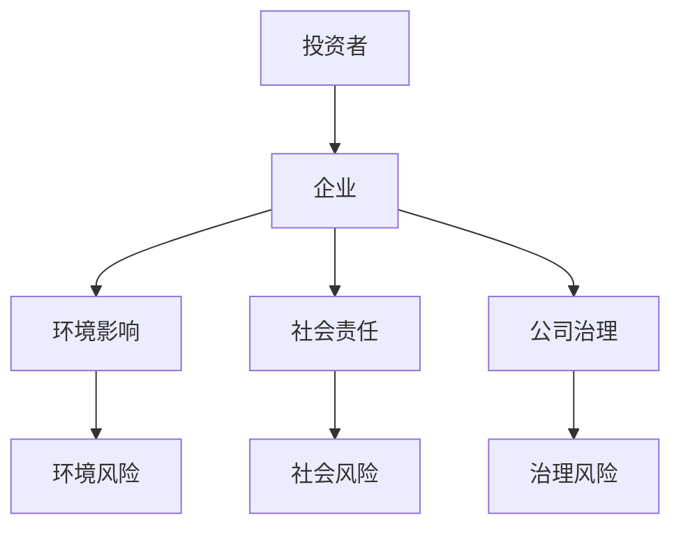
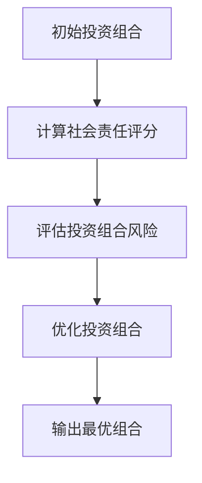
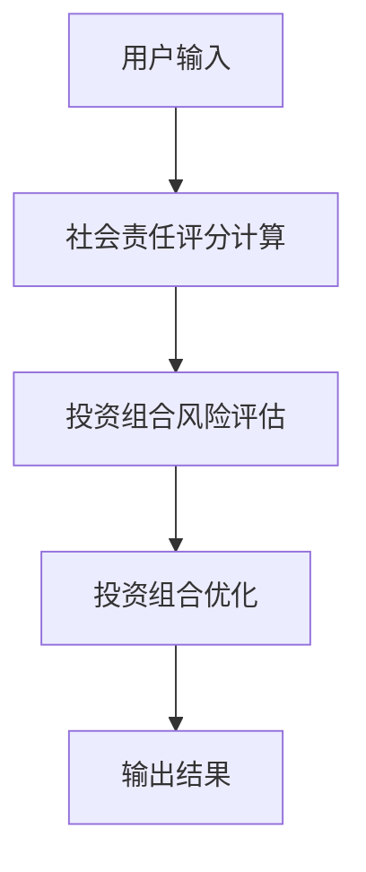

                 


# 价值投资中的社会责任因素

## 关键词：价值投资、社会责任、ESG、投资决策、可持续发展

## 摘要：  
价值投资是一种以基本面分析为基础的投资策略，旨在通过深入研究企业的财务状况、行业地位和管理团队等因素，寻找具有长期增长潜力和合理估值的公司。然而，随着社会对可持续发展和企业社会责任的关注度不断提高，社会责任因素在价值投资中的重要性日益凸显。本文将从价值投资的基本概念出发，分析社会责任因素的核心概念、数学模型、系统架构，并通过实际案例探讨如何将社会责任因素融入投资决策中，为投资者提供新的视角和工具。

---

# 第1章: 价值投资与社会责任的背景介绍

## 1.1 价值投资的核心概念

### 1.1.1 价值投资的定义与起源  
价值投资是一种以低于公平价值的价格购买优质企业股票的投资策略，其核心在于寻找市场低估的公司。该投资理念由本杰明·格雷厄姆和戴维·多德提出，强调以合理价格投资具有强大基本面的企业。

### 1.1.2 价值投资的基本原则  
价值投资强调长期投资、分散投资和安全边际。投资者需要关注企业的盈利能力、财务健康状况和行业地位，而不是市场的短期波动。

### 1.1.3 价值投资的现代发展  
随着市场环境的变化，价值投资逐渐从传统的低估值策略扩展到对企业治理、社会责任等因素的关注。

## 1.2 社会责任投资的兴起

### 1.2.1 社会责任投资的定义  
社会责任投资（SRI）是指在投资过程中考虑环境（Environmental）、社会（Social）和治理（Governance）三个维度的因素，以实现经济回报和社会价值的投资策略。

### 1.2.2 社会责任投资的兴起背景  
随着全球可持续发展目标的推进，企业和投资者逐渐意识到社会责任的重要性。环境问题、社会不平等等因素不仅影响企业的长期发展，也对投资收益构成潜在风险。

### 1.2.3 社会责任投资与传统投资的区别  
社会责任投资注重长期的社会价值和可持续性，而传统投资更关注短期的财务回报。社会责任投资通过筛选符合ESG标准的企业，降低投资风险，同时推动社会进步。

## 1.3 社会责任因素在价值投资中的重要性

### 1.3.1 社会责任因素的定义  
社会责任因素是指企业在经营过程中对环境保护、社会责任和公司治理等方面的表现。

### 1.3.2 社会责任因素对投资决策的影响  
社会责任因素能够帮助投资者识别企业的潜在风险和机会。例如，环保表现不佳的企业可能面临更高的监管风险，而治理结构完善的企业更可能实现长期稳定发展。

### 1.3.3 社会责任投资的潜在收益与风险  
研究表明，符合ESG标准的企业通常具有更高的长期回报率和更低的波动性。然而，社会责任投资也可能面临短期收益较低的问题。

---

# 第2章: 社会责任因素的核心概念与联系

## 2.1 社会责任因素的属性特征对比

| **维度** | **环境（E）** | **社会（S）** | **治理（G）** |
|----------|----------------|----------------|----------------|
| **定义** | 企业对环境保护的贡献 | 企业对社会问题的关注与解决 | 企业治理结构的合理性和透明度 |
| **影响** | 环境风险、资源消耗 | 社会责任履行、员工关系 | 治理效率、企业稳定性 |

### 2.1.2 社会责任因素的ER实体关系图



---

# 第3章: 社会责任因素的数学模型与算法原理

## 3.1 投资决策的数学模型

### 3.1.1 投资组合优化的数学模型

$$ \text{目标函数：} \quad \min \sum_{i=1}^{n} w_i r_i $$  
$$ \text{约束条件：} \quad \sum_{i=1}^{n} w_i = 1, \quad w_i \geq 0 $$  

其中，\( w_i \) 表示第 \( i \) 个资产的投资权重，\( r_i \) 表示第 \( i \) 个资产的预期回报率。

### 3.1.2 社会责任因素的权重分配模型

$$ \text{权重分配公式：} \quad w_i = \frac{E_i + S_i + G_i}{E_{\text{total}} + S_{\text{total}} + G_{\text{total}}} $$  

其中，\( E_i \)、\( S_i \) 和 \( G_i \) 分别表示第 \( i \) 个企业的环境、社会和治理评分，\( E_{\text{total}} \)、\( S_{\text{total}} \) 和 \( G_{\text{total}} \) 分别表示所有企业的环境、社会和治理评分总和。

## 3.2 投资组合优化算法

### 3.2.1 投资组合优化算法流程图



---

# 第4章: 社会责任因素的系统分析与架构设计

## 4.1 投资决策系统的功能设计

### 4.1.1 系统功能模块划分

- **数据采集模块**：收集企业的ESG评分、财务数据等。
- **评分计算模块**：根据ESG标准计算企业的社会责任评分。
- **风险评估模块**：评估投资组合的潜在风险。
- **优化模块**：优化投资组合，确保符合社会责任标准。
- **输出模块**：输出优化后的投资组合。

### 4.1.2 系统功能流程图



---

# 第5章: 社会责任因素的项目实战

## 5.1 环境安装与数据准备

### 5.1.1 数据来源
- 使用公开的企业ESG评分数据。
- 收集企业的财务数据和市场表现数据。

### 5.1.2 工具安装
- 安装Python编程环境。
- 安装必要的库，如Pandas、NumPy、Scipy等。

## 5.2 核心实现源代码

### 5.2.1 计算社会责任评分的代码

```python
import pandas as pd
import numpy as np

# 假设esg_scores是一个包含企业ESG评分的DataFrame
esg_scores = pd.DataFrame({
    'E': [80, 70, 90],
    'S': [75, 85, 65],
    'G': [90, 80, 70]
})

# 计算总分
total_e = esg_scores['E'].sum()
total_s = esg_scores['S'].sum()
total_g = esg_scores['G'].sum()

# 计算权重
weights = (esg_scores['E'] / total_e + esg_scores['S'] / total_s + esg_scores['G'] / total_g) / 3

print(weights)
```

## 5.3 代码解读与分析

上述代码展示了如何计算企业社会责任评分的权重。通过将环境、社会和治理评分加权平均，可以得到每个企业在投资组合中的权重。这种方法能够帮助投资者根据社会责任因素优化投资组合。

---

# 第6章: 总结与展望

## 6.1 总结

社会责任因素在价值投资中的作用日益重要。通过将ESG标准纳入投资决策，投资者能够更好地识别企业的潜在风险和长期价值。本文从背景、概念、数学模型和系统架构等多个方面进行了详细分析，并通过实际案例展示了如何将社会责任因素应用于投资决策中。

## 6.2 展望

未来，随着技术的进步和社会责任意识的增强，社会责任投资将更加普及。投资者可以通过更先进的技术手段，如大数据和人工智能，进一步优化社会责任投资的分析和决策过程。

---

# 作者：AI天才研究院/AI Genius Institute & 禅与计算机程序设计艺术 /Zen And The Art of Computer Programming

