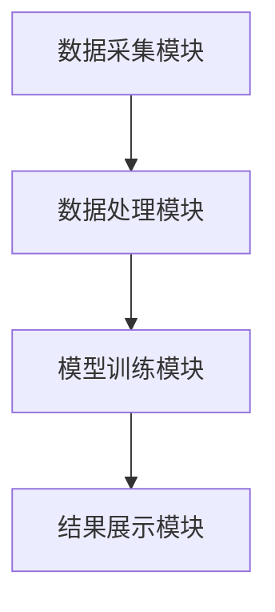

                 


# 价值投资中的神经科技前景分析

> **关键词**：神经科技、价值投资、人工智能、股票预测、机器学习  
> **摘要**：随着人工智能技术的快速发展，神经科技在金融领域的应用越来越广泛。本文从价值投资的角度出发，详细分析了神经科技在股票预测、市场情绪分析和投资组合优化中的应用前景。通过理论与实践相结合的方式，探讨了神经科技如何提升价值投资的效率和准确性。

---

## 第1章：神经科技与价值投资概述

### 1.1 神经科技的基本概念

#### 1.1.1 神经科技的定义
神经科技（Neurotechnology）是结合神经科学和工程技术，研究如何通过模拟人脑神经系统的功能来开发新技术的领域。其核心在于理解并模拟神经系统的运作机制，以实现更高效的信息处理和决策。

#### 1.1.2 神经科技的核心技术
神经科技的核心技术包括：
1. **神经网络**：模拟人脑神经网络的结构和功能，用于模式识别、分类和预测。
2. **深度学习**：通过多层神经网络模型，从大量数据中提取高层次特征。
3. **自然语言处理**：通过神经网络理解和生成人类语言。

#### 1.1.3 神经科技与价值投资的关系
价值投资是一种长期投资策略，强调通过分析公司的基本面来选择被低估的股票。神经科技通过提供强大的数据处理和预测能力，为价值投资者提供了新的工具，帮助他们更准确地评估公司价值和市场趋势。

---

### 1.2 价值投资的基本原理

#### 1.2.1 价值投资的定义
价值投资是一种投资策略，强调以低于内在价值的价格买入优质资产。其核心在于寻找市场中被低估的公司，长期持有以实现收益。

#### 1.2.2 价值投资的核心原则
1. **安全边际**：买入价格低于内在价值，以降低风险。
2. **长期视角**：关注公司的基本面，而非短期市场波动。
3. **分散投资**：通过投资组合分散风险，避免过度依赖单一资产。

#### 1.2.3 价值投资与神经科技的结合
神经科技可以通过以下方式增强价值投资：
1. **数据挖掘**：利用神经网络分析大量非结构化数据（如新闻、社交媒体），提取市场情绪和潜在信息。
2. **预测模型**：通过深度学习预测股票价格趋势，辅助投资者做出更明智的决策。
3. **组合优化**：利用神经网络优化投资组合，平衡风险与收益。

---

## 第2章：神经科技的核心技术与数学模型

### 2.1 神经网络的基本原理

#### 2.1.1 神经网络的定义
神经网络是一种由人工神经元构成的计算模型，模拟人脑的神经网络结构和功能。

#### 2.1.2 神经网络的结构
神经网络通常由以下三层组成：
1. **输入层**：接收外部输入数据。
2. **隐藏层**：通过非线性变换提取特征。
3. **输出层**：产生最终的输出结果。

#### 2.1.3 神经网络的训练过程
神经网络的训练过程包括以下步骤：
1. **前向传播**：将输入数据传递到输出层，计算预测结果。
2. **损失计算**：计算预测结果与实际结果之间的差异（损失函数）。
3. **反向传播**：通过梯度下降优化模型参数，减少损失。

---

### 2.2 神经网络的数学模型

#### 2.2.1 神经网络的激活函数
激活函数用于引入非线性，使神经网络能够学习复杂的模式。常用的激活函数包括：
- **sigmoid**：函数值在0到1之间，适用于二分类问题。
- **ReLU**：非负函数，计算速度快，适用于深度网络。
- **tanh**：函数值在-1到1之间，适用于某些特定任务。

#### 2.2.2 神经网络的损失函数
损失函数用于衡量模型预测结果与真实结果的差异。常用的损失函数包括：
- **均方误差（MSE）**：适用于回归任务。
- **交叉熵损失**：适用于分类任务。

#### 2.2.3 神经网络的优化算法
优化算法用于更新模型参数，减少损失函数。常用的优化算法包括：
- **随机梯度下降（SGD）**：简单但收敛速度慢。
- **Adam优化器**：结合动量和自适应学习率，收敛速度快。

---

### 2.3 神经网络在价值投资中的应用

#### 2.3.1 神经网络用于股票价格预测
股票价格预测是神经网络在金融领域的典型应用。通过分析历史价格、交易量等数据，神经网络可以预测未来的股票走势。

#### 2.3.2 神经网络用于市场情绪分析
市场情绪分析是通过分析新闻、社交媒体等文本数据，判断市场的整体情绪（如乐观、悲观）。神经网络可以通过自然语言处理技术实现这一目标。

#### 2.3.3 神经网络用于投资组合优化
投资组合优化是通过调整资产配置，平衡风险与收益。神经网络可以通过分析历史数据，优化投资组合的收益与风险比。

---

## 第3章：价值投资中的神经科技算法实现

### 3.1 神经网络算法的实现步骤

#### 3.1.1 数据预处理
数据预处理是神经网络实现的第一步，包括数据清洗、特征提取等。

#### 3.1.2 模型构建
根据任务需求选择合适的神经网络模型，如卷积神经网络（CNN）、循环神经网络（RNN）等。

#### 3.1.3 模型训练
使用训练数据训练模型，调整模型参数以最小化损失函数。

#### 3.1.4 模型评估
通过测试数据评估模型的性能，如准确率、召回率等。

---

### 3.2 神经网络算法的Python实现

#### 3.2.1 环境安装与配置
安装必要的Python库，如TensorFlow、Keras等。

#### 3.2.2 数据加载与预处理
加载数据并进行清洗、归一化等预处理。

#### 3.2.3 模型构建与训练
使用Keras或TensorFlow构建神经网络模型，并进行训练。

#### 3.2.4 模型评估与优化
通过测试数据评估模型性能，并进行超参数调优以优化模型。

---

### 3.3 神经网络算法在价值投资中的应用案例

#### 3.3.1 股票价格预测案例
通过神经网络预测股票价格，帮助投资者做出买卖决策。

#### 3.3.2 市场情绪分析案例
通过自然语言处理技术分析新闻和社交媒体，判断市场情绪。

#### 3.3.3 投资组合优化案例
通过神经网络优化投资组合，平衡风险与收益。

---

## 第4章：神经科技与价值投资的系统架构设计

### 4.1 系统架构概述

#### 4.1.1 系统功能模块划分
- 数据采集模块：采集股票价格、新闻等数据。
- 数据处理模块：清洗、归一化数据。
- 模型训练模块：训练神经网络模型。
- 结果展示模块：展示预测结果和市场情绪。

#### 4.1.2 系统架构设计
系统架构采用模块化设计，各模块之间通过接口进行交互。

#### 4.1.3 系统接口设计
- 数据接口：模块间数据传输接口。
- 用户接口：用户与系统交互的界面。

---

### 4.2 系统功能设计

#### 4.2.1 数据采集模块
负责采集股票价格、新闻等数据。

#### 4.2.2 数据处理模块
对采集的数据进行清洗、归一化等处理。

#### 4.2.3 模型训练模块
训练神经网络模型，优化模型参数。

#### 4.2.4 结果展示模块
展示预测结果、市场情绪等信息。

---

### 4.3 系统架构图



---

## 第5章：价值投资中的神经科技实战

### 5.1 环境安装与配置

#### 5.1.1 Python环境安装
安装Python 3.8及以上版本。

#### 5.1.2 神经网络库安装
安装TensorFlow、Keras等库。

---

### 5.2 系统核心实现源代码

#### 5.2.1 数据加载与预处理
```python
import pandas as pd
import numpy as np

# 加载数据
data = pd.read_csv('stock.csv')

# 数据预处理
data = data.dropna()
data = (data - data.mean()) / data.std()
```

#### 5.2.2 模型构建与训练
```python
from tensorflow.keras import layers

# 构建模型
model = tf.keras.Sequential([
    layers.Dense(64, activation='relu'),
    layers.Dense(1, activation='linear')
])

# 编译模型
model.compile(optimizer='adam', loss='mean_squared_error')

# 训练模型
model.fit(X_train, y_train, epochs=100, batch_size=32)
```

---

### 5.3 项目实战：股票价格预测

#### 5.3.1 数据准备
加载股票价格数据，进行归一化处理。

#### 5.3.2 模型训练
使用训练数据训练神经网络模型。

#### 5.3.3 结果展示
展示预测结果与实际结果的对比。

---

## 第6章：总结与最佳实践

### 6.1 本章小结
神经科技为价值投资提供了强大的工具，通过数据分析和预测模型，帮助投资者做出更明智的决策。

### 6.2 最佳实践 tips
- 数据质量是关键，确保数据的完整性和准确性。
- 模型调优是优化性能的重要步骤。
- 风险控制是投资的重要原则，需结合神经科技进行风险评估。

### 6.3 拓展阅读
推荐阅读《神经网络与深度学习》和《价值投资实战策略》等书籍。

---

**作者：AI天才研究院/AI Genius Institute & 禅与计算机程序设计艺术 /Zen And The Art of Computer Programming**

