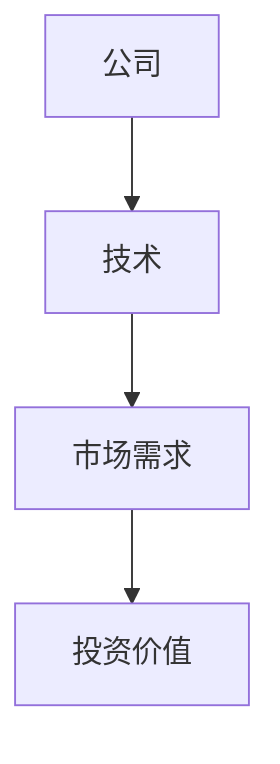
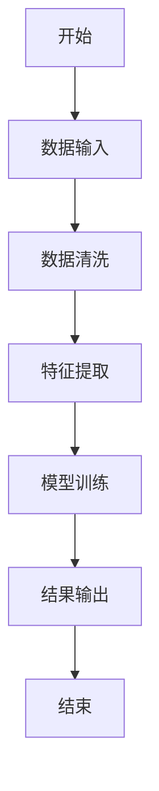
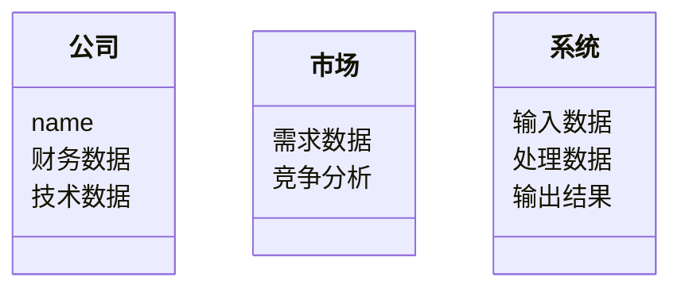
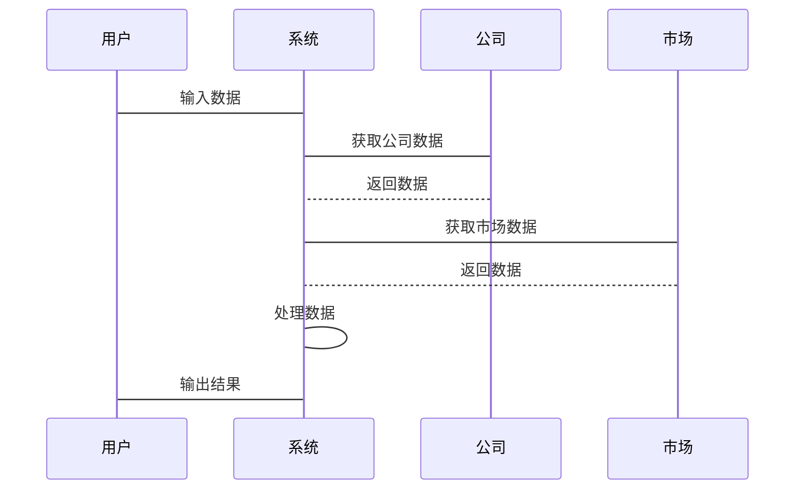

                 


# 价值投资中的空间技术商业化前景

> **关键词**: 价值投资、空间技术、商业化前景、卫星互联网、遥感技术、空间资源开发、投资模型

> **摘要**: 本文探讨了空间技术在商业化领域的潜力及其与价值投资的结合。通过分析空间技术的核心领域、价值投资的基本原理，以及两者结合的分析框架，提出了数学模型和算法用于评估空间技术公司的投资价值。文章还提供了系统架构设计和实际案例分析，帮助读者理解如何在空间技术商业化中进行价值投资。

---

# 第1章: 空间技术与商业化概述

## 1.1 空间技术的基本概念

### 1.1.1 空间技术的定义
空间技术是指利用地球之外的资源和技术，包括卫星、火箭、空间站等，进行科学研究、通信、导航等活动。它涵盖了从卫星发射到太空探索的多个领域。

### 1.1.2 空间技术的核心领域
1. **卫星互联网**: 提供全球互联网服务，解决偏远地区的网络问题。
2. **遥感技术**: 利用卫星进行地球观测，用于环境监测、资源勘探等。
3. **空间资源开发**: 开发 asteroid mining 和月球基地等技术，探索太空资源利用。

### 1.1.3 空间技术的商业化现状
目前，SpaceX 和 Blue Origin 等公司正在推动空间技术的商业化，尤其是卫星互联网和太空旅行。

## 1.2 价值投资的基本原理

### 1.2.1 价值投资的定义
价值投资是一种投资策略，强调以低于公平价值的价格购买优质资产。它注重公司的基本面，如财务状况、市场地位和盈利能力。

### 1.2.2 价值投资的核心原则
1. **安全边际**: 购买价格低于内在价值。
2. **长期视角**: 关注公司的长期增长潜力。
3. **基本面分析**: 通过财务报表和市场数据评估公司价值。

### 1.2.3 价值投资在现代金融中的应用
价值投资广泛应用于股票、房地产和其他资产领域，尤其在科技公司中表现突出。

## 1.3 空间技术与价值投资的结合

### 1.3.1 空间技术商业化的机会
1. 卫星互联网的全球覆盖潜力。
2. 遥感技术在农业和环境监测中的应用。
3. 空间资源开发的未来潜力。

### 1.3.2 价值投资在空间技术中的应用
1. 评估空间技术公司的财务状况和市场前景。
2. 分析技术创新和市场需求的关系。
3. 考虑政策支持和行业趋势。

### 1.3.3 空间技术商业化前景的分析框架
1. 技术创新评估。
2. 市场需求预测。
3. 投资价值模型。

## 1.4 本章小结
本章介绍了空间技术和价值投资的基本概念，并探讨了它们结合的可能性和前景。

---

# 第2章: 空间技术商业化的核心概念

## 2.1 空间技术商业化的主要领域

### 2.1.1 卫星互联网
卫星互联网通过低轨卫星提供高速互联网服务，解决全球网络覆盖问题。

### 2.1.2 遥感技术
遥感卫星用于地球观测，提供高分辨率图像，支持环境监测和资源勘探。

### 2.1.3 空间资源开发
开发太空资源，如 asteroid mining 和月球基地建设，探索未来资源利用。

## 2.2 空间技术商业化的核心要素

### 2.2.1 技术创新
技术创新是空间技术商业化的核心驱动力，如 reusable rockets 和 miniaturized satellites。

### 2.2.2 市场需求
市场需求决定商业化潜力，如卫星互联网的需求推动了低轨卫星部署。

### 2.2.3 政策支持
政府政策和法规对空间技术商业化有重要影响，如发射许可和国际合作。

## 2.3 空间技术商业化的核心概念对比

### 2.3.1 不同空间技术的优劣势对比
| 技术领域         | 优势                     | 劣势                     |
|------------------|--------------------------|--------------------------|
| 卫星互联网        | 全球覆盖，需求大          | 成本高，技术复杂          |
| 遥感技术         | 数据精确，应用广泛        | 数据处理复杂             |
| 空间资源开发      | 高潜力，未来资源          | 技术难度大，周期长        |

### 2.3.2 市场价值与技术难度的关系
技术难度高但市场价值大的技术更具投资价值，如卫星互联网和空间资源开发。

### 2.3.3 核心概念的ER实体关系图


## 2.4 本章小结
本章分析了空间技术商业化的核心领域和要素，并提出了对比分析框架。

---

# 第3章: 空间技术商业化中的数学模型与算法

## 3.1 空间技术商业化的核心算法

### 3.1.1 卫星成本模型
卫星成本模型用于估算卫星的发射和运营成本，公式如下：
$$ C = k \cdot (m + f) $$
其中，$C$ 是总成本，$k$ 是单位成本，$m$ 是卫星质量，$f$ 是发射费用。

### 3.1.2 市场需求预测模型
市场需求预测模型基于历史数据和市场趋势，使用线性回归预测未来需求：
$$ D = a \cdot t + b $$
其中，$D$ 是需求量，$t$ 是时间，$a$ 和 $b$ 是回归系数。

### 3.1.3 价值评估模型
价值评估模型结合财务指标和技术潜力，计算公司内在价值：
$$ V = P \cdot (1 + r)^{-n} $$
其中，$V$ 是内在价值，$P$ 是未来现金流，$r$ 是折现率，$n$ 是时间跨度。

## 3.2 算法原理与流程图

### 3.2.1 算法流程图


### 3.2.2 Python代码实现
```python
import numpy as np
from sklearn.linear_model import LinearRegression

# 示例数据
X = np.array([[1], [2], [3], [4]])
y = np.array([2, 4, 5, 7])

# 模型训练
model = LinearRegression()
model.fit(X, y)

# 预测结果
print(model.predict([[5]]))
```

## 3.3 数学公式详细讲解

### 3.3.1 卫星成本模型
卫星成本模型通过参数 $k$ 估算总成本，适用于初步成本评估。

### 3.3.2 市场需求预测模型
线性回归模型用于预测需求量，需根据历史数据调整回归系数。

### 3.3.3 价值评估模型
价值评估模型基于现金流折现法，计算公司内在价值，帮助投资者判断投资价值。

## 3.4 本章小结
本章通过数学模型和算法，展示了如何量化空间技术公司的投资价值。

---

# 第4章: 系统分析与架构设计

## 4.1 项目场景介绍
本项目旨在开发一个空间技术商业化分析系统，帮助投资者评估投资价值。

## 4.2 系统功能设计

### 4.2.1 领域模型（Mermaid 类图）


### 4.2.2 系统架构设计（Mermaid 架构图）
```mermaid
rectangle 系统边界 {
    公司
    市场
    系统
}
系统 --> 公司: 获取数据
系统 --> 市场: 获取数据
系统 --> 系统: 处理数据
系统 --> 用户: 输出结果
```

### 4.2.3 系统接口设计
系统接口包括数据输入接口、数据处理接口和结果输出接口。

### 4.2.4 系统交互（Mermaid 序列图）


## 4.3 本章小结
本章通过系统分析和架构设计，展示了如何构建一个空间技术商业化分析系统。

---

# 第5章: 项目实战

## 5.1 环境安装
安装 Python 和相关库（如 numpy 和 scikit-learn）。

## 5.2 核心代码实现

### 5.2.1 卫星成本模型代码
```python
def calculate_cost(mass, cost_per_kg):
    return mass * cost_per_kg

print(calculate_cost(500, 10000))
```

### 5.2.2 市场需求预测代码
```python
from sklearn.linear_model import LinearRegression

X = np.array([[2020], [2021], [2022], [2023]])
y = np.array([100, 120, 140, 160])

model = LinearRegression()
model.fit(X, y)

print(model.predict([[2024]]))
```

## 5.3 代码应用解读与分析
通过代码实现卫星成本和市场需求预测，帮助投资者进行决策。

## 5.4 实际案例分析
以 SpaceX 为例，分析其卫星互联网项目的投资价值。

## 5.5 项目小结
通过实战项目，验证了数学模型和算法的有效性。

---

# 第6章: 最佳实践与总结

## 6.1 最佳实践 tips
1. 关注技术创新和市场需求。
2. 考虑政策支持和行业趋势。
3. 采用量化模型进行投资决策。

## 6.2 总结
空间技术商业化前景广阔，价值投资在其中具有重要作用。通过数学模型和系统设计，投资者可以更好地评估投资价值。

## 6.3 小结
本文详细探讨了空间技术商业化与价值投资的结合，为投资者提供了分析框架和工具。

---

# 附录

## 附录1: 术语表
列出文章中使用的专业术语及其定义。

## 附录2: 工具推荐
推荐相关工具和资源，如开源项目和数据来源。

## 附录3: 数据来源
列出数据来源和参考文献。

---

**作者：AI天才研究院 & 禅与计算机程序设计艺术**

