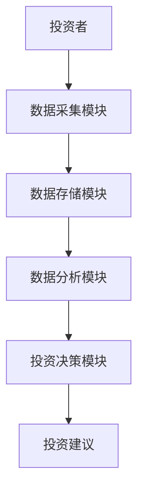

                 


# 《价值投资中的绿色经济机遇》

---

## 关键词：  
价值投资、绿色经济、可持续发展、ESG评分、碳中和、绿色金融、投资策略  

---

## 摘要：  
绿色经济作为全球可持续发展的核心驱动力，正在重塑投资领域的格局。本文从绿色经济的定义、驱动因素及对投资的影响入手，结合价值投资的核心理念，分析绿色经济带来的投资机遇与挑战。通过构建绿色投资评分模型、探讨系统架构设计、案例分析及最佳实践，为投资者提供科学的决策支持，帮助其在绿色经济浪潮中把握长期价值。

---

## 第一部分：绿色经济与价值投资的背景与概念  

### 第1章：绿色经济的定义与重要性  

#### 1.1 绿色经济的定义  
绿色经济是以可持续发展为核心，通过优化资源配置、技术创新和政策引导，实现环境保护与经济增长的协调发展。  

- **绿色经济的核心概念**：绿色经济强调减少资源消耗、降低污染排放，推动清洁能源和环保技术的应用。  
- **绿色经济的驱动因素**：政策支持、技术创新、市场 demand增长。  
- **绿色经济与可持续发展的关系**：绿色经济是实现联合国可持续发展目标（SDGs）的关键路径。  

#### 1.2 价值投资的基本原理  
价值投资是一种投资策略，通过分析企业的基本面（如财务状况、盈利能力、竞争优势）来寻找被市场低估的投资标的。  

- **价值投资的定义**：寻找具有长期竞争优势和合理估值的企业。  
- **价值投资的核心理念**：注重企业内在价值，而非短期市场波动。  
- **绿色经济与价值投资的结合**：绿色经济的可持续性优势为价值投资提供了新的评估维度。  

---

### 第2章：绿色经济对投资的影响  

#### 2.1 绿色经济的市场机遇  
绿色经济的兴起带来了多个行业的投资机会，包括新能源、环保技术、绿色金融等。  

- **新能源行业的投资机会**：太阳能、风能等可再生能源的快速发展为企业提供了广阔的增长空间。  
- **环保技术的创新与应用**：环保技术的创新降低了企业的运营成本，提高了市场竞争力。  
- **绿色金融的发展趋势**：绿色债券、ESG基金等绿色金融工具为投资者提供了多样化的选择。  

#### 2.2 绿色经济的挑战与风险  
尽管绿色经济带来了巨大的投资机会，但也面临一些挑战和风险。  

- **环境风险的评估**：企业可能面临政策变化、技术瓶颈等环境风险。  
- **社会责任投资的局限性**：部分企业可能在短期内难以满足ESG标准。  
- **政策变化对投资的影响**：政策的不确定性和波动性可能对绿色投资产生负面影响。  

---

## 第二部分：绿色经济与价值投资的核心概念与联系  

### 第3章：绿色经济的驱动因素分析  

#### 3.1 政策驱动  
政策是推动绿色经济发展的关键因素之一。  

- **全球气候协议的影响**：《巴黎协定》等国际气候协议为绿色经济提供了政策支持。  
- **各国政府的绿色政策**：各国政府通过立法、财政补贴等方式推动绿色经济发展。  
- **政策不确定性对投资的影响**：政策的不确定性和波动性可能对绿色投资产生负面影响。  

#### 3.2 技术驱动  
技术创新是绿色经济发展的核心动力。  

- **新能源技术的突破**：太阳能、风能等可再生能源技术的突破推动了绿色能源的广泛应用。  
- **环保技术的创新**：环保技术的创新降低了企业的运营成本，提高了市场竞争力。  
- **数字技术对绿色经济的推动**：大数据、人工智能等技术的应用优化了资源分配和环境监测。  

---

### 第4章：价值投资中的绿色经济指标  

#### 4.1 ESG评分体系  
ESG评分体系是绿色投资的重要参考指标。  

- **ESG的定义与构成**：ESG分别代表环境、社会和治理三个维度。  
- **ESG评分的计算方法**：通过对企业在环境、社会和治理方面的表现进行综合评估，得出ESG评分。  
- **ESG评分与投资决策的关系**：高ESG评分的企业通常具有更好的长期表现和风险控制能力。  

#### 4.2 碳排放与绿色投资  
碳排放是衡量企业绿色表现的重要指标。  

- **碳排放的定义与测量**：碳排放指企业在生产过程中直接或间接产生的温室气体排放。  
- **碳排放对投资的影响**：高碳排放企业可能面临更高的合规成本和声誉风险。  
- **碳中和目标的实现路径**：企业通过技术创新和管理优化实现碳中和目标。  

---

## 第三部分：绿色经济与价值投资的分析框架  

### 第5章：绿色经济与价值投资的系统架构  

#### 5.1 问题场景介绍  
绿色经济的兴起为企业提供了新的发展机遇，但也带来了新的挑战。投资者需要通过科学的分析框架来识别绿色投资机会和风险。  

#### 5.2 系统功能设计  
绿色投资分析系统需要具备以下功能：  
- 数据采集：收集企业的财务数据、ESG评分、碳排放数据等。  
- 数据分析：通过算法模型评估企业的绿色投资价值。  
- 投资决策：基于分析结果，为投资者提供投资建议。  

#### 5.3 系统架构设计  
以下是绿色投资分析系统的架构图：  



---

### 第6章：绿色投资评分模型  

#### 6.1 算法原理  
绿色投资评分模型通过综合评估企业的财务表现、ESG评分和碳排放数据，计算出企业的绿色投资价值。  

- **模型公式**：  
  $$ \text{绿色投资价值} = \alpha \times \text{财务表现} + \beta \times \text{ESG评分} + \gamma \times \text{碳排放数据} $$  
  其中，$\alpha$、$\beta$、$\gamma$为权重系数，$\alpha + \beta + \gamma = 1$。  

- **算法实现**：  
  ```python
  def green_investment_score(finance_perf, esg_score, carbon_emission):
      alpha = 0.4
      beta = 0.3
      gamma = 0.3
      return alpha * finance_perf + beta * esg_score + gamma * carbon_emission
  ```

---

## 第四部分：绿色经济与价值投资的案例分析与策略  

### 第7章：绿色经济的行业投资机会  

#### 7.1 新能源行业的投资机会  
新能源行业是绿色经济的核心领域之一。  

- **案例分析**：以某新能源公司为例，分析其财务表现、ESG评分和碳排放数据。  
- **投资策略**：建议投资者关注具有技术创新能力和成本优势的新能源企业。  

#### 7.2 环保科技企业的投资机会  
环保科技企业的技术创新能力是其核心竞争优势。  

- **案例分析**：以某环保科技公司为例，分析其技术创新、市场拓展和财务表现。  
- **投资策略**：建议投资者关注具有强大研发能力和市场前景的环保科技企业。  

---

### 第8章：绿色金融工具的应用  

#### 8.1 绿色债券  
绿色债券是企业融资的重要工具之一。  

- **绿色债券的定义**：绿色债券是指募集资金用于支持绿色项目的债券。  
- **绿色债券的发行流程**：企业需要通过第三方认证机构的审核，确保募集资金的用途符合绿色标准。  
- **绿色债券的投资机会**：绿色债券通常具有较低的违约风险和较高的回报率。  

#### 8.2 绿色ETF  
绿色ETF是一种跟踪绿色股票指数的投资工具。  

- **绿色ETF的定义**：绿色ETF是指投资于绿色企业的交易所交易基金。  
- **绿色ETF的优势**：分散投资风险，便于投资者参与绿色投资。  
- **绿色ETF的投资策略**：投资者可以通过定期定额投资的方式参与绿色ETF投资。  

---

## 第五部分：总结与展望  

### 第9章：总结  

绿色经济为价值投资提供了新的机遇和挑战。投资者需要通过科学的分析框架和有效的投资策略，抓住绿色经济带来的投资机会。  

### 第10章：展望  

随着全球绿色经济的快速发展，绿色投资将成为未来投资领域的主流趋势。投资者需要密切关注绿色经济的最新动态，优化投资组合，实现长期稳定的回报。

---

## 作者：AI天才研究院/AI Genius Institute & 禅与计算机程序设计艺术 /Zen And The Art of Computer Programming

