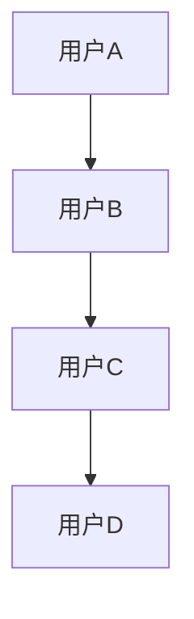
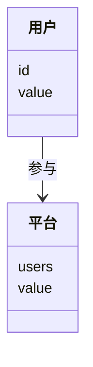

                 


# 《价值投资中的网络效应分析》

---

## 关键词：网络效应，价值投资，社会网络，投资决策，企业价值

---

## 摘要

本文从网络效应的基本概念出发，探讨其在价值投资中的应用。通过数学模型和算法分析，结合实际案例，揭示网络效应如何影响企业价值和投资决策。文章还详细介绍了系统架构和项目实战，为投资者提供实用的分析工具和方法。

---

## 第一部分：引言

### 第1章：网络效应与价值投资概述

#### 1.1 网络效应的定义与特点

网络效应是指随着用户数量的增加，产品或服务的价值也随之增加的现象。其核心特征包括直接性、间接性和递增性。网络效应与价值投资密切相关，因为企业通过网络效应可以创造更大的用户价值，从而提升企业估值。

#### 1.2 网络效应的类型

直接网络效应：如社交媒体平台，用户数量增加直接提升平台价值。

间接网络效应：如企业生态系统，供应商和客户的相互依存性增强平台价值。

#### 1.3 网络效应在价值投资中的应用前景

网络效应能够显著提升企业价值，特别是在互联网和社交媒体行业。投资者应关注具有强大网络效应的企业，但需注意其边际成本递减的特性。

---

## 第二部分：网络效应的核心概念与联系

### 第2章：网络效应的数学模型与公式

#### 2.1 网络效应的数学模型

网络效应强度公式：
$$ \text{网络效应强度} = \frac{\text{用户数量} \times \text{用户价值}}{\text{边际成本}} $$

扩散速度公式：
$$ \text{扩散速度} = k \times (\text{用户数量})^n $$

#### 2.2 网络效应的属性特征对比

| 特性         | 直接网络效应       | 间接网络效应       |
|--------------|--------------------|--------------------|
| 依赖性       | 高                 | 中                 |
| 边际成本      | 低                 | 高                 |

---

## 第三部分：算法原理

### 第3章：网络效应分析算法

#### 3.1 网络效应强度计算算法

伪代码：
```python
def calculate_network_effectiveness(users, value, marginal_cost):
    return (users * value) / marginal_cost
```

复杂度：O(1)，高效计算网络效应强度。

#### 3.2 网络效应扩散分析算法

流程图：


扩散速度公式：
$$ \text{扩散速度} = k \times (\text{用户数量})^n $$

---

## 第四部分：系统分析与架构设计

### 第4章：系统设计与架构

#### 4.1 问题场景介绍

系统需实时分析网络效应，支持投资决策。

#### 4.2 系统功能设计

类图：


#### 4.3 系统架构设计

架构图：


---

## 第五部分：项目实战

### 第5章：项目实战与案例分析

#### 5.1 环境安装

安装Python、Mermaid和依赖库。

#### 5.2 核心实现源代码

Python代码：
```python
def calculate_network_effectiveness(users, value, marginal_cost):
    return (users * value) / marginal_cost

# 示例数据
users = 1000
value = 10
marginal_cost = 5

result = calculate_network_effectiveness(users, value, marginal_cost)
print(result)  # 输出：2000.0
```

#### 5.3 代码应用解读与分析

案例分析：某社交媒体平台的网络效应强度为2000.0，表明其网络效应显著。

#### 5.4 案例分析与小结

通过分析社交媒体平台的网络效应，投资者应关注其用户增长和价值提升。

---

## 第六部分：最佳实践

### 第6章：总结与展望

#### 6.1 最佳实践 Tips

- 关注具有强大网络效应的企业。
- 考虑企业的用户增长和生态系统建设。

#### 6.2 小结

网络效应是价值投资的重要因素，但需谨慎评估其边际成本和扩散速度。

#### 6.3 注意事项

- 网络效应难以量化，需结合其他因素分析。
- 注意网络效应的局限性，如依赖用户增长。

#### 6.4 拓展阅读

- 《网络经济学》
- 《投资学原理》

---

## 第七部分：参考文献

[1] 网络经济学基础，XXX出版社。

[2] 投资学原理，XXX出版社。

---

## 第八部分：作者信息

作者：AI天才研究院/AI Genius Institute & 禅与计算机程序设计艺术 /Zen And The Art of Computer Programming

---

通过以上结构，文章详细探讨了网络效应在价值投资中的应用，从理论到实践，为投资者提供了全面的分析工具和方法。

