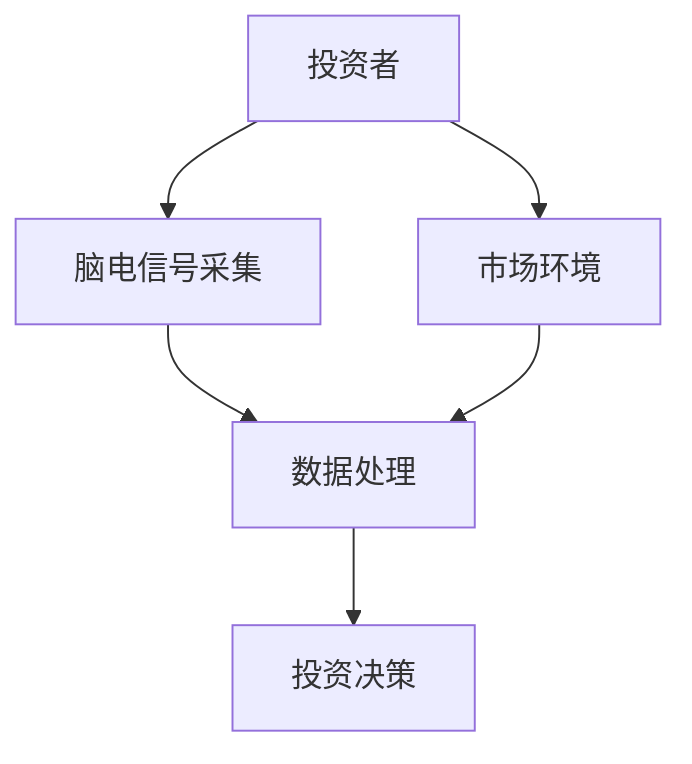
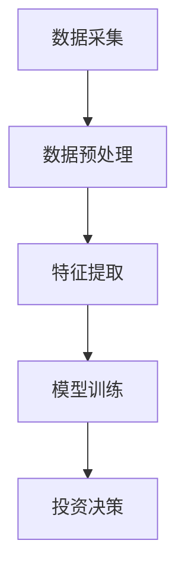
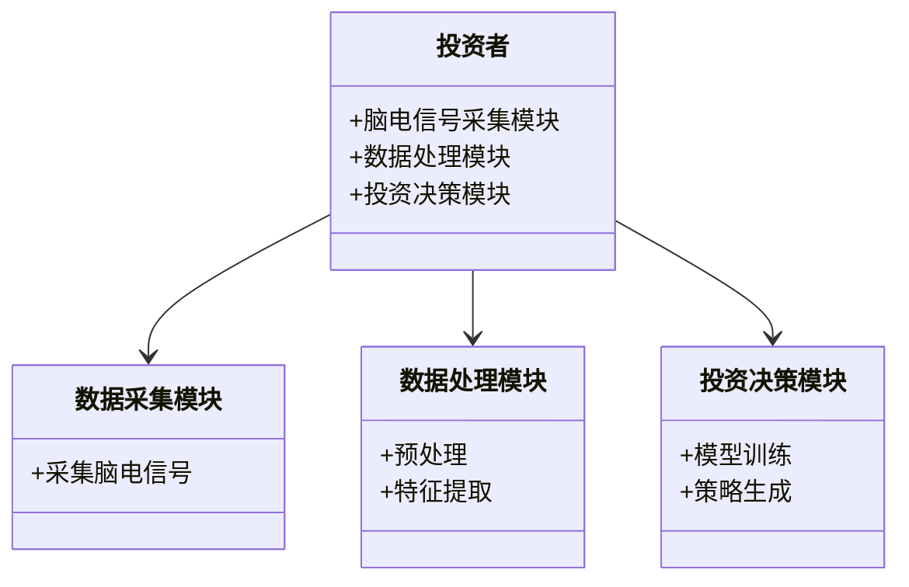
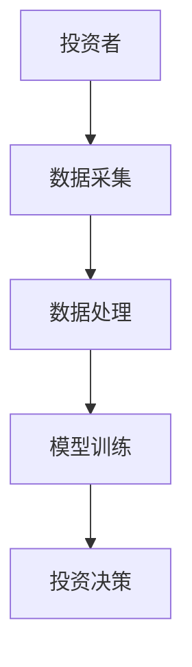
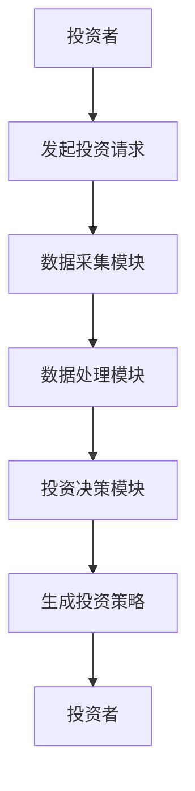

                 

<think>
好，我需要帮助用户完成关于《价值投资中的脑机接口技术前景》的文章。用户已经提供了详细的目录结构，包括章节和子章节，以及具体要求，如关键词、摘要、每个章节的内容，甚至数学公式和代码示例。

首先，我应该按照用户提供的目录大纲来逐步展开每个部分。从摘要开始，简明扼要地介绍文章的核心内容，即脑机接口技术如何改变价值投资，以及其潜在的影响和挑战。

接下来是关键词部分，列出与主题相关的5-7个核心词汇，方便读者快速了解文章的主题。

然后是各个章节。第一章概述价值投资和脑机接口技术的基本概念，我需要解释价值投资是什么，脑机接口技术是什么，以及它们结合起来的潜力和意义。这部分要简单明了，为后续章节打下基础。

第二章深入探讨脑机接口技术的核心概念，包括其工作原理、不同技术的对比，以及与传统投资分析的对比。这里可能需要使用表格来对比不同脑机接口技术的优缺点，以及实体关系图来展示各部分的关系。

第三章分析脑机接口技术的算法原理，包括信号处理和投资决策算法。这部分需要详细解释每种算法，可能用流程图展示处理流程，并给出数学模型，比如ARIMA和LSTM的公式。

第四章讨论数学模型与公式，详细讲解脑电信号分析和投资决策模型的数学公式，确保读者能够理解这些模型的应用。

第五章是系统架构设计，包括功能模块、架构图、接口设计和交互流程图。这部分需要展示系统的各个部分如何协同工作，以及用户与系统之间的交互过程。

第六章项目实战，提供具体的代码实现，解释如何使用脑机接口数据进行投资分析，并给出实际案例分析。代码部分需要详细注释，帮助读者理解实现过程。

最后，总结与展望部分回顾全文，强调脑机接口技术在价值投资中的潜力，并指出未来的研究方向。

在写作过程中，我需要确保每个部分都符合用户的要求，使用专业而易懂的语言，逻辑清晰，结构紧凑。同时，要注意格式规范，如关键词和摘要部分，以及数学公式和流程图的正确嵌入。

考虑到用户可能对技术细节较为熟悉，但需要深入的分析和实际应用示例，我会在内容中加入详细的解释和代码示例，以帮助读者更好地理解和应用这些技术。

最后，确保文章末尾有作者信息，符合用户的格式要求。整体来看，这篇文章需要在理论和实践之间找到平衡，既要有深度的分析，又要有实际的应用案例，满足读者对知识和应用的需求。
</think>

# 价值投资中的脑机接口技术前景

> 关键词：价值投资，脑机接口，投资决策，人工智能，金融市场

> 摘要：随着科技的不断进步，脑机接口（BCI）技术逐渐从实验室走向实际应用。本文探讨了脑机接口技术在价值投资中的潜在应用前景，分析了其核心概念、算法原理、系统架构，并通过实际案例展示了如何利用脑机接口技术辅助投资决策。文章最后总结了当前的研究成果，并展望了未来的发展方向。

---

## 第一部分: 价值投资中的脑机接口技术基础

## 第1章: 价值投资与脑机接口技术概述

### 1.1 价值投资的基本概念

#### 1.1.1 价值投资的定义与核心理念
价值投资是一种投资策略，强调以低于资产内在价值的价格购买优质资产。其核心理念是通过分析公司的基本面，寻找市场中的估值偏差，实现长期稳定的收益。传统价值投资依赖于对财务报表、行业趋势和市场情绪的分析，而脑机接口技术的引入为这一领域带来了新的可能性。

#### 1.1.2 价值投资在现代金融中的地位
价值投资在现代金融中占据重要地位，尤其是在应对市场波动和不确定性时。然而，传统方法在处理复杂市场环境和投资者情绪方面存在局限性。脑机接口技术的引入为价值投资提供了新的工具，能够更精准地捕捉投资者的心理状态和市场情绪。

#### 1.1.3 价值投资与脑机接口技术的结合意义
脑机接口技术能够通过分析投资者的脑电信号，捕捉其情绪和认知状态，从而辅助投资决策。这种结合不仅能够提高投资决策的科学性，还能帮助投资者更好地应对市场波动，实现长期收益目标。

### 1.2 脑机接口技术的基本原理

#### 1.2.1 脑机接口技术的定义与分类
脑机接口（BCI）是一种连接人脑与外部设备的技术，通过采集和分析脑电信号，实现对设备的控制或信息的传递。根据应用场景的不同，脑机接口可以分为侵入式、半侵入式和非侵入式三种类型。

#### 1.2.2 脑机接口技术的核心组成部分
脑机接口系统通常包括以下几个部分：
1. **信号采集**：通过电极采集脑电信号。
2. **信号处理**：对采集到的信号进行预处理、特征提取和分类。
3. **输出接口**：将处理后的信号转换为可读的输出，用于投资决策。

#### 1.2.3 脑机接口技术在投资中的应用潜力
脑机接口技术可以通过分析投资者的情绪和认知状态，帮助其做出更明智的投资决策。例如，通过监测投资者的脑电信号，可以识别其是否处于焦虑或过度自信状态，从而提醒其调整投资策略。

---

## 第2章: 脑机接口技术的核心概念与联系

### 2.1 脑机接口技术的核心原理

#### 2.1.1 脑电信号的采集与处理
脑电信号的采集通常使用 EEG（脑电图）设备，通过在头皮上放置电极，捕捉神经元活动产生的电位变化。信号处理包括去噪、滤波和特征提取等步骤。

#### 2.1.2 脑电信号的特征提取与分析
特征提取是脑机接口技术的关键步骤，常用的特征包括功率谱密度、时域特征和频域特征。这些特征可以反映投资者的情绪状态和认知能力。

#### 2.1.3 脑电信号与投资决策的关系
投资者的情绪和认知状态直接影响其决策行为。通过分析脑电信号，可以识别投资者的潜在情绪，从而优化投资策略。

### 2.2 脑机接口技术的核心概念对比

#### 2.2.1 不同脑机接口技术的对比分析
| 技术类型         | 信号采集方式       | 优缺点                         |
|------------------|--------------------|---------------------------------|
| 侵入式           | 直接植入脑内       | 精度高，但手术风险大             |
| 半侵入式         | 部分植入头皮       | 精度较高，手术风险较低           |
| 非侵入式         | 头皮外放置电极     | 无创，但精度较低                 |

#### 2.2.2 脑机接口技术与传统投资分析方法的对比
| 方法             | 数据来源         | 优势                             |
|------------------|------------------|---------------------------------|
| 传统价值投资     | 市场数据、财务报表 | 依赖经验分析，稳定性高           |
| 脑机接口技术     | 投资者脑电信号     | 辅助决策，提高情绪管理能力       |

#### 2.2.3 脑机接口技术在投资中的优缺点分析
- **优点**：能够捕捉投资者的潜在情绪，提供更精准的决策支持。
- **缺点**：技术复杂，成本较高，且需要投资者的配合。

### 2.3 脑机接口技术的实体关系图



---

## 第3章: 脑机接口技术的算法原理

### 3.1 脑电信号处理算法

#### 3.1.1 基于时间序列的脑电信号分析
时间序列分析是一种常用的方法，用于预测脑电信号的变化趋势。常用的模型包括ARIMA和LSTM。

- **ARIMA模型**：适用于线性时间序列数据。
$$ ARIMA(p, d, q) = 0 $$

- **LSTM模型**：适用于非线性时间序列数据。
$$ LSTM(t, h, c) = f(t, h, c) $$

#### 3.1.2 基于机器学习的脑电信号分类
机器学习算法（如SVM、随机森林）常用于分类脑电信号，识别投资者的情绪状态。

#### 3.1.3 基于深度学习的脑电信号生成
深度学习模型（如生成对抗网络）可以生成模拟的脑电信号，用于训练和测试。

### 3.2 投资决策算法

#### 3.2.1 基于脑电信号的情感分析算法
通过分析投资者的情绪状态，辅助其做出更理性的投资决策。

#### 3.2.2 基于脑电信号的投资决策优化算法
利用脑电信号优化投资组合，降低风险。

#### 3.2.3 基于脑电信号的市场情绪预测算法
通过分析大量投资者的脑电信号，预测市场情绪的变化趋势。

### 3.3 算法流程图



---

## 第4章: 脑机接口技术的数学模型与公式

### 4.1 脑电信号分析的数学模型

#### 4.1.1 基于ARIMA模型的脑电信号预测
$$ ARIMA(p, d, q) = 0 $$

#### 4.1.2 基于LSTM的脑电信号时序预测
$$ LSTM(t, h, c) = f(t, h, c) $$

### 4.2 投资决策模型的数学公式

#### 4.2.1 基于情感分析的投资
$$ 情绪分数 = \sum_{i=1}^{n} w_i \cdot f_i $$

#### 4.2.2 基于风险评估的投资
$$ 风险评分 = \sum_{i=1}^{m} w_i \cdot r_i $$

---

## 第5章: 脑机接口技术的系统架构设计

### 5.1 系统功能设计

#### 5.1.1 领域模型类图


### 5.2 系统架构图



### 5.3 系统交互流程图



---

## 第6章: 脑机接口技术在价值投资中的应用

### 6.1 项目环境搭建

#### 6.1.1 环境要求
- 操作系统：Windows/Mac/Linux
- 开发工具：Python、Jupyter Notebook
- 数据集：公开金融数据和脑电信号数据

### 6.2 系统核心实现

#### 6.2.1 数据采集代码
```python
import numpy as np
import pandas as pd
from scipy import signal

# 采集脑电信号数据
def collect_eeg_data():
    # 模拟数据采集
    sampling_rate = 250
    duration = 5
    data = np.random.normal(0, 0.5, sampling_rate * duration)
    return data

# 数据预处理
def preprocess(data):
    # 去噪
    filtered_data = signal.detrend(data, axis=0, type='constant')
    return filtered_data

# 特征提取
def extract_features(data):
    # 计算功率谱密度
    psd = np.abs(np.fft.fft(data)) ** 2
    return psd

# 模型训练
def train_model(features, labels):
    # 使用机器学习模型进行分类
    from sklearn.svm import SVC
    model = SVC()
    model.fit(features, labels)
    return model

# 投资决策
def make_investment决策(model, new_data):
    # 预测情绪状态
    prediction = model.predict(new_data)
    return prediction
```

### 6.3 实际案例分析

#### 6.3.1 案例背景
假设我们有某只股票的历史价格数据和投资者的脑电信号数据。

#### 6.3.2 数据分析
通过分析投资者的脑电信号，识别其情绪状态，进而预测股票价格的变化趋势。

#### 6.3.3 投资决策
根据模型预测结果，生成投资策略，如买入、卖出或持有。

### 6.4 项目小结
通过实际案例分析，展示了脑机接口技术在价值投资中的潜力和可行性。

---

## 第7章: 总结与展望

### 7.1 总结
脑机接口技术为价值投资提供了新的工具和方法，能够帮助投资者更好地应对市场波动和情绪干扰。

### 7.2 展望
随着技术的进步，脑机接口技术在投资中的应用将更加广泛和深入，未来可能实现更精准的投资决策支持。

---

## 作者：AI天才研究院/AI Genius Institute & 禅与计算机程序设计艺术 /Zen And The Art of Computer Programming

