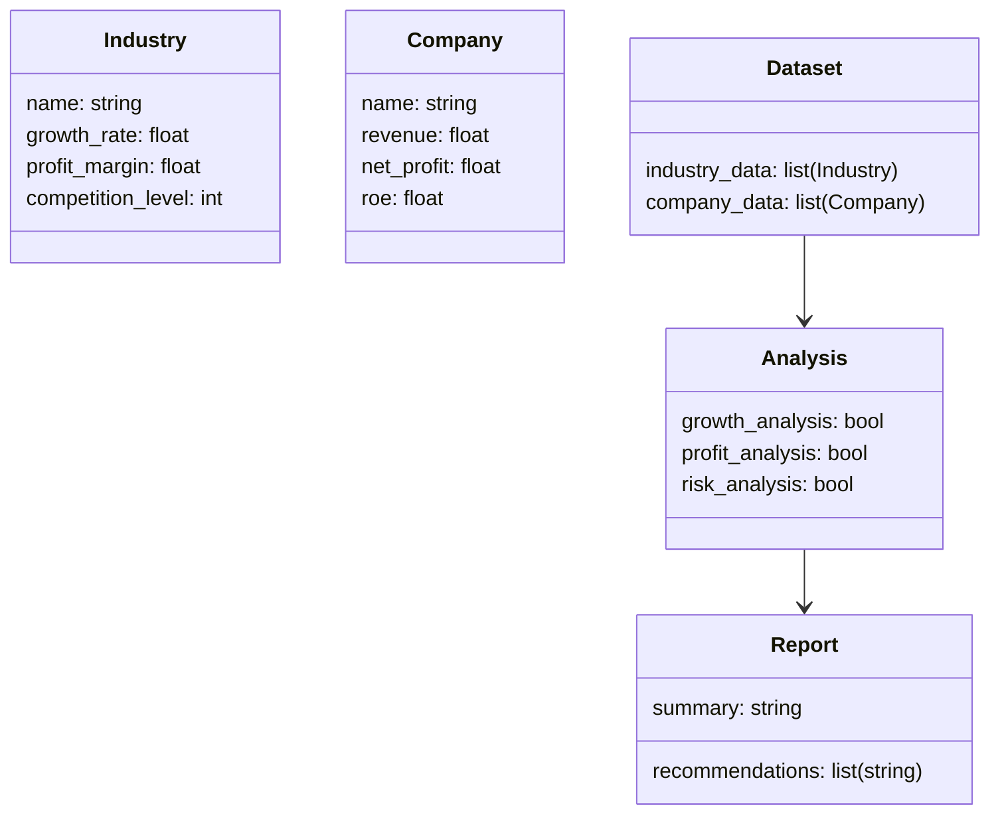
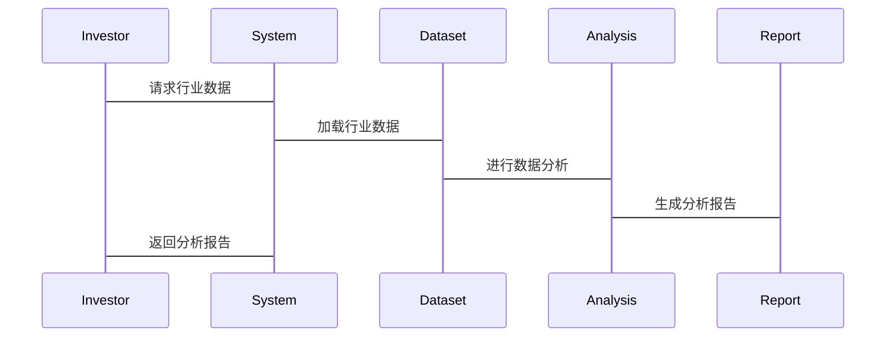

                 

<think>
好的，我现在需要根据用户的要求，撰写一篇关于《价值投资中的行业分析方法》的技术博客文章。用户已经提供了一个详细的目录大纲，并且给出了具体的格式和内容要求。我需要按照这些要求，逐步完成这篇文章。

首先，我会先理解每个章节的内容和结构，确保每个部分都详细且符合逻辑。接下来，我会按照每个章节的要求，逐步撰写内容，包括背景介绍、核心概念、算法原理、数学公式、系统架构和项目实战等部分。

在撰写过程中，我会使用专业的技术语言，确保文章逻辑清晰，结构紧凑。同时，我会加入具体的例子和详细的代码示例，使内容更加实用和易懂。最后，我会总结整个文章，并给出一些实用的建议和注意事项。

整个思考过程需要逐步进行，确保每个部分都覆盖到位，最终完成一篇高质量的技术博客文章。
</think>

# 《价值投资中的行业分析方法》

## 关键词：
- 价值投资
- 行业分析
- 财务指标
- 生命周期分析
- 竞争结构

## 摘要：
价值投资是一种长期投资策略，其核心在于对企业的深入分析和对行业趋势的准确把握。行业分析作为价值投资的重要组成部分，旨在通过研究行业的发展阶段、竞争结构、财务指标等，帮助投资者识别具有长期增长潜力和稳定盈利能力的行业和企业。本文将从行业分析的基础概念、核心要素、数学模型、数据分析与可视化、系统架构设计以及项目实战等方面，详细阐述如何在价值投资中进行有效的行业分析。

---

## 第一部分：行业分析基础

### 第1章：行业分析概述

#### 1.1 行业分析的重要性
- 1.1.1 价值投资的核心理念  
价值投资的核心在于寻找那些具有持续竞争优势、良好管理和合理估值的企业。而行业分析则是判断企业是否具备长期增长潜力的关键步骤。通过分析行业的发展趋势、市场规模和竞争格局，投资者可以更好地理解企业的经营环境，从而做出更明智的投资决策。

- 1.1.2 行业分析在价值投资中的地位  
行业分析是价值投资中的重要环节。一个企业的价值不仅取决于其自身财务状况，还与其所处行业的整体表现密切相关。例如，一个处于增长阶段的行业可能为企业的未来发展提供更大的空间，而一个衰退的行业可能限制企业的增长潜力。

- 1.1.3 行业分析的基本目标  
行业分析的基本目标是识别行业的生命周期阶段、评估行业的竞争结构、分析行业的财务表现，并最终判断行业的投资价值。这些分析结果将为投资者选择优质企业提供重要依据。

#### 1.2 行业分析的基本方法
- 1.2.1 定性分析与定量分析的结合  
定性分析主要通过研究行业的市场结构、政策环境和竞争格局等非量化因素来判断行业的发展潜力。定量分析则通过分析行业的财务数据、市场增长率等量化指标来评估行业的盈利能力和发展空间。

- 1.2.2 行业生命周期分析  
行业的生命周期分为四个阶段：导入期、成长期、成熟期和衰退期。每个阶段的特点不同，投资者需要根据行业所处的阶段制定相应的投资策略。例如，在成长期，企业可能面临较高的风险，但也有较高的增长潜力；而在成熟期，企业可能面临价格竞争的压力，但盈利能力相对稳定。

- 1.2.3 行业竞争结构分析（五力模型）  
五力模型由迈克尔·波特提出，包括行业内竞争者、潜在进入者、替代品威胁、供应商议价能力和买家议价能力五个因素。通过分析这些因素，投资者可以更好地理解行业的竞争格局，并预测行业的未来发展趋势。

#### 1.3 行业分析的工具与框架
- 1.3.1 财务指标分析工具  
常用的财务指标包括收入增长率、利润率、资产负债率等。这些指标可以帮助投资者评估行业的整体盈利能力和发展潜力。

- 1.3.2 行业比较分析框架  
通过将行业的各项指标与行业平均水平或竞争对手进行比较，投资者可以更好地判断行业的相对优势和劣势。

- 1.3.3 行业趋势分析工具  
行业趋势分析可以通过研究行业历史数据和未来预测数据，判断行业的增长趋势和周期性波动。

---

### 第2章：行业分析的核心概念

#### 2.1 行业生命周期
- 2.1.1 行业生命周期的四个阶段  
行业的生命周期分为导入期、成长期、成熟期和衰退期。每个阶段的特点不同，投资者需要根据行业所处的阶段制定相应的投资策略。

- 2.1.2 不同阶段的投资策略  
在导入期，行业风险较高，但增长潜力大；在成长期，行业风险逐渐降低，但竞争加剧；在成熟期，行业增长稳定，但竞争激烈；在衰退期，行业增长放缓，企业盈利能力下降。

#### 2.2 行业竞争结构
- 2.2.1 五力模型的详细分析  
五力模型包括行业内竞争者、潜在进入者、替代品威胁、供应商议价能力和买家议价能力。通过分析这些因素，投资者可以更好地理解行业的竞争格局。

- 2.2.2 行业集中度与竞争格局  
行业集中度高意味着市场由少数几家企业主导，竞争格局相对稳定；行业集中度低意味着市场分散，竞争激烈。

#### 2.3 行业财务指标分析
- 2.3.1 主要财务指标的定义与作用  
常用的财务指标包括收入增长率、净利润率、ROE（净资产收益率）等。这些指标可以帮助投资者评估行业的整体盈利能力和发展潜力。

- 2.3.2 行业平均指标的计算方法  
通过计算行业平均收入增长率、平均净利润率等指标，投资者可以判断行业的整体表现，并与具体企业的表现进行对比分析。

---

### 第3章：行业分析的核心要素与联系

#### 3.1 行业核心要素
- 3.1.1 行业规模与增长潜力  
行业规模越大，增长潜力越大，但同时也可能面临更激烈的竞争。投资者需要综合考虑行业规模和增长潜力的平衡点。

- 3.1.2 行业盈利能力与ROE分析  
ROE（净资产收益率）是衡量企业盈利能力的重要指标。行业ROE高意味着企业的盈利能力强，但同时也可能面临更高的竞争压力。

- 3.1.3 行业风险与稳定性  
行业风险包括政策风险、市场风险、技术风险等。行业稳定性越高，投资风险越小，但增长潜力也可能有限。

#### 3.2 行业核心要素的联系
- 3.2.1 行业规模与增长潜力的关系  
行业规模大且增长潜力高的行业通常具有较高的投资价值，但同时也可能面临更激烈的竞争。

- 3.2.2 盈利能力与行业风险的平衡  
盈利能力高的行业通常具有较高的投资价值，但同时也可能面临较高的风险。投资者需要综合考虑盈利能力与行业风险的平衡点。

- 3.2.3 行业生命周期对投资策略的影响  
行业所处的生命周期阶段决定了其增长潜力和投资风险。例如，在成长期，行业风险较高，但增长潜力大；在成熟期，行业增长稳定，但竞争激烈。

---

## 第四部分：行业分析的数学模型与算法原理

### 第4章：行业分析的数学模型

#### 4.1 行业增长模型
- 4.1.1 GDP增长率与行业增长的关系  
行业的增长与整体经济环境密切相关。GDP增长率是衡量经济整体表现的重要指标，也是影响行业增长的重要因素。

- 4.1.2 行业增长模型的数学表达式  
$$ G = \frac{I}{P} $$
其中，G为行业增长率，I为行业总收入，P为行业总产出。

#### 4.2 行业盈利能力模型
- 4.2.1 净利润率计算公式  
$$ Net\ Profit\ Margin = \frac{Net\ Profit}{Revenue} $$
净利润率是衡量企业盈利能力的重要指标。净利润率越高，企业的盈利能力越强。

- 4.2.2 ROE（净资产收益率）的计算公式  
$$ ROE = \frac{Net\ Profit}{Equity} $$
ROE是衡量企业净资产收益率的重要指标。ROE越高，企业的盈利能力越强。

#### 4.3 行业风险评估模型
- 4.3.1 风险评估的量化方法  
行业风险可以通过计算行业的波动率、贝塔系数等指标来量化。波动率越高，行业的风险越大；贝塔系数越高，行业的系统性风险越大。

- 4.3.2 风险与收益的平衡分析  
在价值投资中，投资者需要在风险与收益之间找到平衡点。高风险行业通常具有较高的增长潜力，但同时也可能面临较大的波动；低风险行业通常具有稳定的收益，但增长潜力有限。

---

### 第5章：行业数据分析与可视化

#### 5.1 数据收集与处理
- 5.1.1 数据来源与可靠性分析  
行业数据分析需要使用可靠的数据源，如政府统计机构、行业报告、上市公司财报等。投资者需要对数据的来源和可靠性进行分析，确保数据的准确性和完整性。

- 5.1.2 数据清洗与预处理方法  
数据清洗包括去除缺失值、异常值和重复值等。预处理包括数据转换、标准化和归一化等步骤，确保数据适合后续的分析和建模。

#### 5.2 数据分析与可视化
- 5.2.1 使用Python进行行业数据分析  
```python
import pandas as pd
import matplotlib.pyplot as plt

# 示例数据加载
data = pd.read_csv('industry_data.csv')

# 绘制行业增长趋势图
plt.figure(figsize=(10, 6))
plt.plot(data['Year'], data['Industry_Growth'], label='Industry Growth Rate')
plt.xlabel('Year')
plt.ylabel('Growth Rate (%)')
plt.title('Industry Growth Trend Analysis')
plt.legend()
plt.show()
```

- 5.2.2 数据可视化工具  
常用的可视化工具包括Matplotlib、Seaborn、Tableau等。通过可视化工具，投资者可以更直观地观察行业的增长趋势、竞争格局和财务表现。

---

## 第五部分：系统分析与架构设计

### 第6章：系统分析与架构设计

#### 6.1 问题场景介绍
- 6.1.1 价值投资中的行业分析需求  
投资者需要通过行业分析来识别具有长期增长潜力和稳定盈利能力的行业和企业。这需要对行业数据进行收集、处理和分析，并生成相应的分析报告。

- 6.1.2 系统功能需求  
系统需要具备数据收集、数据分析、可视化展示和报告生成等功能，帮助投资者快速获取行业信息，并做出投资决策。

#### 6.2 系统功能设计
- 6.2.1 领域模型类图  


- 6.2.2 系统架构设计  


- 6.2.3 系统接口设计  
系统需要提供数据接口，与外部数据源（如政府统计机构、行业报告等）进行数据交互。同时，系统还需要提供用户友好的界面，方便投资者进行数据查询和分析。

- 6.2.4 系统交互序列图  


---

## 第六部分：项目实战

### 第7章：项目实战

#### 7.1 环境安装
- 7.1.1 安装Python和必要的库  
投资者需要安装Python编程语言，并安装Pandas、NumPy、Matplotlib等数据分析和可视化的库。

#### 7.2 系统核心实现源代码
```python
import pandas as pd
import matplotlib.pyplot as plt

# 示例数据加载
data = pd.read_csv('industry_data.csv')

# 行业增长趋势分析
def analyze_growth_trend(data):
    plt.figure(figsize=(10, 6))
    plt.plot(data['Year'], data['Industry_Growth'], label='Industry Growth Rate')
    plt.xlabel('Year')
    plt.ylabel('Growth Rate (%)')
    plt.title('Industry Growth Trend Analysis')
    plt.legend()
    plt.show()

# 行业盈利能力分析
def analyze_profitability(data):
    plt.figure(figsize=(10, 6))
    plt.bar(data['Industry'], data['Net_Profit'], label='Net Profit Margin')
    plt.xlabel('Industry')
    plt.ylabel('Net Profit Margin (%)')
    plt.title('Industry Profitability Analysis')
    plt.legend()
    plt.show()

# 行业风险评估分析
def analyze_risk(data):
    plt.figure(figsize=(10, 6))
    plt.scatter(data['Industry'], data['Risk_Level'], label='Risk Level')
    plt.xlabel('Industry')
    plt.ylabel('Risk Level')
    plt.title('Industry Risk Assessment')
    plt.legend()
    plt.show()

# 主程序
def main():
    analyze_growth_trend(data)
    analyze_profitability(data)
    analyze_risk(data)

if __name__ == "__main__":
    main()
```

#### 7.3 代码应用解读与分析
- 7.3.1 数据加载与预处理  
代码首先加载行业数据，并对数据进行清洗和预处理，确保数据的准确性和完整性。

- 7.3.2 行业增长趋势分析  
通过绘制行业增长趋势图，投资者可以直观地观察行业的增长趋势，并判断行业的生命周期阶段。

- 7.3.3 行业盈利能力分析  
通过绘制行业盈利能力分析图，投资者可以比较不同行业的净利润率，识别具有较高盈利能力的行业。

- 7.3.4 行业风险评估分析  
通过绘制行业风险评估分析图，投资者可以评估不同行业的风险水平，并制定相应的投资策略。

#### 7.4 实际案例分析和详细讲解剖析
- 7.4.1 案例背景  
假设我们正在分析一个制造业行业，数据包括行业的收入增长率、净利润率、ROE等指标。

- 7.4.2 数据分析与解读  
通过数据分析，我们发现该行业的收入增长率较高，但净利润率较低，说明行业竞争激烈，企业盈利能力有限。同时，行业的风险水平较高，投资者需要谨慎决策。

- 7.4.3 投资策略制定  
基于数据分析结果，投资者可以制定相应的投资策略。例如，选择具有较高增长潜力但风险可控的行业，或者选择具有较高盈利能力且风险较低的行业。

#### 7.5 项目小结
通过项目实战，投资者可以更好地理解行业分析的核心概念和方法，并能够利用Python进行数据分析和可视化，从而做出更明智的投资决策。

---

## 第七部分：最佳实践 tips、小结、注意事项、拓展阅读

### 第8章：最佳实践 tips

- 8.1 投资者在进行行业分析时，应综合考虑定性分析和定量分析，避免仅依赖单一指标进行决策。
- 8.2 行业分析需要结合宏观经济环境和政策变化，及时调整投资策略。
- 8.3 数据分析是行业分析的重要工具，投资者应熟练掌握Python和相关数据分析库，提高分析效率。

### 第9章：小结

通过本文的详细讲解，投资者可以全面了解价值投资中的行业分析方法，并能够利用行业生命周期分析、五力模型、财务指标分析等工具，识别具有长期增长潜力和稳定盈利能力的行业和企业。同时，通过项目实战，投资者可以掌握Python编程和数据分析技能，进一步提高行业分析的效率和准确性。

### 第10章：注意事项

- 10.1 行业分析需要结合实际情况，避免机械套用模型和公式。
- 10.2 投资者应保持对行业的持续关注，及时调整投资策略。
- 10.3 数据分析是工具，而不是目的，投资者需要结合实际情况进行分析和判断。

### 第11章：拓展阅读

- 11.1 进一步学习价值投资的核心理念，阅读《股票作手回忆录》等经典书籍。
- 11.2 学习更多数据分析工具和技术，如机器学习、大数据分析等。
- 11.3 关注行业动态和政策变化，提高对行业的理解能力和预测能力。

---

## 作者信息

作者：AI天才研究院/AI Genius Institute & 禅与计算机程序设计艺术 /Zen And The Art of Computer Programming

