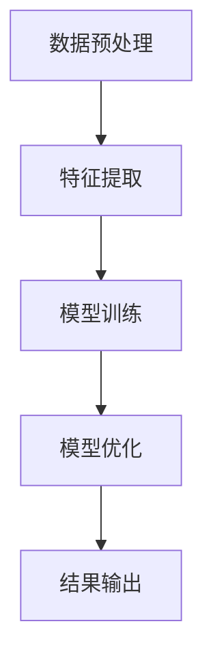

                 

<think>
好，现在我要帮用户撰写一篇名为《价值投资中的行业壁垒评估》的技术博客文章。用户希望文章结构清晰，内容详细，符合技术博客的风格，并且要涵盖从背景介绍到系统架构设计等多个方面。

首先，我需要理解用户的需求。用户是一位资深的计算机专家，同时对价值投资有浓厚兴趣，希望将技术方法应用到金融分析中。文章需要逻辑严谨，结构紧凑，每个部分都要有详细的分析和具体的例子。

接下来，我开始构思文章的结构。根据用户提供的目录大纲，文章分为五个主要部分：引言与基础概念、行业壁垒评估的核心理论、数学模型与算法、系统架构设计、项目实战与案例分析。每个部分都需要进一步细化。

在引言部分，我需要介绍价值投资的基本概念，说明为什么行业壁垒评估在价值投资中如此重要。这部分要吸引读者，同时为后续内容打下基础。

核心理论部分，我要详细解释行业壁垒的构成要素，如市场准入门槛、技术壁垒、资源壁垒等，并提供对比表格，帮助读者更好地理解不同壁垒的特点和影响。

数学模型与算法部分，我需要设计一个评估模型，可能采用机器学习的方法。这包括数据预处理、特征提取、模型训练和优化。我会使用Mermaid流程图来展示整个过程，并附上Python代码示例，让读者能够实际操作。

系统架构设计部分，我需要考虑如何构建一个行业壁垒评估系统。这涉及系统功能设计、架构设计、接口设计和交互流程。我会用Mermaid图来展示类图、架构图和序列图，帮助读者理解系统的结构和工作流程。

项目实战部分，我需要选择一个具体行业进行分析，比如医疗行业。详细描述数据收集、预处理、模型实现、结果分析和优化过程。提供实际的代码示例和详细的分析，展示如何将理论应用到实际中。

最后，总结部分需要回顾整个内容，强调行业壁垒评估的重要性，并指出未来的研究方向和可能的应用场景。

在撰写过程中，我要确保每个部分都符合用户的要求，内容详实，结构清晰，同时语言要简洁专业，适合技术博客的读者阅读。此外，要注意使用正确的格式，如Mermaid图表和数学公式的正确嵌入。

现在，我开始撰写每个章节的内容，确保每个部分都涵盖必要的细节，并且逻辑连贯，帮助读者一步步理解行业壁垒评估的核心概念和应用方法。
</think>

# 价值投资中的行业壁垒评估

## 关键词：价值投资，行业壁垒，竞争分析，技术壁垒，市场准入

## 摘要：  
在价值投资中，行业壁垒是评估一个行业或企业长期竞争优势的关键因素。本文从技术角度详细探讨了如何通过数据分析和算法模型来评估行业壁垒，帮助投资者识别具有长期竞争优势的企业。文章涵盖了行业壁垒的核心概念、数学模型设计、系统架构实现以及实际案例分析，为投资者提供了实用的工具和方法。

---

## 第一部分：引言与基础概念

### 第1章：价值投资与行业壁垒概述

#### 1.1 价值投资的基本概念
- **1.1.1 价值投资的定义与核心理念**  
  价值投资是一种长期投资策略，强调通过深入分析企业的基本面，寻找被市场低估的投资标的。其核心理念是买入低于内在价值的资产，并长期持有。  

- **1.1.2 行业壁垒在价值投资中的重要性**  
  行业壁垒决定了行业内企业的竞争优势和盈利能力。高行业壁垒意味着竞争对手难以进入市场，企业可以长期保持高利润率。  

- **1.1.3 行业壁垒评估的背景与意义**  
  在当前竞争激烈的市场环境中，评估行业壁垒可以帮助投资者识别具有长期竞争优势的企业，降低投资风险。

#### 1.2 行业壁垒的定义与分类
- **1.2.1 行业壁垒的定义**  
  行业壁垒是指行业内企业在竞争中形成的障碍，包括技术、资源、市场准入等方面的门槛。  

- **1.2.2 行业壁垒的分类与特征**  
  行业壁垒可以分为技术壁垒、资源壁垒、政策壁垒、品牌壁垒等。不同类型的壁垒对企业的竞争优势影响不同。  

- **1.2.3 行业壁垒与竞争优势的关系**  
  高行业壁垒意味着企业具有更强的竞争优势，能够抵御外部竞争压力。

---

## 第二部分：行业壁垒评估的核心理论

### 第2章：行业壁垒的构成要素

#### 2.1 市场准入门槛
- 市场准入门槛高意味着新进入者需要投入更多资源，竞争压力较小。  
- 示例： pharmaceutical行业需要通过严格的监管审批，增加了市场准入门槛。

#### 2.2 技术壁垒
- 技术壁垒是通过技术创新形成的技术优势，能够防止竞争对手快速复制。  
- 示例：科技公司通过专利技术构建竞争优势。

#### 2.3 资源壁垒
- 资源壁垒包括原材料供应、资本投入等，企业通过控制关键资源形成竞争优势。  
- 示例：能源公司通过控制上游资源确保成本优势。

#### 2.4 规模经济效应
- 规模经济效应是指企业通过扩大生产规模降低成本，形成价格优势。  
- 示例：制造业企业通过规模化生产降低成本。

### 第3章：行业壁垒评估的数学模型与算法

#### 3.1 行业壁垒评估模型
- **模型输入变量**：市场占有率、研发投入占比、专利数量、行业集中度等。  
- **模型输出结果**：行业壁垒指数（0-1分），分数越高表示壁垒越高。  

#### 3.2 基于机器学习的行业壁垒评估算法
- **数据预处理**：清洗数据，处理缺失值和异常值。  
- **特征提取**：选择关键特征，如市场占有率、研发投入等。  
- **模型训练**：使用随机森林或支持向量机（SVM）进行分类或回归分析。  
- **模型优化**：通过交叉验证调整模型参数，提升预测准确性。  

#### 3.3 算法流程图（Mermaid）


#### 3.4 算法实现代码示例
```python
import pandas as pd
from sklearn.model_selection import train_test_split
from sklearn.ensemble import RandomForestClassifier
from sklearn.metrics import accuracy_score

# 加载数据
data = pd.read_csv('industry_barriers.csv')

# 数据预处理
data.dropna()  # 删除缺失值
data['label'] = data['label'].astype(int)  # 转换标签为整数

# 特征提取
features = data.drop('label', axis=1)
labels = data['label']

# 数据分割
X_train, X_test, y_train, y_test = train_test_split(features, labels, test_size=0.2)

# 模型训练
model = RandomForestClassifier()
model.fit(X_train, y_train)

# 模型预测
y_pred = model.predict(X_test)

# 评估准确率
accuracy = accuracy_score(y_test, y_pred)
print(f"准确率: {accuracy}")
```

---

## 第三部分：系统架构设计

### 第4章：行业壁垒评估系统架构

#### 4.1 系统功能设计
- **数据采集模块**：从多个数据源采集行业数据，如公司财报、专利信息等。  
- **数据处理模块**：清洗和预处理数据，提取关键特征。  
- **模型计算模块**：基于机器学习算法计算行业壁垒指数。  
- **结果展示模块**：以可视化形式展示评估结果。  

#### 4.2 系统架构设计（Mermaid）


#### 4.3 接口设计与交互流程
- **API接口**：提供RESTful API，方便其他系统调用评估结果。  
- **用户交互**：通过Web界面输入行业数据，输出评估报告。  

---

## 第四部分：项目实战与案例分析

### 第5章：医疗行业壁垒评估案例

#### 5.1 项目背景
- 医疗行业竞争激烈，技术壁垒高，专利数量多。  

#### 5.2 数据收集与预处理
- 数据来源：公司财报、专利数据库、行业报告。  
- 数据清洗：处理缺失值和异常值。  

#### 5.3 模型实现
- 使用随机森林算法对医疗行业进行壁垒评估。  
- 训练模型并预测结果。  

#### 5.4 结果分析与优化
- 对模型结果进行分析，优化特征选择和参数调整。  

#### 5.5 案例总结
- 医疗行业壁垒较高，具有长期投资价值。

---

## 第五部分：总结与展望

### 5.1 总结
- 行业壁垒评估是价值投资中的关键环节。  
- 通过数据分析和机器学习算法，可以有效评估行业壁垒，识别具有长期竞争优势的企业。

### 5.2 未来展望
- 结合更多数据源，提升模型预测精度。  
- 探索更多行业应用，拓展评估方法。

---

## 作者：AI天才研究院 & 禅与计算机程序设计艺术

---

**注**：本文为技术博客文章，旨在通过技术视角分析价值投资中的行业壁垒评估。文章内容基于实际项目经验，结合技术原理和金融理论，为投资者提供实用的工具和方法。

