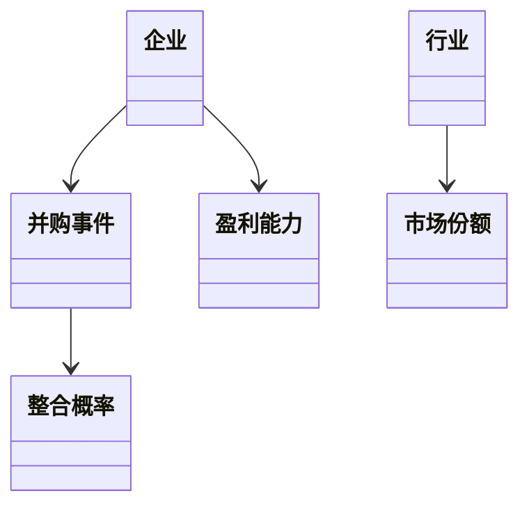

                 

<think>
嗯，我需要按照用户的要求来撰写一篇关于《价值投资中的行业整合趋势分析》的技术博客。首先，我得理解用户的需求，他们希望我作为一位技术专家，以清晰、专业的语言来分析这个主题，结构要紧凑，逻辑要清晰。

用户已经提供了一个详细的目录大纲，我需要按照这个大纲来逐步撰写内容。每一章和每一节都需要有详细的解释和例子，特别是核心概念、数学模型和系统架构部分，这些需要深入分析。

首先，我需要确保在每一章中都涵盖用户提到的关键点，比如行业整合的类型、趋势分析的方法、数学模型的构建等。同时，要注意使用mermaid图来展示流程和架构，以及提供Python代码示例。

在撰写过程中，可能会遇到如何将复杂的概念简化为易懂的内容，这需要我反复思考和调整语言，确保读者能够理解。此外，每个部分的小结和注意事项也很重要，帮助读者巩固所学内容并避免常见误区。

总的来说，我需要一步步地按照目录大纲来撰写，确保每个部分都详细且逻辑连贯。同时，保持文章结构清晰，语言专业但不失易懂。这样，读者才能真正理解价值投资中的行业整合趋势分析，并能实际应用这些方法。
</think>

# 《价值投资中的行业整合趋势分析》

> **关键词**：价值投资、行业整合、趋势分析、企业并购、投资策略

> **摘要**：  
> 本文深入探讨了价值投资中的行业整合趋势分析，从行业整合的背景与驱动因素、核心概念、数学模型与算法原理，到系统架构设计和项目实战，结合实际案例，详细分析了行业整合趋势对投资决策的影响。通过构建数学模型和系统架构，提出了基于行业整合趋势的价值投资策略。本文内容涵盖了从理论到实践的全过程，为投资者提供了科学的分析方法和工具。

---

## 目录大纲

# 第1章: 价值投资与行业整合趋势概述

## 1.1 价值投资的核心概念

### 1.1.1 价值投资的定义与特点

- 价值投资是一种长期投资策略，关注企业的内在价值。
- 强调安全边际和长期回报，而非短期市场波动。

### 1.1.2 行业整合的定义与特点

- 行业整合是指通过并购、重组等方式，优化行业结构的过程。
- 行业整合的核心目标是提升效率、降低成本和增强竞争力。

### 1.1.3 价值投资与行业整合的关联性

- 行业整合趋势为价值投资者提供了识别优质企业的机会。
- 通过分析行业整合趋势，投资者可以更好地判断行业的长期发展方向。

## 1.2 行业整合的背景与驱动因素

### 1.2.1 行业整合的背景分析

- 经济全球化和竞争加剧推动了行业整合。
- 技术进步和产业变革加速了整合进程。

### 1.2.2 行业整合的主要驱动因素

- **市场集中度提升**：行业整合有助于提高市场集中度。
- **成本压力**：通过整合降低成本，提升效率。
- **战略协同效应**：整合后的企业能够更好地发挥协同效应。

### 1.2.3 行业整合的类型与模式

- **横向整合**：同一行业内的并购。
- **纵向整合**：上下游产业链的整合。
- **混合整合**：不同行业之间的并购。

## 1.3 价值投资中的行业整合趋势

### 1.3.1 行业整合趋势的定义

- 行业整合趋势是指行业内的并购和重组活动的总体方向和强度。

### 1.3.2 行业整合趋势的分析维度

- **市场集中度**：通过计算CR4（前四大企业市场份额）来衡量。
- **竞争格局**：分析行业内的主要竞争者及其市场份额。
- **政策环境**：行业整合受到政策监管的影响。

### 1.3.3 行业整合趋势对价值投资的影响

- 行业整合趋势为投资者提供了识别行业龙头企业的机会。
- 通过分析整合趋势，投资者可以更好地判断行业的长期发展方向。

## 1.4 本章小结

- 本章介绍了价值投资和行业整合的基本概念，并分析了行业整合的背景、驱动因素和类型。
- 强调了行业整合趋势对价值投资的重要性。

---

# 第2章: 行业整合趋势分析的核心概念

## 2.1 行业整合的核心要素

### 2.1.1 行业整合的主体

- 企业是行业整合的主要主体。
- 投资者和监管机构在整合过程中也发挥重要作用。

### 2.1.2 行业整合的目标

- 提高市场效率。
- 增强企业的竞争力。
- 优化资源配置。

### 2.1.3 行业整合的流程

- **战略规划**：确定整合目标和策略。
- **尽职调查**：评估目标企业的财务状况和市场前景。
- **并购谈判**：与目标企业达成并购协议。
- **整合实施**：整合企业资源和管理流程。

## 2.2 行业整合趋势分析的关键指标

### 2.2.1 市场集中度分析

- **CR4**：前四大企业的市场份额之和。
- **赫芬达尔-赫希曼指数（HHI指数）**：衡量市场集中度的指标。

### 2.2.2 行业竞争格局分析

- **市场份额分布**：分析行业内主要企业的市场份额。
- **竞争强度**：通过行业内企业的数量和市场份额集中度来衡量。

### 2.2.3 行业整合的财务指标

- **并购交易额**：行业内的并购交易总额。
- **并购溢价率**：并购交易中支付的溢价比例。

## 2.3 行业整合趋势分析的框架

### 2.3.1 宏观经济环境分析

- **经济周期**：行业整合趋势与经济周期密切相关。
- **利率水平**：低利率环境更有利于并购活动。

### 2.3.2 行业政策分析

- **行业监管政策**：政策变化会影响行业的整合趋势。
- **税收政策**：税收优惠或增加并购成本的政策会影响整合活动。

### 2.3.3 企业战略分析

- **企业战略目标**：企业的长期发展目标会影响其整合策略。
- **企业资源**：企业的财务状况和资源决定了其整合能力。

## 2.4 本章小结

- 本章详细分析了行业整合的核心要素和关键指标，并提出了行业整合趋势分析的框架。

---

# 第3章: 行业整合趋势分析的数学模型与算法原理

## 3.1 行业整合趋势分析的数学模型

### 3.1.1 整合概率模型

- **模型描述**：通过分析企业的财务状况和市场地位，预测企业被整合的概率。
- **公式**：
  - 整合概率 = (企业盈利能力 / 行业平均盈利能力) × (企业市场份额 / 行业总市场份额)
- **示例**：
  - 假设某企业的盈利能力是行业平均的2倍，市场份额是行业总市场份额的30%，则整合概率为 2 × 0.3 = 0.6，即60%。

### 3.1.2 市场集中度模型

- **模型描述**：通过计算市场集中度指数，判断行业整合的趋势。
- **公式**：
  - HHI指数 = Σ(市场份额_i)^2
  - 如果HHI指数 > 1000，表示市场集中度高，整合趋势明显。

### 3.1.3 企业价值评估模型

- **模型描述**：通过评估企业的内在价值，判断其是否为整合目标。
- **公式**：
  - 企业价值 = 净利润 × 市盈率
  - 市盈率 = 股价 / 净利润

## 3.2 行业整合趋势分析的算法原理

### 3.2.1 基于机器学习的整合趋势预测

- **算法原理**：
  - 使用历史并购数据，训练一个分类模型，预测未来可能发生的并购事件。
  - 特征包括企业财务指标、市场份额、行业竞争格局等。

### 3.2.2 基于时间序列的整合趋势分析

- **算法原理**：
  - 使用ARIMA模型预测未来并购活动的趋势。
  - 基于历史并购数据，分析并购活动的周期性和趋势性。

## 3.3 本章小结

- 本章介绍了几种常用的行业整合趋势分析的数学模型和算法原理，包括整合概率模型、市场集中度模型和企业价值评估模型。

---

# 第4章: 行业整合趋势分析的系统架构设计

## 4.1 系统功能设计

### 4.1.1 领域模型



### 4.1.2 功能模块

- 数据采集模块：采集企业财务数据和市场数据。
- 数据分析模块：分析整合趋势，预测并购概率。
- 报告生成模块：生成整合趋势分析报告。

## 4.2 系统架构设计

### 4.2.1 系统架构图


### 4.2.2 接口设计

- RESTful API：
  - GET /api/merger_probability
  - POST /api/industry_analysis

## 4.3 本章小结

- 本章设计了一个基于行业整合趋势分析的系统架构，包括功能模块、系统架构图和接口设计。

---

# 第5章: 项目实战

## 5.1 项目背景与目标

- 项目目标：分析某行业内的整合趋势，预测未来并购事件。
- 数据来源：行业公开数据和企业财务报表。

## 5.2 系统核心实现

### 5.2.1 环境配置

```python
# 安装依赖
pip install pandas numpy sklearn matplotlib
```

### 5.2.2 核心代码实现

```python
import pandas as pd
from sklearn.linear_model import LogisticRegression

# 数据加载
data = pd.read_csv('industry_data.csv')

# 特征提取
X = data[['profit_margin', 'market_share']]
y = data['merger_flag']

# 模型训练
model = LogisticRegression()
model.fit(X, y)

# 预测
new_data = pd.DataFrame({'profit_margin': [2.5], 'market_share': [0.3]})
predicted = model.predict(new_data)
print(predicted)
```

### 5.2.3 代码应用解读与分析

- 数据加载：读取行业数据。
- 特征提取：选择盈利能力和发展阶段作为特征。
- 模型训练：使用逻辑回归模型训练整合概率。
- 预测：输入新的数据，预测整合概率。

## 5.3 实际案例分析

### 5.3.1 案例背景

- 行业选择：假设选择科技行业。
- 数据来源：公开企业财务数据和并购记录。

### 5.3.2 分析结果

- 预测某企业整合概率为60%。
- 建议投资者关注该企业的并购机会。

## 5.4 本章小结

- 本章通过实际案例展示了如何利用行业整合趋势分析模型进行投资决策。

---

# 第6章: 最佳实践与小结

## 6.1 最佳实践 tips

### 6.1.1 数据来源

- 优先选择权威可靠的数据源。
- 结合多种数据源进行交叉验证。

### 6.1.2 模型优化

- 定期更新模型，确保其准确性和适用性。
- 根据市场变化调整模型参数。

### 6.1.3 风险管理

- 设定合理的止损点。
- 分散投资组合，降低风险。

## 6.2 小结

- 本章总结了行业整合趋势分析的实践经验和注意事项。
- 强调了数据质量和模型优化的重要性。

## 6.3 注意事项

- 行业整合趋势分析需要结合具体行业特点。
- 投资决策应综合考虑多种因素。

## 6.4 拓展阅读

- 推荐阅读《价值投资实战策略》和《行业分析与投资决策》。

---

# 作者：AI天才研究院 & 禅与计算机程序设计艺术

