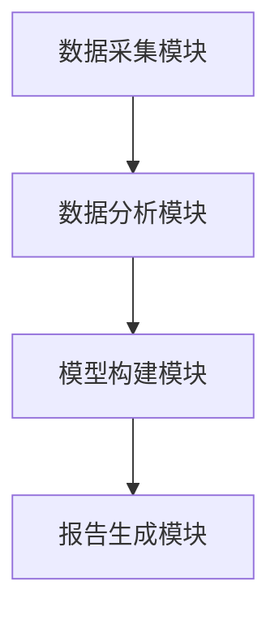
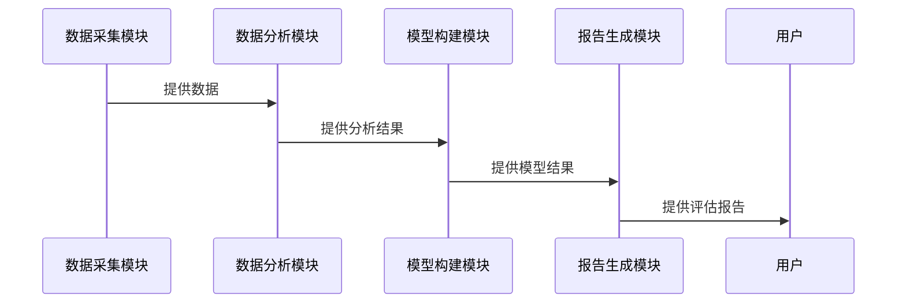

                 


# 价值投资中的行业转型机会

## 关键词：价值投资、行业转型、投资策略、企业转型、数学模型

## 摘要：价值投资是一种长期有效的投资策略，其核心在于选择那些具有长期竞争优势和良好管理的企业。在当前经济环境下，行业转型已成为企业发展的关键，价值投资者需要识别那些能够成功转型的企业，以获得超额收益。本文将探讨行业转型的机会，分析其在价值投资中的重要性，并提供相应的投资策略和数学模型，帮助投资者在转型中找到机会。

---

## 目录

1. [价值投资与行业转型的背景](#价值投资与行业转型的背景)
2. [行业分析与转型机会](#行业分析与转型机会)
3. [企业转型的驱动因素](#企业转型的驱动因素)
4. [价值投资策略与转型投资](#价值投资策略与转型投资)
5. [数学模型与数据分析](#数学模型与数据分析)
6. [系统分析与架构设计](#系统分析与架构设计)
7. [项目实战](#项目实战)
8. [最佳实践、小结、注意事项和拓展阅读](#最佳实践、小结、注意事项和拓展阅读)

---

## 第一部分: 价值投资与行业转型的背景

### 1.1 价值投资的基本概念

#### 1.1.1 价值投资的定义
价值投资是一种投资策略，强调以低于其内在价值的价格购买优质资产。其核心理念是寻找市场先生的错误定价，通过长期持有优质企业实现收益。

#### 1.1.2 价值投资的核心理念
- **安全边际**：买入价格远低于内在价值，以降低风险。
- **长期视角**：关注企业的长期竞争优势和盈利能力。
- **内在价值评估**：通过基本面分析估算企业的真实价值。

#### 1.1.3 价值投资与其它投资策略的区别
- **技术分析**：基于价格波动预测市场走向，属于短期交易策略。
- **成长投资**：侧重于高成长性企业的投资。
- **价值投资**：关注市场低估的企业，强调安全边际和长期价值。

### 1.2 行业转型的背景与重要性

#### 1.2.1 经济全球化与行业转型
- 全球化促进了跨行业整合，企业需要不断调整以适应全球市场。
- 技术进步和信息共享加速了行业转型的进程。

#### 1.2.2 技术进步对行业转型的影响
- 数字化转型推动了传统产业的升级。
- 人工智能和大数据技术的应用改变了行业的运作方式。

#### 1.2.3 市场需求变化推动行业转型
- 消费者需求的变化促使企业调整产品和服务。
- 新兴市场的崛起为企业提供了新的增长机会。

### 1.3 行业转型的成功案例分析

#### 1.3.1 传统行业转型的案例
- **制造业转型为智能制造**：通过自动化和智能化技术提高效率，降低成本。
- **零售业转型为电商**：线上销售模式改变了传统零售业态。

#### 1.3.2 高科技行业转型的案例
- **互联网企业转型为平台生态**：构建开放平台，吸引第三方开发者和用户。
- **人工智能企业转型为行业解决方案**：将技术应用于不同行业，提供定制化服务。

### 1.4 行业转型中的挑战与机遇

#### 1.4.1 行业转型中的主要挑战
- **技术瓶颈**：技术创新需要时间和资金投入。
- **市场竞争加剧**：新进入者可能导致价格战和利润下降。
- **人才与组织管理问题**：转型需要高素质人才和灵活的组织结构。

#### 1.4.2 行业转型中的主要机遇
- **新技术的应用**：如人工智能、大数据等技术为企业提供新可能。
- **新市场的开拓**：新兴市场和新客户群体为企业带来增长点。
- **新商业模式的创新**： subscription models 和共享经济等模式为企业创造新收入来源。

---

## 第二部分: 行业分析与转型机会

### 2.1 传统行业转型的潜力

#### 2.1.1 制造业的转型潜力
- **智能化生产**：通过工业4.0实现智能制造，提高效率和产品质量。
- **绿色制造**：减少资源消耗和环境污染，符合可持续发展的趋势。

#### 2.1.2 零售业的转型潜力
- **电商模式**：线上销售成为主流，改变传统的零售业态。
- **体验式零售**：通过增强客户体验，提高客户忠诚度和满意度。

### 2.2 高科技行业的转型机会

#### 2.2.1 信息技术行业的转型机会
- **云计算和大数据**：通过提供云服务和数据分析，为企业提供解决方案。
- **人工智能技术**：将AI技术应用于不同行业，如医疗、金融等，创造新的应用场景。

#### 2.2.2 医疗健康的转型机会
- **远程医疗**：通过互联网提供医疗服务，扩大医疗覆盖范围。
- **个性化医疗**：基于基因测序和大数据分析，提供个性化治疗方案。

### 2.3 行业转型中的风险与应对策略

#### 2.3.1 行业转型中的风险
- **技术风险**：技术创新失败可能导致企业陷入困境。
- **市场风险**：市场需求变化可能导致转型失败。
- **财务风险**：转型需要大量资金投入，可能导致财务压力。

#### 2.3.2 应对策略
- **技术创新**：加大研发投入，确保技术领先地位。
- **市场调研**：深入了解市场需求，制定切实可行的转型计划。
- **风险管理**：建立风险评估机制，制定应对措施。

---

## 第三部分: 企业转型的驱动因素

### 3.1 技术驱动

#### 3.1.1 技术进步对企业转型的推动
- **数字化转型**：企业通过数字化技术提高效率和竞争力。
- **人工智能的应用**：AI技术的应用改变了企业的运营方式和商业模式。

#### 3.1.2 技术驱动的行业案例
- **制造业**：通过智能化生产提高效率和产品质量。
- **金融行业**：通过大数据和AI技术提高风险控制和客户服务能力。

### 3.2 政策驱动

#### 3.2.1 政策对企业转型的影响
- **政府支持**：政府通过政策支持和资金投入推动企业转型。
- **行业标准的制定**：政府制定行业标准，促进技术创新和产业升级。

#### 3.2.2 政策驱动的行业案例
- **绿色能源**：政府通过政策支持推动绿色能源的发展。
- **数字化转型**：政府通过政策引导企业进行数字化转型。

### 3.3 市场需求驱动

#### 3.3.1 市场需求变化对企业转型的推动
- **消费者行为变化**：消费者需求的变化促使企业调整产品和服务。
- **新兴市场需求**：新兴市场为企业提供了新的增长机会。

#### 3.3.2 市场需求驱动的行业案例
- **互联网行业**：消费者对互联网服务的需求推动企业转型。
- **医疗健康行业**：消费者对健康和医疗服务的需求推动企业转型。

### 3.4 企业自身驱动

#### 3.4.1 企业内部管理的转型
- **组织结构调整**：企业通过组织结构调整提高效率和灵活性。
- **企业文化转型**：企业文化从传统管理向现代化管理转变。

#### 3.4.2 企业自身驱动的行业案例
- **技术创新**：企业通过技术创新保持竞争优势。
- **管理创新**：企业通过管理创新提高效率和员工满意度。

---

## 第四部分: 价值投资策略与转型投资

### 4.1 价值投资策略的核心要素

#### 4.1.1 投资目标的筛选
- **基本面分析**：通过分析企业的财务状况、盈利能力、管理团队等基本面因素筛选投资目标。
- **估值分析**：通过估值指标（如PE、PB等）判断企业是否被市场低估。

#### 4.1.2 投资组合的构建
- **分散投资**：通过分散投资降低风险。
- **长期持有**：价值投资强调长期持有，避免频繁交易。

### 4.2 转型投资的策略

#### 4.2.1 识别行业转型机会
- **行业分析**：通过分析行业发展趋势和市场前景，识别有转型潜力的行业。
- **企业分析**：通过分析企业的转型能力和竞争优势，识别有投资价值的企业。

#### 4.2.2 投资组合的调整
- **动态调整**：根据市场变化和企业转型进展，动态调整投资组合。
- **风险控制**：通过设定止损点和分散投资降低风险。

### 4.3 转型投资的风险与应对

#### 4.3.1 转型投资的风险
- **市场风险**：市场波动可能导致投资损失。
- **企业风险**：企业转型失败可能导致投资失败。
- **流动性风险**：转型投资可能需要较长时间，导致流动性不足。

#### 4.3.2 应对策略
- **风险分散**：通过分散投资降低风险。
- **风险评估**：定期评估投资风险，及时调整投资策略。
- **风险管理**：建立风险管理机制，制定应对措施。

---

## 第五部分: 数学模型与数据分析

### 5.1 行业转型潜力的评估模型

#### 5.1.1 数据收集与整理
- **行业数据**：收集行业的历史数据和未来预测数据。
- **企业数据**：收集企业的财务数据、管理数据和市场数据。

#### 5.1.2 数据分析方法
- **回归分析**：通过回归分析识别影响行业转型的主要因素。
- **聚类分析**：通过聚类分析将行业和企业进行分类，识别有潜力的转型机会。

#### 5.1.3 模型构建与验证
- **构建模型**：根据分析结果构建行业转型潜力评估模型。
- **模型验证**：通过历史数据验证模型的准确性和稳定性。

### 5.2 企业转型潜力的评估模型

#### 5.2.1 数据收集与整理
- **企业数据**：收集企业的财务数据、管理数据和市场数据。
- **行业数据**：收集行业的历史数据和未来预测数据。

#### 5.2.2 数据分析方法
- **回归分析**：通过回归分析识别影响企业转型的主要因素。
- **决策树分析**：通过决策树分析将企业转型的可能性进行分类。

#### 5.2.3 模型构建与验证
- **构建模型**：根据分析结果构建企业转型潜力评估模型。
- **模型验证**：通过历史数据验证模型的准确性和稳定性。

---

## 第六部分: 系统分析与架构设计

### 6.1 系统分析

#### 6.1.1 问题场景介绍
- **目标**：构建一个能够评估行业转型机会的系统。
- **范围**：涵盖多个行业的数据分析和企业评估。

#### 6.1.2 系统功能设计
- **数据采集**：从多个数据源采集行业和企业的数据。
- **数据分析**：对数据进行清洗、处理和分析。
- **模型构建**：根据分析结果构建行业转型潜力评估模型。
- **报告生成**：生成评估报告，指导投资决策。

#### 6.1.3 系统架构设计
- **模块化设计**：将系统划分为数据采集、数据分析、模型构建和报告生成四个模块。
- **接口设计**：定义各模块之间的接口，确保模块之间的数据交互和功能调用。

### 6.2 系统架构设计

#### 6.2.1 系统架构图


#### 6.2.2 系统交互图


---

## 第七部分: 项目实战

### 7.1 环境安装与配置

#### 7.1.1 安装Python
```bash
# 安装Python
sudo apt-get install python3
```

#### 7.1.2 安装必要的库
```bash
# 安装必要的库
pip install numpy pandas scikit-learn matplotlib
```

### 7.2 核心代码实现

#### 7.2.1 数据预处理
```python
import pandas as pd

# 读取数据
data = pd.read_csv('industry_data.csv')

# 数据清洗
data.dropna(inplace=True)
data = pd.get_dummies(data)
```

#### 7.2.2 特征工程
```python
from sklearn.preprocessing import StandardScaler

# 标准化处理
scaler = StandardScaler()
X_scaled = scaler.fit_transform(data.drop('target', axis=1))
```

#### 7.2.3 模型训练
```python
from sklearn.linear_model import LogisticRegression

# 训练模型
model = LogisticRegression()
model.fit(X_scaled, data['target'])
```

### 7.3 代码解读与分析

#### 7.3.1 数据预处理
- **读取数据**：从CSV文件中读取行业数据。
- **数据清洗**：删除缺失值，进行独热编码，将分类变量转换为哑变量。

#### 7.3.2 特征工程
- **标准化处理**：对连续型变量进行标准化处理，消除量纲影响。

#### 7.3.3 模型训练
- **逻辑回归模型**：用于分类问题，预测行业转型的潜力。

### 7.4 实际案例分析

#### 7.4.1 案例介绍
- **案例背景**：某制造企业计划进行智能制造转型。
- **数据来源**：企业财务数据、生产数据和市场数据。

#### 7.4.2 模型应用
```python
# 使用模型预测转型潜力
new_data = pd.DataFrame({'feature1': [value1], 'feature2': [value2], ...})
new_data = pd.get_dummies(new_data)
new_data_scaled = scaler.transform(new_data)
predicted_prob = model.predict_proba(new_data_scaled)
```

#### 7.4.3 结果解读
- **预测结果**：模型预测该企业的转型潜力较高，建议投资者进行投资。

### 7.5 项目小结

#### 7.5.1 项目总结
- **项目目标**：构建一个能够评估行业转型机会的系统。
- **项目成果**：开发了一个基于机器学习的行业转型潜力评估系统，能够帮助投资者识别有潜力的企业。

#### 7.5.2 项目经验
- **技术经验**：掌握了数据预处理、特征工程和模型训练的全过程。
- **业务经验**：深入了解了行业转型的背景和机会，能够将技术与业务结合。

---

## 第八部分: 最佳实践、小结、注意事项和拓展阅读

### 8.1 最佳实践

#### 8.1.1 投资者
- **长期视角**：关注企业的长期竞争优势，避免短期波动影响决策。
- **安全边际**：买入价格远低于内在价值，降低投资风险。

#### 8.1.2 企业
- **技术创新**：加大研发投入，保持技术领先地位。
- **组织调整**：通过组织结构调整提高效率和灵活性。

### 8.2 小结

- **总结全文**：本文系统地探讨了价值投资中的行业转型机会，分析了行业转型的背景、驱动因素和投资策略。
- **主要结论**：行业转型是企业发展的关键，价值投资者需要识别那些能够成功转型的企业，以获得超额收益。

### 8.3 注意事项

- **风险管理**：投资者需要关注市场风险、企业风险和流动性风险，制定有效的风险管理策略。
- **持续学习**：行业和市场环境不断变化，投资者需要持续学习，更新知识和策略。

### 8.4 拓展阅读

- **推荐书籍**
  - 《价值投资入门》：系统介绍价值投资的基本概念和方法。
  - 《行业分析与投资策略》：深入分析不同行业的特点和投资机会。
- **推荐文章**
  - 网站：Morningstar（晨星网），提供专业的投资分析和行业研究报告。
  - 博客：投资界，分享价值投资者的实战经验和策略分析。

---

## 作者

作者：AI天才研究院/AI Genius Institute & 禅与计算机程序设计艺术 /Zen And The Art of Computer Programming

---

以上是《价值投资中的行业转型机会》的完整目录和文章结构。通过系统分析和详细阐述，本文为投资者提供了从理论到实践的全面指导，帮助他们在行业转型中抓住投资机会，实现长期价值增长。

