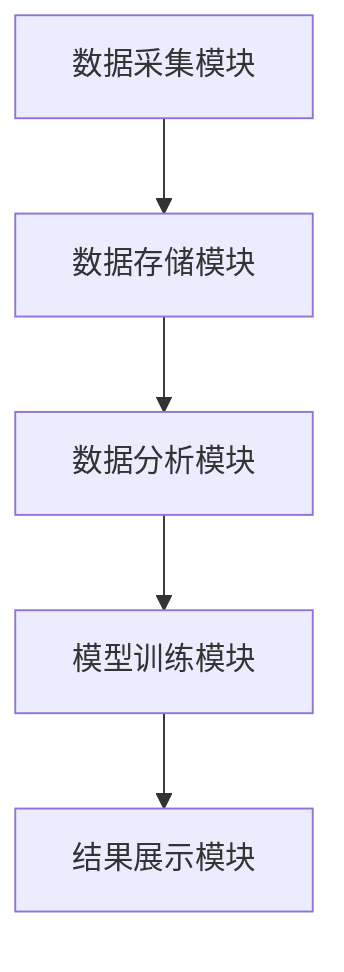
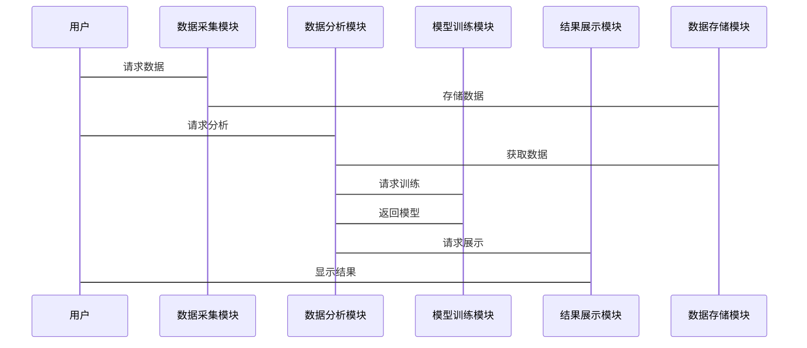

                 


# 价值投资中的行业领导者识别

> **关键词**: 价值投资, 行业领导者, 数据分析, 机器学习, 金融模型, 投资策略, 市场分析

> **摘要**: 本文系统地探讨了价值投资中识别行业领导者的关键方法。通过结合金融理论、数据分析和机器学习技术，本文提出了一个全面的行业领导者识别框架。文章首先介绍了价值投资的基本概念和行业领导者的特征，然后详细分析了行业分析和数据分析的方法，提出了基于数学模型的行业领导者识别算法。接着，文章从系统架构的角度，设计了一个完整的行业领导者识别系统，并通过实际案例展示了该系统的应用。最后，本文总结了识别行业领导者的关键要点，并提供了最佳实践建议。

---

# 第一部分: 价值投资中的行业领导者识别基础

## 第1章: 价值投资与行业领导者概述

### 1.1 价值投资的基本概念

#### 1.1.1 价值投资的定义
价值投资是一种以低于市场价值的价格买入优质资产的投资策略。其核心理念是通过深入分析企业的基本面，识别被市场低估的投资标的。

#### 1.1.2 价值投资的核心理念
- **安全边际**: 买入价格与内在价值的差距越大，投资的安全性越高。
- **长期视角**: 价值投资强调长期持有优质资产，而非短期交易。
- **基本面分析**: 通过财务报表、行业地位等指标评估企业的内在价值。

#### 1.1.3 价值投资与其它投资策略的区别
- **区别于趋势投资**: 价值投资不依赖于价格趋势，而是基于企业的内在价值。
- **区别于成长投资**: 价值投资更关注低估值，而成长投资更关注高增长。

### 1.2 行业领导者的定义与特征

#### 1.2.1 行业领导者的定义
行业领导者是指在某一行业中占据主导地位，具有最强市场竞争力的企业。

#### 1.2.2 行业领导者的核心特征
| 特征 | 描述 |
|------|------|
| 市场地位 | 高市场占有率，行业影响力强。 |
| 财务表现 | 净利润、ROE等指标优于行业平均水平。 |
| 创新能力 | 持续推出新产品或技术，保持竞争优势。 |
| 管理团队 | 高效且稳定的管理团队，战略清晰。 |

#### 1.2.3 行业领导者在价值投资中的重要性
- 行业领导者通常具有更强的抗风险能力和盈利能力。
- 在市场波动中，行业领导者往往表现出更强的稳定性。

### 1.3 价值投资中行业领导者识别的重要性

#### 1.3.1 行业领导者在投资组合中的作用
- 作为投资组合的核心资产，行业领导者能够提供稳定的收益。
- 在行业波动中，领导者具有更强的防御性。

#### 1.3.2 识别行业领导者对投资收益的影响
- 准确识别行业领导者可以显著提高投资收益。
- 通过避免投资于表现不佳的企业，降低组合风险。

#### 1.3.3 行业领导者识别的挑战与机遇
- **挑战**: 行业环境复杂，企业竞争激烈，识别难度大。
- **机遇**: 通过数据分析和模型优化，可以更高效地识别行业领导者。

---

## 第2章: 价值投资中的行业分析方法

### 2.1 行业分析的基本框架

#### 2.1.1 行业生命周期分析
- **导入期**: 市场需求不确定，竞争较小。
- **成长期**: 市场需求快速增长，企业竞争加剧。
- **成熟期**: 市场需求稳定，竞争格局稳定。
- **衰退期**: 市场需求下降，企业盈利能力减弱。

#### 2.1.2 行业竞争结构分析
- **波特五力模型**: 从供应商、买家、新进入者、替代品和行业内竞争五个方面分析行业竞争格局。

#### 2.1.3 行业财务指标分析
- **盈利能力**: 净利润增长率、ROE等。
- **成长能力**: 营收增长率、净利润增长率。
- **财务健康性**: 负债率、现金流状况。

### 2.2 行业领导者识别的指标体系

#### 2.2.1 市场占有率分析
- 计算方法: 市场占有率 = (企业销售额 / 行业总销售额) × 100%。
- 案例: 某科技公司在智能手机市场的占有率。

#### 2.2.2 财务表现分析
- 关键指标: 净利润、ROE、毛利率。
- 案例: 分析某企业的财务报表，评估其盈利能力。

#### 2.2.3 创新能力分析
- 创新投入: R&D支出占营收比例。
- 创新成果: 专利数量、新产品发布频率。

#### 2.2.4 管理团队分析
- 团队稳定性: 管理层变动频率。
- 战略规划: 公司未来发展方向。

---

## 第3章: 价值投资中的数据分析方法

### 3.1 数据收集与整理

#### 3.1.1 数据来源渠道
- **公开数据**: 企业财报、行业报告。
- **第三方数据**: 金融数据平台（如Wind、 Bloomberg）。
- **网络爬取**: 从公司官网或新闻网站获取数据。

#### 3.1.2 数据清洗与预处理
- 去除缺失值: 对数据进行填补或删除。
- 数据标准化: 将不同单位的数据统一化。

#### 3.1.3 数据特征提取
- **主成分分析**: 通过PCA提取关键特征。
- **特征选择**: 使用Lasso回归筛选重要特征。

### 3.2 数据分析与建模

#### 3.2.1 数据可视化分析
- **趋势分析**: 绘制营收和利润的折线图。
- **分布分析**: 绘制行业市场份额的饼图。

#### 3.2.2 统计分析与回归模型
- **线性回归**: 分析变量之间的关系。
- **聚类分析**: 将企业分为不同类别。

#### 3.2.3 机器学习算法在行业领导者识别中的应用
- **支持向量机(SVM)**: 用于分类问题。
- **随机森林**: 用于特征重要性分析。

---

## 第4章: 价值投资中的行业领导者识别模型

### 4.1 模型构建与优化

#### 4.1.1 特征选择与权重分配
- **特征选择**: 使用信息增益或Lasso回归选择关键特征。
- **权重分配**: 根据特征的重要性分配权重。

#### 4.1.2 模型训练与调优
- **训练数据**: 使用历史数据训练模型。
- **模型调优**: 通过网格搜索优化超参数。

#### 4.1.3 模型评估与验证
- **准确率**: 模型预测的准确率。
- **召回率**: 模型预测的召回率。

### 4.2 模型应用场景与案例分析

#### 4.2.1 不同行业的模型适用性
- **科技行业**: 技术创新速度快，模型需要频繁更新。
- **传统行业**: 行业变化缓慢，模型稳定性高。

#### 4.2.2 模型在实际投资中的应用案例
- 案例: 使用模型筛选出某行业的领导者，并验证其表现。

#### 4.2.3 模型的局限性与改进方向
- **局限性**: 数据质量和模型假设可能影响结果。
- **改进方向**: 引入实时数据，增强模型的动态适应能力。

---

## 第5章: 价值投资中的行业领导者识别系统架构

### 5.1 系统功能设计

#### 5.1.1 数据采集模块
- **功能**: 从多种数据源采集行业数据。
- **工具**: 使用Python的`requests`库或`BeautifulSoup`进行数据爬取。

#### 5.1.2 数据分析模块
- **功能**: 对采集的数据进行清洗、特征提取和建模。
- **工具**: 使用Pandas进行数据处理，使用Scikit-learn进行建模。

#### 5.1.3 模型训练模块
- **功能**: 使用训练好的模型对新数据进行预测。
- **工具**: 使用XGBoost或LightGBM进行模型训练。

#### 5.1.4 结果展示模块
- **功能**: 将模型预测结果以可视化形式展示。
- **工具**: 使用Matplotlib或Seaborn进行可视化。

### 5.2 系统架构设计

#### 5.2.1 系统架构图


#### 5.2.2 系统交互流程图


### 5.3 系统接口设计

#### 5.3.1 数据接口
- **输入接口**: 数据采集模块的输入接口。
- **输出接口**: 数据分析模块的输出接口。

#### 5.3.2 模型接口
- **输入接口**: 模型训练模块的输入接口。
- **输出接口**: 结果展示模块的输出接口。

---

## 第6章: 项目实战

### 6.1 项目背景与目标

#### 6.1.1 项目背景
- **目标**: 使用价值投资的方法，识别某行业的领导者。

#### 6.1.2 数据准备
- **数据来源**: 某行业的历史财务数据和市场数据。

#### 6.1.3 数据预处理
- **清洗数据**: 去除缺失值和异常值。
- **特征提取**: 提取关键的财务指标。

### 6.2 系统核心实现

#### 6.2.1 环境配置
- **Python版本**: Python 3.8及以上。
- **依赖库安装**: 使用pip安装numpy、pandas、scikit-learn等库。

#### 6.2.2 核心代码实现

```python
import pandas as pd
from sklearn.ensemble import RandomForestClassifier
from sklearn.metrics import accuracy_score

# 数据加载
data = pd.read_csv('industry_data.csv')

# 特征选择
features = ['revenue', 'profit', 'market_share']
target = 'is_leader'

X = data[features]
y = data[target]

# 模型训练
model = RandomForestClassifier()
model.fit(X, y)

# 模型预测
predictions = model.predict(X)
print(f'准确率: {accuracy_score(y, predictions)}')
```

#### 6.2.3 代码解读与分析
- **数据加载**: 使用pandas读取CSV文件。
- **特征选择**: 选择营收、利润和市场份额作为特征。
- **模型训练**: 使用随机森林分类器进行训练。
- **模型预测**: 对训练数据进行预测，并计算准确率。

### 6.3 实际案例分析

#### 6.3.1 案例背景
- **行业选择**: 选择科技行业。
- **数据收集**: 收集过去5年的财务数据。

#### 6.3.2 模型应用
- **模型应用**: 使用训练好的模型预测当前行业的领导者。

#### 6.3.3 结果分析
- **结果解读**: 分析模型预测的准确性，并验证其与实际市场表现的一致性。

### 6.4 项目小结

#### 6.4.1 项目总结
- **成功之处**: 成功识别了行业领导者。
- **不足之处**: 模型的准确率有待提高。

#### 6.4.2 经验与教训
- **经验**: 数据质量和特征选择对模型性能影响重大。
- **教训**: 需要引入更多的数据来源和模型优化方法。

---

## 第7章: 最佳实践与注意事项

### 7.1 最佳实践 tips

#### 7.1.1 数据质量控制
- 确保数据的完整性和准确性。

#### 7.1.2 模型优化
- 定期更新模型，适应市场变化。

### 7.2 小结

#### 7.2.1 核心要点总结
- 行业领导者识别的关键在于数据质量和模型优化。
- 价值投资需要结合长期视角和数据分析。

#### 7.2.2 注意事项
- 避免过度依赖单一模型。
- 定期复盘，评估模型表现。

### 7.3 拓展阅读

#### 7.3.1 推荐书籍
- 《投资学精要》
- 《机器学习实战》

#### 7.3.2 推荐博客与网站
- QuantInst Inc. 博客
- Towards Data Science

---

**作者**: AI天才研究院/AI Genius Institute & 禅与计算机程序设计艺术/Zen And The Art of Computer Programming

