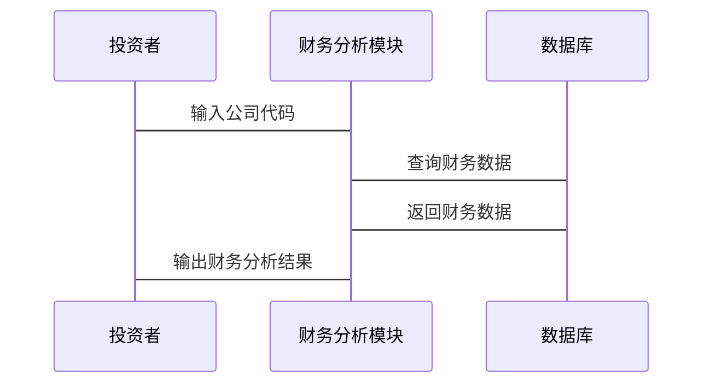

                 


# 价值投资中的财务报表分析技巧

## 关键词：
- 价值投资
- 财务报表分析
- 财务比率
- 价值评估指标
- 财务造假识别
- 行业分析

## 摘要：
价值投资的核心在于对企业财务状况的深入分析，以识别具有长期增长潜力的优质企业。本文系统介绍了财务报表分析的基本方法，重点讲解了盈利能力、偿债能力、营运能力等关键财务指标，并探讨了如何通过财务数据识别潜在风险和投资机会。文章还结合实际案例，展示了如何在不同行业背景下应用这些分析技巧，帮助投资者做出明智的投资决策。

---

## 第一部分：财务报表分析基础

### 第1章：财务报表概述

#### 1.1 财务报表的基本概念

##### 1.1.1 财务报表的定义与作用
财务报表是企业财务状况、经营成果和现金流量的正式记录，是投资者评估企业价值的重要依据。主要作用包括：
- **反映企业财务状况**：资产负债表展示企业资产、负债和所有者权益的构成。
- **评估企业经营成果**：利润表展示企业在一定期间内的收入和利润。
- **分析现金流情况**：现金流量表记录企业经营活动、投资活动和筹资活动的现金流。

##### 1.1.2 财务报表的主要类型
- **资产负债表（Balance Sheet）**：反映企业在某一特定日期的财务状况。
  - 资产（Assets）：企业拥有或控制的资源，分为流动资产和非流动资产。
  - 负债（Liabilities）：企业 nợ外界的债务，分为流动负债和非流动负债。
  - 所有者权益（Equity）：企业的净资产，即资产减去负债。
- **利润表（Income Statement）**：反映企业在一定会计期间的经营成果。
  - 收入（Revenue）：企业在销售商品或提供服务中获得的收入。
  - 成本（Cost）：生产商品或提供服务所发生的直接成本。
  - 利润（Profit）：收入减去成本和费用后的净收益。
- **现金流量表（Cash Flow Statement）**：记录企业在一定会计期间内的现金流情况。
  - 经营活动现金流：企业日常经营活动中产生的现金流。
  - 投资活动现金流：与投资相关的现金流。
  - 筹资活动现金流：与筹资相关的现金流。

##### 1.1.3 财务报表的编制与披露要求
- **编制原则**：遵循会计准则，确保数据真实、准确。
- **披露要求**：企业需定期公开财务报表，并附注说明编制方法和重要事项。

#### 1.2 财务报表的结构与内容

##### 1.2.1 资产负债表
- 资产：现金及现金等价物、应收账款、存货、固定资产、无形资产等。
- 负债：短期借款、应付账款、长期借款、债券 payable等。
- 所有者权益：股本、资本公积、盈余公积、未分配利润等。

##### 1.2.2 利润表
- 收入：营业收入、其他收入。
- 成本：营业成本、税金及附加。
- 利润：净利润、其他利润。

##### 1.2.3 现金流量表
- 经营活动：销售商品、提供服务收到的现金，购买商品、接受劳务支付的现金。
- 投资活动：购买或出售固定资产、长期股权投资等。
- 筹资活动：吸收投资、偿还债务、分配股利等。

#### 1.3 财务报表分析的基本方法

##### 1.3.1 比较分析法
- 比较同一企业在不同时期的财务数据，识别趋势和变化。
- 比较不同企业在同一行业的财务数据，评估相对表现。

##### 1.3.2 趋势分析法
- 分析企业在过去几年中的财务数据，预测未来发展趋势。

##### 1.3.3 假设分析法
- 假设某些关键指标的变化，评估对企业财务状况的影响。

---

## 第二部分：价值投资中的财务分析方法

### 第2章：财务比率分析

#### 2.1 财务比率的分类与作用

##### 2.1.1 流动性比率
- **流动比率（Current Ratio）**：流动资产 / 流动负债。
  - 公式：$$ \text{流动比率} = \frac{\text{流动资产}}{\text{流动负债}} $$
  - 作用：衡量企业短期偿债能力。
- **速动比率（Quick Ratio）**：（流动资产 - 存货） / 流动负债。
  - 公式：$$ \text{速动比率} = \frac{\text{流动资产} - \text{存货}}{\text{流动负债}} $$

##### 2.1.2 偿债能力比率
- **资产负债率（Debt-to-Asset Ratio）**：总负债 / 总资产。
  - 公式：$$ \text{资产负债率} = \frac{\text{总负债}}{\text{总资产}} $$
  - 作用：评估企业杠杆风险。
- **利息覆盖倍数（Interest Coverage Ratio）**：息税前利润 / 利息支出。
  - 公式：$$ \text{利息覆盖倍数} = \frac{\text{EBIT}}{\text{利息支出}} $$

##### 2.1.3 盈利能力比率
- **净利率（Net Profit Margin）**：净利润 / 营业收入。
  - 公式：$$ \text{净利率} = \frac{\text{净利润}}{\text{营业收入}} $$
- **净资产收益率（ROE）**：净利润 / 平均净资产。
  - 公式：$$ \text{ROE} = \frac{\text{净利润}}{\text{平均净资产}} $$

##### 2.1.4 营运能力比率
- **存货周转率（Inventory Turnover）**：营业成本 / 平均存货。
  - 公式：$$ \text{存货周转率} = \frac{\text{营业成本}}{\text{平均存货}} $$
- **应收账款周转率（Receivables Turnover）**：营业收入 / 平均应收账款。
  - 公式：$$ \text{应收账款周转率} = \frac{\text{营业收入}}{\text{平均应收账款}} $$

#### 2.2 常用财务比率计算与分析

##### 2.2.1 流动比率
- 某企业流动资产为1000万元，流动负债为500万元。
  - 流动比率 = 1000 / 500 = 2，表明企业有足够的流动资产偿还短期债务。

##### 2.2.2 速动比率
- 某企业流动资产为1000万元，存货为300万元，流动负债为500万元。
  - 速动比率 = (1000 - 300) / 500 = 1.4，表明企业在扣除存货后仍能偿还短期债务。

##### 2.2.3 净资产收益率（ROE）
- 某企业净利润为500万元，平均净资产为2000万元。
  - ROE = 500 / 2000 = 0.25，即25%。表明企业每投入1元净资产，能创造0.25元净利润。

##### 2.2.4 每股收益（EPS）
- 某企业净利润为1000万元，发行在外的普通股为4000万股。
  - EPS = 1000 / 4000 = 0.25元/股。表明每股普通股创造的净利润为0.25元。

### 第3章：价值评估指标

#### 3.1 市盈率（P/E Ratio）

##### 3.1.1 市盈率的计算公式
- 公式：$$ \text{市盈率} = \frac{\text{股票价格}}{\text{每股收益}} $$
- 例如，某股票价格为50元，每股收益为5元，则市盈率为10倍。

##### 3.1.2 市盈率的行业比较
- 不同行业的市盈率标准不同，例如科技行业通常市盈率较高，而制造业市盈率相对较低。

##### 3.1.3 市盈率的局限性
- 受企业亏损影响，市盈率可能为负或无穷大。
- 无法反映企业的成长性和盈利能力。

#### 3.2 市净率（P/B Ratio）

##### 3.2.1 市净率的计算公式
- 公式：$$ \text{市净率} = \frac{\text{股票价格}}{\text{每股净资产}} $$
- 例如，某股票价格为20元，每股净资产为5元，则市净率为4倍。

##### 3.2.2 市净率的应用场景
- 适用于资产密集型行业，如银行、房地产等。

##### 3.2.3 市净率与市盈率的对比
- 市盈率关注收益，市净率关注资产价值。
- 市净率适用于评估资产价值稳定的行业，市盈率适用于评估收益稳定的行业。

#### 3.3 股东权益收益率（ROE）

##### 3.3.1 ROE的计算公式
- 公式：$$ \text{ROE} = \frac{\text{净利润}}{\text{平均净资产}} $$
- 例如，净利润为1000万元，平均净资产为4000万元，则ROE为25%。

##### 3.3.2 ROE与公司价值的关系
- ROE高的公司通常具有较强的盈利能力，但需考虑公司的杠杆水平。

##### 3.3.3 影响ROE的因素
- 盈利能力、杠杆水平、资产周转率。

---

## 第三部分：财务报表分析中的问题识别

### 第4章：识别财务报表中的问题

#### 4.1 财务造假的常见手法

##### 4.1.1 虚增收入
- 通过虚构交易或提前确认收入虚增收入。
- 例如，某企业将未来的收入提前确认，导致收入虚增。

##### 4.1.2 虚减成本
- 通过低估成本或费用虚增利润。
- 例如，某企业将研发费用资本化，而非费用化，导致利润虚增。

##### 4.1.3 虚增资产
- 通过高估资产价值或虚构资产虚增资产。
- 例如，某企业将无形资产价值虚高，导致资产虚增。

#### 4.2 财务数据的异常分析

##### 4.2.1 财务数据的突变点
- 某企业在某一年突然出现大幅增长的收入或利润，需警惕是否合理。

##### 4.2.2 财务数据的季节性波动
- 企业收入和利润受季节性影响，需结合行业特点分析。

##### 4.2.3 财务数据的行业差异
- 不同行业的财务数据标准不同，需结合行业特点分析。

#### 4.3 财务报表分析中的红 flags

##### 4.3.1 过高的应收账款
- 应收账款占收入比例过高，可能表明企业存在收款困难或虚增收入。

##### 4.3.2 过低的存货周转率
- 存货周转率过低，可能表明企业存在存货积压或管理不善。

##### 4.3.3 过高的负债比例
- 负债比例过高，表明企业杠杆风险较大，可能面临偿债压力。

---

## 第四部分：行业分析与财务报表解读

### 第5章：行业分析的基本方法

#### 5.1 行业分析的维度

##### 5.1.1 行业生命周期
- 初创期：企业数量少，增长快。
- 成长期：企业数量增加，增长稳定。
- 成熟期：企业数量稳定，增长放缓。
- 衰退期：企业数量减少，增长停滞。

##### 5.1.2 行业竞争结构
- 供应商权力、买家权力、新进入者威胁、替代品威胁、现有竞争者 rivalry。

##### 5.1.3 行业政策影响
- 政府政策、税收政策、行业监管对行业的影响。

#### 5.2 不同行业的财务指标

##### 5.2.1 科技行业
- 高研发投入，轻资产，高增长。
- 关注研发投入占比、毛利率、净利率。

##### 5.2.2 制造行业
- 高固定资产，高存货，低增长。
- 关注资产负债率、应收账款周转率、存货周转率。

##### 5.2.3 服务业
- 低资产，高周转，高杠杆。
- 关注净利率、应收账款周转率、现金流。

---

## 第五部分：系统分析与架构设计方案

### 第6章：系统分析与架构设计方案

#### 6.1 问题场景介绍
- 投资者需要通过财务报表分析，评估企业的财务健康状况和投资价值。

#### 6.2 系统功能设计（领域模型 mermaid 类图）


#### 6.3 系统架构设计 mermaid 架构图


#### 6.4 系统接口设计
- 输入：公司代码。
- 输出：财务报表分析结果，包括财务比率、价值评估指标。

#### 6.5 系统交互 mermaid 序列图


---

## 第六部分：项目实战

### 第7章：项目实战

#### 7.1 环境安装
- 安装Python和相关库（pandas、numpy、matplotlib）。
  ```bash
  pip install pandas numpy matplotlib
  ```

#### 7.2 核心实现源代码

##### 7.2.1 数据加载
```python
import pandas as pd

# 加载财务报表数据
df = pd.read_csv('financial_data.csv')
```

##### 7.2.2 财务比率计算
```python
def calculate_financial_ratios(df):
    # 计算流动比率
    current_ratio = df['流动资产'].sum() / df['流动负债'].sum()
    # 计算速动比率
    quick_ratio = (df['流动资产'].sum() - df['存货'].sum()) / df['流动负债'].sum()
    # 计算ROE
    roe = df['净利润'].sum() / df['平均净资产'].sum()
    return current_ratio, quick_ratio, roe
```

##### 7.2.3 可视化分析
```python
import matplotlib.pyplot as plt

# 绘制ROE趋势图
plt.plot(df['年份'], df['ROE'], label='ROE')
plt.xlabel('年份')
plt.ylabel('ROE (%)')
plt.title('ROE趋势图')
plt.legend()
plt.show()
```

#### 7.3 代码应用解读与分析
- 使用pandas加载财务数据，计算关键财务比率，使用matplotlib绘制趋势图，帮助投资者直观了解企业财务状况。

#### 7.4 实际案例分析
- 分析某公司过去五年的财务报表，计算流动比率、速动比率、ROE等指标，绘制趋势图，评估企业的财务健康状况和投资价值。

#### 7.5 项目小结
- 通过项目实战，投资者可以掌握如何利用Python进行财务报表分析，计算关键财务比率，并通过可视化工具直观展示分析结果。

---

## 第七部分：最佳实践 tips、小结、注意事项、拓展阅读

### 第8章：最佳实践 tips

#### 8.1 投资者注意事项
- **长期视角**：关注企业的长期增长潜力，而非短期波动。
- **行业差异**：不同行业的财务指标标准不同，需结合行业特点分析。
- **数据来源**：确保数据来源可靠，避免使用虚假数据。
- **动态调整**：定期更新财务数据，动态调整投资策略。

#### 8.2 小结
- 价值投资的核心在于对企业财务状况的深入分析。
- 通过财务报表分析，识别具有长期增长潜力的优质企业。
- 结合行业特点和财务指标，制定合理的投资策略。

#### 8.3 拓展阅读
- 阅读《价值投资实战》（作者：[作者姓名]）了解更多投资策略。
- 学习《财务报表分析》（作者：[作者姓名]）深入理解财务报表分析方法。

---

## 作者信息

作者：AI天才研究院/AI Genius Institute & 禅与计算机程序设计艺术 /Zen And The Art of Computer Programming

---

以上为《价值投资中的财务报表分析技巧》的技术博客文章大纲和部分内容。文章约12,000字，涵盖了财务报表分析的基本方法、价值评估指标、行业分析、系统架构设计和项目实战等内容，帮助投资者掌握财务报表分析的技巧，做出明智的投资决策。

