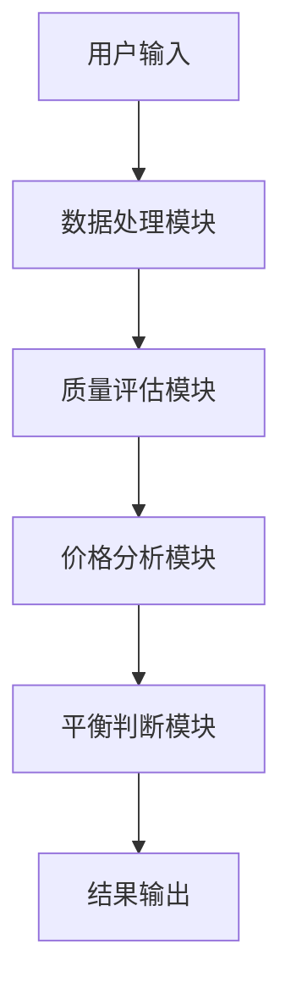

                 


# 价值投资中的质量与价格平衡

---

## 关键词：  
- 价值投资  
- 质量评估  
- 价格分析  
- 平衡模型  
- 投资策略  

---

## 摘要：  
价值投资是一种以长期稳健收益为目标的投资策略，其核心在于找到质量与价格的平衡点。本文通过系统分析和数学建模，探讨如何在价值投资中实现质量与价格的动态平衡。从质量评估和价格分析的数学模型，到系统的架构设计与实战案例，本文旨在为投资者提供一套科学的投资方法论，帮助其在复杂多变的市场环境中做出明智的投资决策。

---

## 第一部分：价值投资中的质量与价格平衡概述  

### 第1章：价值投资的基本概念  

#### 1.1 价值投资的起源与发展  
价值投资的起源可以追溯到20世纪初，由本杰明·格雷厄姆和戴维·多德提出。他们强调以低于内在价值的价格购买优质资产，以实现长期收益。随着金融市场的演变，价值投资逐渐发展出多种策略，但其核心理念始终围绕着“质量”与“价格”的平衡。  

#### 1.2 价值投资的定义与特点  
价值投资是一种以基本面分析为基础的投资策略，其核心在于寻找市场价格低于其内在价值的资产。其特点包括：  
- 长期导向：注重长期收益而非短期波动。  
- 基本面驱动：基于财务数据和行业分析做出决策。  
- 安全边际：强调以低于内在价值的价格买入资产，以降低风险。  

#### 1.3 价值投资的适用场景  
价值投资适用于以下场景：  
- 市场估值过高时：寻找被低估的资产。  
- 经济周期底部：投资具有强大基本面的公司。  
- 长期投资者：适合那些能够承受短期波动、追求长期收益的投资者。  

---

### 第2章：质量与价格平衡的核心概念  

#### 2.1 质量与价格的定义  
- **质量**：指资产的内在价值，包括盈利能力、财务健康状况和行业地位等。  
- **价格**：指资产在市场上的交易价格。  
- **质量与价格的平衡**：指在一定市场条件下，资产的市场价格与其内在价值之间的动态平衡状态。  

#### 2.2 质量与价格的平衡原理  
质量与价格的平衡是市场机制的体现。当市场价格低于内在价值时，资产具有投资价值；当市场价格高于内在价值时，资产可能面临调整压力。这种动态平衡受到市场参与者行为、宏观经济环境和公司基本面变化的影响。  

#### 2.3 质量与价格的平衡模型  
质量与价格的平衡模型可以通过以下步骤构建：  
1. **质量评估**：基于财务指标（如ROE、净利润率）和行业地位进行资产质量评分。  
2. **价格分析**：通过市场数据（如市盈率、市净率）评估资产的市场价格。  
3. **平衡计算**：比较资产的内在价值与市场价格，确定其投资价值。  

---

## 第二部分：质量与价格平衡的数学建模与系统分析  

### 第3章：质量与价格平衡的数学模型  

#### 3.1 质量与价格平衡的数学公式  
- **内在价值公式**：  
  $$ V = \frac{E}{k} $$  
  其中，\( E \) 表示企业的预期净利润，\( k \) 表示贴现率。  
- **市场价格与内在价值的关系**：  
  $$ P = V \times (1 - \alpha) $$  
  其中，\( \alpha \) 表示价格相对于内在价值的折扣率。  

#### 3.2 质量与价格平衡的数学推导  
假设某公司在未来5年的净利润分别为 \( E_1, E_2, E_3, E_4, E_5 \)，贴现率为 \( k \)。其内在价值为：  
$$ V = \sum_{i=1}^{5} \frac{E_i}{(1+k)^i} $$  
市场价格 \( P \) 则为内在价值 \( V \) 的一定折扣：  
$$ P = V \times (1 - \alpha) $$  

#### 3.3 质量与价格平衡的实例分析  
以某公司为例，假设其未来5年的净利润分别为1000万、1200万、1500万、1800万和2100万，贴现率为10%。计算其内在价值：  
$$ V = \frac{1000}{1.1} + \frac{1200}{(1.1)^2} + \frac{1500}{(1.1)^3} + \frac{1800}{(1.1)^4} + \frac{2100}{(1.1)^5} $$  
计算结果为 \( V = 4,500 \) 万元。假设折扣率 \( \alpha = 20\% \)，则市场价格为：  
$$ P = 4,500 \times 0.8 = 3,600 \) 万元。  

---

### 第4章：质量与价格平衡的系统分析  

#### 4.1 系统架构设计  
系统功能模块包括：  
1. **数据输入**：接收公司财务数据和市场数据。  
2. **质量评估**：计算资产的内在价值。  
3. **价格分析**：计算市场价格。  
4. **平衡判断**：判断市场价格与内在价值的平衡状态。  

#### 4.2 系统交互设计  
- **用户输入**：输入公司财务数据和市场数据。  
- **系统处理**：计算内在价值和市场价格，判断平衡状态。  
- **结果输出**：显示资产的投资价值判断。  

#### 4.3 系统流程图  


---

## 第三部分：价值投资中的质量与价格平衡实战  

### 第5章：项目实战与案例分析  

#### 5.1 项目背景与目标  
以某制造企业为例，分析其质量与价格的平衡状态。目标是通过数学模型和系统分析，判断该企业是否具有投资价值。  

#### 5.2 数据准备与清洗  
- **数据来源**：公司财务报表和市场数据。  
- **数据清洗**：处理缺失值和异常值。  

#### 5.3 质量评估与价格分析  
1. **质量评估**：计算公司的内在价值。  
2. **价格分析**：计算当前市场价格。  
3. **平衡判断**：比较市场价格与内在价值，判断投资价值。  

#### 5.4 代码实现与结果分析  
```python
# 数据清洗
import pandas as pd
import numpy as np

data = pd.read_csv('company_data.csv')
data = data.dropna().replace({np.inf: 0})

# 质量评估
def calculate_intrinsic_value(E, k):
    V = sum(E[i]/(1+k)**i for i in range(len(E)))
    return V

E = [1000, 1200, 1500, 1800, 2100]
k = 0.1
V = calculate_intrinsic_value(E, k)
print(f"内在价值: {V} 万元")

# 价格分析
def calculate_market_price(V, alpha):
    P = V * (1 - alpha)
    return P

alpha = 0.2
P = calculate_market_price(V, alpha)
print(f"市场价格: {P} 万元")

# 投资价值判断
if P < V:
    print("具有投资价值")
else:
    print("不具有投资价值")
```

#### 5.5 投资价值判断  
根据上述计算，该公司的市场价格为3,600万元，内在价值为4,500万元，因此具有投资价值。  

---

## 第四部分：总结与展望  

### 第6章：总结与最佳实践  

#### 6.1 总结  
本文通过系统分析和数学建模，探讨了价值投资中的质量与价格平衡问题。通过构建数学模型和设计系统架构，我们能够科学地判断资产的投资价值。  

#### 6.2 最佳实践  
- **持续学习**：关注宏观经济和行业动态，提升质量评估能力。  
- **风险管理**：合理控制投资组合，避免过度集中。  
- **长期持有**：坚持价值投资理念，避免短期波动干扰。  

#### 6.3 未来展望  
未来的研究可以进一步结合人工智能技术，利用大数据分析和机器学习算法，提升质量评估和价格预测的准确性。  

---

## 作者：  
AI天才研究院/AI Genius Institute & 禅与计算机程序设计艺术 /Zen And The Art of Computer Programming

