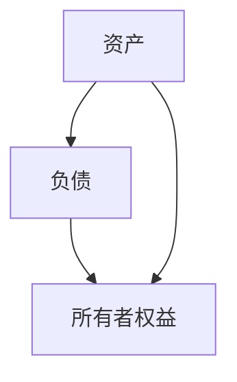
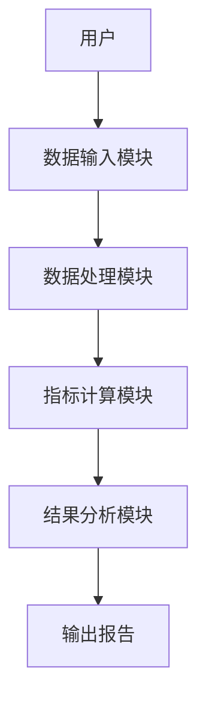

                 

# 价值投资中的资产负债表分析

> 关键词：价值投资、资产负债表、财务分析、投资策略、财务指标、企业估值

> 摘要：本文详细探讨了在价值投资中如何通过分析资产负债表来评估企业的财务健康状况和内在价值。文章从资产负债表的基本概念出发，逐步深入分析其核心要素、关键指标及其在投资决策中的应用，结合实际案例，帮助投资者掌握通过资产负债表进行价值投资的技巧。

---

## 第1章: 资产负债表概述

### 1.1 资产负债表的基本概念

#### 1.1.1 什么是资产负债表

资产负债表是企业财务报表的核心组成部分之一，反映了企业在某一特定时点的资产、负债和所有者权益的状况。它是企业财务健康状况的“晴雨表”，也是投资者评估企业价值的重要工具。

#### 1.1.2 资产负债表的构成要素

资产负债表主要由以下三个核心要素构成：

1. **资产（Assets）**：企业拥有的资源，能够为企业带来经济利益。资产包括流动资产（如现金、应收账款）和非流动资产（如固定资产、无形资产）。
2. **负债（Liabilities）**：企业需要偿还的债务，包括短期负债和长期负债。
3. **所有者权益（Owner's Equity）**：企业资产扣除负债后剩余的部分，代表所有者对企业的净权益。

#### 1.1.3 资产负债表的编制与披露要求

资产负债表的编制需要遵循会计准则，确保数据的真实性和一致性。企业在编制资产负债表时，必须确保：

- 资产和负债的分类清晰，便于分析。
- 数据准确无误，避免虚假或误导性信息。
- 披露充分，包括注释和解释，帮助读者更好地理解财务数据。

---

### 1.2 资产负债表在价值投资中的重要性

#### 1.2.1 资产负债表分析在投资决策中的作用

在价值投资中，资产负债表分析是评估企业内在价值的核心步骤。通过分析资产负债表，投资者可以：

- 评估企业的财务健康状况，判断其是否具有长期盈利能力。
- 识别企业的财务风险，避免投资高负债企业。
- 量化企业的资产结构，判断其是否具备竞争优势。

#### 1.2.2 资产负债表分析的基本方法

资产负债表分析的基本方法包括：

1. **横向比较分析**：将企业不同期间的资产负债表进行对比，观察其资产、负债和所有者权益的变化趋势。
2. **纵向比较分析**：将企业的资产负债表与其行业平均水平或竞争对手进行对比，评估其财务表现。
3. **比率分析法**：通过计算各项财务指标（如资产负债率、流动比率等），量化企业的财务健康状况。

#### 1.2.3 资产负债表分析的常见误区

许多投资者在分析资产负债表时容易陷入以下误区：

1. **只看表不看里**：忽视资产的质量，只关注资产的账面价值，而忽略了资产的实际变现能力。
2. **忽视负债结构**：只关注总负债规模，而忽略了负债的期限和偿债压力。
3. **过于依赖财务指标**：过度依赖财务指标，忽视企业的实际经营状况和市场环境。

---

### 1.3 资产负债表的核心要素解析

#### 1.3.1 资产的定义与分类

资产是企业拥有的资源，能够为企业带来经济利益。资产可以分为以下两类：

1. **流动资产**：可以在一年内变现或耗用的资产，包括现金、应收账款、存货等。
2. **非流动资产**：无法在一年内变现的资产，包括固定资产、无形资产、长期投资等。

#### 1.3.2 负债的定义与分类

负债是企业需要偿还的债务，包括以下两类：

1. **流动负债**：需要在一年内偿还的债务，包括应付账款、短期借款、应交税费等。
2. **非流动负债**：需要在一年以上偿还的债务，包括长期借款、应付债券等。

#### 1.3.3 所有者权益的定义与分类

所有者权益是企业资产扣除负债后剩余的部分，代表所有者对企业的净权益。它包括以下内容：

1. **实收资本**：所有者实际投入企业的资金。
2. **资本公积**：企业发行股票时超过面值的部分。
3. **盈余公积**：企业从净利润中提取的公积金。
4. **未分配利润**：企业尚未分配给所有者的利润。

---

### 1.4 本章小结

本章从资产负债表的基本概念出发，详细介绍了其构成要素、编制要求及其在价值投资中的重要性。通过分析资产负债表，投资者可以更好地理解企业的财务状况，从而做出更明智的投资决策。

---

## 第2章: 资产负债表的核心概念与联系

### 2.1 资产负债表的核心概念

#### 2.1.1 资产的流动性与收益性

资产的流动性是指资产转化为现金的能力，流动性越强，资产的变现能力越强。收益性是指资产为企业创造收益的能力，流动性高的资产通常收益性较低，反之亦然。

#### 2.1.2 负债的偿债能力与风险性

负债的偿债能力是指企业偿还债务的能力，通常通过流动比率、速动比率等指标来衡量。负债的风险性是指企业因无法偿还债务而面临破产的风险。

#### 2.1.3 所有者权益的稳定性与安全性

所有者权益的稳定性是指所有者权益在企业经营中不易被侵蚀的能力。安全性是指所有者权益在企业财务危机时能够得到保障的程度。

---

### 2.2 资产负债表的核心要素之间的关系

#### 2.2.1 资产与负债的关系

资产与负债是企业财务的两大主要部分。资产是企业拥有的资源，负债是企业需要偿还的债务。资产的增加通常伴随着负债的增加，反之亦然。

#### 2.2.2 负债与所有者权益的关系

负债与所有者权益是企业财务的另外两大主要部分。负债是企业的外部债务，所有者权益是所有者对企业净资产的要求权。负债的增加通常会减少所有者权益，反之亦然。

#### 2.2.3 资产与所有者权益的关系

资产与所有者权益是企业财务的两个侧面。资产是企业拥有的资源，所有者权益是所有者对企业净资产的要求权。资产的增加通常会增加所有者权益，反之亦然。

---

### 2.3 资产负债表的实体关系图

以下是资产负债表的实体关系图：

---

### 2.4 本章小结

本章详细分析了资产负债表的核心概念及其之间的关系。通过理解资产、负债和所有者权益之间的关系，投资者可以更好地理解企业的财务状况，并做出更明智的投资决策。

---

## 第3章: 资产负债表分析的数学模型与公式

### 3.1 资产负债表分析的关键指标

#### 3.1.1 资产负债率

资产负债率是衡量企业财务杠杆的重要指标，计算公式如下：

$$ \text{资产负债率} = \frac{\text{总负债}}{\text{总资产}} \times 100\% $$

#### 3.1.2 产权比率

产权比率是衡量企业所有者权益与负债的比例，计算公式如下：

$$ \text{产权比率} = \frac{\text{总负债}}{\text{所有者权益}} $$

#### 3.1.3 流动比率

流动比率是衡量企业短期偿债能力的重要指标，计算公式如下：

$$ \text{流动比率} = \frac{\text{流动资产}}{\text{流动负债}} $$

#### 3.1.4 速动比率

速动比率是衡量企业短期偿债能力的更严格的指标，计算公式如下：

$$ \text{速动比率} = \frac{\text{速动资产}}{\text{流动负债}} $$

---

### 3.2 资产负债表分析的数学公式

#### 3.2.1 资产负债率公式

$$ \text{资产负债率} = \frac{\text{总负债}}{\text{总资产}} \times 100\% $$

#### 3.2.2 产权比率公式

$$ \text{产权比率} = \frac{\text{总负债}}{\text{所有者权益}} $$

#### 3.2.3 流动比率公式

$$ \text{流动比率} = \frac{\text{流动资产}}{\text{流动负债}} $$

#### 3.2.4 速动比率公式

$$ \text{速动比率} = \frac{\text{速动资产}}{\text{流动负债}} $$

---

### 3.3 指标的实际应用与举例

#### 3.3.1 某公司资产负债表分析实例

假设某公司资产负债表如下：

| 项目          | 金额（万元） |
|---------------|--------------|
| 总资产        | 1000         |
| 总负债        | 400          |
| 所有者权益    | 600          |

根据上述公式，我们可以计算出以下指标：

1. 资产负债率 = (400 / 1000) × 100% = 40%
2. 产权比率 = 400 / 600 = 0.6667
3. 流动比率 = 流动资产 / 流动负债（假设流动资产为600万元，流动负债为200万元）
   - 流动比率 = 600 / 200 = 3
4. 速动比率 = 速动资产 / 流动负债（假设速动资产为400万元，流动负债为200万元）
   - 速动比率 = 400 / 200 = 2

---

### 3.4 本章小结

本章通过数学公式和实际案例，详细讲解了资产负债表分析的关键指标及其计算方法。通过这些指标，投资者可以更好地评估企业的财务健康状况，并做出更明智的投资决策。

---

## 第4章: 资产负债表分析的系统架构与设计方案

### 4.1 系统分析与架构设计

#### 4.1.1 问题场景介绍

在实际投资中，投资者需要分析大量的资产负债表数据，以评估企业的财务状况。为了提高效率，可以设计一个基于资产负债表分析的系统。

#### 4.1.2 系统功能设计

以下是资产负债表分析系统的功能设计：

---

### 4.2 系统架构设计

以下是系统的架构设计：

---

### 4.3 本章小结

本章通过系统架构设计，详细讲解了如何通过技术手段提高资产负债表分析的效率和准确性。通过设计一个基于资产负债表分析的系统，投资者可以更高效地评估企业的财务状况，并做出更明智的投资决策。

---

## 作者：AI天才研究院/AI Genius Institute & 禅与计算机程序设计艺术 /Zen And The Art of Computer Programming

---

这篇文章详细探讨了价值投资中资产负债表分析的核心概念、方法和实际应用。通过系统化的分析和丰富的案例，帮助投资者掌握通过资产负债表进行价值投资的技巧。希望本文能为投资者提供有价值的参考和启发。

