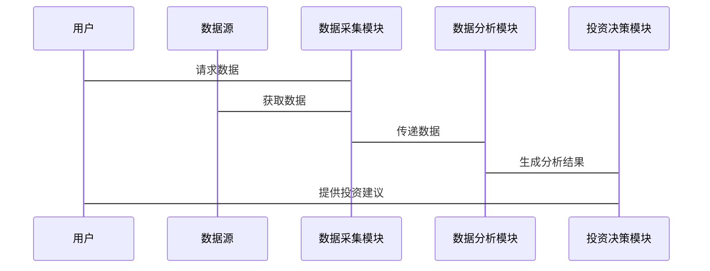

                 


# 价值投资中的超级计算机发展趋势

> 关键词：超级计算机，价值投资，投资分析，算法，机器学习，数据处理

> 摘要：超级计算机在价值投资中的应用越来越广泛，尤其是在数据处理和预测模型方面。本文将探讨超级计算机在价值投资中的发展趋势，分析其核心算法和系统架构设计，最后通过实际案例展示其在投资决策中的应用。

---

# 第1章: 超级计算机与价值投资的结合

## 1.1 超级计算机的基本概念

### 1.1.1 超级计算机的定义

超级计算机是指能够进行高速计算和处理海量数据的计算机系统。它通常具备极高的计算能力，能够处理复杂的任务，如科学计算、大数据分析和人工智能应用。

### 1.1.2 超级计算机的核心技术特点

- **高速计算能力**：超级计算机能够以极快的速度处理大量数据，适合需要实时反馈的应用场景。
- **并行计算**：通过多核处理器和分布式计算技术，超级计算机能够同时处理多个任务。
- **高内存容量**：超级计算机具备大内存容量，能够存储和处理海量数据。

### 1.1.3 超级计算机在金融领域的应用潜力

- **量化交易**：超级计算机能够快速计算交易策略，帮助投资者在毫秒级别完成交易。
- **风险管理**：通过超级计算机分析市场风险，投资者可以更好地控制投资组合。
- **数据挖掘**：超级计算机能够从海量数据中提取有价值的信息，帮助投资者发现市场趋势。

## 1.2 价值投资的基本原理

### 1.2.1 价值投资的定义

价值投资是一种投资策略，强调以低于其内在价值的价格购买优质资产。这种方法的核心是寻找市场低估的股票，长期持有，等待其价值回归。

### 1.2.2 价值投资的核心理念

- **基本面分析**：通过分析公司的财务状况、行业地位和竞争优势，评估其内在价值。
- **长期投资**：价值投资者通常持有资产较长时间，避免频繁交易。
- **安全边际**：以低于内在价值的价格买入资产，以降低投资风险。

### 1.2.3 价值投资与技术分析的区别

- **基本面分析 vs. 技术分析**：价值投资依赖于对公司基本面的分析，而技术分析则依赖于价格走势和成交量等技术指标。
- **长期 vs. 短期**：价值投资注重长期投资，技术分析则更关注短期价格波动。

## 1.3 超级计算机在价值投资中的应用背景

### 1.3.1 金融市场的数据爆炸

现代金融市场产生了海量的数据，包括股票价格、成交量、财务报表、新闻资讯等。这些数据的处理和分析需要强大的计算能力。

### 1.3.2 传统投资分析的局限性

传统的价值投资方法依赖于人工分析，耗时且效率低下。面对海量数据，人工分析难以捕捉所有信息，容易遗漏重要信号。

### 1.3.3 超级计算机在投资决策中的优势

- **高速计算能力**：超级计算机能够快速处理大量数据，提高投资决策的效率。
- **自动化分析**：通过超级计算机，投资者可以自动化地进行基本面分析和数据挖掘，发现潜在的投资机会。
- **实时反馈**：超级计算机能够实时分析市场动态，帮助投资者做出及时的交易决策。

## 1.4 本章小结

本章介绍了超级计算机的基本概念和其在金融领域的应用潜力，同时阐述了价值投资的核心理念和其与技术分析的区别。超级计算机的高速计算能力和自动化分析能力为价值投资提供了新的可能性。

---

# 第2章: 超级计算机在投资分析中的核心概念

## 2.1 数据处理与分析

### 2.1.1 数据清洗与预处理

在进行投资分析之前，需要对数据进行清洗和预处理，以确保数据的准确性和完整性。这包括去除重复数据、填补缺失值和处理异常值。

### 2.1.2 数据特征提取

通过超级计算机，可以从原始数据中提取有用的特征，例如股票的市盈率、市净率、ROE等财务指标，以及市场情绪指标。

### 2.1.3 数据可视化

利用数据可视化工具，投资者可以更直观地理解数据。例如，通过图表可以观察股票价格的趋势和波动情况。

## 2.2 投资预测模型

### 2.2.1 线性回归模型

线性回归是一种简单而有效的预测模型，适用于线性关系的数据。它可以用于预测股票价格的变化趋势。

### 2.2.2 时间序列分析模型

时间序列分析模型，如ARIMA，适用于分析股票价格的时序数据，帮助投资者预测未来的价格走势。

### 2.2.3 机器学习模型

机器学习模型，如随机森林和神经网络，能够从复杂的数据中发现非线性关系，提高预测的准确性。

## 2.3 超级计算机在投资决策中的优势

### 2.3.1 高速计算能力

超级计算机能够快速处理大量数据，提高投资决策的效率。

### 2.3.2 大数据处理能力

超级计算机能够处理海量数据，发现数据中的潜在规律和模式。

### 2.3.3 自动化交易能力

通过超级计算机，投资者可以实现自动化交易，快速响应市场变化。

## 2.4 本章小结

本章介绍了超级计算机在数据处理和投资预测中的应用，探讨了不同类型的预测模型及其优势。超级计算机的强大计算能力和自动化分析能力为投资决策提供了有力支持。

---

# 第3章: 超级计算机在价值投资中的算法原理

## 3.1 线性回归算法

### 3.1.1 线性回归的数学模型

线性回归的数学模型可以表示为：$$ y = \beta_0 + \beta_1 x + \epsilon $$

其中，$y$ 是目标变量，$x$ 是自变量，$\beta_0$ 和 $\beta_1$ 是回归系数，$\epsilon$ 是误差项。

### 3.1.2 最小二乘法的实现

通过最小二乘法，我们可以找到最佳的回归系数，使得预测值与实际值的平方差之和最小。

### 3.1.3 线性回归在投资预测中的应用

线性回归可以用于预测股票价格的变化趋势，例如预测未来的价格走势。

### 3.1.4 线性回归的Python代码实现

```python
import numpy as np
from sklearn.linear_model import LinearRegression

# 创建数据集
X = np.array([1, 2, 3, 4, 5]).reshape(-1, 1)
y = np.array([2, 4, 5, 4, 6])

# 训练模型
model = LinearRegression()
model.fit(X, y)

# 预测结果
print(model.predict([[6]]))
```

### 3.1.5 线性回归的优缺点

- **优点**：简单易懂，计算速度快。
- **缺点**：只能处理线性关系，对非线性关系的预测能力有限。

## 3.2 机器学习算法

### 3.2.1 神经网络的结构

神经网络由多个层组成，包括输入层、隐藏层和输出层。每一层都有多个神经元，通过权重和激活函数进行信息传递。

### 3.2.2 深度学习的基本原理

深度学习是一种机器学习技术，通过多层神经网络来学习数据的特征和模式。

### 3.2.3 长短期记忆网络（LSTM）在时间序列预测中的应用

LSTM是一种特殊的循环神经网络，适用于处理时间序列数据，能够捕捉长期依赖关系。

### 3.2.4 LSTM模型的Python代码实现

```python
import numpy as np
from keras.models import Sequential
from keras.layers import LSTM, Dense

# 创建数据集
X = np.random.randn(100, 1, 1)
y = np.random.randn(100, 1)

# 构建模型
model = Sequential()
model.add(LSTM(128, input_shape=(1, 1)))
model.add(Dense(1))

# 编译模型
model.compile(loss='mean_squared_error', optimizer='adam')

# 训练模型
model.fit(X, y, epochs=100, batch_size=32)

# 预测结果
print(model.predict(X[:1]))
```

### 3.2.5 LSTM的优缺点

- **优点**：能够捕捉长期依赖关系，适合处理时间序列数据。
- **缺点**：计算复杂度较高，需要大量计算资源。

## 3.3 本章小结

本章详细介绍了线性回归和LSTM两种算法的原理和实现方法，探讨了它们在投资预测中的应用。线性回归适用于简单的线性关系，而LSTM则适用于复杂的时间序列数据。

---

# 第4章: 投资分析系统的系统架构设计

## 4.1 系统功能设计

### 4.1.1 数据采集模块

数据采集模块负责从各种数据源获取数据，例如股票市场数据、财务报表和新闻资讯。

### 4.1.2 数据分析模块

数据分析模块负责对采集到的数据进行清洗、特征提取和建模分析。

### 4.1.3 投资决策模块

投资决策模块根据分析结果生成投资建议，指导投资者进行交易决策。

## 4.2 系统架构设计

### 4.2.1 分层架构设计

系统架构通常采用分层设计，包括数据层、业务逻辑层和表现层。

### 4.2.2 微服务架构设计

微服务架构将系统功能分解为多个独立的服务，每个服务负责特定的功能模块。

### 4.2.3 系统交互流程

系统交互流程包括数据采集、数据处理、模型训练和结果展示四个阶段。

## 4.3 系统接口设计

### 4.3.1 数据接口

数据接口用于与数据源进行交互，例如从股票交易所获取实时数据。

### 4.3.2 模型接口

模型接口用于与预测模型进行交互，例如调用神经网络模型进行预测。

### 4.3.3 用户接口

用户接口用于与最终用户进行交互，例如显示投资建议和交易结果。

## 4.4 系统交互流程图



## 4.5 本章小结

本章详细描述了投资分析系统的功能设计、架构设计和交互流程。系统架构设计为投资决策提供了高效的支持，确保了数据的准确性和分析的及时性。

---

# 第5章: 价值投资中的超级计算机项目实战

## 5.1 项目环境安装

### 5.1.1 安装Python和相关库

需要安装Python编程语言以及以下库：

- `numpy`
- `pandas`
- `scikit-learn`
- `keras`

安装命令如下：

```bash
pip install numpy pandas scikit-learn keras
```

## 5.2 系统核心实现源代码

### 5.2.1 数据采集模块

```python
import pandas as pd
import requests

# 从网站获取股票数据
def get_stock_data():
    url = "https://example.com/stock_data"
    response = requests.get(url)
    data = response.json()
    df = pd.DataFrame(data)
    return df
```

### 5.2.2 数据分析模块

```python
from sklearn.linear_model import LinearRegression

# 数据预处理
def preprocess_data(df):
    df.dropna(inplace=True)
    return df

# 训练线性回归模型
def train_model(X, y):
    model = LinearRegression()
    model.fit(X, y)
    return model

# 预测股票价格
def predict_price(model, X_new):
    return model.predict(X_new)
```

### 5.2.3 投资决策模块

```python
import numpy as np
from keras.models import Sequential
from keras.layers import LSTM, Dense

# 构建LSTM模型
def build_lstm_model(input_shape):
    model = Sequential()
    model.add(LSTM(128, input_shape=input_shape))
    model.add(Dense(1))
    model.compile(loss='mean_squared_error', optimizer='adam')
    return model

# 训练LSTM模型
def train_lstm_model(model, X, y):
    model.fit(X, y, epochs=100, batch_size=32)

# 预测股票价格
def predict_lstm_price(model, X_new):
    return model.predict(X_new)
```

## 5.3 项目实战案例分析

### 5.3.1 股票价格预测

假设我们有一个包含股票历史价格和相关财务指标的数据集，我们可以使用线性回归和LSTM模型进行预测。

### 5.3.2 模型训练与评估

通过训练数据集，我们可以评估模型的预测准确性。例如，线性回归模型的R²分数可以衡量其拟合优度。

### 5.3.3 投资决策

根据模型的预测结果，我们可以制定投资策略。例如，当预测股票价格上涨时，我们可以选择买入股票。

## 5.4 项目小结

本章通过实际案例展示了超级计算机在价值投资中的应用。通过数据采集、数据分析和模型训练，我们可以利用超级计算机进行股票价格预测和投资决策。

---

# 第6章: 总结与展望

## 6.1 本章总结

超级计算机在价值投资中的应用前景广阔。通过数据处理和预测模型，投资者可以更准确地评估资产价值，制定科学的投资策略。

## 6.2 未来发展趋势

随着技术的进步，超级计算机在价值投资中的应用将更加智能化和自动化。未来，我们可能会看到更多基于人工智能的投资决策系统。

## 6.3 最佳实践 tips

- **数据质量**：确保数据的准确性和完整性。
- **模型调优**：通过不断优化模型参数，提高预测的准确性。
- **风险管理**：合理控制投资风险，避免过度依赖模型预测。

## 6.4 注意事项

- **市场波动**：金融市场具有不确定性，模型预测仅供参考。
- **数据隐私**：确保数据的安全和隐私。

## 6.5 拓展阅读

- 《量化投资：机构是如何运作的》
- 《机器学习实战》
- 《深度学习入门：基于Python的CNN、RNN、GAN等基础算法原理与实现》

---

# 作者

作者：AI天才研究院/AI Genius Institute & 禅与计算机程序设计艺术 /Zen And The Art of Computer Programming

