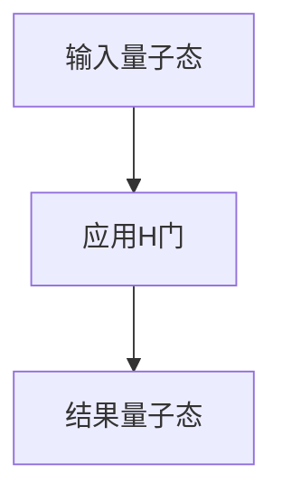
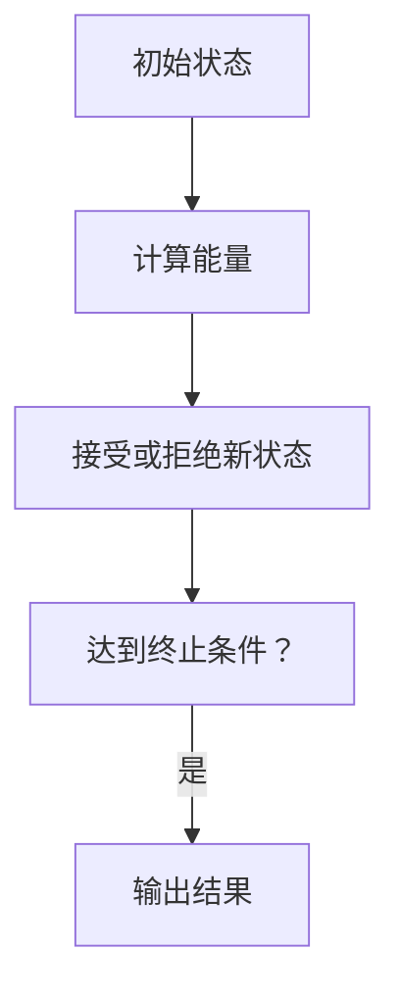

                 


# 价值投资中的量子计算商业化前景

> 关键词：量子计算，价值投资，金融应用，组合优化，风险管理，高频交易

> 摘要：量子计算作为一种革命性的技术，在金融领域的应用潜力巨大。本文探讨了量子计算如何与价值投资相结合，分析了其在金融中的核心算法与应用场景，并深入研究了其在价值投资中的商业化前景。通过实际案例分析，展示了量子计算在投资组合管理、风险管理、高频交易等领域的潜在价值。

---

## 第1章: 量子计算与价值投资的背景介绍

### 1.1 量子计算的基本概念

#### 1.1.1 量子计算的定义与基本原理

量子计算是一种基于量子力学原理的计算方式，与经典计算不同，它利用量子叠加和量子纠缠的特性进行信息处理。量子叠加允许量子比特同时处于多个状态，而量子纠缠则允许多个量子比特之间形成强关联。

数学表达式：
$$ | \psi \rangle = \alpha|0\rangle + \beta|1\rangle $$

其中，$\alpha$ 和 $\beta$ 是复数，满足 $|\alpha|^2 + |\beta|^2 = 1$。

#### 1.1.2 量子计算与经典计算的核心区别

经典计算基于二进制逻辑，每个比特只能是0或1。而量子计算使用量子比特（qubit），可以同时处于多个状态，并且可以通过量子纠缠实现并行计算。

### 1.2 价值投资的核心概念

#### 1.2.1 价值投资的定义与核心理念

价值投资是一种投资策略，旨在通过识别市场低估的资产，长期持有以实现超额收益。其核心理念是寻找具有安全边际的投资标的，注重基本面分析。

### 1.3 量子计算与价值投资的结合背景

#### 1.3.1 金融领域的计算需求与挑战

金融领域对高效计算的需求日益增长，尤其是在处理海量数据和复杂模型时。传统计算在处理这些问题时效率较低，而量子计算的并行处理能力可以显著提升计算效率。

---

## 第2章: 量子计算在金融中的核心算法与应用

### 2.1 量子计算的核心算法原理

#### 2.1.1 量子叠加与量子纠缠的数学模型

量子叠加：
$$ | \psi \rangle = \alpha|0\rangle + \beta|1\rangle $$

量子纠缠：
$$ |\psi\rangle = \frac{1}{\sqrt{2}}(|0\rangle|1\rangle + |1\rangle|0\rangle) $$

#### 2.1.2 量子门与量子电路的基本原理

量子门通过改变量子比特的状态来实现信息处理。常见的量子门包括Hadamard门、Pauli门和CNOT门。



### 2.2 量子计算在金融中的核心算法

#### 2.2.1 量子线性方程组求解

量子线性方程组求解算法用于解决稀疏线性系统：
$$ A|x\rangle = b $$

其中，$A$ 是稀疏矩阵，$x$ 是未知向量，$b$ 是已知向量。

#### 2.2.2 量子模拟退火算法

量子模拟退火算法通过模拟量子系统退磁过程来寻找全局最优解。



### 2.3 量子计算在金融中的应用实例

#### 2.3.1 量子组合优化

量子计算可以优化投资组合，降低风险和成本。

#### 2.3.2 量子风险管理

通过量子计算分析市场风险，评估投资组合的稳定性。

#### 2.3.3 量子高频交易

量子计算可以提高高频交易的执行速度和精度。

---

## 第3章: 量子计算在金融领域的商业化潜力

### 3.1 量子计算在金融领域的商业化现状

#### 3.1.1 当前量子计算在金融中的应用案例

目前，量子计算已经在金融建模、风险管理等领域取得了一定进展。

#### 3.1.2 量子计算在金融中的技术瓶颈

量子计算技术尚未成熟，面临稳定性、纠错能力等问题。

#### 3.1.3 量子计算在金融中的未来发展方向

未来，量子计算将与人工智能、大数据分析等技术深度融合。

### 3.2 价值投资中的量子计算商业化策略

#### 3.2.1 量子组合优化在投资组合管理中的应用

通过量子组合优化算法，优化投资组合的收益与风险比。

#### 3.2.2 量子风险管理在信用评估中的应用

利用量子计算提高信用评估的准确性和效率。

#### 3.2.3 量子高频交易在市场中的应用

量子计算可以显著提升高频交易的速度和效率。

---

## 第4章: 实际案例分析

### 4.1 案例一：量子组合优化在投资组合管理中的应用

通过量子组合优化算法，某投资机构优化了其投资组合，显著降低了风险。

### 4.2 案例二：量子风险管理在信用评估中的应用

通过量子风险管理模型，某银行提高了信用评估的准确性，降低了违约风险。

### 4.3 案例三：量子高频交易在市场中的应用

某高频交易公司利用量子计算技术，显著提升了交易速度和效率。

---

## 第5章: 结论与展望

### 5.1 结论

量子计算在价值投资中的潜力巨大，尤其是在投资组合优化、风险管理等领域。

### 5.2 未来展望

随着量子计算技术的进步，其在价值投资中的应用将更加广泛和深入，推动金融领域的创新与发展。

---

## 附录

### 附录A: 量子计算相关的数学公式

$$ | \psi \rangle = \alpha|0\rangle + \beta|1\rangle $$
$$ |\psi\rangle = \frac{1}{\sqrt{2}}(|0\rangle|1\rangle + |1\rangle|0\rangle) $$

### 附录B: 量子算法的代码示例

```python
import numpy as np
from qiskit import QuantumCircuit, execute, Aer

def quantum_helloworld():
    circuit = QuantumCircuit(2, 2)
    circuit.h(0)
    circuit.cx(0, 1)
    circuit.measure(0, 0)
    circuit.measure(1, 1)
    backend = Aer.get_backend('qasm_simulator')
    result = execute(circuit, backend).result()
    counts = result.get_counts()
    print(counts)

quantum_helloworld()
```

---

## 参考文献

1. Feynman, R. P. (1982). *Quantum Computing and Quantum Bits*.
2. Shor, P. W. (1994). *Algorithms for Quantum Computation: Discrete Logarithms and Factoring*.
3. Nielsen, M. A., & Chuang, I. L. (2000). *Quantum Computation and Quantum Information*.

---

作者：AI天才研究院 & 禅与计算机程序设计艺术

---

以上就是关于《价值投资中的量子计算商业化前景》的完整文章，涵盖了量子计算的基本原理、价值投资的核心概念、量子计算在金融中的核心算法与应用，以及实际案例分析。希望对您有所帮助！

