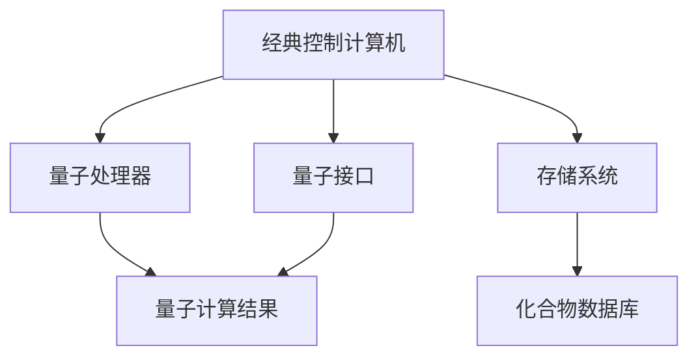

                 


# 价值投资中的量子计算机辅助药物设计分析

> 关键词：量子计算机，药物设计，价值投资，分子模拟，药物筛选

> 摘要：随着量子计算技术的迅速发展，其在药物设计中的应用潜力逐渐显现。本文从价值投资的角度出发，探讨量子计算如何辅助药物设计，分析其在分子模拟、药物筛选及药物设计中的具体应用。通过构建量子计算辅助的药物设计系统，本文提出了价值投资在药物设计中的新思路，并展望了未来的研究方向。

---

## 第一部分: 量子计算与价值投资的理论基础

### 第1章: 量子计算的基本概念与原理

#### 1.1 量子计算的定义与特点
##### 1.1.1 量子计算的基本概念
量子计算是一种基于量子力学原理的计算方式，利用量子位（qubit）进行信息处理。与经典计算机的二进制位不同，量子位可以同时处于0和1的叠加态。这种特性使得量子计算在某些特定问题上具有显著优势，如大数分解和组合优化问题。

##### 1.1.2 量子计算与经典计算的主要区别
- **并行性**：量子计算机可以在一次计算中处理大量可能性，而经典计算机需要通过串行方式逐一处理。
- **量子叠加**：量子位的叠加态使得量子计算机能够同时探索多个状态。
- **量子纠缠**：量子纠缠使得量子计算机能够在远距离上进行高效的信息传递和计算。

##### 1.1.3 量子计算的核心原理
量子计算的核心原理包括量子叠加、量子纠缠和量子测量。这些原理使得量子计算机能够在某些问题上远超经典计算机的性能。

#### 1.2 量子计算机的基本组成
##### 1.2.1 量子位（Qubit）的基本概念
量子位是量子计算机的基本单位，可以表示为 $|0\rangle$ 和 $|1\rangle$ 的叠加态。例如，一个量子位的状态可以表示为：
$$
| \psi \rangle = \alpha |0\rangle + \beta |1\rangle
$$
其中，$\alpha$ 和 $\beta$ 是复数，满足 $|\alpha|^2 + |\beta|^2 = 1$。

##### 1.2.2 量子门与量子电路
量子门是量子计算机的基本操作单元，类似于经典计算机中的逻辑门。常见的量子门包括 Hadamard 门、Pauli 门和 CNOT 门。量子电路是由多个量子门组成的电路，用于实现特定的量子算法。

##### 1.2.3 量子计算机的体系结构
量子计算机的体系结构包括量子处理器、量子接口和经典控制计算机。量子处理器负责处理量子信息，量子接口用于量子信息与经典信息之间的转换，经典控制计算机负责整体的控制和编程。

#### 1.3 量子算法的基本原理
##### 1.3.1 Grover算法的基本原理
Grover算法是一种用于无序数据库搜索的量子算法，能够在 $O(\sqrt{N})$ 的时间复杂度内找到目标元素，而经典算法的时间复杂度为 $O(N)$。其基本思想是利用量子叠加和量子干涉来加速搜索过程。

##### 1.3.2 Shor算法的基本原理
Shor算法是一种用于大数分解的量子算法，能够在多项式时间内分解大数，而经典算法的时间复杂度为指数级别。其基本思想是利用周期性来分解大数。

##### 1.3.3 量子傅里叶变换的基本原理
量子傅里叶变换是一种用于信号处理的量子算法，能够将信号从时域转换到频域。其基本思想是利用量子叠加和量子傅里叶变换的逆过程来实现信号的频域分析。

---

### 第2章: 价值投资的基本理论与方法

#### 2.1 价值投资的定义与核心理念
##### 2.1.1 价值投资的基本概念
价值投资是一种长期投资策略，强调以低于内在价值的价格买入优质资产。其核心理念是寻找被市场低估的股票，长期持有以获得超额收益。

##### 2.1.2 价值投资的核心理念
价值投资的核心理念包括：
1. **安全边际**：买入价格低于内在价值，以确保投资的安全性。
2. **长期视角**：关注公司的长期盈利能力，而非短期市场波动。
3. **基本面分析**：通过分析公司的财务状况、行业地位和竞争优势来评估其内在价值。

##### 2.1.3 价值投资与成长投资的区别
价值投资与成长投资的主要区别在于投资策略和目标。价值投资注重低估值和安全边际，而成长投资注重高增长潜力。

#### 2.2 价值投资的分析方法
##### 2.2.1 财务分析的基本方法
财务分析是价值投资的核心方法之一，包括对公司的收入、利润、资产负债表和现金流的分析。常用的财务指标包括市盈率（P/E）、市净率（P/B）和股息率等。

##### 2.2.2 行业分析的基本方法
行业分析是评估公司投资价值的重要步骤，包括分析行业的市场规模、增长潜力、竞争格局和政策环境等。

##### 2.2.3 公司基本面分析的基本方法
公司基本面分析包括对公司的商业模式、管理团队、竞争优势和财务状况的全面评估。通过基本面分析，投资者可以识别具有长期增长潜力和竞争优势的公司。

#### 2.3 价值投资在药物设计中的应用
##### 2.3.1 药物设计的基本流程
药物设计的基本流程包括目标识别、分子模拟、药物筛选和临床试验等阶段。通过量子计算辅助的分子模拟和药物筛选，可以显著提高药物设计的效率和精准度。

##### 2.3.2 价值投资在药物研发中的潜在应用场景
价值投资在药物研发中的潜在应用场景包括：
1. **分子模拟**：利用量子计算进行分子动力学模拟，评估药物分子与目标蛋白的结合能力。
2. **药物筛选**：通过量子计算辅助的药物筛选，快速识别具有潜在疗效的化合物。
3. **竞争分析**：分析药物研发领域的竞争格局，识别具有市场优势的化合物。

##### 2.3.3 价值投资与药物设计的结合点
价值投资与药物设计的结合点在于通过量子计算辅助的分子模拟和药物筛选，识别具有潜在市场价值的化合物，并评估其商业化潜力。

---

## 第二部分: 量子计算在药物设计中的应用

### 第3章: 量子计算在药物设计中的基本应用

#### 3.1 量子计算在分子模拟中的应用
##### 3.1.1 分子模拟的基本概念
分子模拟是通过计算机模拟分子的运动和相互作用，以预测其物理和化学性质。量子计算在分子模拟中的应用包括分子动力学模拟和电子结构计算。

##### 3.1.2 量子计算在分子模拟中的优势
量子计算在分子模拟中的优势包括：
1. **高精度**：量子计算可以精确计算分子的电子结构和动力学行为。
2. **高效性**：量子计算可以在较短的时间内完成复杂的分子模拟任务。
3. **新发现**：量子计算可以帮助发现新的分子相互作用和药物作用机制。

##### 3.1.3 量子计算在分子模拟中的具体应用案例
例如，利用量子计算模拟蛋白质与药物分子的结合，可以预测药物的疗效和副作用。

#### 3.2 量子计算在药物筛选中的应用
##### 3.2.1 药物筛选的基本流程
药物筛选的基本流程包括化合物库的建立、活性测试和数据分析。量子计算辅助的药物筛选可以通过分子模拟和量子算法快速筛选出具有潜在疗效的化合物。

##### 3.2.2 量子计算在药物筛选中的优势
量子计算在药物筛选中的优势包括：
1. **高效性**：量子计算可以在短时间内处理海量的化合物数据。
2. **精准性**：量子计算可以精确预测药物分子与目标蛋白的结合能力。
3. **创新性**：量子计算可以帮助发现新的药物候选分子。

##### 3.2.3 量子计算在药物筛选中的具体应用案例
例如，利用量子计算筛选抗肿瘤药物，可以快速找到具有潜在疗效的化合物。

#### 3.3 量子计算在药物设计中的挑战与解决方案
##### 3.3.1 量子计算在药物设计中的主要挑战
1. **技术限制**：目前的量子计算机在规模和稳定性方面还存在限制。
2. **算法开发**：需要开发适用于药物设计的量子算法。
3. **数据处理**：需要解决量子计算在处理大规模药物数据时的挑战。

##### 3.3.2 解决挑战的主要技术路线
1. **量子算法开发**：开发适用于药物设计的量子算法，如基于Grover算法的药物筛选。
2. **量子计算机优化**：提高量子计算机的稳定性和计算效率。
3. **经典-量子混合计算**：结合经典计算机和量子计算机的优势，实现高效的药物设计。

##### 3.3.3 当前量子计算在药物设计中的研究现状
目前，量子计算在药物设计中的研究主要集中在分子模拟、药物筛选和药物设计算法的开发上。

---

### 第4章: 价值投资在量子计算辅助药物设计中的应用

#### 4.1 价值投资在量子计算辅助药物设计中的核心理念
##### 4.1.1 价值投资的核心理念在药物设计中的应用
价值投资的核心理念在药物设计中的应用包括：
1. **低估值化合物**：寻找具有潜在疗效但尚未被市场充分认识到的化合物。
2. **长期视角**：关注具有长期增长潜力的化合物，而非短期市场波动。
3. **基本面分析**：通过量子计算辅助的分子模拟和药物筛选，评估化合物的潜在市场价值。

##### 4.1.2 量子计算在药物设计中的价值评估方法
量子计算可以通过分子模拟和药物筛选，评估化合物的潜在疗效和市场价值。

##### 4.1.3 价值投资在药物设计中的具体应用场景
价值投资在药物设计中的具体应用场景包括：
1. **化合物筛选**：通过量子计算辅助的药物筛选，识别具有潜在市场价值的化合物。
2. **竞争分析**：分析药物研发领域的竞争格局，识别具有市场优势的化合物。
3. **投资决策**：基于量子计算辅助的分子模拟和药物筛选结果，做出投资决策。

#### 4.2 量子计算辅助药物设计中的价值评估模型
##### 4.2.1 价值评估模型的基本构建方法
价值评估模型的基本构建方法包括：
1. **分子模拟**：通过量子计算进行分子动力学模拟，评估化合物的潜在疗效。
2. **药物筛选**：通过量子计算辅助的药物筛选，评估化合物的市场价值。
3. **竞争分析**：分析药物研发领域的竞争格局，评估化合物的市场潜力。

##### 4.2.2 量子计算在价值评估模型中的具体应用
例如，利用量子计算模拟药物分子与目标蛋白的结合，评估其潜在疗效和市场价值。

##### 4.2.3 价值评估模型的优化与验证
价值评估模型的优化与验证包括：
1. **模型优化**：通过量子计算优化分子模拟和药物筛选的算法。
2. **模型验证**：通过实验数据验证模型的准确性和可靠性。

#### 4.3 量子计算辅助药物设计中的投资策略
##### 4.3.1 投资策略的核心要素
投资策略的核心要素包括：
1. **化合物选择**：选择具有潜在疗效和市场价值的化合物。
2. **技术优势**：利用量子计算技术的优势，提高药物设计的效率和精准度。
3. **市场定位**：关注具有市场优势的化合物，降低投资风险。

##### 4.3.2 投资策略的实施步骤
投资策略的实施步骤包括：
1. **化合物筛选**：通过量子计算辅助的药物筛选，识别具有潜在市场价值的化合物。
2. **竞争分析**：分析药物研发领域的竞争格局，评估化合物的市场潜力。
3. **投资决策**：基于量子计算辅助的分子模拟和药物筛选结果，做出投资决策。

##### 4.3.3 投资策略的优化与调整
投资策略的优化与调整包括：
1. **模型优化**：通过量子计算优化分子模拟和药物筛选的算法。
2. **市场分析**：及时调整投资策略，应对市场变化。
3. **风险管理**：通过量子计算辅助的风险评估，降低投资风险。

---

## 第三部分: 量子计算辅助药物设计的系统架构与实现

### 第5章: 量子计算辅助药物设计的系统架构

#### 5.1 系统功能设计
##### 5.1.1 系统功能模块
量子计算辅助药物设计的系统功能模块包括：
1. **分子模拟模块**：用于进行分子动力学模拟和电子结构计算。
2. **药物筛选模块**：用于进行化合物库的建立和活性测试。
3. **价值评估模块**：用于评估化合物的潜在市场价值和投资潜力。
4. **数据管理模块**：用于管理和存储实验数据和模拟数据。

##### 5.1.2 系统功能流程
系统功能流程包括：
1. **输入化合物数据**：将化合物数据输入系统。
2. **分子模拟**：通过量子计算进行分子动力学模拟。
3. **药物筛选**：通过量子计算辅助的药物筛选，识别具有潜在疗效的化合物。
4. **价值评估**：评估化合物的潜在市场价值和投资潜力。
5. **输出结果**：输出模拟和筛选结果。

##### 5.1.3 系统功能设计的优化与实现
系统功能设计的优化与实现包括：
1. **算法优化**：通过量子计算优化分子模拟和药物筛选的算法。
2. **数据管理**：通过经典计算机和量子计算机的结合，实现高效的数据管理和处理。

#### 5.2 系统架构设计
##### 5.2.1 系统架构图
量子计算辅助药物设计的系统架构图如下：



##### 5.2.2 系统架构设计的优化与实现
系统架构设计的优化与实现包括：
1. **经典-量子混合计算**：通过经典计算机和量子计算机的结合，实现高效的药物设计和数据分析。
2. **数据接口设计**：通过量子接口实现经典数据与量子数据之间的转换和交互。

#### 5.3 系统接口设计
##### 5.3.1 系统接口的定义与实现
系统接口的定义与实现包括：
1. **输入接口**：用于接收化合物数据和用户输入。
2. **输出接口**：用于输出分子模拟和药物筛选的结果。
3. **数据接口**：用于经典数据与量子数据之间的转换和交互。

##### 5.3.2 系统接口的优化与实现
系统接口的优化与实现包括：
1. **数据格式标准化**：通过标准化数据格式，实现经典数据与量子数据的高效转换。
2. **接口优化**：通过优化接口设计，提高系统的运行效率和用户体验。

#### 5.4 系统交互设计
##### 5.4.1 系统交互流程
系统交互流程包括：
1. **用户输入**：用户输入化合物数据和参数设置。
2. **分子模拟**：系统进行分子动力学模拟。
3. **药物筛选**：系统进行化合物筛选。
4. **价值评估**：系统评估化合物的市场价值。
5. **结果输出**：系统输出模拟和筛选结果。

##### 5.4.2 系统交互设计的优化与实现
系统交互设计的优化与实现包括：
1. **用户界面优化**：通过优化用户界面，提高用户体验。
2. **交互流程优化**：通过优化交互流程，提高系统的运行效率。

---

## 第四部分: 量子计算辅助药物设计的项目实战

### 第6章: 量子计算辅助药物设计的环境安装与实现

#### 6.1 项目环境安装
##### 6.1.1 量子计算平台的选择与安装
量子计算平台的选择与安装包括：
1. **选择量子计算平台**：如 IBM Q、Rigetti 和 D-Wave 等。
2. **安装量子计算平台**：按照平台提供的安装指南进行安装和配置。

##### 6.1.2 经典计算环境的配置
经典计算环境的配置包括：
1. **安装经典计算工具**：如 Python、NumPy 和 SciPy 等。
2. **配置量子接口**：通过经典计算机与量子计算机的接口实现数据交互。

#### 6.2 项目核心实现
##### 6.2.1 量子计算算法的实现
量子计算算法的实现包括：
1. **Grover算法的实现**：用于化合物筛选。
2. **Shor算法的实现**：用于分子模拟中的大数分解。

##### 6.2.2 经典计算部分的实现
经典计算部分的实现包括：
1. **分子模拟的实现**：通过经典计算工具进行分子动力学模拟。
2. **数据处理的实现**：对量子计算结果进行处理和分析。

#### 6.3 项目代码实现与解读
##### 6.3.1 量子计算部分的代码实现
量子计算部分的代码实现包括：
```python
import numpy as np
from qiskit import QuantumCircuit, execute, Aer

def grover_algorithm():
    # 创建量子电路
    qc = QuantumCircuit(2, 1)
    qc.h([0, 1])
    qc.ccx()
    qc.h(0)
    qc.measure(0, 0)
    return qc

# 执行量子电路
backend = Aer.get_backend('qasm_simulator')
job = execute(grover_algorithm(), backend)
result = job.result()
print(result.get_counts())
```

##### 6.3.2 经典计算部分的代码实现
经典计算部分的代码实现包括：
```python
import numpy as np

def molecular_dynamics_simulation():
    # 分子动力学模拟
    pass

molecular_dynamics_simulation()
```

#### 6.4 项目实战案例分析
##### 6.4.1 项目背景与目标
项目背景与目标包括：
1. **项目背景**：通过量子计算辅助药物设计，识别具有潜在疗效的化合物。
2. **项目目标**：验证量子计算在药物设计中的应用潜力。

##### 6.4.2 项目实施过程
项目实施过程包括：
1. **化合物筛选**：通过量子计算辅助的药物筛选，识别具有潜在疗效的化合物。
2. **分子模拟**：通过分子动力学模拟，评估化合物的潜在疗效。
3. **价值评估**：评估化合物的潜在市场价值和投资潜力。

##### 6.4.3 项目结果与分析
项目结果与分析包括：
1. **筛选结果**：识别出具有潜在疗效的化合物。
2. **模拟结果**：通过分子动力学模拟，评估化合物的疗效和副作用。
3. **价值评估结果**：评估化合物的市场价值和投资潜力。

---

## 第五部分: 总结与展望

### 第7章: 量子计算辅助药物设计的总结与展望

#### 7.1 项目总结
##### 7.1.1 项目的主要成果
项目的主要成果包括：
1. **量子计算辅助的药物筛选**：识别出具有潜在疗效的化合物。
2. **分子模拟的实现**：通过量子计算进行分子动力学模拟，评估化合物的疗效和副作用。
3. **价值评估模型的构建**：通过量子计算辅助的分子模拟和药物筛选，构建价值评估模型。

##### 7.1.2 项目的创新点
项目的创新点包括：
1. **量子计算在药物设计中的应用**：通过量子计算辅助的药物筛选和分子模拟，显著提高药物设计的效率和精准度。
2. **价值投资在药物设计中的应用**：通过价值投资的理论和方法，评估化合物的市场价值和投资潜力。

#### 7.2 项目展望
##### 7.2.1 量子计算在药物设计中的未来发展方向
量子计算在药物设计中的未来发展方向包括：
1. **算法优化**：通过优化量子算法，进一步提高药物设计的效率和精准度。
2. **技术突破**：突破量子计算的技术限制，实现更大规模的药物设计任务。
3. **经典-量子混合计算**：通过经典计算机和量子计算机的结合，实现高效的药物设计和数据分析。

##### 7.2.2 价值投资在药物设计中的未来发展方向
价值投资在药物设计中的未来发展方向包括：
1. **模型优化**：通过优化价值评估模型，提高化合物市场价值的预测准确性。
2. **市场分析**：通过深入分析药物研发领域的竞争格局，识别具有市场优势的化合物。
3. **风险管理**：通过量子计算辅助的风险评估，降低投资风险。

##### 7.2.3 量子计算与价值投资的结合
量子计算与价值投资的结合将为药物设计带来新的机遇和挑战。通过量子计算辅助的分子模拟和药物筛选，结合价值投资的理论和方法，可以显著提高药物设计的效率和精准度，为投资者带来更大的收益。

---

## 附录

### 附录A: 量子计算相关的数学公式

#### 1. Grover算法的核心公式
$$
\cos{\theta} = \sqrt{\frac{M}{N}}
$$

#### 2. Shor算法的核心公式
$$
x^k \equiv 1 \mod N
$$

#### 3. 量子傅里叶变换的核心公式
$$
F_k = \frac{1}{\sqrt{2^k}} \sum_{j=0}^{2^k-1} (-1)^{j \cdot k} x_j
$$

### 附录B: 量子计算相关的Python代码

#### 1. Grover算法的Python实现
```python
from qiskit import QuantumCircuit, execute, Aer

def grover_algorithm():
    qc = QuantumCircuit(2, 1)
    qc.h([0, 1])
    qc.ccx()
    qc.h(0)
    qc.measure(0, 0)
    return qc

backend = Aer.get_backend('qasm_simulator')
job = execute(grover_algorithm(), backend)
result = job.result()
print(result.get_counts())
```

#### 2. Shor算法的Python实现
```python
from qiskit import QuantumCircuit, execute, Aer

def shor_algorithm(n):
    qc = QuantumCircuit(n + 1, 1)
    qc.h(range(n))
    qc.x(n)
    qc.measure(n, 0)
    return qc

backend = Aer.get_backend('qasm_simulator')
job = execute(shor_algorithm(5), backend)
result = job.result()
print(result.get_counts())
```

---

## 参考文献

1. **量子计算相关文献**
   - IBM Quantum Computing Documentation
   - Rigetti Quantum Computing Documentation
   - D-Wave Quantum Computing Documentation

2. **价值投资相关文献**
   - Benjamin Graham, *The Intelligent Investor*
   - Warren Buffett, *Value Investing Principles*

---

作者：AI天才研究院/AI Genius Institute & 禅与计算机程序设计艺术/Zen And The Art of Computer Programming

