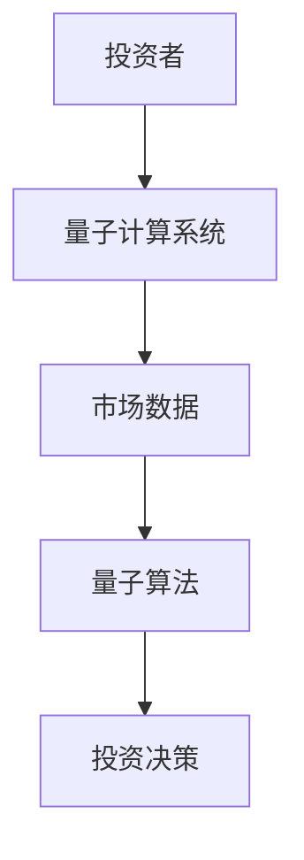
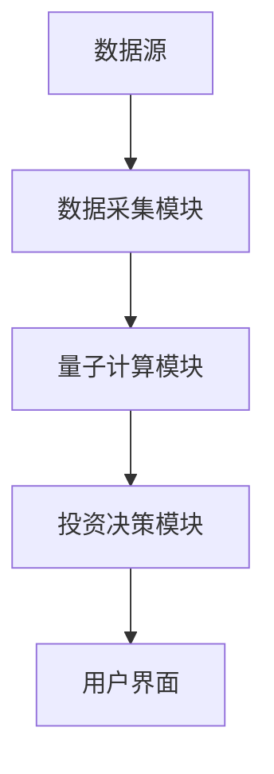
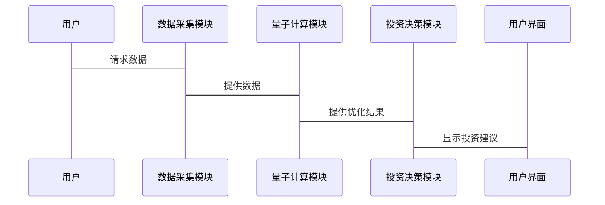

                 


# 价值投资中的量子计算潜力分析

> 关键词：量子计算，价值投资，金融分析，投资决策，量子算法

> 摘要：本文探讨量子计算在价值投资中的潜力，分析量子计算如何提升投资决策的准确性和效率，涵盖量子计算的基本原理、在投资中的应用，以及如何通过量子算法优化投资组合。

---

## 第1章: 价值投资与量子计算的背景介绍

### 1.1 价值投资的核心概念

#### 1.1.1 价值投资的定义与特点
价值投资是一种投资策略，通过分析公司的基本面，寻找市场价格低于其内在价值的股票。其特点包括长期导向、注重安全边际、关注公司质量等。

#### 1.1.2 价值投资的核心要素
- 公司基本面分析
- 市场价格与内在价值的差异
- 安全边际

#### 1.1.3 价值投资的边界与外延
价值投资不仅限于股票，还可应用于债券、房地产等领域，其外延包括成长型投资和价值发现型投资。

### 1.2 量子计算的基本原理

#### 1.2.1 量子计算的定义与特点
量子计算利用量子叠加和量子纠缠现象，能够在指数级时间内处理复杂问题。

#### 1.2.2 量子计算的核心要素
- 量子比特（qubit）
- 量子叠加
- 量子纠缠

#### 1.2.3 量子计算与经典计算的区别
- 并行计算能力
- 处理复杂问题的能力

### 1.3 价值投资与量子计算的结合点

#### 1.3.1 价值投资中的数据处理需求
- 处理海量数据
- 分析复杂市场动态

#### 1.3.2 量子计算在金融分析中的潜力
- 提高预测准确性
- 优化投资组合

#### 1.3.3 量子计算与价值投资的协同效应
- 加速决策过程
- 提升投资收益

### 1.4 本章小结
本章介绍了价值投资和量子计算的基本概念，探讨了它们的结合点和潜在协同效应。

---

## 第2章: 量子计算在价值投资中的核心概念与联系

### 2.1 量子计算的核心原理

#### 2.1.1 量子叠加与量子纠缠
- 量子叠加：状态可以同时存在于多个可能结果中。
- 量子纠缠：两个或多个量子比特的状态相互关联。

#### 2.1.2 量子门与量子电路
- 量子门：如Hadamard门、CNOT门。
- 量子电路：量子门的组合，用于执行量子算法。

#### 2.1.3 量子算法的基本框架
- 变量定义
- 算法步骤
- 结果输出

### 2.2 价值投资中的关键因素

#### 2.2.1 财务数据的分析与建模
- 收入、利润、现金流等财务指标
- 通过数学模型评估公司价值

#### 2.2.2 市场情绪与投资者行为
- 市场情绪波动
- 投资者决策模式

#### 2.2.3 行业趋势与宏观经济因素
- 行业发展周期
- 宏观经济指标如GDP、利率

### 2.3 量子计算与价值投资的实体关系图

#### 2.3.1 ER实体关系图架构
```mermaid
erd
actor 投资者
database 金融市场数据
object 量子计算系统
```

#### 2.3.2 量子计算与价值投资的流程图


### 2.4 本章小结
本章详细解释了量子计算的核心原理及其与价值投资的联系，通过实体关系图和流程图展示了它们的协同作用。

---

## 第3章: 量子计算在价值投资中的算法原理

### 3.1 量子算法的基本原理

#### 3.1.1 量子算法的核心思想
利用量子叠加和量子纠缠特性，通过并行计算提高处理效率。

#### 3.1.2 量子算法与经典算法的对比
- 并行能力
- 复杂度

#### 3.1.3 量子算法的数学基础
- 量子态表示
- 量子变换

### 3.2 量子优化算法的实现

#### 3.2.1 量子模拟退火算法
- 模拟退火：找到全局最优解
- 量子模拟退火：加速优化过程

#### 3.2.2 量子遗传算法
- 遗传算法：基于自然选择
- 量子遗传算法：结合量子计算特性

#### 3.2.3 量子粒子群算法
- 粒子群优化：基于群体智能
- 量子粒子群：利用量子叠加特性

### 3.3 量子计算在投资组合优化中的应用

#### 3.3.1 投资组合优化的数学模型
$$ \text{目标函数：} \min_w \frac{1}{2} w^T \Sigma w $$
$$ \text{约束条件：} r^T w = r_0 $$

#### 3.3.2 量子算法在投资组合优化中的实现
- 使用量子模拟退火算法优化投资组合
- 量子计算加速优化过程

#### 3.3.3 投资组合优化的案例分析
- 数据准备：收集市场数据
- 算法实现：应用量子模拟退火
- 结果分析：优化后的投资组合表现

### 3.4 本章小结
本章介绍了量子算法的基本原理，重点讲解了量子优化算法在投资组合优化中的应用，并通过案例分析展示了其实现过程。

---

## 第4章: 量子计算在价值投资中的数学模型与公式

### 4.1 量子概率的基本公式

#### 4.1.1 量子概率的定义
量子概率是量子系统中测量结果的概率，基于量子态的内积计算。

#### 4.1.2 量子概率的计算公式
$$ P(i) = | \langle i | \psi \rangle |^2 $$

#### 4.1.3 量子概率与经典概率的对比
- 经典概率是独立事件的概率，量子概率允许相关性。

### 4.2 量子优化的数学模型

#### 4.2.1 量子优化模型的构建
- 定义优化目标
- 建立量子态表示

#### 4.2.2 量子优化模型的求解
- 应用量子算法求解
- 转化为量子计算问题

#### 4.2.3 量子优化模型的实例分析
- 投资组合优化模型
- 通过量子计算求解最优解

### 4.3 本章小结
本章详细讲解了量子概率的基本公式和量子优化的数学模型，为后续应用奠定了理论基础。

---

## 第5章: 量子计算在价值投资中的系统分析与架构设计

### 5.1 问题场景介绍

#### 5.1.1 项目介绍
开发一个基于量子计算的金融分析系统，用于优化投资组合。

#### 5.1.2 系统功能设计
- 数据采集模块：收集市场数据
- 量子计算模块：执行量子算法
- 投资决策模块：生成投资建议

### 5.2 系统架构设计

#### 5.2.1 系统架构图


#### 5.2.2 系统接口设计
- 数据接口：与数据源交互
- 计算接口：量子计算模块的API

#### 5.2.3 系统交互流程图


### 5.3 本章小结
本章通过系统架构设计展示了如何将量子计算应用于金融分析，提供了系统的整体框架和交互流程。

---

## 第6章: 量子计算在价值投资中的项目实战

### 6.1 环境安装

#### 6.1.1 安装量子计算开发环境
- 使用Qiskit或其他量子计算库
- 安装Python和相关依赖

#### 6.1.2 数据源配置
- 数据接口开发
- 数据存储配置

### 6.2 系统核心实现源代码

#### 6.2.1 量子模拟退火算法实现
```python
from qiskit import QuantumCircuit, Aer, execute
from qiskit.optimization import QuadraticProgram

# 定义优化问题
qp = QuadraticProgram()
qp.minimize_linears([1, 2, 3])
qp.add_constraint(LinearConstraint([1, 1, 1], '>=', 3))

# 量子模拟退火求解
from qiskit.algorithms import SimulatedAnnealing
sa = SimulatedAnnealing()
result = sa.solve(qp)
print(result)
```

#### 6.2.2 数据处理与分析
- 数据清洗
- 数据建模

### 6.3 代码应用解读与分析

#### 6.3.1 量子模拟退火算法的代码解读
- 问题建模：定义优化目标和约束
- 算法执行：调用SimulatedAnnealing求解

#### 6.3.2 算法结果分析
- 解释量子算法输出结果
- 对比经典算法的效率

### 6.4 实际案例分析

#### 6.4.1 案例背景
- 某行业市场数据
- 投资目标：优化投资组合

#### 6.4.2 算法实现
- 应用量子模拟退火算法进行优化

#### 6.4.3 结果分析
- 优化后的投资组合表现
- 对比经典算法的结果

### 6.5 本章小结
本章通过实际项目展示了量子计算在价值投资中的应用，详细讲解了系统的实现过程和案例分析。

---

## 第7章: 总结与未来展望

### 7.1 总结
量子计算在价值投资中的潜力巨大，能够显著提升数据分析和投资决策的效率。

### 7.2 未来展望
- 量子计算技术的进一步发展
- 在更多金融领域的应用

### 7.3 注意事项
- 技术实现的复杂性
- 数据隐私和安全问题

### 7.4 拓展阅读
- 推荐相关书籍和论文

### 7.5 本章小结
本章总结了文章的主要内容，并展望了量子计算在价值投资中的未来发展方向。

---

## 作者：AI天才研究院/AI Genius Institute & 禅与计算机程序设计艺术 /Zen And The Art of Computer Programming

---

以上是《价值投资中的量子计算潜力分析》的完整目录和内容框架，涵盖了从背景介绍到实际应用的各个方面，确保读者能够全面理解量子计算在价值投资中的潜力和应用。

