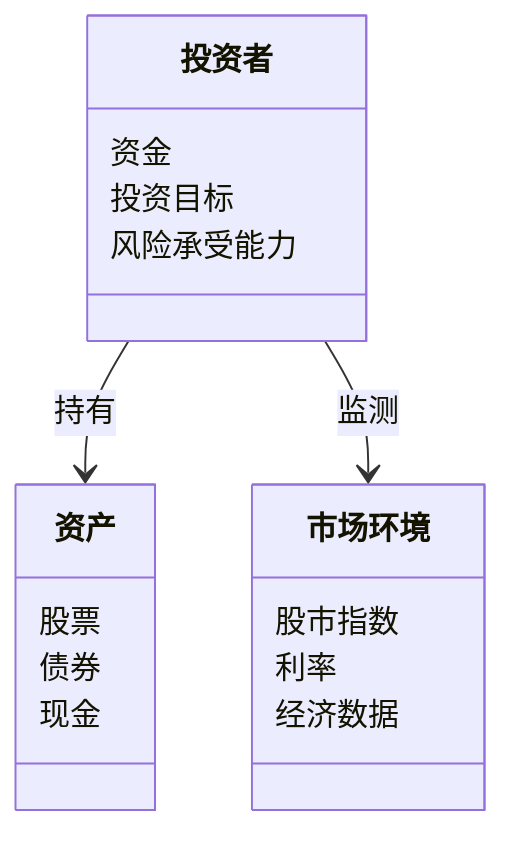
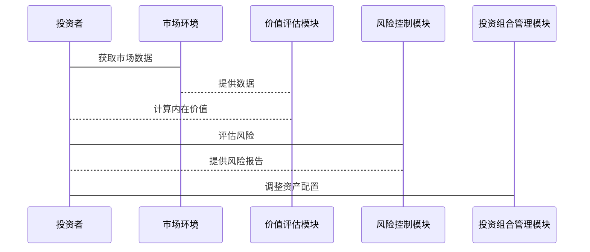

                 

<think>
嗯，我现在需要帮用户撰写一篇关于《价值投资中的长期主义思维》的技术博客文章。用户已经提供了详细的目录大纲，包括背景介绍、核心概念、算法原理、系统分析、项目实战、小结等部分。我的任务是按照这个大纲，一步一步地详细分析和撰写每部分内容。

首先，我得理解这本书的核心主题：价值投资和长期主义。价值投资是一种投资策略，强调以低于内在价值的价格购买优质资产，长期持有，获得收益。长期主义则强调在投资中保持耐心，避免短期波动的干扰，注重长期的价值积累。

接下来，我需要按照目录大纲逐步撰写每一章的内容，确保逻辑清晰，内容详尽。首先从背景介绍开始，解释价值投资和长期主义的基本概念，然后分析它们之间的关系。接下来，详细讨论核心概念，包括企业内在价值、财务指标分析、竞争优势等。之后，引入数学模型和算法，如贴现现金流模型，帮助读者理解如何计算内在价值。然后，从系统分析的角度，构建投资决策框架，包括风险控制和投资组合管理。接下来，通过实际案例分析，展示长期主义思维在投资中的应用，最后总结最佳实践和注意事项。

在撰写过程中，我要确保每一部分都有足够的细节和例子，帮助读者更好地理解和应用这些概念。同时，要注意使用适当的图表和公式，使内容更加直观。例如，在讨论贴现现金流模型时，我会提供详细的计算公式和实际案例，帮助读者理解如何应用这些模型。

我还需要确保文章结构清晰，每一章都有小结，总结本章的主要内容，帮助读者巩固所学的知识。同时，在结尾部分，我会给出一些实用的建议和注意事项，帮助读者在实际投资中避免常见错误，更好地应用长期主义思维。

总之，我需要系统地按照用户提供的大纲，逐步展开每一部分的内容，确保逻辑连贯，内容详实，帮助读者全面理解价值投资中的长期主义思维，并能够在实际投资中加以应用。
</think>

# 价值投资中的长期主义思维

## 关键词：价值投资，长期主义，投资策略，内在价值，风险管理

## 摘要：本文深入探讨了价值投资中的长期主义思维，分析了其核心概念、数学模型、系统架构及实际案例。通过详细讲解贴现现金流模型、投资决策框架等，结合实际案例，揭示长期主义如何帮助投资者在复杂市场中实现稳健收益。

---

# 第一部分: 价值投资与长期主义的背景与核心概念

## 第1章: 价值投资与长期主义的概述

### 1.1 价值投资的基本概念

#### 1.1.1 价值投资的定义
价值投资是一种以低于内在价值的价格购买优质资产的投资策略，强调长期持有，等待价值回归。

#### 1.1.2 价值投资的核心理念
- 市场先生理论：市场短期波动，但长期趋向反映内在价值。
- 安全边际：买入价格远低于内在价值，以降低风险。

#### 1.1.3 价值投资的历史发展
起源于格雷厄姆和多德的理论，后被巴菲特发扬光大，强调安全边际和长期持有。

### 1.2 长期主义的内涵

#### 1.2.1 长期主义的定义
长期主义是一种思维方式，强调在决策中优先考虑长期价值，而非短期利益。

#### 1.2.2 长期主义的核心特征
- 耐心：愿意等待，追求长期稳定的收益。
- 深思熟虑：注重长期目标，而非短期波动。
- 系统性：构建长期可持续的决策框架。

#### 1.2.3 长期主义与短期行为的对比
短期行为注重快速收益，忽视风险；长期主义注重稳健增长，注重价值积累。

### 1.3 价值投资与长期主义的关系

#### 1.3.1 价值投资中的长期主义思维
价值投资天然需要长期视角，长期主义为价值投资提供了思维方式。

#### 1.3.2 长期主义对价值投资的促进作用
通过长期视角，投资者能够更好地识别和持有优质资产，避免短期波动干扰。

#### 1.3.3 长期主义与价值投资的结合
长期主义是价值投资的灵魂，指导投资者在市场波动中保持耐心和纪律。

## 1.4 本章小结
本章介绍了价值投资和长期主义的基本概念，分析了它们的关系，强调了长期主义在价值投资中的重要性。

---

## 第2章: 价值投资与长期主义的核心概念

### 2.1 价值投资的核心要素

#### 2.1.1 企业内在价值的定义
企业内在价值是未来现金流的现值，反映企业的实际价值。

#### 2.1.2 财务指标分析
关键指标包括ROE、ROA、毛利率、净利率等，帮助评估企业盈利能力。

#### 2.1.3 行业分析与竞争优势
分析行业前景，识别企业的竞争优势，如成本优势、品牌优势等。

### 2.2 长期主义的核心要素

#### 2.2.1 时间价值的体现
长期持有优质资产，利用复利效应，实现财富稳步增长。

#### 2.2.2 风险控制与长期收益
通过分散投资、风险控制，降低短期波动对长期收益的影响。

#### 2.2.3 长期投资策略的制定
制定明确的长期目标，避免短期情绪干扰，保持投资纪律。

### 2.3 价值投资与长期主义的联系

#### 2.3.1 长期主义如何影响价值投资决策
长期视角帮助投资者忽略短期波动，专注于企业长期价值。

#### 2.3.2 价值投资如何体现长期主义思维
通过长期持有和持续复利，实现财富的长期增长。

#### 2.3.3 长期主义与价值投资的协同效应
长期主义为价值投资提供了思维方式，价值投资为长期主义提供了实现路径。

## 2.4 本章小结
本章详细分析了价值投资和长期主义的核心要素，揭示了它们之间的协同效应。

---

## 第3章: 价值投资中的长期主义思维

### 3.1 长期主义思维的培养

#### 3.1.1 长期思维的定义与特征
长期思维注重长远目标，忽视短期干扰，保持战略定力。

#### 3.1.2 长期思维的培养方法
通过阅读、学习、实践，形成长期视角，避免短期诱惑。

#### 3.1.3 长期思维与投资决策的关系
长期思维帮助投资者做出理性决策，避免情绪化交易。

### 3.2 价值投资中的长期视角

#### 3.2.1 长期视角在价值投资中的重要性
通过长期视角，识别和持有优质资产，实现价值回归。

#### 3.2.2 长期视角对投资策略的影响
制定长期投资计划，分散投资，降低短期波动风险。

#### 3.2.3 长期视角与投资风险的平衡
通过风险控制和分散投资，平衡长期收益与短期风险。

### 3.3 长期主义与价值投资的结合

#### 3.3.1 长期主义在价值投资中的应用
通过长期持有优质资产，利用复利效应，实现财富增长。

#### 3.3.2 长期投资策略的制定与执行
制定明确的长期目标，严格执行投资纪律，避免短期干扰。

#### 3.3.3 长期投资中的耐心与坚持
保持耐心，避免频繁交易，坚持长期价值导向。

## 3.4 本章小结
本章探讨了长期主义思维的培养和应用，强调了耐心和纪律在投资中的重要性。

---

## 第4章: 价值投资中的长期主义思维的数学模型与公式

### 4.1 价值投资中的数学模型

#### 4.1.1 贴现现金流模型

##### 贴现现金流模型公式
$$
V = \sum_{t=1}^{n} \frac{CF_t}{(1 + r)^t}
$$
其中，$V$ 是内在价值，$CF_t$ 是第 $t$ 年的现金流，$r$ 是折现率。

##### 贴现现金流模型的应用
通过计算企业未来现金流的现值，评估其内在价值，决定是否买入。

#### 4.1.2 市盈率与市净率分析

##### 市盈率公式
$$
\text{市盈率} = \frac{\text{股价}}{\text{每股收益}}
$$
##### 市净率公式
$$
\text{市净率} = \frac{\text{股价}}{\text{每股净资产}}
$$
通过市盈率和市净率，判断股票是否被低估。

#### 4.1.3 内在价值计算公式
$$
\text{内在价值} = \sum_{t=1}^{n} \frac{\text{自由现金流}_t}{(1 + r)^t}
$$
通过内在价值与市场价比较，决定投资决策。

### 4.2 长期主义与数学模型的结合

#### 4.2.1 长期视角下的贴现率选择
长期投资者通常采用较低的贴现率，反映长期资金的机会成本。

#### 4.2.2 长期投资中的复利计算
$$
\text{终值} = P \times (1 + r)^n
$$
复利效应是长期投资收益的关键因素。

#### 4.2.3 风险调整后的长期收益模型
通过历史数据分析，计算长期风险调整后的收益，指导投资决策。

## 4.3 本章小结
本章通过数学模型分析了价值投资中的长期主义思维，揭示了内在价值计算和复利效应的重要性。

---

## 第5章: 价值投资中的长期主义思维的系统分析

### 5.1 问题场景介绍

#### 5.1.1 投资者面临的挑战
- 短期波动干扰
- 短期诱惑影响决策
- 风险控制不足

### 5.2 系统功能设计

#### 5.2.1 领域模型（Mermaid 类图）


#### 5.2.2 系统架构设计（Mermaid 架构图）


#### 5.2.3 系统接口设计
- 价值评估模块：接收企业财务数据，输出内在价值。
- 风险控制模块：监控市场风险，调整投资组合。
- 投资组合管理模块：根据长期目标，优化资产配置。

### 5.3 系统交互（Mermaid 序列图）


## 5.4 本章小结
本章从系统角度分析了长期主义思维在投资中的应用，强调了系统化决策的重要性。

---

## 第6章: 价值投资中的长期主义思维的项目实战

### 6.1 环境安装

#### 6.1.1 投资工具准备
- 数据分析工具：Excel、Python
- 投资信息获取：通过财经网站获取历史数据

### 6.2 核心实现源代码

#### 6.2.1 内在价值计算代码
```python
def calculate_intrinsic_value(free_cash_flows, discount_rate):
    intrinsic_value = 0
    for t in range(len(free_cash_flows)):
        cash_flow = free_cash_flows[t]
        intrinsic_value += cash_flow / (1 + discount_rate) ** t
    return intrinsic_value
```

#### 6.2.2 长期收益模拟代码
```python
def simulate_long_term_returns(initial_investment, annual_return, years):
    return initial_investment * (1 + annual_return) ** years
```

### 6.3 实际案例分析

#### 6.3.1 案例选择
以苹果公司为例，分析其长期投资价值。

#### 6.3.2 财务数据分析
分析苹果的盈利能力、ROE、毛利率等指标。

#### 6.3.3 估值与投资决策
计算苹果的内在价值，对比市场价格，决定是否买入。

### 6.4 项目小结
通过实际案例分析，展示了长期主义思维在投资中的应用，强调了系统化分析的重要性。

---

## 第7章: 价值投资中的长期主义思维的最佳实践

### 7.1 最佳实践 tips

#### 7.1.1 长期视角的重要性
保持耐心，避免短期波动干扰。

#### 7.1.2 风险管理的必要性
通过分散投资和风险控制，降低投资风险。

#### 7.1.3 系统化决策的必要性
制定投资计划，保持纪律性。

### 7.2 小结

#### 7.2.1 长期主义的重要性
长期主义是价值投资的核心，指导投资者在复杂市场中保持定力。

#### 7.2.2 价值投资与长期主义的结合
通过长期视角和系统化分析，实现稳健投资收益。

### 7.3 注意事项

#### 7.3.1 避免过度乐观
长期投资需要理性判断，避免过度自信。

#### 7.3.2 风险控制的重要性
即使长期投资，也需要定期评估和调整投资组合。

### 7.4 拓展阅读

#### 7.4.1 推荐书籍
- 《证券分析》——格雷厄姆
- 《巴菲特致股东的信》——巴菲特
- 《投资学原理》——F·莫尼格

## 7.5 本章小结
本章总结了长期主义思维的最佳实践，提供了投资建议和注意事项。

---

## 作者：AI天才研究院/AI Genius Institute & 禅与计算机程序设计艺术 /Zen And The Art of Computer Programming

---

通过以上详细分析和实际案例，本文深入探讨了价值投资中的长期主义思维，揭示了其数学模型、系统架构和实际应用。希望读者能够通过本文，更好地理解长期主义的重要性，并在投资实践中加以应用。

