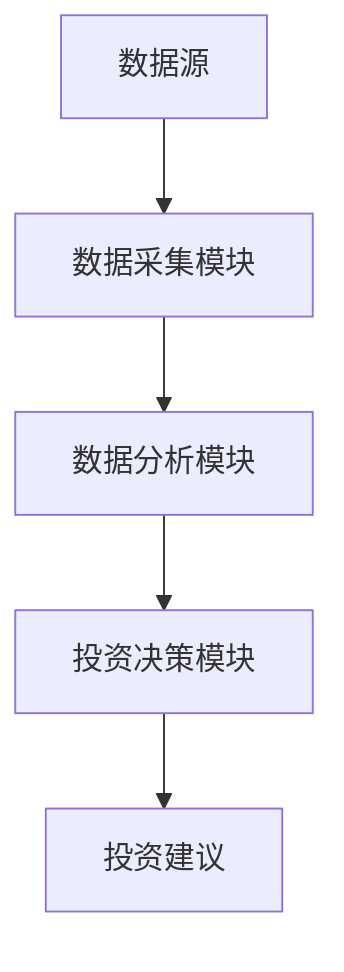

                 

<think>
嗯，我现在需要帮用户撰写一篇关于《价值投资中的颠覆性创新识别》的技术博客文章。用户希望我以一位世界级人工智能专家和CTO的身份，用逻辑清晰、结构紧凑的专业技术语言，一步一步地分析和推理，撰写一篇有深度的文章。

首先，我需要理解用户的需求。用户希望文章的标题是《价值投资中的颠覆性创新识别》，关键词包括价值投资、颠覆性创新、技术分析、投资决策、创新识别、AI驱动。摘要需要概述文章的核心内容，即如何通过技术手段识别颠覆性创新，并将其应用于价值投资中。

接下来，我需要按照用户提供的目录结构来撰写文章。第一部分是价值投资与颠覆性创新的背景与基础，包括两章。第一章介绍颠覆性创新的基本概念，第二章探讨颠覆性创新与价值投资的结合。第二部分是颠覆性创新的识别方法与模型，包括三章，分别讨论识别模型、识别算法与数学模型，以及系统架构与投资决策支持系统设计。

在撰写过程中，我需要确保每个章节都包含背景介绍、核心概念与联系、算法原理讲解、数学公式使用、系统分析与架构设计、项目实战以及最佳实践等部分。每个部分都需要详细展开，使用mermaid流程图、latex公式和Python代码示例来增强内容的技术性和可读性。

同时，我需要确保文章结构合理，逻辑清晰，每一部分内容丰富且详细，满足用户的字数要求。最后，文章末尾需要加上作者信息，即“作者：AI天才研究院 & 禅与计算机程序设计艺术”。

在写作过程中，我会先从第一章开始，介绍颠覆性创新的基本概念，确保读者能够理解相关术语和背景。然后逐步深入，结合价值投资的基本原理，探讨两者的契合点。接下来，我会详细讲解识别模型和算法，使用mermaid图表和Python代码来展示技术细节。最后，我会讨论系统架构设计，结合实际案例进行分析，总结最佳实践和注意事项。

整个思考过程中，我需要确保内容不仅专业，还要易于理解，避免过于复杂的术语，同时提供足够的深度和见解，帮助读者在价值投资中识别颠覆性创新。这不仅满足了用户的需求，也确保了文章的高质量和实用性。
</think>

# 价值投资中的颠覆性创新识别

> 关键词：价值投资、颠覆性创新、技术分析、投资决策、创新识别、AI驱动

> 摘要：本文探讨了在价值投资中识别颠覆性创新的关键方法和技术。通过结合技术分析、系统架构设计和AI驱动的算法，文章详细分析了如何利用颠覆性创新的特征和模式，构建有效的投资决策支持系统，以帮助投资者在快速变化的市场中发现潜在的高价值投资机会。

---

## 第一部分：价值投资与颠覆性创新的背景与基础

### 第1章：颠覆性创新的基本概念

#### 1.1 颠覆性创新的定义与特征

颠覆性创新是指一种新的技术、商业模式或产品，能够从根本上改变现有的市场格局或行业规则。与持续性创新不同，颠覆性创新往往以更低的成本、更高的效率或全新的用户体验，打破传统市场的平衡。

- **定义**：颠覆性创新通过引入新的技术或商业模式，创造了一个新的市场空间，使得原有的市场参与者难以竞争。
- **特征**：
  - 技术驱动：颠覆性创新通常依赖于某项核心技术或技术组合。
  - 市场破坏性：颠覆性创新往往以更低的价格或更高的效率，吸引了新的客户群体。
  - 长期价值：颠覆性创新能够在长期创造更大的市场价值。

#### 1.2 价值投资的基本原理

价值投资是一种投资策略，强调以低于内在价值的价格购买优质的资产。其核心理念是寻找被市场低估的企业，长期持有，等待其价值回归。

- **定义**：价值投资通过分析企业的基本面（如财务状况、盈利能力、行业地位等），寻找具有长期竞争优势的企业。
- **核心理念**：
  - 质量优先：选择财务健康、管理优秀的企业。
  - 价格敏感：以合理或低估的价格买入。
  - 长期持有：避免频繁交易，减少交易成本。

---

### 第2章：颠覆性创新与价值投资的结合

#### 2.1 颠覆性创新与价值投资的契合点

颠覆性创新与价值投资的结合在于，颠覆性创新往往能够为投资者创造超越市场平均水平的回报。通过识别具有颠覆性潜力的企业，投资者可以在早期阶段介入，享受其快速成长带来的收益。

- **商业模式契合**：颠覆性创新通常以更低的成本或更高的效率满足客户需求，这与价值投资追求长期竞争优势的理念一致。
- **市场潜力契合**：颠覆性创新往往能够打开新的市场空间，为投资者创造更大的价值。

#### 2.2 颠覆性创新的识别标准

识别颠覆性创新的关键在于分析企业的技术门槛、市场可行性以及长期价值。

- **技术门槛**：企业是否掌握核心技术或技术组合，能够形成竞争优势。
- **市场可行性**：创新是否能够快速进入市场，并获得足够的市场份额。
- **长期价值**：创新是否能够为企业带来持续的盈利能力，并推动股价长期增长。

---

## 第二部分：颠覆性创新的识别方法与模型

### 第3章：颠覆性创新的识别模型

#### 3.1 颠覆性创新的生命周期模型

颠覆性创新的生命周期可以分为萌芽阶段、成长阶段和成熟阶段。

- **萌芽阶段**：颠覆性创新的早期阶段，通常由小企业或新兴技术驱动。
- **成长阶段**：创新开始进入市场，逐步扩大市场份额。
- **成熟阶段**：创新成为市场主流，相关企业进入稳定增长期。

#### 3.2 颠覆性创新的评价指标

- **技术创新性指标**：企业的研发投入占比、专利数量。
- **市场影响力指标**：市场份额增长率、客户满意度。
- **财务可行性指标**：利润率、ROE（净资产收益率）。

---

### 第4章：颠覆性创新的识别算法与数学模型

#### 4.1 颠覆性创新识别的算法原理

- **机器学习模型**：基于历史数据，预测颠覆性创新的可能性。
- **时间序列分析模型**：分析企业的财务数据，预测其未来表现。
- **文本挖掘模型**：通过分析企业的新闻、财报等文本数据，识别创新信号。

#### 4.2 数学模型与公式

- **时间序列分析模型（ARIMA）**：
  $$ ARIMA(p, d, q) $$
  其中，p为自回归阶数，d为差分阶数，q为移动平均阶数。

- **机器学习模型（随机森林）**：
  使用随机森林算法对企业的财务数据和市场数据进行分类，预测颠覆性创新的可能性。

---

### 第5章：系统架构与投资决策支持系统设计

#### 5.1 投资决策支持系统的功能设计

- **数据采集模块**：收集企业的财务数据、市场数据、新闻数据。
- **数据分析模块**：利用算法模型对数据进行分析，识别颠覆性创新。
- **投资决策模块**：根据分析结果，生成投资建议。

#### 5.2 系统架构设计

- **系统架构图**（使用Mermaid）：

---

## 第三部分：项目实战与最佳实践

### 6.1 项目实战

#### 6.1.1 环境安装

- 安装Python和相关库（如pandas、numpy、scikit-learn）。
- 安装Mermaid和LaTeX工具。

#### 6.1.2 核心实现

- 数据清洗与特征提取。
- 模型训练与优化。
- 投资建议生成。

#### 6.1.3 实际案例分析

- 以某科技公司为例，分析其颠覆性创新潜力。

### 6.2 最佳实践

- **关注技术创新**：优先选择掌握核心技术的企业。
- **长期持有**：避免短期波动，享受长期增长。
- **风险管理**：分散投资，降低风险。

---

## 第四部分：总结与展望

### 7.1 总结

本文通过分析颠覆性创新的识别方法和价值投资的结合，为投资者提供了新的视角和工具。通过技术手段，投资者可以更准确地识别具有颠覆性潜力的企业，提升投资收益。

### 7.2 展望

未来，随着AI技术的不断发展，颠覆性创新的识别将更加精准和高效。投资者需要持续关注技术进步和市场变化，抓住新的投资机会。

---

## 作者：AI天才研究院 & 禅与计算机程序设计艺术

---

这篇文章通过结合技术分析、系统架构设计和AI驱动的算法，详细探讨了如何在价值投资中识别颠覆性创新。从基本概念到实际案例，文章为投资者提供了全面的指导和实用的工具。

