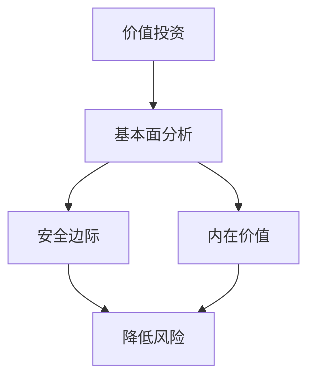
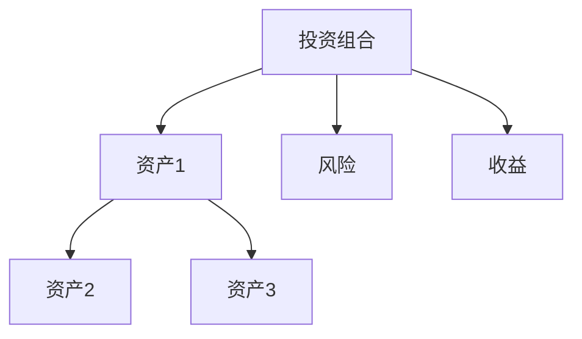

                 

# 价值投资中的风险管理策略

> 关键词：价值投资、风险管理、投资策略、风险控制、风险管理模型

> 摘要：本文深入探讨了价值投资中的风险管理策略，从基本概念到高级模型，详细分析了如何在投资过程中有效管理和控制风险。通过理论与实践相结合的方式，本文为投资者提供了系统化的风险管理方法，强调稳健投资的重要性。

---

# 第一章: 价值投资与风险管理概述

## 1.1 价值投资的核心概念

### 1.1.1 价值投资的定义与特点
价值投资是一种以基本面分析为基础的投资策略，强调购买被市场低估的资产。其核心在于寻找“烟屁股”（ cigar butts）——即具有安全边际的股票。价值投资的特点包括：
- 长期导向：关注企业的内在价值，而非短期市场波动。
- 安全边际：买入价格低于内在价值，以降低风险。
- 逆向思维：在市场恐慌时寻找机会，在市场狂热时保持冷静。

### 1.1.2 风险管理在价值投资中的重要性
风险管理是价值投资成功的关键因素之一。即使选择的标的具有安全边际，市场波动也可能导致投资组合的损失。有效的风险管理可以：
- 减少投资组合的波动性。
- 保护投资者免受重大损失。
- 提高投资组合的长期收益稳定性。

### 1.1.3 价值投资与风险管理的相互关系
价值投资通过选择低估资产降低下行风险，而风险管理则通过控制投资组合的波动性和潜在损失，进一步提高投资的稳健性。两者相辅相成，共同构建了一个可持续的投资体系。

---

## 1.2 风险管理的基本原理

### 1.2.1 风险的定义与分类
风险是指投资收益的不确定性。在价值投资中，风险主要分为系统性风险和非系统性风险：
- **系统性风险**：影响整个市场的风险，如经济衰退、战争等。
- **非系统性风险**：特定于个别资产的风险，如公司财务状况恶化。

### 1.2.2 风险管理的目标与流程
风险管理的目标是通过识别、评估和控制风险，实现投资组合的稳健收益。流程包括：
1. **风险识别**：识别可能影响投资组合的风险因素。
2. **风险评估**：量化风险的影响程度。
3. **风险控制**：通过分散投资、对冲等手段降低风险。
4. **风险监控**：持续监控风险，及时调整策略。

### 1.2.3 价值投资中风险管理的核心要素
- **分散投资**：通过投资多个资产降低非系统性风险。
- **安全边际**：确保买入价格低于内在价值。
- **长期视角**：避免短期波动的干扰，专注于长期价值。

---

# 第二章: 风险的种类与衡量

## 2.1 风险的分类
### 2.1.1 系统性风险与非系统性风险
- **系统性风险**：影响整个市场的风险，如经济周期、政策变化等。
- **非系统性风险**：特定于个别资产的风险，如公司经营状况、管理决策等。

### 2.1.2 市场风险、流动性风险与信用风险
- **市场风险**：资产价格波动导致的损失风险。
- **流动性风险**：资产难以快速变现的风险。
- **信用风险**：债券发行人违约的风险。

### 2.1.3 操作风险与法律风险
- **操作风险**：由于操作失误或内部管理问题导致的风险。
- **法律风险**：由于法律法规变化导致的风险。

## 2.2 风险的衡量方法

### 2.2.1 风险的定量衡量指标
- **波动率**：衡量资产价格的波动程度。
- **Beta值**：衡量资产相对于市场的波动性。
- **VaR（风险价值）**：在给定置信水平下，可能的最大损失。

### 2.2.2 风险的定性分析方法
- **情景分析**：模拟不同市场情景下的投资组合表现。
- **压力测试**：评估投资组合在极端市场条件下的表现。

### 2.2.3 风险衡量的综合应用
结合定量和定性方法，全面评估投资组合的风险。例如：
1. 使用VaR量化潜在损失。
2. 进行情景分析模拟市场波动。
3. 结合公司基本面分析评估信用风险。

---

# 第三章: 现代投资组合理论与风险管理

## 3.1 投资组合理论概述

### 3.1.1 投资组合理论的基本假设
- 投资者是理性的，追求收益最大化，厌恶风险。
- 资产收益符合正态分布。
- 市场是有效的，价格反映所有可获取的信息。

### 3.1.2 投资组合理论的核心模型
现代投资组合理论（MPT）由Harry Markowitz提出，通过优化投资组合的收益-风险比来构造最优组合。

### 3.1.3 投资组合理论的现实意义
MPT提供了一种科学的投资组合构造方法，帮助投资者在风险可控的前提下实现收益最大化。

---

## 3.2 现代投资组合理论中的风险管理

### 3.2.1 风险分散化原理
通过投资不同资产或行业分散化，降低非系统性风险。分散化的效果取决于资产之间的相关性。

### 3.2.2 投资组合的优化模型
Markowitz的优化模型通过最大化收益-风险比来构造最优组合。

$$
\text{Minimize } \sigma^2 \text{ subject to } \mu \geq \text{目标收益}
$$

其中，σ²为投资组合的方差，μ为期望收益。

### 3.2.3 风险调整后的收益评估
使用夏普比率（Sharpe Ratio）评估投资组合的风险调整后收益：

$$
\text{夏普比率} = \frac{\mu_p - \mu_r}{\sigma_p}
$$

其中，μ_p为投资组合的期望收益，μ_r为无风险利率，σ_p为投资组合的标准差。

---

# 第四章: 风险度量工具与方法

## 4.1 风险价值（VaR）

### 4.1.1 VaR的定义与计算方法
VaR是指在给定置信水平下，投资组合可能遭受的最大损失。

### 4.1.2 VaR的优缺点
- 优点：简单直观，便于比较不同投资组合的风险。
- 缺点：假设资产收益符合正态分布，可能低估尾部风险。

### 4.1.3 VaR在价值投资中的应用
用于评估投资组合在正常市场条件下的潜在损失。

## 4.2 信用风险价值（CVaR）

### 4.2.1 CVaR的定义与计算方法
CVaR是VaR在超过VaR值情况下的平均损失，用于衡量尾部风险。

### 4.2.2 CVaR与VaR的区别与联系
- VaR是损失的阈值。
- CVaR是损失超过VaR后的平均值。

### 4.2.3 CVaR在投资组合管理中的应用
用于评估和管理信用风险。

---

# 第五章: 对冲策略与风险控制

## 5.1 对冲策略的基本原理

### 5.1.1 配对交易
配对交易通过同时买入低估资产和卖出高估资产，利用价差回归实现收益。

### 5.1.2 统计套利
通过寻找资产价格的短期偏离，利用市场修复实现收益。

### 5.1.3 风险对冲
通过衍生品（如期货、期权）对冲特定风险。

## 5.2 对冲策略的风险

### 5.2.1 基差风险
衍生品价格与标的资产价格偏离的风险。

### 5.2.2 流动性风险
衍生品市场的流动性不足可能导致无法及时对冲。

---

# 第六章: 风险管理系统的构建

## 6.1 风险管理系统的目标
- 监控投资组合的风险。
- 及时发现和应对潜在风险。
- 优化投资组合的风险收益比。

## 6.2 风险管理系统的功能设计

### 6.2.1 风险识别
通过数据分析和市场监控，识别潜在风险因素。

### 6.2.2 风险评估
量化风险的影响程度，评估投资组合的承受能力。

### 6.2.3 风险控制
通过调整投资组合或使用衍生品对冲，降低风险敞口。

### 6.2.4 风险监控
持续跟踪风险变化，及时调整风险管理策略。

---

# 第七章: 价值投资中的风险管理实战

## 7.1 经典案例分析
### 7.1.1 2008年金融危机
分析金融危机中风险管理的失败教训。

### 7.1.2 美国航空（UAL）案例
通过基本面分析和风险管理，实现投资收益。

## 7.2 小结与总结
价值投资中的风险管理需要结合理论与实践，通过系统化的方法控制风险，实现稳健收益。

---

# 作者：AI天才研究院/AI Genius Institute & 禅与计算机程序设计艺术 /Zen And The Art of Computer Programming

---

本文通过系统化的方法，深入分析了价值投资中的风险管理策略，从理论到实践，为投资者提供了全面的风险管理框架。希望本文能为价值投资者在复杂市场环境中实现稳健收益提供有价值的参考。

