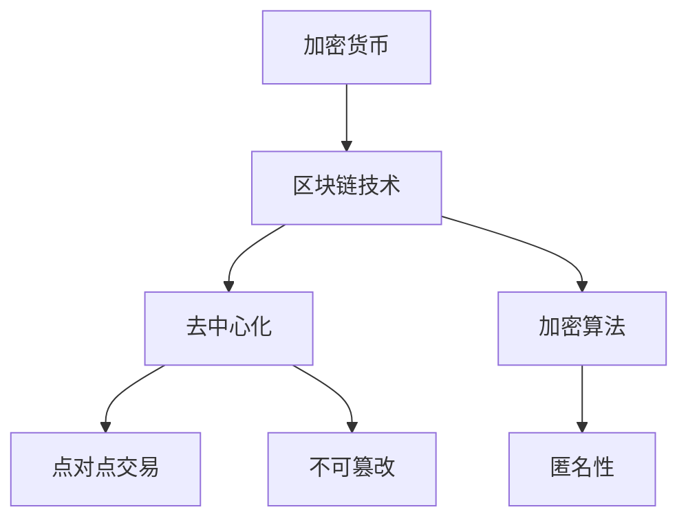

                 

# 价值投资在加密货币市场中的应用与风险

## 关键词：价值投资、加密货币、风险管理、技术分析、区块链、投资策略

## 摘要：  
价值投资在传统金融市场中已经证明了其有效性，但在加密货币市场中，由于其高度波动性、去中心化和技术复杂性，价值投资的应用和风险评估变得更加复杂。本文深入探讨了加密货币市场的特点、价值投资的核心理念、技术分析与基本面分析的结合，以及风险管理策略。通过实际案例分析，本文为投资者提供了如何在加密货币市场中应用价值投资的实用指南，并强调了在高风险环境下的风险控制的重要性。

---

# 第1章: 加密货币与价值投资概述

## 1.1 加密货币的基本概念

### 1.1.1 加密货币的定义与特点  
加密货币是一种基于区块链技术的数字货币，具有去中心化、匿名性、不可篡改和全球流通等特点。与传统货币不同，加密货币的发行和交易不依赖于中央银行或金融机构，而是通过区块链技术实现点对点的价值转移。

### 1.1.2 加密货币的核心技术：区块链  
区块链是加密货币的核心技术，通过分布式账本实现数据的安全性和可靠性。区块链的特点包括：

- **去中心化**：数据存储在多个节点上，没有单一点控制。
- **不可篡改**：通过密码学技术确保数据无法被修改。
- **透明性**：所有交易记录在区块链上公开可见。
- **共识机制**：通过共识算法（如PoW、PoS）确保网络的安全性。

### 1.1.3 加密货币市场的基本结构  
加密货币市场由以下几个主要部分组成：

1. **交易所**：如 Coinbase、Binance 等，提供加密货币的买卖服务。
2. **参与者**：包括个人投资者、机构投资者、开发者和项目方。
3. **价格指数**：如 BTC/USD、ETH/USD 等，表示加密货币与法币的汇率。

## 1.2 价值投资的核心理念

### 1.2.1 价值投资的定义与特点  
价值投资是一种长期投资策略，强调以低于资产内在价值的价格买入优质资产。其核心理念包括：

- **内在价值**：资产的真实价值，而非市场定价。
- **长期视角**：关注企业的长期盈利能力，而非短期价格波动。
- **安全边际**：买入价格低于内在价值，以降低风险。

### 1.2.2 价值投资与加密货币市场的结合  
加密货币市场的高度波动性和去中心化特性使得价值投资的应用更具挑战性。传统的价值投资策略需要结合加密货币市场的特点进行调整：

- **项目基本面分析**：评估加密货币的用途、技术实现和团队能力。
- **市场周期分析**：加密货币市场存在明显的周期性波动，投资者需要识别市场拐点。
- **风险管理**：由于市场波动性大，风险控制是价值投资的重要组成部分。

### 1.2.3 加密货币市场的独特性与挑战  
加密货币市场的独特性主要体现在以下几个方面：

- **高波动性**：价格波动剧烈，短期内可能出现大幅波动。
- **技术创新**：区块链技术的不断进步可能导致现有项目的淘汰。
- **监管不确定性**：不同国家对加密货币的监管政策差异较大，可能影响市场稳定性。

## 1.3 加密货币市场的参与者

### 1.3.1 投资者：个人与机构  
加密货币市场的投资者可以分为两类：

1. **个人投资者**：基于个人判断进行投资，风险承受能力较低。
2. **机构投资者**：包括对冲基金、风投公司等，资金实力雄厚，投资策略更为多元化。

### 1.3.2 开发者与项目方  
开发者和项目方是加密货币市场的核心推动者，他们负责开发和维护区块链项目。一个成功的项目需要具备强大的技术团队和清晰的商业模式。

### 1.3.3 中介：交易所与监管机构  
交易所是加密货币交易的平台，而监管机构则负责制定和执行相关政策法规。交易所的诚信和监管政策对市场稳定性有重要影响。

## 1.4 本章小结  
本章介绍了加密货币的基本概念、核心技术以及市场的基本结构，同时阐述了价值投资的核心理念及其在加密货币市场的应用。通过分析加密货币市场的独特性，为后续章节的深入探讨奠定了基础。

---

# 第2章: 加密货币市场的特点与风险

## 2.1 加密货币市场的波动性

### 2.1.1 市场波动的原因  
加密货币市场的波动性主要由以下几个因素引起：

1. **市场情绪**：投资者情绪的波动直接影响市场价格。
2. **市场周期**：加密货币市场存在明显的周期性，从牛市到熊市交替出现。
3. **媒体报道**：正面或负面的新闻报道会引发市场波动。

### 2.1.2 市场周期性分析  
加密货币市场的周期性可以通过以下步骤进行分析：

1. **识别市场趋势**：通过技术分析和基本面分析识别市场的整体趋势。
2. **判断市场拐点**：通过价格走势和交易量分析判断市场的顶部和底部。
3. **制定投资策略**：根据市场周期调整投资策略，如在牛市中增加持仓，在熊市中减少持仓。

### 2.1.3 市场参与者心理与行为  
市场参与者的心理和行为对市场波动有重要影响。例如：

- **贪婪与恐惧**：投资者的贪婪可能导致市场泡沫，而恐惧可能导致市场崩盘。
- **羊群效应**：投资者的跟风行为可能导致市场的非理性波动。

## 2.2 加密货币市场的风险

### 2.2.1 市场风险：价格波动  
市场风险是加密货币投资的主要风险，主要表现为价格的剧烈波动。投资者需要通过技术分析和基本面分析来降低市场风险。

### 2.2.2 信用风险：项目失败  
如果加密货币项目的技术实现失败或团队管理不善，可能导致项目失败，进而影响投资者的收益。

### 2.2.3 运行风险：技术漏洞  
加密货币项目的技术漏洞可能导致项目的安全性受到威胁，进而影响项目的价值。

### 2.2.4 法律风险：政策变化  
不同国家对加密货币的监管政策不同，政策的变化可能对市场产生重大影响。

## 2.3 风险管理的重要性

### 2.3.1 风险管理的基本原则  
风险管理的基本原则包括：

1. **分散投资**：通过投资不同类型的资产降低风险。
2. **止损策略**：设定止损点，避免损失过大。
3. **风险评估**：定期评估投资组合的风险，及时调整策略。

### 2.3.2 风险分担与分散投资  
分散投资是降低风险的有效方法。例如：

- **资产配置**：将资金分配到不同类型的加密货币和传统资产中。
- **项目选择**：选择不同阶段的项目，如早期项目和成熟项目。

### 2.3.3 风险评估工具与方法  
投资者可以使用以下工具和方法进行风险评估：

1. **VaR（Value at Risk）模型**：用于评估投资组合在一定置信水平下的最大损失。
2. **波动率分析**：通过分析历史波动率预测未来的波动情况。
3. **情景分析**：通过模拟不同市场情景，评估投资组合的表现。

## 2.4 本章小结  
本章分析了加密货币市场的波动性及其对投资的影响，同时探讨了加密货币市场的各种风险。通过风险管理策略的制定，投资者可以更好地应对市场的不确定性。

---

# 第3章: 价值投资在加密货币中的策略与方法

## 3.1 价值投资的核心要素

### 3.1.1 项目基本面分析  
项目基本面分析是价值投资的重要组成部分，主要包括以下几个方面：

1. **项目目标**：项目的初衷和目标是什么？
2. **技术实现**：项目的技术实现是否可行？
3. **团队能力**：开发团队的经验和能力如何？
4. **市场需求**：项目是否有明确的市场需求？

### 3.1.2 团队背景与项目目标  
团队背景和项目目标是评估项目价值的重要因素。例如：

- **团队背景**：团队成员是否有相关经验？
- **项目目标**：项目是否有明确的商业模式和市场定位？

### 3.1.3 市场定位与竞争分析  
市场定位和竞争分析是评估项目市场地位的重要步骤。例如：

- **市场定位**：项目在市场中的定位是什么？
- **竞争对手分析**：项目的主要竞争对手有哪些？

## 3.2 加密货币的价值评估方法

### 3.2.1 市场资本化率（Market Cap）  
市场资本化率是加密货币市值的重要指标，计算公式为：

$$ \text{市场资本化率} = \text{价格} \times \text{流通量} $$

### 3.2.2 币价与供需关系  
币价与供需关系密切相关。例如：

- **供不应求**：币价上涨。
- **供大于求**：币价下跌。

### 3.2.3 项目技术评估  
项目技术评估是评估项目价值的重要步骤。例如：

- **技术实现**：项目的技术实现是否可行？
- **技术优势**：项目是否有技术上的独特优势？

## 3.3 价值投资的长期视角

### 3.3.1 长期投资的逻辑  
长期投资的逻辑是基于项目的长期价值，而非短期价格波动。例如：

- **内在价值**：项目的内在价值是否长期增长？
- **市场趋势**：加密货币市场是否长期向好？

### 3.3.2 市场短期波动与长期趋势  
市场短期波动可能影响投资者的收益，但长期趋势才是决定投资收益的关键。例如：

- **短期波动**：市场价格的短期波动可能影响投资者的心理。
- **长期趋势**：加密货币市场的长期趋势是向好的，但需要关注技术创新和政策变化。

### 3.3.3 投资组合的构建与优化  
投资组合的构建与优化是价值投资的重要步骤。例如：

- **资产配置**：将资金分配到不同类型的加密货币和传统资产中。
- **风险控制**：通过分散投资和止损策略降低投资风险。

## 3.4 本章小结  
本章探讨了价值投资在加密货币中的策略与方法，包括项目基本面分析、价值评估方法和长期投资视角。通过这些方法，投资者可以更好地识别和投资有价值的项目。

---

# 第4章: 加密货币市场的技术分析与价值投资结合

## 4.1 技术分析的基本原理

### 4.1.1 技术分析的定义与特点  
技术分析是通过分析历史价格数据预测未来价格走势的一种方法。其特点包括：

- **数据驱动**：基于历史价格数据进行分析。
- **预测性**：通过技术指标和图表模式预测未来价格走势。

### 4.1.2 常见技术指标  
常见的技术指标包括：

1. **移动平均线（MA）**：通过计算一定时间内价格的平均值，判断价格趋势。
2. **相对强弱指数（RSI）**：通过计算价格涨跌幅度，判断超买或超卖状态。
3. **MACD（移动平均收敛散度）**：通过两条移动平均线的交叉点判断价格趋势。

### 4.1.3 技术分析的步骤  
技术分析的步骤包括：

1. **数据收集**：收集加密货币的历史价格数据。
2. **指标计算**：计算相关技术指标。
3. **图表绘制**：绘制价格图表和指标图表。
4. **趋势判断**：通过图表模式和指标信号判断价格走势。

## 4.2 技术分析与价值投资的结合

### 4.2.1 价值投资与技术分析的结合逻辑  
价值投资与技术分析的结合逻辑是：通过技术分析识别市场的短期波动，结合基本面分析判断项目的长期价值。例如：

- **短期波动**：技术分析可以帮助投资者把握市场的短期趋势。
- **长期价值**：基本面分析可以帮助投资者识别有价值的项目。

### 4.2.2 技术分析在加密货币市场的应用  
技术分析在加密货币市场的应用包括：

1. **趋势分析**：通过技术分析判断市场的整体趋势。
2. **交易信号**：通过技术指标生成买入和卖出信号。
3. **风险管理**：通过技术分析制定止损策略。

### 4.2.3 价值投资与技术分析的结合案例  
以下是一个价值投资与技术分析结合的案例：

1. **项目选择**：选择一个有明确市场需求和良好团队的项目。
2. **技术分析**：通过技术指标判断项目的短期价格走势。
3. **投资决策**：结合项目基本面和技术分析结果，制定投资策略。

## 4.3 本章小结  
本章探讨了技术分析在加密货币市场的应用，以及如何将其与价值投资结合。通过技术分析，投资者可以更好地把握市场的短期波动，结合基本面分析判断项目的长期价值。

---

# 第5章: 价值投资在加密货币中的风险管理

## 5.1 风险管理的核心原则

### 5.1.1 风险与收益的平衡  
风险管理的核心原则是平衡风险与收益。例如：

- **高风险高收益**：高风险的项目可能带来高收益，但也可能带来更大的损失。
- **低风险低收益**：低风险的项目收益相对稳定，但可能低于高风险项目的收益。

### 5.1.2 风险承受能力  
风险承受能力是投资者在面对损失时的心理和财务承受能力。例如：

- **心理承受能力**：投资者的心理状态影响其对风险的承受能力。
- **财务承受能力**：投资者的财务状况影响其对风险的承受能力。

## 5.2 风险分担与分散投资

### 5.2.1 分散投资的重要性  
分散投资是降低风险的重要方法。例如：

- **资产配置**：将资金分配到不同类型的资产中，降低投资风险。
- **项目选择**：选择不同类型的项目，降低投资风险。

### 5.2.2 风险分担的策略  
风险分担的策略包括：

1. **资产多样化**：将资金分配到不同类型的资产中。
2. **项目分散化**：选择不同阶段的项目，降低投资风险。

## 5.3 风险评估与应对策略

### 5.3.1 风险评估的方法  
风险评估的方法包括：

1. **VaR模型**：评估投资组合在一定置信水平下的最大损失。
2. **波动率分析**：通过分析历史波动率预测未来的波动情况。
3. **情景分析**：模拟不同市场情景，评估投资组合的表现。

### 5.3.2 风险应对策略  
风险应对策略包括：

1. **止损策略**：设定止损点，避免损失过大。
2. **对冲策略**：通过对冲交易降低投资风险。
3. **动态调整**：根据市场变化动态调整投资组合。

## 5.4 本章小结  
本章探讨了风险管理的核心原则，以及如何通过分散投资和风险评估降低投资风险。通过有效的风险管理策略，投资者可以更好地应对加密货币市场的高波动性。

---

# 第6章: 价值投资在加密货币中的长期视角

## 6.1 长期投资的逻辑

### 6.1.1 长期投资的核心理念  
长期投资的核心理念是基于项目的长期价值进行投资。例如：

- **内在价值**：项目的内在价值是否长期增长？
- **市场趋势**：加密货币市场是否长期向好？

### 6.1.2 长期投资的优势  
长期投资的优势包括：

1. **复利效应**：长期投资可以通过复利效应实现资产的长期增长。
2. **市场波动的平滑**：长期投资可以平滑短期波动的影响，实现更稳定的收益。

## 6.2 长期投资的风险与挑战

### 6.2.1 长期投资的风险  
长期投资的风险包括：

1. **技术风险**：项目的技术实现可能失败。
2. **市场风险**：市场的长期趋势可能不如预期。
3. **政策风险**：政策的变化可能影响市场的长期发展。

### 6.2.2 长期投资的挑战  
长期投资的挑战包括：

1. **心理压力**：长期投资需要较强的心理承受能力。
2. **信息不对称**：投资者可能无法及时获取项目的最新信息。
3. **市场变化**：市场的长期变化可能超出投资者的预期。

## 6.3 长期投资的策略与方法

### 6.3.1 投资组合的构建  
投资组合的构建是长期投资的重要步骤。例如：

- **资产配置**：将资金分配到不同类型的资产中，降低投资风险。
- **项目选择**：选择具有长期增长潜力的项目。

### 6.3.2 投资组合的优化  
投资组合的优化包括：

1. **动态调整**：根据市场变化动态调整投资组合。
2. **风险控制**：通过风险控制策略降低投资风险。

## 6.4 本章小结  
本章探讨了长期投资的核心理念、风险与挑战，以及长期投资的策略与方法。通过长期投资，投资者可以更好地实现资产的长期增长。

---

# 第7章: 价值投资在加密货币中的未来展望

## 7.1 未来趋势与挑战

### 7.1.1 加密货币市场的未来趋势  
加密货币市场的未来趋势包括：

1. **技术创新**：区块链技术的不断进步将推动加密货币市场的发展。
2. **政策变化**：不同国家的政策变化可能影响市场的长期发展。
3. **市场需求**：市场需求的变化将影响市场的整体趋势。

### 7.1.2 价值投资的未来挑战  
价值投资的未来挑战包括：

1. **技术进步**：技术的进步可能改变项目的长期价值。
2. **市场变化**：市场的长期变化可能超出投资者的预期。
3. **政策风险**：政策的变化可能影响市场的长期发展。

## 7.2 价值投资的未来机遇

### 7.2.1 技术进步带来的机遇  
技术进步将带来更多的投资机会。例如：

- **技术创新**：区块链技术的创新将推动新的项目出现。
- **应用场景**：加密货币在更多应用场景中的应用将推动市场需求。

### 7.2.2 市场发展的机遇  
市场的长期发展将为价值投资带来更多的机遇。例如：

- **市场规模扩大**：加密货币市场的规模可能进一步扩大。
- **市场成熟**：市场的成熟将吸引更多机构投资者进入市场。

## 7.3 未来投资策略的调整

### 7.3.1 技术进步的影响  
技术进步将影响投资策略的调整。例如：

- **技术创新**：投资者需要关注技术进步对项目价值的影响。
- **市场变化**：投资者需要根据市场的变化调整投资策略。

### 7.3.2 市场变化的应对  
市场变化的应对策略包括：

1. **动态调整**：根据市场变化动态调整投资策略。
2. **风险控制**：通过风险控制策略降低投资风险。

## 7.4 本章小结  
本章探讨了加密货币市场的未来趋势与挑战，以及价值投资的未来机遇与策略。通过未来的技术创新和市场发展，投资者可以更好地实现投资目标。

---

# 结语

价值投资在加密货币市场中的应用与风险是一个复杂而富有挑战性的课题。加密货币市场的高波动性、技术创新和政策不确定性为价值投资带来了新的机遇和挑战。通过深入分析加密货币市场的特点、价值投资的核心理念、技术分析与基本面分析的结合，以及风险管理策略，投资者可以更好地应对市场的不确定性，实现长期的投资目标。

---

# 作者：AI天才研究院/AI Genius Institute & 禅与计算机程序设计艺术 /Zen And The Art of Computer Programming

