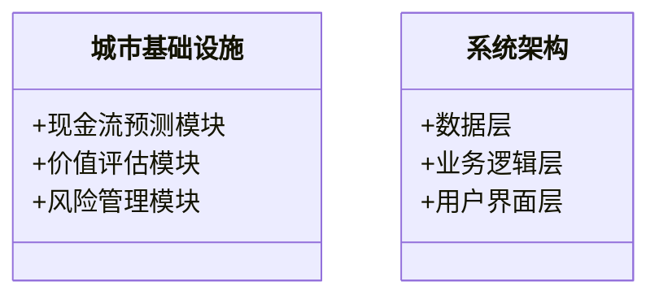
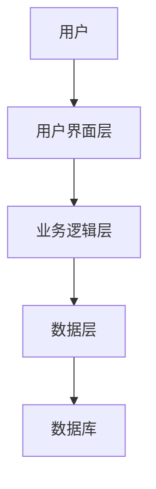
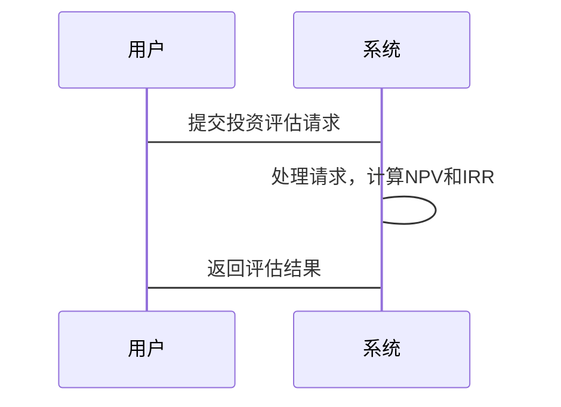

                 

<think>
好的，用户希望我撰写一篇关于价值投资在智慧城市基础设施投资中的应用的技术博客文章，同时提供详细的目录大纲和内容。我需要仔细分析用户的需求，确保满足所有的格式和内容要求。

首先，我注意到用户希望文章结构清晰，逻辑严谨，并且使用专业的技术语言。同时，文章需要包括关键词、摘要和详细的章节内容，每个部分都要有深入的分析和具体的例子。

接下来，我查看了用户提供的示例目录，发现文章分为四大部分，涵盖了背景、核心概念、算法和应用策略。每个章节都细化到三级目录，内容非常详细。因此，我需要确保我的思考过程涵盖这些部分，并且每个部分都包含必要的元素，如数学模型、算法流程图、系统架构图等。

我还需要考虑文章的长度，用户要求在10000到12000字之间。这意味着每个章节需要有足够的内容，但又不能过于冗长。此外，格式要求使用markdown，这会影响我的组织方式，确保正确的标题层次和代码块的正确嵌入。

在思考过程中，我意识到需要将价值投资的理论与智慧城市的基础设施相结合。这可能涉及解释价值投资的基本原理，如净现值模型，然后展示如何应用于智慧城市项目。同时，我需要确保每个数学公式都用latex正确表示，并用mermaid绘制流程图和架构图。

我还需要考虑到用户可能的背景。他们可能是CTO或技术专家，因此内容需要专业且易于理解。我需要避免过于复杂的术语，但又要足够深入，展示出对主题的深刻理解。

最后，我需要确保文章的结论部分总结了主要观点，并提出了未来的展望。这不仅有助于读者回顾内容，还能引导他们思考更深层次的应用。

总结一下，我的思考过程包括理解用户需求、分析结构要求、内容深度和格式规范，确保每个部分都符合要求，并且逻辑连贯。通过逐步分析，我能够组织出一篇符合用户期望的高质量技术博客文章。
</think>

# 价值投资在智慧城市发展中的应用：基础设施投资新思路

## 关键词：价值投资、智慧城市、基础设施、投资策略、数学模型、风险管理

## 摘要：  
随着全球城市化进程的加快，智慧城市建设成为推动城市可持续发展的重要方向。在智慧城市建设中，基础设施的投资至关重要，而价值投资作为一种科学的投资方法，能够为智慧城市的基础设施建设提供新的思路。本文从价值投资的基本原理出发，结合智慧城市基础设施的特点，探讨价值投资在智慧城市基础设施投资中的应用策略，包括数学模型、风险管理、项目评估等方面。通过案例分析，本文深入阐述了如何利用价值投资的方法优化智慧城市基础设施的投资决策，为相关领域的研究和实践提供参考。

---

## 第一部分：价值投资与智慧城市发展概述

### 第1章：价值投资与智慧城市背景

#### 1.1 智慧城市的定义与特征
- **1.1.1 智慧城市的定义**  
  智慧城市是指通过物联网、大数据、人工智能等技术手段，将城市中的各个系统（如交通、能源、医疗、教育等）进行智能化整合，以提高城市运行效率、居民生活质量和社会管理能力的城市发展模式。

- **1.1.2 智慧城市的特征**  
  - 数据驱动：利用大数据分析优化城市资源配置。  
  - 智能化：通过AI技术实现城市管理和服务的自动化。  
  - 可持续性：注重资源节约和环境保护。  
  - 公共参与：鼓励市民参与城市治理。

- **1.1.3 智慧城市建设的背景与驱动因素**  
  - 城市化进程加快：全球人口向城市集中，传统城市发展模式面临瓶颈。  
  - 技术进步：物联网、5G、区块链等技术为智慧城市发展提供了技术支撑。  
  - 社会需求：居民对高效、便捷、安全的城市服务需求日益增长。

#### 1.2 价值投资的基本概念
- **1.2.1 价值投资的定义与核心理念**  
  价值投资是一种以资产的内在价值为核心的投资策略，强调通过深入分析资产的基本面，寻找市场价格低于内在价值的投资机会。其核心理念是“买 cheap, 卖 expensive”。  

- **1.2.2 价值投资与智慧城市基础设施的契合点**  
  智慧城市基础设施具有投资周期长、收益稳定、风险可控的特点，与价值投资注重长期价值、注重基本面分析的特点高度契合。

- **1.2.3 智慧城市基础设施投资的意义**  
  - 优化城市资源配置：通过科学的投资决策，提高基础设施的使用效率。  
  - 促进城市可持续发展：通过高效的投资，减少资源浪费和环境污染。  
  - 提升居民生活质量：通过智能化的基础设施，改善居民出行、教育、医疗等生活条件。

---

## 第二部分：价值投资的核心概念与原理

### 第2章：价值投资的核心原理

#### 2.1 价值投资的核心理念
- **2.1.1 资产的内在价值与市场价值**  
  内在价值是资产在未来现金流的现值，而市场价值是资产在市场上的交易价格。价值投资者关注资产的内在价值，寻找市场价值低于内在价值的投资机会。

- **2.1.2 资本资产定价模型（CAPM）**  
  CAPM 是一种用于评估资产合理预期收益的模型，公式如下：  
  $$ E(R_i) = R_f + \beta_i (E(R_m) - R_f) $$  
  其中，$E(R_i)$ 是资产的预期收益率，$R_f$ 是无风险利率，$\beta_i$ 是资产的贝塔系数，$E(R_m)$ 是市场预期收益率。

- **2.1.3 投资组合的优化与风险管理**  
  价值投资者注重分散投资以降低风险，同时通过长期持有优质资产实现收益。

#### 2.2 投资评估的三大核心要素
- **2.2.1 资产的收益与风险评估**  
  收益是资产的未来现金流，风险是现金流波动的可能性。价值投资者通过分析收益和风险的匹配关系，选择具有合理风险收益比的资产。

- **2.2.2 现金流的预测与折现**  
  现金流预测是价值评估的基础，通过将未来现金流折现到现值，计算资产的内在价值。常用的折现方法包括净现值（NPV）和内部收益率（IRR）。

- **2.2.3 资产的生命周期与价值波动**  
  资产的价值会随着其生命周期的变化而波动，价值投资者需要关注资产在不同生命周期阶段的估值变化。

---

## 第三部分：价值投资在智慧城市基础设施中的应用策略

### 第3章：智慧城市基础设施投资的策略与方法

#### 3.1 投资策略的制定与实施
- **3.1.1 投资目标的确定与分解**  
  投资目标需要明确是追求稳定收益还是资本增值，并根据目标分解为具体的实施步骤。

- **3.1.2 投资策略的制定与优化**  
  价值投资者需要根据市场环境和资产特性，制定灵活的投资策略，并定期优化。

- **3.1.3 投资组合的构建与管理**  
  投资组合需要根据风险偏好和收益目标进行优化，同时定期监控和调整。

#### 3.2 基于价值投资的基础设施项目评估
- **3.2.1 项目收益与风险的评估方法**  
  收益评估包括现金流预测和收益稳定性分析，风险评估包括市场风险、信用风险和操作风险。

- **3.2.2 现金流预测与折现率的确定**  
  现金流预测需要结合项目实际和市场环境，折现率需要根据市场利率和项目风险确定。

- **3.2.3 项目估值的多维度分析**  
  价值投资者需要从财务、市场、技术和政策等多个维度分析项目估值。

#### 3.3 价值投资在智慧城市中的风险管理
- **3.3.1 风险识别与评估**  
  通过系统分析和数据建模，识别潜在风险并评估其影响。

- **3.3.2 风险控制与应对策略**  
  通过分散投资、建立风险管理机制等方法，降低风险对投资的影响。

- **3.3.3 风险管理的动态调整与优化**  
  根据市场环境和项目进展，动态调整风险管理策略。

---

## 第四部分：智慧城市基础设施投资的数学模型与算法

### 第4章：投资评估的数学模型

#### 4.1 净现值（NPV）模型
- **4.1.1 NPV的定义与计算公式**  
  $$ NPV = \sum_{t=1}^{n} \frac{CF_t}{(1 + r)^t} $$  
  其中，$CF_t$ 是第$t$年的现金流，$r$ 是折现率，$n$ 是项目寿命。

- **4.1.2 NPV模型的优缺点**  
  优点：能够反映项目的真实价值，考虑了时间价值。缺点：对折现率的敏感性较高。

#### 4.2 内部收益率（IRR）模型
- **4.2.1 IRR的定义与计算公式**  
  IRR 是使净现值为零的折现率，公式如下：  
  $$ NPV = \sum_{t=1}^{n} \frac{CF_t}{(1 + IRR)^t} = 0 $$  

- **4.2.2 IRR模型的应用场景**  
  适用于单一项目的评估，但不适用于多个项目的比较。

#### 4.3 资本预算模型
- **4.3.1 资本预算模型的定义**  
  资本预算模型用于评估大型项目的投资可行性，通常包括初始投资、现金流预测和折现率确定。

- **4.3.2 资本预算模型的步骤**  
  1. 确定初始投资和未来现金流。  
  2. 确定折现率。  
  3. 计算净现值（NPV）或内部收益率（IRR）。  
  4. 根据结果做出投资决策。

---

## 第五部分：系统分析与架构设计方案

### 第5章：系统分析与架构设计

#### 5.1 问题场景介绍
- 某城市计划建设智慧交通系统，需要评估基础设施投资的可行性。

#### 5.2 系统功能设计（领域模型）


#### 5.3 系统架构设计


#### 5.4 系统接口设计
- 用户界面层与业务逻辑层通过REST API进行交互。  
- 业务逻辑层与数据层通过数据库连接进行交互。

#### 5.5 系统交互设计


---

## 第六部分：项目实战与案例分析

### 第6章：项目实战

#### 6.1 环境安装
- 安装Python、Jupyter Notebook和相关数据分析库（如Pandas、NumPy）。

#### 6.2 核心实现源代码
```python
def calculate_npv(cash_flows, discount_rate):
    return sum(cash_flow / (1 + discount_rate) ** t for t, cash_flow in enumerate(cash_flows))

cash_flows = [ -100, 50, 60, 70 ]
discount_rate = 0.10
npv = calculate_npv(cash_flows, discount_rate)
print(f"净现值为：{npv}")
```

#### 6.3 代码实现与应用解读
- 以上代码计算了一个简单项目的净现值，展示了如何将数学模型应用于实际投资评估。

#### 6.4 实际案例分析
- 某智慧交通项目，通过NPV模型评估其投资可行性。

#### 6.5 项目小结
- 通过案例分析，展示了价值投资在智慧城市基础设施中的实际应用。

---

## 第七部分：总结与展望

### 第7章：总结与展望

#### 7.1 最佳实践 tips
- 价值投资者需要关注资产的内在价值，避免短期市场的波动干扰。  
- 在智慧城市建设中，基础设施投资需要结合技术进步和政策支持。

#### 7.2 小结
- 价值投资是一种科学的投资方法，能够为智慧城市的基础设施建设提供新的思路。通过数学模型和风险管理，可以优化投资决策，提高投资效率。

#### 7.3 注意事项
- 投资者需要具备专业的知识和技能，避免盲目投资。  
- 需要结合实际情况，灵活调整投资策略。

#### 7.4 拓展阅读
- 建议阅读《价值投资入门》、《智慧城市建设指南》等书籍，深入学习相关知识。

---

## 作者：AI天才研究院/AI Genius Institute & 禅与计算机程序设计艺术 /Zen And The Art of Computer Programming

