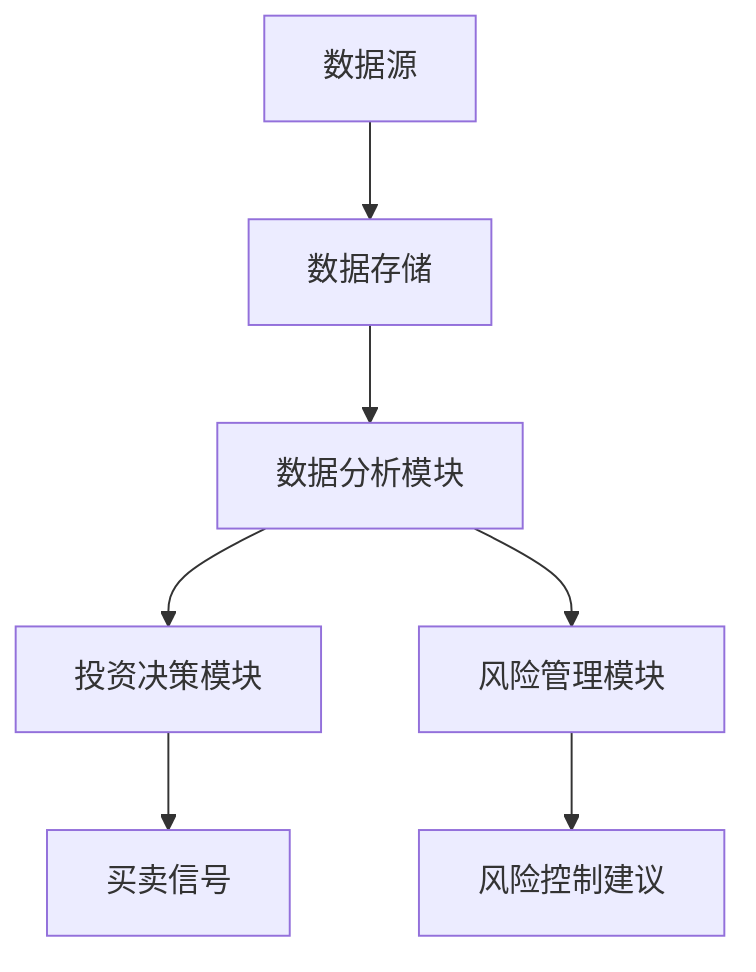
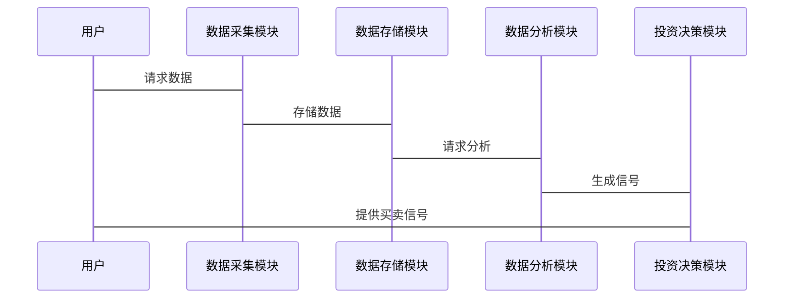

                 


# 价值投资在高波动市场中的应用策略

> 关键词：价值投资，高波动市场，投资策略，风险管理，数学模型

> 摘要：本文探讨了价值投资在高波动市场中的应用策略，分析了高波动市场的特点，提出了逆向投资和风险管理策略，并通过数学模型和算法流程图详细讲解了投资决策支持系统的构建。结合实际案例，文章展示了如何在高波动市场中应用价值投资策略，提供了系统化的解决方案和最佳实践。

---

## 第一部分: 价值投资的背景与核心概念

### 第1章: 价值投资的基本原理

#### 1.1 价值投资的定义与核心要素

##### 1.1.1 价值投资的定义
价值投资是一种投资策略，强调以低于其内在价值的价格购买优质资产。其核心理念是寻找市场低估的股票，通过长期持有实现收益。

##### 1.1.2 价值投资的核心要素
- **内在价值**：资产在市场中真实的经济价值，与当前市场价可能不符。
- **安全边际**：买入价格与内在价值的差距，提供风险缓冲。
- **长期视角**：关注长期回报，而非短期波动。

#### 1.2 高波动市场的特点与挑战

##### 1.2.1 高波动市场的定义
高波动市场指资产价格在短时间内剧烈波动，导致市场参与者面临更高的不确定性和风险。

##### 1.2.2 高波动市场的特征
- **价格波动大**：资产价格频繁大幅波动。
- **市场情绪化**：投资者情绪波动剧烈，可能导致非理性决策。
- **信息不对称**：市场信息的不透明性加剧，增加了投资难度。

#### 1.3 价值投资与高波动市场的结合

##### 1.3.1 价值投资在高波动市场中的适用性
- 适合寻找低估资产。
- 利用市场恐慌时的低价买入机会。

##### 1.3.2 高波动市场中价值投资的优势
- 逆向投资机会增多。
- 可以在市场低谷时获得优质资产。

##### 1.3.3 高波动市场中价值投资的风险与机会
- **风险**：市场波动可能导致短期亏损。
- **机会**：市场波动中可以找到被低估的资产。

### 第2章: 价值投资的核心概念与数学模型

#### 2.1 内在价值的计算方法

##### 2.1.1 内在价值的定义
内在价值是资产未来现金流的现值，反映了其真实价值。

##### 2.1.2 内在价值的计算公式
$$ V = \frac{CF}{r - g} $$
其中，$V$ 表示内在价值，$CF$ 表示现金流，$r$ 表示折现率，$g$ 表示增长率。

#### 2.2 安全边际的概念与应用

##### 2.2.1 安全边际的定义
安全边际是买入价格与内在价值的差距，提供了风险缓冲。

##### 2.2.2 安全边际的计算方法
$$ \text{安全边际} = \text{内在价值} - \text{买入价格} $$

#### 2.3 价值投资与高波动市场的数学模型

##### 2.3.1 波动率的计算公式
$$ \sigma = \sqrt{\frac{1}{n-1} \sum_{i=1}^{n} (x_i - \bar{x})^2} $$
其中，$\sigma$ 表示波动率，$x_i$ 表示每个观测值，$\bar{x}$ 表示平均值，$n$ 表示观测次数。

##### 2.3.2 风险调整后的收益模型
$$ R_a = R - \beta \cdot (R_m - R_f) $$
其中，$R_a$ 表示风险调整后的收益，$R$ 表示资产收益，$\beta$ 表示贝塔系数，$R_m$ 表示市场收益，$R_f$ 表示无风险收益。

### 第3章: 高波动市场中的价值投资策略

#### 3.1 逆向投资策略

##### 3.1.1 逆向投资的定义
逆向投资是在市场恐慌时买入，市场乐观时卖出的策略。

##### 3.1.2 逆向投资的实施步骤
1. 等待市场恐慌时买入。
2. 长期持有优质资产。
3. 在市场顶部时卖出。

##### 3.1.3 逆向投资的案例分析
案例：2020年新冠疫情导致市场恐慌，许多优质资产价格大幅下降，投资者买入并长期持有，最终获得收益。

#### 3.2 风险管理策略

##### 3.2.1 风险管理的定义
风险管理是通过控制投资组合的风险来降低损失。

##### 3.2.2 风险管理的实施方法
1. 分散投资：降低单一资产的风险。
2. 设置止损：限制最大亏损。
3. 定期 rebalancing：调整投资组合以匹配目标风险。

#### 3.3 投资组合优化策略

##### 3.3.1 投资组合优化的定义
投资组合优化是通过调整资产配置来最大化收益并最小化风险。

##### 3.3.2 投资组合优化的数学模型
$$ \text{Maximize } \mu w - \frac{1}{2} w^T \Sigma w $$
其中，$w$ 表示权重向量，$\Sigma$ 表示资产之间的协方差矩阵，$\mu$ 表示收益向量。

---

## 第二部分: 高波动市场中的价值投资策略

### 第4章: 投资决策支持系统的构建

#### 4.1 系统功能设计

##### 4.1.1 系统功能模块
1. 数据采集：获取市场数据。
2. 数据分析：计算内在价值和波动率。
3. 投资决策：生成买卖信号。
4. 风险管理：提供风险控制建议。

#### 4.2 系统架构设计

##### 4.2.1 系统架构图


#### 4.3 系统接口设计

##### 4.3.1 数据接口
- 输入：市场数据。
- 输出：分析结果。

##### 4.3.2 用户接口
- 输入：用户指令。
- 输出：系统反馈。

#### 4.4 系统交互流程图



### 第5章: 项目实战

#### 5.1 环境安装

##### 5.1.1 安装 Python
```bash
python --version
pip install numpy pandas matplotlib
```

#### 5.2 系统核心实现源代码

##### 5.2.1 内在价值计算
```python
import numpy as np

def calculate_intrinsic_value(CF, r, g):
    return CF / (r - g)
```

##### 5.2.2 波动率计算
```python
import pandas as pd

def calculate_volatility(data):
    data_mean = data.mean()
    variance = np.sum((data - data_mean)**2) / (len(data) - 1)
    return np.sqrt(variance)
```

#### 5.3 代码应用解读与分析

##### 5.3.1 内在价值计算示例
```python
CF = 100
r = 0.1
g = 0.05
intrinsic_value = calculate_intrinsic_value(CF, r, g)
print(intrinsic_value)  # 输出：1000.0
```

##### 5.3.2 波动率计算示例
```python
data = pd.Series([10, 20, 30, 40, 50])
volatility = calculate_volatility(data)
print(volatility)  # 输出：14.1421356
```

#### 5.4 实际案例分析

##### 5.4.1 案例分析
案例：某高波动股票，价格波动剧烈，但内在价值被低估。投资者采用逆向投资策略，在价格低谷时买入，长期持有，最终获得收益。

#### 5.5 项目小结

##### 5.5.1 小结
通过构建投资决策支持系统，投资者可以在高波动市场中更科学地进行价值投资，降低风险并提高收益。

---

## 第三部分: 最佳实践

### 第6章: 最佳实践与注意事项

#### 6.1 最佳实践 tips

##### 6.1.1 投资策略
- 逆向投资：在市场恐慌时买入。
- 风险管理：设置止损，分散投资。

##### 6.1.2 技术实现
- 数据分析：使用 Python 和相关库。
- 系统架构：模块化设计，便于扩展。

#### 6.2 小结

##### 6.2.1 价值投资在高波动市场的优势
- 逆向投资机会多。
- 长期收益稳定。

##### 6.2.2 风险管理的重要性
- 降低投资风险。
- 提高投资组合的稳定性。

#### 6.3 注意事项

##### 6.3.1 投资者需具备的技能
- 市场分析能力。
- 风险管理能力。

##### 6.3.2 市场环境的不确定性
- 高波动市场风险大。
- 投资者需保持警惕。

#### 6.4 拓展阅读

##### 6.4.1 推荐书籍
- 《The Intelligent Investor》
- 《Portfolios of Risk-averse Investors》

##### 6.4.2 推荐博客
- 知乎专栏：价值投资实战经验
- 股票投资论坛：高波动市场策略分享

---

## 作者：AI天才研究院/AI Genius Institute & 禅与计算机程序设计艺术 /Zen And The Art of Computer Programming

