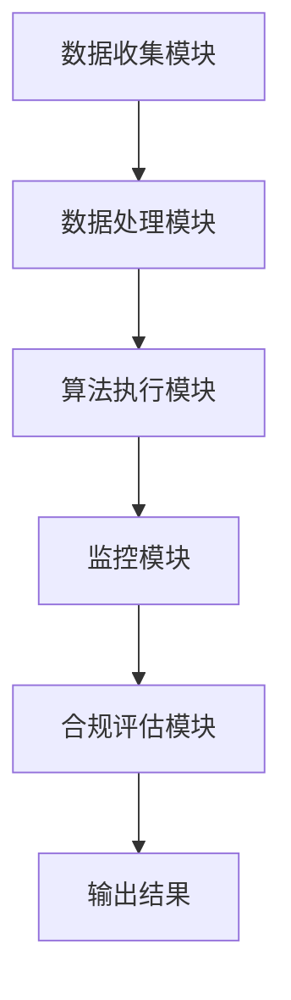

                 


# 价值投资视角下的人工智能伦理合规

> 关键词：价值投资，人工智能，伦理合规，算法偏见，数据隐私，金融伦理，投资决策

> 摘要：随着人工智能技术在金融领域的广泛应用，如何在价值投资视角下确保人工智能的伦理合规成为一个重要课题。本文从人工智能伦理的基本概念出发，结合价值投资的核心原则，系统探讨人工智能在投资决策中的伦理问题，分析如何构建符合伦理合规的人工智能投资系统，并通过实际案例展示其应用。

---

# 第1章: 价值投资与人工智能伦理概述

## 1.1 价值投资的核心概念

### 1.1.1 价值投资的定义与历史发展

价值投资是一种以基本面分析为基础的投资策略，强调以低于内在价值的价格购买优质资产。其核心思想是寻找市场低估的股票，并长期持有，等待其价值回归。价值投资的鼻祖是本杰明·格雷厄姆和戴维·多德，他们的理论为现代价值投资奠定了基础。

### 1.1.2 价值投资的基本原则与方法

价值投资的核心原则包括：

1. **安全边际**：以低于内在价值的价格买入资产，确保投资的安全性。
2. **长期视角**：关注企业的长期价值，而非短期市场波动。
3. **基本面分析**：通过财务报表、行业地位等因素评估企业的内在价值。
4. **分散投资**：避免过度集中，降低风险。

### 1.1.3 价值投资在现代金融中的应用

随着金融市场的复杂化，价值投资逐步从传统的企业分析扩展到量化分析、大数据分析等领域。现代价值投资结合了传统基本面分析和新兴技术手段，试图在不确定性中找到确定性的价值。

---

## 1.2 人工智能伦理的核心概念

### 1.2.1 人工智能的基本定义与技术特点

人工智能（AI）是指通过计算机模拟人类智能的技术，包括学习、推理、感知和决策等能力。其技术特点包括数据驱动、算法复杂性和自适应性。

### 1.2.2 人工智能伦理的主要问题与挑战

人工智能的伦理问题主要集中在以下方面：

1. **数据隐私**：数据的收集、存储和使用可能侵犯个人隐私。
2. **算法偏见**：算法可能因为训练数据的偏差而产生不公平的决策。
3. **透明性与可解释性**：复杂的算法可能难以解释其决策过程。

### 1.2.3 人工智能伦理与合规的必要性

随着AI在金融领域的广泛应用，确保其伦理合规不仅是法律要求，更是维护投资者信任和社会公平的重要手段。

---

## 1.3 价值投资视角下的人工智能伦理合规框架

### 1.3.1 人工智能在金融投资中的应用现状

人工智能在金融投资中的应用包括量化交易、风险评估、市场预测等领域。然而，这些应用也带来了伦理问题。

### 1.3.2 人工智能伦理对投资决策的影响

伦理合规框架需要确保AI投资决策的透明性、公平性和可解释性。

### 1.3.3 合规框架的设计原则

1. **数据隐私保护**：确保数据的合法性和合规性。
2. **算法公平性**：消除算法偏见，确保决策的公平性。
3. **可解释性**：使投资决策过程可追溯和解释。

---

# 第2章: 人工智能伦理问题分析

## 2.1 数据隐私与安全问题

### 2.1.1 数据隐私的定义与挑战

数据隐私是指个人对自身数据的控制权。在AI应用中，数据的收集和使用可能涉及大量个人隐私信息。

### 2.1.2 数据安全的威胁与防护

数据泄露、网络攻击等威胁可能破坏数据安全，导致合规性问题。

### 2.1.3 数据隐私与合规的解决方案

通过数据脱敏、加密存储等技术手段保护数据隐私。

---

## 2.2 算法偏见与公平性问题

### 2.2.1 算法偏见的来源

算法偏见可能源于训练数据的偏差或算法设计的缺陷。

### 2.2.2 偏见对投资决策的影响

算法偏见可能导致不公平的投资决策，损害投资者利益。

### 2.2.3 降低算法偏见的方法

通过数据清洗、算法优化等手段减少偏见。

---

## 2.3 人工智能决策的可解释性问题

### 2.3.1 可解释性的定义与重要性

可解释性是指算法决策过程能够被人类理解和解释。

### 2.3.2 不可解释性对投资决策的影响

不可解释的决策可能导致投资者信任度下降。

### 2.3.3 提高可解释性的方法

通过模型简化、规则化等手段提高可解释性。

---

# 第3章: 人工智能伦理合规的算法原理

## 3.1 人工智能算法的基本原理

### 3.1.1 机器学习算法的分类与特点

机器学习算法包括监督学习、无监督学习和强化学习等。

### 3.1.2 深度学习算法的核心机制

深度学习通过多层神经网络模拟人类大脑的处理方式。

### 3.1.3 自然语言处理算法的原理

自然语言处理算法用于理解和生成人类语言。

---

## 3.2 人工智能算法中的伦理问题

### 3.2.1 数据偏见的来源与影响

数据偏见可能导致算法决策不公平。

### 3.2.2 算法决策的透明性与可解释性

算法决策需要透明且可解释。

### 3.2.3 算法滥用与伦理风险

算法可能被滥用，导致伦理风险。

---

## 3.3 价值投资视角下的算法优化

### 3.3.1 基于伦理合规的算法设计原则

确保算法决策的公平性、透明性和可解释性。

### 3.3.2 算法优化中的伦理考量

在优化算法性能的同时，考虑其伦理影响。

### 3.3.3 算法评估与改进方法

通过测试和评估，不断优化算法的伦理合规性。

---

# 第4章: 人工智能伦理合规的系统架构设计

## 4.1 系统架构设计的基本原则

### 4.1.1 系统架构设计的目标与方法

系统架构设计的目标是确保系统的功能性、可靠性和合规性。

### 4.1.2 伦理合规在系统架构中的体现

通过模块化设计，确保各个功能模块符合伦理合规要求。

### 4.1.3 系统架构的可扩展性与灵活性

系统架构应具备良好的扩展性和灵活性，以适应未来的发展需求。

---

## 4.2 人工智能伦理合规系统的功能设计

### 4.2.1 数据收集与处理模块

确保数据的合法性和合规性。

### 4.2.2 算法执行与监控模块

监控算法运行，确保其符合伦理合规要求。

### 4.2.3 伦理合规评估模块

定期评估系统的伦理合规性，并进行优化。

---

## 4.3 人工智能伦理合规系统的架构图



---

## 4.4 本章小结

通过系统架构设计，确保人工智能伦理合规系统在功能、性能和合规性方面达到要求。

---

# 第5章: 人工智能伦理合规的项目实战

## 5.1 项目背景与目标

### 5.1.1 项目背景

一个基于人工智能的金融投资系统，需要确保其伦理合规性。

### 5.1.2 项目目标

构建一个符合伦理合规的人工智能投资系统。

---

## 5.2 项目核心实现

### 5.2.1 环境安装

安装必要的Python库，如TensorFlow、Pandas等。

### 5.2.2 系统核心实现

```python
def check_ethical_compliance(data):
    # 数据清洗
    cleaned_data = data.dropna()
    # 检查数据隐私
    if not is_private(cleaned_data):
        raise Exception("Data privacy violation")
    # 检查算法偏见
    if has_bias(cleaned_data):
        raise Exception("Algorithm bias detected")
    return True
```

---

## 5.3 项目应用与案例分析

通过实际案例分析，展示如何在金融投资中应用人工智能伦理合规框架。

---

## 5.4 本章小结

通过项目实战，验证人工智能伦理合规框架的有效性和可行性。

---

# 第6章: 人工智能伦理合规的未来展望

## 6.1 人工智能伦理合规的未来趋势

随着技术的发展，人工智能伦理合规将更加重要。

## 6.2 价值投资视角下的伦理合规挑战与机遇

未来，价值投资与人工智能伦理合规的结合将更加紧密。

## 6.3 本章小结

总结全文，展望人工智能伦理合规的未来发展方向。

---

# 作者：AI天才研究院/AI Genius Institute & 禅与计算机程序设计艺术/Zen And The Art of Computer Programming

---

> 本文通过系统地分析价值投资视角下的人工智能伦理合规问题，提出了构建符合伦理合规的人工智能投资系统的框架和方法。希望本文能够为金融领域的技术从业者和投资者提供有价值的参考。

