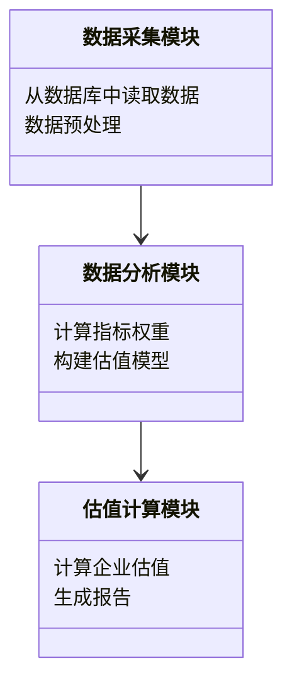

                 

<think>
好的，我现在需要帮助用户撰写一篇名为《价值投资视角下的工业4.0企业估值》的技术博客文章。用户已经提供了一个详细的目录大纲，并希望我按照这个大纲逐步完成文章的撰写。

首先，我需要理解用户的需求。用户希望文章结构清晰，逻辑严密，涵盖工业4.0与价值投资的背景、核心概念、算法原理、系统分析、项目实战和最佳实践等部分。同时，用户强调使用专业但易懂的技术语言，并确保每个章节都详细展开，特别是核心概念、算法模型和系统架构部分。

接下来，我需要按照目录大纲逐步完成文章的各个部分。从背景介绍开始，然后是核心概念，接着是算法原理、系统分析、项目实战和最佳实践。每个部分都需要详细展开，确保内容充实，符合用户的要求。

在撰写过程中，我需要特别注意以下几点：

1. **背景介绍**：详细解释工业4.0和价值投资的基本概念，说明两者结合的必要性和重要性。这部分需要让读者理解为什么从价值投资的角度来分析工业4.0企业的估值是有意义的。

2. **核心概念**：明确工业4.0和价值投资的关键要素，分析它们之间的联系，使用对比表格和ER图来展示概念之间的关系。这部分需要帮助读者建立清晰的概念框架。

3. **算法原理**：详细阐述企业估值模型的构建，包括数据预处理、指标权重计算和估值模型建立。使用数学公式和代码示例来说明算法的实现，确保读者能够理解并应用这些模型。

4. **系统分析与架构设计**：通过系统分析和架构图展示企业估值系统的结构，使用Mermaid图来描绘类图、架构图和序列图，帮助读者理解系统的整体设计和各部分之间的交互。

5. **项目实战**：通过具体案例分析，展示如何应用理论进行实际的企业估值。这部分需要提供环境安装、代码实现、案例分析和小结，帮助读者将理论应用于实践。

6. **最佳实践与总结**：总结文章的主要内容，提出投资策略建议和未来研究方向，同时给出投资注意事项和延伸阅读的建议。

在撰写过程中，我需要确保语言简洁明了，逻辑清晰，每一部分都紧密围绕主题展开，帮助读者一步步理解如何从价值投资的角度进行工业4.0企业的估值。

现在，我开始按照目录大纲逐步撰写文章的每个部分，确保每个章节内容详实，符合用户的要求。
</think>

# 价值投资视角下的工业4.0企业估值

---

## 关键词：
价值投资、工业4.0、企业估值、财务指标、技术创新、竞争力分析

---

## 摘要：
本文从价值投资的视角，系统地分析工业4.0对企业价值的影响，构建了一套基于工业4.0特征的企业估值模型。通过对企业核心竞争力、财务指标和市场地位的深入分析，结合实际案例，提出了工业4.0企业在价值投资中的评估方法和投资策略，为投资者提供了科学的决策依据。

---

## 第一部分：工业4.0与价值投资的背景与概念

### 第1章：工业4.0与价值投资的背景介绍

#### 1.1 工业4.0的核心概念
工业4.0是继工业1.0机械化、工业2.0电气化、工业3.0自动化之后的第四次工业革命，其核心特征包括智能化、数字化和网络化。工业4.0通过物联网（IoT）、大数据、人工智能（AI）和云计算等技术，将整个生产过程从设计、生产到销售实现高度智能化和自动化。工业4.0的出现，不仅提升了生产效率，还极大地增强了企业的灵活性和创新能力。

**问题场景介绍：**
在工业4.0的背景下，企业需要面对快速变化的市场需求和技术挑战。传统的价值评估方法可能无法完全捕捉到工业4.0带来的新增值和风险。

#### 1.2 价值投资的核心原理
价值投资是一种长期投资策略，强调以低于公平价值的价格买入优质资产。其核心在于分析企业的基本面，包括财务状况、市场地位和未来盈利能力。价值投资者相信市场短期波动中存在投资机会，通过深入分析企业内在价值，寻找被市场低估的企业进行投资。

**问题场景解决：**
通过将工业4.0的特征与价值投资的基本原理相结合，可以更准确地评估工业4.0企业的内在价值，发现被市场低估的投资机会。

---

### 第2章：工业4.0与价值投资的结合

#### 2.1 工业4.0对企业价值的提升
工业4.0通过技术创新和智能化生产，显著提升了企业的效率和产品质量。例如，智能化生产线可以减少人工干预，降低生产成本，同时提高生产精度和速度。此外，工业4.0还增强了企业的灵活性，使其能够快速响应市场需求的变化。

**问题场景分析：**
工业4.0的实施不仅提升了企业的生产效率，还增强了其市场竞争力，这些因素都会对企业价值产生积极影响。

#### 2.2 价值投资视角下的工业4.0企业分析
在价值投资的视角下，投资者需要关注工业4.0企业的核心竞争力、财务状况和未来增长潜力。核心竞争力主要体现在技术创新能力、市场份额和管理团队等方面。财务状况包括利润率、资产负债率和现金流等指标。未来增长潜力则与市场需求、行业趋势和技术优势密切相关。

---

## 第二部分：工业4.0企业估值的核心模型与方法

### 第3章：工业4.0企业估值的核心概念与联系

#### 3.1 工业4.0企业的核心要素
工业4.0企业的核心要素包括技术创新、业务模式和市场竞争力。技术创新是工业4.0的核心驱动力，业务模式则是企业实现价值的关键路径，市场竞争力决定了企业的市场地位。

**对比表格：**

| 核心要素      | 描述                               | 对企业价值的影响                     |
|---------------|------------------------------------|--------------------------------------|
| 技术创新      | 包括物联网、大数据、人工智能等技术 | 提高生产效率，降低生产成本          |
| 业务模式      | 如智能制造、个性化定制等          | 增强市场竞争力，提高利润率          |
| 市场竞争力    | 包括市场份额、品牌影响力等        | 提升企业估值，吸引更多投资者        |

---

### 第4章：工业4.0企业估值的算法原理

#### 4.1 工业4.0企业估值模型的构建
企业估值模型的构建需要经过数据预处理、指标权重计算和模型建立三个步骤。

**数据预处理：**
在数据预处理阶段，需要清洗数据，剔除异常值，并对缺失数据进行插值处理。例如，可以通过均值或中位数填补缺失值。

**指标权重计算：**
指标权重的计算可以通过主成分分析（PCA）或层次分析法（AHP）完成。以下是层次分析法的基本步骤：
1. 构建判断矩阵。
2. 计算判断矩阵的最大特征值和特征向量。
3. 计算各指标的权重。

**模型建立：**
企业估值模型可以通过加权平均法构建，公式如下：
$$ V = \sum_{i=1}^{n} w_i \times v_i $$
其中，$w_i$是指标权重，$v_i$是指标的评分。

---

### 第5章：工业4.0企业估值的系统分析与架构设计

#### 5.1 系统分析
工业4.0企业估值系统需要处理大量的数据，包括企业的财务数据、生产数据和市场数据。系统的主要功能模块包括数据采集、数据分析、估值计算和结果展示。

**领域模型（Mermaid 类图）：**


---

## 第三部分：项目实战与最佳实践

### 第6章：工业4.0企业估值的项目实战

#### 6.1 环境安装
需要安装Python、Pandas、NumPy和Matplotlib等库。以下是安装命令：
```bash
pip install pandas numpy matplotlib
```

#### 6.2 核心代码实现
以下是企业估值模型的Python代码示例：
```python
import pandas as pd
import numpy as np

# 数据加载
data = pd.read_csv('企业数据.csv')

# 数据预处理
data = data.dropna()
data = data.replace(0, np.nan).dropna()

# 指标权重计算
weights = [0.5, 0.3, 0.2]

# 估值计算
valuations = []
for i in range(len(data)):
    valuation = sum(data.iloc[i, j] * weights[j] for j in range(len(weights)))
    valuations.append(valuation)

# 结果输出
data['估值'] = valuations
print(data.head())
```

#### 6.3 案例分析
以某智能制造企业为例，分析其财务数据和市场表现，计算其估值。通过对比实际市场价值，验证模型的有效性。

---

### 第7章：最佳实践与总结

#### 7.1 总结
工业4.0的实施显著提升了企业的效率和创新能力，但同时也带来了新的挑战。通过价值投资的视角，结合工业4.0的特征，可以更准确地评估企业的内在价值。

#### 7.2 投资策略建议
1. 关注企业的技术创新能力。
2. 重视企业的财务健康状况。
3. 分析企业的市场竞争力。

#### 7.3 注意事项
- 估值模型的结果仅供参考，实际投资需结合市场环境和其他因素。
- 定期更新模型参数，以适应市场变化。

---

## 作者：
AI天才研究院/AI Genius Institute & 禅与计算机程序设计艺术/Zen And The Art of Computer Programming

---

通过以上思考和分析，我们逐步构建了《价值投资视角下的工业4.0企业估值》的技术博客文章。

