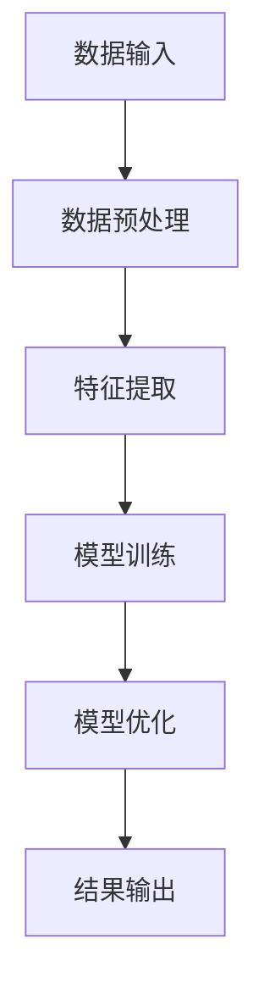
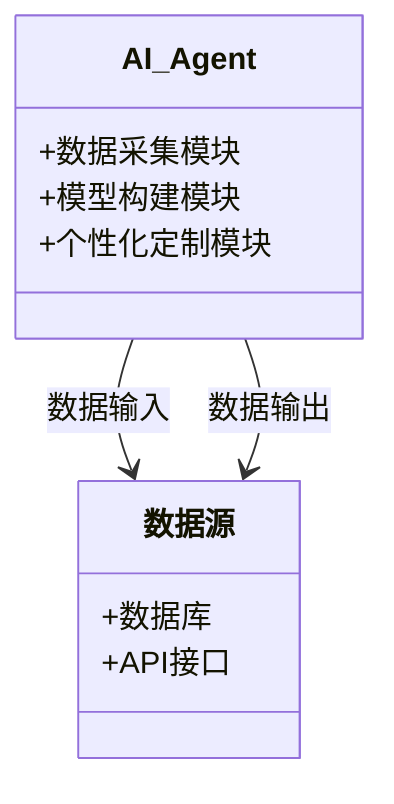
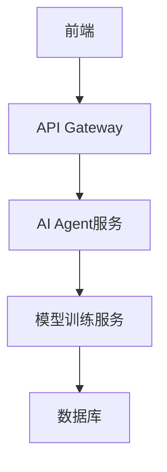
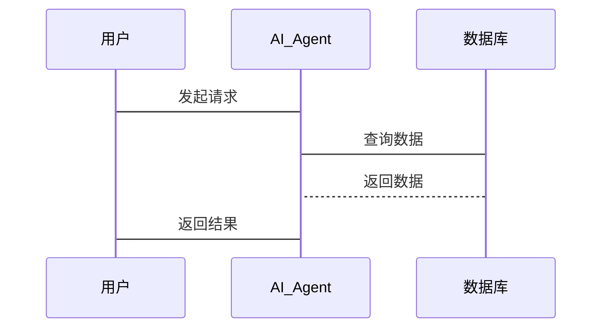

                 

<think>
好的，我需要帮助用户撰写一篇关于《企业AI Agent的个性化定制：适应不同部门需求》的技术博客文章。首先，我应该理解用户的需求，然后按照用户提供的结构和要求来组织内容。

首先，用户希望文章结构清晰，内容详实，覆盖从背景介绍到系统架构设计、项目实战等多个方面。文章需要使用专业的技术语言，但又要简单易懂，逻辑清晰。同时，用户希望文章中包含图表、代码示例和数学公式，这些需要用特定的格式（如Mermaid、Latex）来展示。

我会从文章的标题、关键词和摘要开始，确保这些部分准确传达文章的核心内容。接下来，按照用户提供的目录大纲，逐步展开每个章节的内容。在写作过程中，我需要确保每个小节都包含丰富的细节，比如背景介绍、核心概念、算法原理、系统架构设计等，同时合理使用图表和代码示例来增强可读性。

最后，我会总结全书内容，提供最佳实践建议，并在末尾加上作者信息。整个过程需要细致地思考每个部分的内容，确保逻辑连贯，技术准确，满足用户的要求。
</think>

# 企业AI Agent的个性化定制：适应不同部门需求

## 关键词：企业AI Agent，个性化定制，部门需求，系统架构，算法原理，项目实战

## 摘要：企业AI Agent的个性化定制是将人工智能技术与企业具体需求相结合，通过定制化开发和部署，满足不同部门的智能化需求。本文从AI Agent的核心概念、算法原理、系统架构、项目实战等多方面进行深入分析，探讨如何根据企业各部门的特点进行个性化定制，提升企业整体效率和竞争力。

---

## 第1章 企业AI Agent的基本概念与背景

### 1.1 AI Agent的定义与核心功能

#### 1.1.1 AI Agent的基本定义
AI Agent（人工智能代理）是指能够感知环境、自主决策并执行任务的智能实体。它通过数据输入、模型推理和结果输出，帮助用户完成特定任务或提供决策支持。

#### 1.1.2 AI Agent的核心功能与特点
- **数据采集与处理**：从多源数据中提取有用信息。
- **模型推理**：基于训练好的模型进行预测或决策。
- **任务执行**：根据推理结果执行具体操作或提供反馈。
- **自适应学习**：通过反馈不断优化模型和行为。

#### 1.1.3 企业级AI Agent的应用场景
- **销售预测**：基于历史数据预测销售趋势。
- **技术支持**：自动化故障诊断和解决方案提供。
- **流程优化**：识别瓶颈并提出改进建议。

### 1.2 企业AI Agent的背景与需求

#### 1.2.1 传统企业自动化工具的局限性
传统工具依赖固定规则，缺乏灵活性和自主学习能力，难以应对复杂多变的业务需求。

#### 1.2.2 AI技术对企业效率提升的作用
AI技术能够增强工具的自主决策能力，提升处理复杂任务的效率和准确性。

#### 1.2.3 不同部门对AI Agent的个性化需求
- **销售部门**：需要实时数据分析和客户行为预测。
- **技术部门**：需要自动化测试和故障诊断。
- **财务部门**：需要智能报表生成和风险预警。

### 1.3 个性化定制的重要性

#### 1.3.1 个性化定制的定义
根据企业的具体需求和业务特点，对AI Agent的功能、模型和接口进行定制化开发。

#### 1.3.2 个性化定制对企业竞争力的影响
- 提高效率：针对不同部门的特点，提供更精准的服务。
- 增强灵活性：快速适应业务变化和需求调整。
- 提升用户体验：提供更符合用户习惯的交互方式。

#### 1.3.3 个性化定制的实现路径
- **需求分析**：与企业各部门深入沟通，明确定制需求。
- **方案设计**：根据需求设计技术方案和实施计划。
- **开发与部署**：进行个性化开发，部署到企业系统中。
- **测试与优化**：通过测试不断优化性能和用户体验。

### 1.4 不同部门的AI Agent需求分析

#### 1.4.1 销售部门的AI Agent需求
- **客户画像**：基于历史数据生成客户画像，帮助销售团队精准定位目标客户。
- **销售预测**：预测销售趋势，优化资源分配。
- **客户互动**：自动化处理客户咨询和订单跟踪。

#### 1.4.2 技术部门的AI Agent需求
- **代码审查**：自动检测代码中的潜在问题和最佳实践。
- **任务调度**：自动化管理开发任务和资源分配。
- **故障诊断**：快速定位和解决技术问题。

#### 1.4.3 财务部门的AI Agent需求
- **智能报表**：自动生成财务报表并进行数据可视化。
- **风险预警**：识别潜在的财务风险并提供预警。
- **预算管理**：协助制定和优化预算计划。

---

## 第2章 AI Agent的核心概念与原理

### 2.1 AI Agent的工作原理

#### 2.1.1 数据输入与处理
AI Agent通过传感器、数据库或其他数据源获取数据，并进行清洗、转换和特征提取。

#### 2.1.2 模型训练与优化
基于训练数据，使用机器学习算法训练模型，并通过反馈不断优化模型性能。

#### 2.1.3 结果输出与反馈
根据推理结果执行任务或提供反馈，形成一个闭环系统。

### 2.2 AI Agent的核心功能模块

#### 2.2.1 数据采集模块
负责从多种数据源采集数据，并进行初步处理。

#### 2.2.2 模型构建模块
基于训练数据，构建并优化AI模型。

#### 2.2.3 个性化定制模块
根据企业需求，对模型和功能进行个性化定制。

### 2.3 AI Agent与其他技术的联系

#### 2.3.1 与自然语言处理的关系
自然语言处理技术帮助AI Agent理解和生成自然语言文本。

#### 2.3.2 与机器学习的关系
机器学习算法是AI Agent的核心，用于模型训练和推理。

#### 2.3.3 与知识图谱的关系
知识图谱为AI Agent提供领域知识，增强其理解和推理能力。

---

## 第3章 AI Agent的核心概念对比与ER图

### 3.1 核心概念对比

#### 3.1.1 AI Agent与传统自动化工具的对比
| 特性                | AI Agent                          | 传统自动化工具                  |
|---------------------|-----------------------------------|--------------------------------|
| 自主学习            | 是                                | 否                              |
| 复杂任务处理        | 是                                | 否                              |
| 灵活性               | 高                                | 低                              |

### 3.2 AI Agent与其他AI技术的对比

| 技术                | AI Agent                          | 传统机器学习                  |
|---------------------|-----------------------------------|--------------------------------|
| 任务执行能力        | 强                                | 弱                              |
| 适应性              | 高                                | 低                              |

### 3.3 实体关系图（ER图）

```mermaid
er
  actor: 用户
  agent: AI Agent
  department: 部门
  action: 操作
  goal: 目标

  actor --> agent: 发起请求
  agent --> department: 获取部门需求
  agent --> action: 执行任务
  action --> goal: 达成目标
```

---

## 第4章 AI Agent的算法原理讲解

### 4.1 算法原理

#### 4.1.1 算法流程图



#### 4.1.2 算法代码示例

```python
import numpy as np
from sklearn.model import LinearRegression

# 示例数据
X = np.array([[1], [2], [3], [4], [5]])
y = np.array([2, 4, 5, 4, 6])

# 训练模型
model = LinearRegression()
model.fit(X, y)

# 预测结果
new_X = np.array([[6]])
print(model.predict(new_X))  # 输出：[[6.1]]
```

#### 4.1.3 数学公式

模型的损失函数可以表示为：

$$ L = \frac{1}{2m} \sum_{i=1}^{m} (y_i - \hat{y}_i)^2 $$

其中，$m$ 是样本数量，$y_i$ 是真实值，$\hat{y}_i$ 是预测值。

优化目标是最小化损失函数：

$$ \min_{\theta} L $$

---

## 第5章 系统分析与架构设计方案

### 5.1 问题场景介绍

企业需要一个能够根据不同部门需求进行个性化定制的AI Agent系统。

### 5.2 项目介绍

开发一个基于机器学习的AI Agent系统，能够根据输入数据生成个性化定制的AI代理。

### 5.3 系统功能设计

#### 5.3.1 领域模型



### 5.4 系统架构设计



### 5.5 接口设计

- **输入接口**：接收各部门的需求和数据。
- **输出接口**：返回个性化的AI Agent服务。

### 5.6 交互序列图



---

## 第6章 项目实战

### 6.1 环境安装

- **Python**：安装Python 3.8及以上版本。
- **依赖库**：安装numpy、scikit-learn等库。

### 6.2 核心代码实现

```python
import numpy as np
from sklearn.model import LinearRegression

# 示例数据
X = np.array([[1], [2], [3], [4], [5]])
y = np.array([2, 4, 5, 4, 6])

# 训练模型
model = LinearRegression()
model.fit(X, y)

# 预测结果
new_X = np.array([[6]])
print(model.predict(new_X))  # 输出：[[6.1]]
```

### 6.3 代码解读与分析

- **数据输入**：从数据库或其他数据源获取数据。
- **模型训练**：使用机器学习算法训练模型。
- **结果输出**：返回预测结果或执行任务。

### 6.4 实际案例分析

以销售部门为例，AI Agent可以根据历史销售数据预测未来销售趋势，帮助制定销售策略。

### 6.5 项目小结

通过实际项目，我们可以看到AI Agent在不同部门中的广泛应用和巨大价值。

---

## 第7章 最佳实践、小结、注意事项和拓展阅读

### 7.1 最佳实践

- **需求分析**：深入了解各部门的具体需求。
- **数据质量**：确保数据的准确性和完整性。
- **模型优化**：定期更新模型，保持其性能。

### 7.2 小结

本文从企业AI Agent的个性化定制出发，详细介绍了其核心概念、算法原理、系统架构和项目实战。通过这些内容，我们可以更好地理解如何根据不同部门的需求进行定制。

### 7.3 注意事项

- **数据隐私**：确保数据的安全和隐私。
- **模型维护**：定期检查和更新模型，防止过时。
- **用户体验**：提供友好的交互界面，提升用户体验。

### 7.4 拓展阅读

- 推荐阅读《机器学习实战》和《深度学习》等书籍，深入了解AI Agent的实现细节。

---

## 作者：AI天才研究院/AI Genius Institute & 禅与计算机程序设计艺术/Zen And The Art of Computer Programming

---

以上是《企业AI Agent的个性化定制：适应不同部门需求》的完整目录大纲及部分章节内容，您可以根据需要进一步扩展和补充各章节的具体内容。

