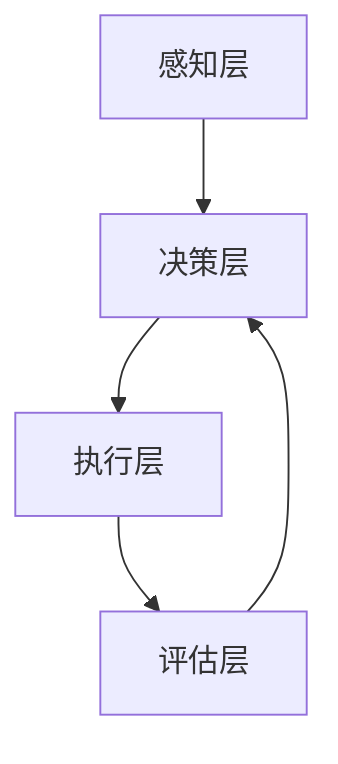
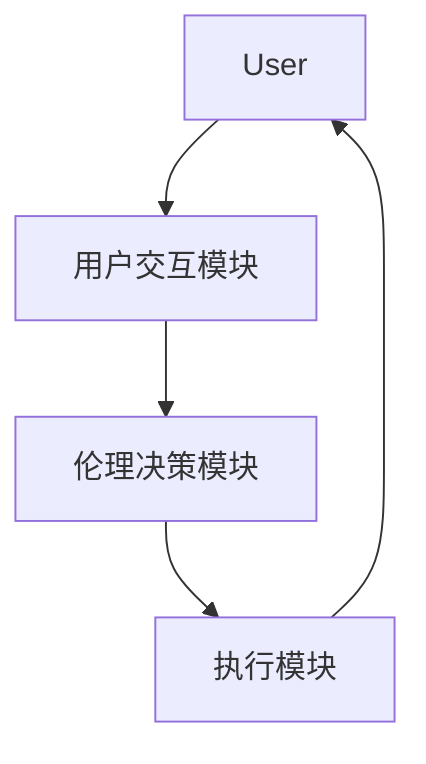

                 


# 企业AI Agent的伦理设计与道德决策框架

> 关键词：AI Agent，伦理设计，道德决策框架，企业智能，人工智能伦理

> 摘要：随着人工智能技术的迅速发展，企业AI Agent在各个行业的应用日益广泛。然而，AI Agent的决策过程涉及复杂的伦理和道德问题，如何设计和实现符合伦理规范的AI Agent成为企业和开发者面临的重大挑战。本文系统阐述了企业AI Agent的伦理设计与道德决策框架，从背景介绍、核心概念、算法原理、系统架构到项目实战和最佳实践，详细探讨了构建伦理驱动的AI Agent的各个方面。

---

# 第一部分: 企业AI Agent的背景与概述

## 第1章: AI Agent的基本概念与演进

### 1.1 AI Agent的定义与核心特征

#### 1.1.1 AI Agent的定义

AI Agent（人工智能代理）是指能够感知环境、自主决策并采取行动以实现特定目标的智能实体。与传统程序不同，AI Agent具备以下核心特征：

- **自主性**：能够在没有外部干预的情况下独立运行。
- **反应性**：能够实时感知环境并做出反应。
- **目标导向性**：所有行为均以实现特定目标为导向。
- **学习能力**：能够通过经验改进自身性能。

AI Agent可以是软件程序、机器人或其他智能系统，广泛应用于自动驾驶、智能客服、金融交易等领域。

#### 1.1.2 AI Agent的核心特征

| 特征         | 描述                                                         |
|--------------|--------------------------------------------------------------|
| 自主性       | 能够独立运行，无需外部干预                               |
| 反应性       | 能够实时感知环境并做出反应                               |
| 目标导向性   | 行为以实现特定目标为导向                                   |
| 学习能力     | 能够通过经验改进性能                                       |

#### 1.1.3 AI Agent与传统程序的区别

- **自主性**：AI Agent具备自主决策能力，而传统程序通常按照预设逻辑运行。
- **适应性**：AI Agent能够根据环境变化调整行为，传统程序则不具备这种能力。
- **目标导向性**：AI Agent的行为以目标为导向，传统程序则以任务为导向。

### 1.2 AI Agent的演进历程

#### 1.2.1 从简单规则到复杂决策的演进

早期的AI Agent主要基于简单的规则进行决策，例如专家系统。随着技术进步，AI Agent逐渐采用机器学习、深度学习等技术，能够处理复杂场景下的决策问题。

#### 1.2.2 大模型对AI Agent能力的提升

大语言模型（如GPT）的出现，显著提升了AI Agent的自然语言处理和决策能力，使其能够理解上下文并做出更复杂的决策。

#### 1.2.3 企业级AI Agent的发展趋势

企业级AI Agent正在向更智能化、更人性化的方向发展，具备以下趋势：

- **多模态交互**：支持文本、语音、视觉等多种交互方式。
- **实时决策**：能够在极短时间内完成复杂决策。
- **可解释性**：决策过程更加透明，便于人类理解和信任。

### 1.3 企业AI Agent的应用场景

#### 1.3.1 企业内部的智能决策支持

- **供应链优化**：通过AI Agent实时监控库存、预测需求，优化供应链管理。
- **风险管理**：AI Agent能够实时分析市场动态，识别潜在风险并提出应对策略。

#### 1.3.2 客户交互中的AI Agent应用

- **智能客服**：通过自然语言处理技术，提供更智能、更个性化的客户服务。
- **个性化推荐**：基于用户行为和偏好，推荐相关内容或产品。

#### 1.3.3 行业领域的典型应用案例

- **金融行业**：AI Agent用于股票交易、风险管理等领域。
- **医疗行业**：AI Agent辅助医生进行诊断、治疗方案推荐。
- **制造业**：AI Agent用于生产优化、质量控制等。

---

## 1.4 本章小结

本章从AI Agent的基本概念、演进历程以及应用场景三个方面，全面介绍了企业AI Agent的背景知识。通过对比传统程序，明确了AI Agent的核心特征和优势，为后续章节的伦理设计与道德决策框架奠定了基础。

---

# 第二部分: 伦理与道德决策框架的核心概念

## 第2章: 伦理决策框架的构建

### 2.1 伦理决策框架的定义

伦理决策框架是指用于指导AI Agent在决策过程中遵循伦理规范的系统架构和规则集合。它包括伦理原则、决策规则、评估机制等多个方面。

### 2.2 伦理决策框架的设计原则

#### 2.2.1 可解释性原则

AI Agent的决策过程需要具备可解释性，确保人类能够理解其决策逻辑。

#### 2.2.2 可控性原则

在紧急情况下，人类能够干预或控制AI Agent的行为。

#### 2.2.3 透明性原则

AI Agent的决策过程和依据需要向用户或相关方公开，增强信任。

### 2.3 伦理决策框架的实现步骤

#### 2.3.1 问题分析与目标设定

明确AI Agent的决策场景和目标，确定需要考虑的伦理因素。

#### 2.3.2 伦理规则的制定

基于伦理原则，制定具体的决策规则，例如“保护用户隐私”“避免伤害他人”等。

#### 2.3.3 决策模型的构建与验证

通过机器学习或其他方法，构建决策模型，并通过测试用例验证其符合伦理规范。

---

## 2.4 本章小结

本章重点介绍了伦理决策框架的构建过程，从定义、设计原则到实现步骤，为后续章节的算法实现奠定了基础。

---

# 第三部分: 伦理与道德决策框架的系统架构

## 第3章: 伦理决策框架的系统架构设计

### 3.1 系统架构概述

系统架构包括感知层、决策层、执行层和评估层，各层之间通过接口进行交互。

#### 3.1.1 系统架构的组成

- **感知层**：负责收集环境信息。
- **决策层**：基于伦理规则进行决策。
- **执行层**：将决策转化为具体行动。
- **评估层**：对决策结果进行评估和优化。

#### 3.1.2 系统架构的分层设计



### 3.2 系统架构的关键模块设计

#### 3.2.1 感知模块

负责接收输入信息并进行初步处理，例如自然语言理解、图像识别等。

#### 3.2.2 决策模块

基于伦理规则和决策模型，生成决策结果。

#### 3.2.3 执行模块

将决策结果转化为具体行动，例如发送邮件、调整参数等。

#### 3.2.4 评估模块

对决策结果进行评估，优化伦理规则和决策模型。

---

## 3.3 本章小结

本章详细探讨了伦理决策框架的系统架构设计，明确了各模块的功能和交互关系，为后续章节的算法实现提供了系统级的支持。

---

# 第四部分: 伦理与道德决策框架的算法实现

## 第4章: 伦理决策算法的实现

### 4.1 伦理决策算法概述

伦理决策算法是AI Agent实现伦理决策的核心技术，通常基于规则、案例推理或效用函数。

#### 4.1.1 基于规则的伦理决策算法

通过预定义的伦理规则进行决策，适用于规则明确的场景。

#### 4.1.2 基于案例的伦理决策算法

通过匹配历史案例，生成新的决策方案。

#### 4.1.3 基于效用的伦理决策算法

通过优化效用函数，实现伦理决策的最优解。

### 4.2 基于规则的伦理决策算法实现

#### 4.2.1 算法流程

1. 输入决策场景。
2. 匹配预定义的伦理规则。
3. 生成决策结果。

#### 4.2.2 代码实现

```python
def ethical_decision(rule_set, scenario):
    for rule in rule_set:
        if rule.applies_to(scenario):
            return rule.generate_decision(scenario)
    return default_decision
```

### 4.3 基于效用的伦理决策算法实现

#### 4.3.1 算法流程

1. 定义效用函数。
2. 优化效用函数，找到最优解。
3. 输出决策结果。

#### 4.3.2 代码实现

```python
def utility_function(action, scenario):
    return sum([penalty(action, attribute) for attribute in scenario.attributes])

def optimize_utility(rule_set, scenario):
    from scipy.optimize import minimize
    import numpy as np

    # 定义目标函数
    def objective(x):
        utility = 0
        for rule in rule_set:
            if rule.applies_to(scenario):
                utility += rule.utility(x)
        return utility

    # 初始化参数
    x0 = np.random.rand(len(rule_set))
    
    # 最优化
    result = minimize(objective, x0, method='BFGS')
    return result.x
```

### 4.4 本章小结

本章详细介绍了伦理决策算法的实现方法，从基于规则的算法到基于效用的优化算法，为构建伦理驱动的AI Agent提供了技术支撑。

---

# 第五部分: 项目实战

## 第5章: 企业AI Agent伦理决策框架的实现

### 5.1 项目背景与目标

本项目旨在设计并实现一个符合伦理规范的企业AI Agent，应用于智能客服领域。

### 5.2 系统功能设计

#### 5.2.1 系统功能模块

- **用户交互模块**：负责与用户交互。
- **伦理决策模块**：负责伦理决策。
- **执行模块**：负责执行决策结果。

#### 5.2.2 系统功能流程



### 5.3 系统实现

#### 5.3.1 环境配置

安装所需库：

```bash
pip install numpy scipy matplotlib
```

#### 5.3.2 核心代码实现

```python
class EthicalDecisionAgent:
    def __init__(self, rule_set):
        self.rule_set = rule_set

    def decide(self, scenario):
        for rule in self.rule_set:
            if rule.apply(scenario):
                return rule.decide(scenario)
        return default_decision
```

### 5.4 项目小结

本章通过实际案例展示了如何实现一个伦理驱动的AI Agent，从环境配置到核心代码实现，为读者提供了宝贵的实战经验。

---

# 第六部分: 最佳实践与总结

## 第6章: 最佳实践与注意事项

### 6.1 最佳实践

- **明确伦理目标**：在设计AI Agent时，首先明确其伦理目标。
- **可解释性设计**：确保AI Agent的决策过程可解释。
- **持续优化**：定期评估和优化伦理决策框架。

### 6.2 小结

通过本文的系统介绍和实战案例，读者可以全面理解企业AI Agent的伦理设计与道德决策框架。未来，随着技术的发展，AI Agent的伦理设计将更加重要，需要企业和开发者共同努力，构建符合伦理规范的智能系统。

---

# 作者：AI天才研究院/AI Genius Institute & 禅与计算机程序设计艺术 /Zen And The Art of Computer Programming

---

以上是《企业AI Agent的伦理设计与道德决策框架》的目录和部分章节内容，涵盖了从背景介绍到项目实战的各个方面，为构建符合伦理规范的AI Agent提供了系统化的指导和实践案例。

