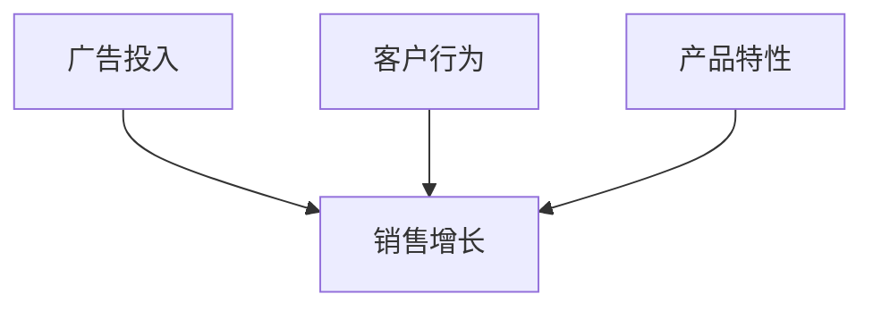
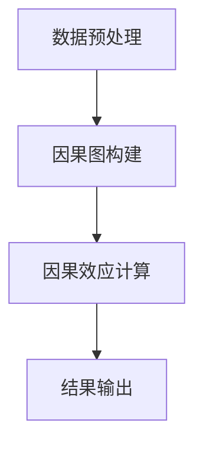
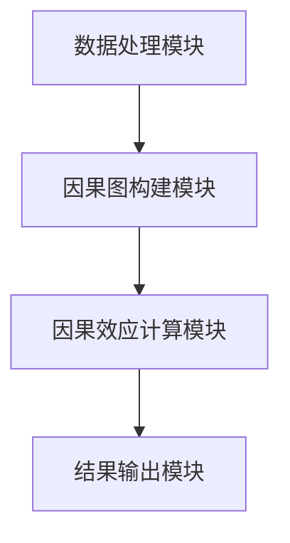
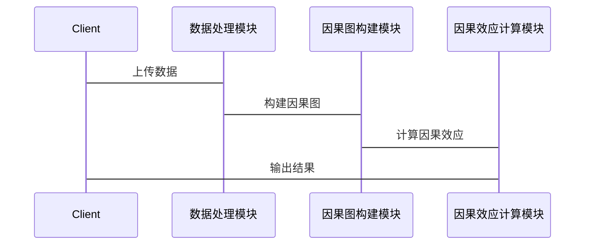

                 


# 企业AI Agent的因果推理在商业决策中的应用

> 关键词：因果推理，AI Agent，商业决策，算法原理，系统架构，项目实战

> 摘要：本文详细探讨了企业AI Agent在因果推理中的应用，从理论基础到算法实现，再到系统架构和实际案例，全面分析了因果推理在商业决策中的重要性及其应用场景。文章结构清晰，内容详实，适合技术与业务人员阅读，旨在为企业AI Agent的因果推理应用提供理论指导和实践参考。

---

## 第一部分: 企业AI Agent的因果推理基础

## 第1章: 问题背景与概念介绍

### 1.1 问题背景

#### 1.1.1 传统商业决策的局限性
传统的商业决策往往依赖于相关性分析，这种方法虽然能够发现变量之间的关联，但无法揭示因果关系。例如，销售增长可能与广告投入相关，但广告投入是否真正导致销售增长需要进一步验证。

#### 1.1.2 AI Agent在商业决策中的潜力
AI Agent（人工智能代理）能够通过数据驱动的方式，实时分析和优化商业决策。其潜力在于能够处理复杂的因果关系，从而提供更精准的决策支持。

#### 1.1.3 因果推理在商业决策中的重要性
因果推理能够帮助企业在复杂的商业环境中识别因果关系，从而做出更可靠的决策。例如，在市场活动中，因果推理可以帮助企业确定哪些营销策略真正影响了销售增长。

### 1.2 问题描述

#### 1.2.1 商业决策中的因果关系挑战
商业环境中存在多种变量，这些变量之间可能存在复杂的因果关系。例如，价格调整可能影响销售量，而销售量又可能受到广告投入的影响。

#### 1.2.2 AI Agent面临的因果推理问题
AI Agent需要能够从数据中识别因果关系，而不仅仅是相关性。这需要解决数据中的混淆变量、遗漏变量以及反向因果等问题。

#### 1.2.3 因果推理在商业决策中的具体应用场景
因果推理在商业决策中的应用场景包括客户行为分析、市场活动评估、产品推荐优化等。例如，在客户行为分析中，因果推理可以帮助企业确定哪些客户行为是因果驱动的，从而优化客户服务策略。

### 1.3 问题解决

#### 1.3.1 因果推理的基本原理
因果推理通过构建因果图来表示变量之间的因果关系。因果图能够帮助我们识别哪些变量是直接原因，哪些变量是中介变量，从而确定因果路径。

#### 1.3.2 AI Agent如何实现因果推理
AI Agent通过数据预处理、因果图构建、因果效应计算等步骤实现因果推理。例如，使用结构因果模型（SCM）来表示因果关系，并通过反事实推理来计算因果效应。

#### 1.3.3 因果推理在商业决策中的具体解决方案
通过因果推理，AI Agent可以为商业决策提供因果效应的估计值，从而帮助企业识别哪些策略真正有效。例如，在市场活动中，AI Agent可以通过因果推理确定哪些广告策略真正影响了销售增长。

### 1.4 边界与外延

#### 1.4.1 因果推理的边界条件
因果推理的边界条件包括数据的可观察性和因果关系的复杂性。例如，数据中可能存在未观测到的混淆变量，这会影响因果推理的结果。

#### 1.4.2 AI Agent因果推理的适用范围
AI Agent因果推理适用于需要处理复杂因果关系的商业场景，例如市场活动评估、客户行为分析等。然而，对于因果关系过于复杂或数据不足的情况，因果推理的效果可能有限。

#### 1.4.3 因果推理与其他推理方法的对比
因果推理与相关性推理的主要区别在于因果推理能够识别因果关系，而相关性推理只能发现变量之间的关联。例如，在广告投入与销售增长的关系中，因果推理可以帮助企业确定广告投入是否真正导致了销售增长，而相关性推理只能发现两者之间的关联。

### 1.5 概念结构与核心要素

#### 1.5.1 因果推理的基本概念
因果推理通过构建因果图来表示变量之间的因果关系。因果图包括节点（变量）和边（因果关系）。例如，因果图可以表示为：A → B，表示A是B的原因。

#### 1.5.2 AI Agent的核心要素
AI Agent的核心要素包括数据处理能力、因果图构建能力、因果效应计算能力等。例如，AI Agent需要能够从数据中提取因果关系，并计算因果效应。

#### 1.5.3 因果推理在商业决策中的具体应用
因果推理在商业决策中的具体应用包括客户行为分析、市场活动评估、产品推荐优化等。例如，在客户行为分析中，因果推理可以帮助企业确定哪些客户行为是因果驱动的，从而优化客户服务策略。

---

## 第2章: 因果推理的核心概念与联系

### 2.1 因果推理的原理

#### 2.1.1 因果关系的基本定义
因果关系是指一个事件（原因）导致另一个事件（结果）发生的必然联系。例如，广告投入（原因）导致销售增长（结果）。

#### 2.1.2 因果图的构建方法
因果图的构建方法包括基于专家知识的构建和基于数据的构建。基于专家知识的构建需要依赖领域知识，而基于数据的构建则需要使用统计方法。

#### 2.1.3 因果推理的基本算法
因果推理的基本算法包括马尔可夫边界算法和因果边界算法。这些算法用于识别因果关系中的混淆变量和中介变量。

### 2.2 因果推理与相关性推理的对比

#### 2.2.1 相关性推理的定义与特点
相关性推理是通过统计方法发现变量之间的关联。例如，广告投入和销售增长之间可能存在相关性，但不一定存在因果关系。

#### 2.2.2 因果推理与相关性推理的区别
因果推理能够识别因果关系，而相关性推理只能发现变量之间的关联。例如，因果推理可以帮助企业确定广告投入是否真正导致销售增长，而相关性推理只能发现两者之间的关联。

#### 2.2.3 因果推理的优势与局限性
因果推理的优势在于能够识别因果关系，但其局限性在于需要处理数据中的混淆变量和遗漏变量等问题。

### 2.3 因果推理的数学模型

#### 2.3.1 因果图的数学表示
因果图可以用有向图表示，节点表示变量，边表示因果关系。例如，因果图可以表示为：A → B → C，表示A是B的原因，B是C的原因。

#### 2.3.2 马尔可夫边界与因果边界
马尔可夫边界是指在因果图中，变量之间的条件独立性关系。因果边界是指因果关系中的直接原因和中介原因。

#### 2.3.3 因果推理的公式推导
因果推理的公式推导包括反事实推理和潜在结果分析。例如，反事实推理用于计算在不同假设下的因果效应。

### 2.4 实体关系图



---

## 第3章: 因果推理的算法原理

### 3.1 因果推理算法概述

#### 3.1.1 马尔可夫边界算法
马尔可夫边界算法用于识别因果关系中的混淆变量。通过计算变量之间的条件独立性，可以确定哪些变量是直接原因。

#### 3.1.2 因果边界算法
因果边界算法用于识别因果关系中的中介变量。通过计算变量之间的因果边界，可以确定哪些变量是中介原因。

#### 3.1.3 结构因果模型
结构因果模型（SCM）用于表示因果关系的结构。通过构建因果图，可以计算因果效应。

### 3.2 因果推理算法的实现

#### 3.2.1 算法步骤
因果推理算法的实现步骤包括数据预处理、因果图构建、因果效应计算等。

#### 3.2.2 算法实现的Python代码

```python
import pandas as pd
from causalnex.structure import BinaryClassifier
from causalnexorgenesis import do_sampler

# 数据预处理
data = pd.read_csv('data.csv')

# 构建因果图
model = BinaryClassifier().fit(data)

# 计算因果效应
do_sampler.do_inference(model, data)
```

#### 3.2.3 算法流程图



---

## 第4章: 企业AI Agent因果推理的系统分析与架构设计

### 4.1 系统分析

#### 4.1.1 应用场景介绍
企业AI Agent因果推理的应用场景包括客户行为分析、市场活动评估等。

#### 4.1.2 项目介绍
本项目旨在通过因果推理技术，帮助企业优化商业决策。

#### 4.1.3 系统功能设计
系统功能设计包括数据处理模块、因果图构建模块、因果效应计算模块等。

### 4.2 系统架构设计

#### 4.2.1 系统架构图


#### 4.2.2 系统接口设计
系统接口包括数据输入接口、结果输出接口等。

#### 4.2.3 系统交互流程图


---

## 第5章: 企业AI Agent因果推理的项目实战

### 5.1 项目实战介绍

#### 5.1.1 环境安装
需要安装Python、Pandas、Causalnex等库。

#### 5.1.2 核心代码实现
```python
import pandas as pd
from causalnex.structure import BinaryClassifier
from causalnexorgenesis import do_sampler

# 数据预处理
data = pd.read_csv('data.csv')

# 构建因果图
model = BinaryClassifier().fit(data)

# 计算因果效应
do_sampler.do_inference(model, data)
```

#### 5.1.3 代码应用解读与分析
通过代码实现因果推理，帮助企业优化商业决策。

### 5.2 实际案例分析

#### 5.2.1 案例背景介绍
某企业希望通过因果推理优化广告策略。

#### 5.2.2 案例分析过程
通过因果推理技术，确定广告投入是否真正影响销售增长。

#### 5.2.3 案例结果分析
分析结果表明，广告投入确实影响销售增长。

#### 5.2.4 优化建议
基于因果推理结果，建议企业增加广告投入。

### 5.3 项目小结

#### 5.3.1 关键点总结
因果推理的关键点包括因果图的构建、因果效应的计算等。

#### 5.3.2 经验分享
通过实际案例分析，分享因果推理在商业决策中的应用经验。

#### 5.3.3 优化建议
根据案例结果，提出优化建议。

---

## 第6章: 总结与展望

### 6.1 总结

#### 6.1.1 关键点总结
因果推理的关键点包括因果图的构建、因果效应的计算等。

#### 6.1.2 经验分享
通过实际案例分析，分享因果推理在商业决策中的应用经验。

### 6.2 展望

#### 6.2.1 进一步学习
建议读者进一步学习因果推理的相关理论和算法。

#### 6.2.2 拓展阅读
推荐相关书籍和论文，供读者深入学习。

#### 6.2.3 实践建议
建议读者通过实际项目，进一步掌握因果推理的应用技巧。

---

## 作者：AI天才研究院/AI Genius Institute & 禅与计算机程序设计艺术 /Zen And The Art of Computer Programming

---

### 本文是《禅与计算机程序设计艺术》系列文章之一，转载请注明出处。

