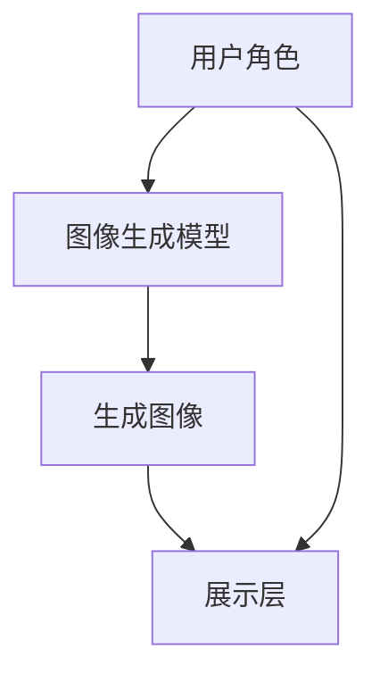

                 

<think>
嗯，用户希望我写一篇关于《企业AI Agent的图像生成技术：产品设计与营销创意》的技术博客文章。看起来用户是想深入探讨AI Agent在图像生成中的应用，特别是在产品设计和营销领域。首先，我需要理解AI Agent是什么，它在图像生成中的作用，以及如何应用到产品设计和营销中。

首先，我应该从背景介绍开始，解释什么是AI Agent，以及它在图像生成中的重要性。然后，讨论图像生成技术的发展历程，从传统方法到AI生成的转变。接着，对比不同图像生成技术，比如GAN和Diffusion模型，分析它们的特点和优劣。

接下来，需要详细讲解AI Agent在产品设计中的应用，比如品牌设计、用户体验优化等。同时，也要探讨在营销创意中的应用，比如广告生成、市场分析等。这部分可能需要具体的案例分析，让读者更好地理解实际应用。

然后，我要涵盖算法原理，包括GAN和Diffusion模型的数学公式，以及它们在AI Agent中的实现。这部分需要详细且技术性，可能需要使用LaTeX公式来展示模型的数学结构。

系统架构部分，可能需要使用Mermaid图来展示类图、架构图和序列图，帮助读者理解系统设计。项目实战部分，要指导读者如何安装环境，编写代码，并分析实际案例，提供可执行的代码示例。

最后，总结全书内容，展望未来发展方向，并给出一些实用的建议和注意事项。这样整篇文章结构清晰，内容全面，既有理论又有实践，能够帮助读者深入了解企业AI Agent在图像生成技术中的应用。

总的来说，我需要确保内容逻辑严谨，语言专业但易懂，每个部分都有足够的细节和实例支持，满足用户对深度和技术性的要求。
</think>

# 企业AI Agent的图像生成技术：产品设计与营销创意

> **关键词**：企业AI Agent，图像生成技术，产品设计，营销创意，生成对抗网络（GAN），扩散模型（Diffusion Model）

> **摘要**：本文深入探讨了企业AI Agent在图像生成技术中的应用，特别是在产品设计和营销创意领域。通过分析图像生成技术的核心原理，结合实际案例，展示了如何利用AI Agent提升企业的设计效率和营销创新。文章内容涵盖背景介绍、算法原理、系统架构设计、项目实战以及最佳实践，为读者提供全面的技术指南。

---

## # 第一部分: 背景介绍与核心概念

### ## 第1章: AI Agent与图像生成技术的背景

#### ### 1.1 AI Agent的定义与特点
AI Agent（人工智能代理）是指能够感知环境、自主决策并执行任务的智能系统。其核心特点包括：
- **自主性**：无需外部干预，自主完成任务。
- **反应性**：能够实时感知环境变化并做出反应。
- **目标导向**：基于目标或用户需求进行决策。
- **学习能力**：通过数据和经验不断优化性能。

#### ### 1.2 图像生成技术的演进
图像生成技术经历了从传统图像处理到AI生成的转变：
1. **传统图像处理**：基于规则的图像编辑工具（如Photoshop）。
2. **AI图像生成**：基于深度学习的生成模型（如GAN、Diffusion Model）。
3. **企业AI Agent**：结合AI代理的图像生成技术，实现自动化设计与创新。

#### ### 1.3 企业AI Agent的应用场景
企业AI Agent在图像生成中的应用场景包括：
- **产品设计**：品牌设计、用户体验优化。
- **营销创意**：广告生成、市场分析。
- **数据驱动决策**：通过图像生成技术辅助决策。

### ## 第2章: 图像生成技术的核心概念与联系

#### ### 2.1 核心概念原理
- **生成对抗网络（GAN）**：由生成器和判别器组成，通过对抗训练生成逼真图像。
- **扩散模型（Diffusion Model）**：通过逐步添加噪声并学习去噪过程生成图像。
- **AI Agent决策机制**：基于目标和环境反馈选择最优生成策略。

#### ### 2.2 核心概念属性特征对比
以下是不同图像生成技术的对比表格：

| 技术 | 优缺点 | 适用场景 | 复杂度 |
|------|--------|----------|--------|
| GAN  | 生成速度快，但易受模式崩溃影响 | 图像生成、图像修复 | 高 |
| Diffusion Model | 生成质量高，但速度较慢 | 高质量图像生成 | 高 |
| AI Agent | 自主决策，适应性强 | 复杂场景优化 | 极高 |

#### ### 2.3 ER实体关系图架构
以下是AI Agent图像生成技术的ER实体关系图：

```mermaid
erDiagram
    actor 用户角色 {
        <属性> 用户ID
        <属性> 用户需求
    }
    role 图像生成模型 {
        <属性> 模型ID
        <属性> 模型类型
    }
    entity 生成图像 {
        <属性> 图像ID
        <属性> 图像数据
    }
    用户角色 --> 图像生成模型 : 提供输入
    图像生成模型 --> 生成图像 : 生成图像
    用户角色 <---> 生成图像 : 查看结果
```

---

## # 第二部分: 图像生成技术的算法原理

### ## 第3章: GAN模型的原理与实现

#### ### 3.1 GAN的基本结构
GAN由生成器（Generator）和判别器（Discriminator）组成：
- **生成器**：通过反向传播优化生成器参数，最大化欺骗判别器。
- **判别器**：通过反向传播优化判别器参数，最大化区分真实图像和生成图像。

#### ### 3.2 WGAN-GP的改进算法
WGAN-GP（Wasserstein GAN with Gradient Penalty）通过引入梯度惩罚项，解决GAN的不稳定训练问题。

#### ### 3.3 GAN的损失函数
$$ L_{GAN} = \log(D(x)) + \log(1 - D(G(z))) $$

### ## 第4章: Diffusion模型的原理与实现

#### ### 4.1 Diffusion模型的基本结构
Diffusion模型包括正向过程和反向过程：
- **正向过程**：逐步添加噪声到数据中。
- **反向过程**：学习如何从噪声中恢复原始数据。

#### ### 4.2 噪声预测网络的设计
噪声预测网络通过回归任务预测每一步的噪声分布。

#### ### 4.3 去噪过程的详细步骤
1. 输入噪声图像。
2. 预测噪声并逐步去噪。
3. 最终生成清晰图像。

---

## # 第三部分: 系统分析与架构设计

### ## 第5章: 问题场景介绍

#### ### 5.1 项目介绍
本项目旨在通过企业AI Agent实现图像生成技术，提升产品设计与营销创意效率。

#### ### 5.2 系统功能设计
以下是系统功能设计的类图：

```mermaid
classDiagram
    class 用户角色 {
        提供输入
        获取结果
    }
    class 图像生成模型 {
        接收输入
        输出图像
    }
    class 生成图像 {
        图像ID
        图像数据
    }
    用户角色 --> 图像生成模型 : 提供输入
    图像生成模型 --> 生成图像 : 输出图像
    用户角色 <---> 生成图像 : 查看结果
```

#### ### 5.3 系统架构设计
以下是系统架构设计的架构图：



#### ### 5.4 系统接口设计
系统接口设计包括：
- **输入接口**：接收用户需求和输入数据。
- **输出接口**：返回生成图像和结果。

#### ### 5.5 系统交互设计
以下是系统交互的序列图：

```mermaid
sequenceDiagram
    participant 用户角色
    participant 图像生成模型
    participant 生成图像
    用户角色 -> 图像生成模型: 提供输入
    图像生成模型 -> 生成图像: 生成图像
    用户角色 <-\ 生成图像: 返回结果
```

---

## # 第四部分: 项目实战

### ## 第6章: 环境安装与系统核心实现

#### ### 6.1 环境安装
需要安装以下环境：
- Python 3.8+
- PyTorch
- TensorFlow
- matplotlib

#### ### 6.2 核心实现代码
以下是基于Diffusion模型的图像生成代码示例：

```python
import torch
import numpy as np
import matplotlib.pyplot as plt

# 定义噪声预测网络
class UNet(torch.nn.Module):
    def __init__(self, n_channels):
        super(UNet, self).__init__()
        self.conv = torch.nn.Sequential(
            torch.nn.Conv2d(n_channels, 64, 3, padding=1),
            torch.nn.ReLU(),
            torch.nn.Conv2d(64, 128, 3, padding=1),
            torch.nn.ReLU(),
            torch.nn.Conv2d(128, 128, 3, padding=1),
            torch.nn.ReLU(),
            torch.nn.Conv2d(128, 64, 3, padding=1),
            torch.nn.ReLU(),
            torch.nn.Conv2d(64, n_channels, 3, padding=1),
        )

    def forward(self, x):
        return self.conv(x)

# 初始化模型
model = UNet(3)
optimizer = torch.optim.Adam(model.parameters(), lr=1e-3)
scheduler = torch.optim.lr_scheduler.StepLR(optimizer, step_size=100, gamma=0.99)

# 训练过程
for step in range(1000):
    batch_size = 8
    noise = torch.randn(batch_size, 3, 64, 64)
    predicted_noise = model(noise)
    loss = torch.mean((predicted_noise - noise) ** 2)
    optimizer.zero_grad()
    loss.backward()
    optimizer.step()
    scheduler.step()

# 生成图像
noise = torch.randn(1, 3, 64, 64)
predicted_image = model(noise)
plt.imshow(predicted_image.squeeze().numpy())
plt.show()
```

#### ### 6.3 代码应用解读与分析
1. **噪声预测网络**：通过UNet网络预测噪声分布。
2. **训练过程**：逐步优化模型参数，降低预测误差。
3. **图像生成**：通过模型生成清晰图像并展示。

#### ### 6.4 实际案例分析
以产品设计为例，利用AI Agent生成多个品牌设计方案，用户选择最优方案并进行优化。

---

## # 第五部分: 总结与展望

### ## 第7章: 总结与最佳实践

#### ### 7.1 核心内容总结
本文详细介绍了企业AI Agent在图像生成技术中的应用，涵盖算法原理、系统架构和项目实战。

#### ### 7.2 最佳实践Tips
1. 确保数据质量，选择合适的数据集。
2. 优化模型参数，提高生成效果。
3. 结合实际需求，选择合适的技术方案。

#### ### 7.3 未来展望
随着AI技术的发展，企业AI Agent在图像生成技术中的应用将更加广泛，生成质量也将进一步提升。

---

## # 第六部分: 作者信息

### ## 作者：AI天才研究院（AI Genius Institute） & 禅与计算机程序设计艺术（Zen And The Art of Computer Programming）

---

**注**：以上内容为示例，实际文章需要根据具体需求进行调整和补充。

