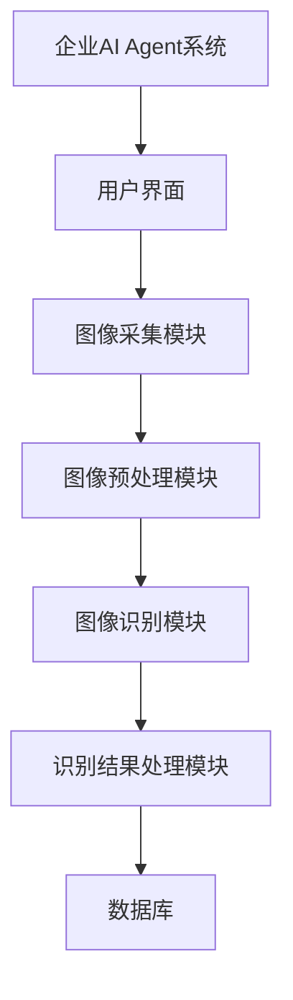

                 


# 企业AI Agent的图像识别与处理技术应用

> **关键词**: 企业AI Agent, 图像识别, 计算机视觉, 图像处理, 人工智能, 系统架构设计

> **摘要**: 本文深入探讨了企业AI Agent在图像识别与处理技术中的应用，从基础概念到算法原理，再到系统设计与实际项目实现，全面分析了企业AI Agent如何利用图像识别技术提升业务效率。通过具体案例和代码实现，详细讲解了图像分类、目标检测、OCR等关键技术，并结合系统架构设计和最佳实践，为读者提供了从理论到实践的完整指南。

---

## 第1章: 企业AI Agent与图像识别概述

### 1.1 企业AI Agent的定义与特点

#### 1.1.1 AI Agent的基本概念
AI Agent（智能体）是一种能够感知环境、自主决策并执行任务的智能系统。在企业场景中，AI Agent通常用于自动化处理业务流程、数据处理、客户交互等任务。

- **感知环境**: 通过传感器或数据接口获取环境信息。
- **自主决策**: 基于感知的信息，利用算法做出决策。
- **执行任务**: 执行预设或动态调整的任务。

#### 1.1.2 企业AI Agent的核心特征
- **智能化**: 利用机器学习、自然语言处理等技术实现智能决策。
- **自动化**: 自动执行任务，减少人工干预。
- **适应性**: 根据环境变化动态调整行为。
- **可扩展性**: 支持多种任务和场景的扩展。

#### 1.1.3 图像识别技术在企业AI Agent中的作用
图像识别是AI Agent的重要能力之一，主要用于处理图像数据，提取有用信息。例如，在企业文档管理中，AI Agent可以通过OCR技术识别文档内容，自动分类和归档。

### 1.2 图像识别技术的背景与应用

#### 1.2.1 图像识别技术的发展历程
- **早期阶段**: 基于传统图像处理技术，如边缘检测、模板匹配。
- **深度学习阶段**: 引入CNN（卷积神经网络）等深度学习模型，显著提升识别精度。

#### 1.2.2 图像识别技术的分类与特点
- **图像分类**: 对整张图像进行分类，如将图片分为“猫”或“狗”。
- **目标检测**: 在图像中定位并识别目标物体，如在监控视频中检测车辆。
- **图像分割**: 对图像中的每个像素进行分类，如医学图像分割。
- **OCR**: 识别图像中的文字，如扫描文档中的文本提取。

#### 1.2.3 企业场景中的图像识别应用
- **文档处理**: 自动识别和分类文档，如 receipts、 invoices。
- **视觉检测**: 在制造业中用于缺陷检测。
- **身份识别**: 通过人脸识别进行身份验证。

### 1.3 企业AI Agent与图像识别的结合

#### 1.3.1 AI Agent在企业中的应用场景
- **自动化工作流**: 自动处理文档、邮件分类。
- **智能监控**: 实时监控视频流，识别异常行为。
- **客户交互**: 通过图像识别辅助客服处理客户请求。

#### 1.3.2 图像识别技术在企业AI Agent中的应用
- **文档管理**: 自动识别文档内容，分类存储。
- **数据录入**: 通过OCR技术自动提取表格数据。
- **市场分析**: 从图像数据中提取竞争对手信息。

#### 1.3.3 企业AI Agent与图像识别的未来趋势
- **多模态融合**: 结合文本、语音、图像等多种数据源。
- **实时性提升**: 优化算法，实现低延迟的实时识别。
- **可解释性增强**: 提供更透明的识别结果，便于调试和优化。

---

## 第2章: 图像识别的核心技术与算法原理

### 2.1 图像分类算法

#### 2.1.1 基于CNN的图像分类
CNN（卷积神经网络）是图像分类的核心技术。以下是典型的CNN架构：

$$ \text{卷积层} \rightarrow \text{池化层} \rightarrow \text{全连接层} \rightarrow \text{输出层} $$

#### 2.1.2 常见图像分类模型
- **ResNet**: 通过残差连接解决深层网络的梯度消失问题。
- **VGG**: 通过堆叠多个3x3卷积核提取深层特征。
- **Inception**: 通过多尺度卷积核提升模型的表达能力。

#### 2.1.3 图像分类算法的优缺点分析
- **优点**: 高精度、可扩展性强。
- **缺点**: 对标注数据依赖性强，训练时间较长。

---

### 2.2 目标检测与图像分割

#### 2.2.1 基于Faster R-CNN的目标检测
Faster R-CNN的流程如下：

1. **生成候选框**: 使用RPN（Region Proposal Network）生成可能包含目标的区域。
2. **特征提取**: 提取候选框的特征。
3. **分类与回归**: 对候选框进行分类和定位。

#### 2.2.2 U-Net网络在图像分割中的应用
U-Net是一种经典的图像分割模型，适用于医学图像分割、图像修复等任务。

#### 2.2.3 目标检测与分割的优缺点对比
- **目标检测**: 输出边界框和类别，适合场景理解。
- **图像分割**: 输出每个像素的类别，适合需要精确分割的任务。

---

### 2.3 图像识别中的OCR技术

#### 2.3.1 OCR的基本原理
OCR（光学字符识别）的流程包括图像预处理、字符提取、文字识别。

#### 2.3.2 常见OCR算法
- **Tesseract**: 开源OCR引擎，支持多种语言。
- **EAST**: 基于CNN的实时文字检测算法。

#### 2.3.3 OCR技术在企业中的应用案例
- **文档处理**: 自动提取发票信息。
- **车牌识别**: 在交通监控中识别车牌号码。

---

### 2.4 图像增强与数据预处理

#### 2.4.1 常见图像增强方法
- **随机裁剪**: 提高模型的泛化能力。
- **颜色抖动**: 增加图像的多样性。
- **归一化**: 标准化图像数据，便于模型训练。

#### 2.4.2 数据预处理技术
- **归一化**: 将图像数据标准化到[0,1]范围。
- **数据增强**: 通过旋转、翻转等操作扩展训练数据。

#### 2.4.3 图像增强对模型性能的影响
- **优点**: 提高模型的鲁棒性和泛化能力。
- **缺点**: 数据增强需要额外的计算资源。

---

## 第3章: 企业AI Agent的系统架构与设计

### 3.1 企业AI Agent的系统架构

#### 3.1.1 分层架构设计
分层架构将系统划分为数据层、业务逻辑层和用户界面层，便于模块化开发。

#### 3.1.2 微服务架构的应用
微服务架构将系统功能模块化，便于扩展和维护。

---

### 3.2 系统功能设计

#### 3.2.1 图像采集与预处理模块
- **功能**: 采集图像并进行预处理，如降噪、增强。
- **流程**: 图像采集 → 预处理 → 存储。

#### 3.2.2 图像识别与分析模块
- **功能**: 使用CNN、OCR等技术进行图像识别。
- **流程**: 提取特征 → 分类 → 输出结果。

#### 3.2.3 识别结果处理与反馈模块
- **功能**: 对识别结果进行处理，并反馈给用户。
- **流程**: 分析结果 → 更新数据库 → 反馈给用户。

---

### 3.3 系统架构设计（Mermaid图）



---

### 3.4 系统接口设计

#### 3.4.1 API接口定义
- **输入**: 图像文件或图像数据。
- **输出**: 识别结果或错误信息。

#### 3.4.2 接口调用流程
1. 用户发送图像请求。
2. 系统调用OCR模块进行识别。
3. 返回识别结果。

#### 3.4.3 接口安全与权限管理
- **身份验证**: 使用JWT进行身份验证。
- **权限控制**: 根据用户权限限制接口访问。

---

## 第4章: 图像识别算法的数学模型与实现

### 4.1 图像分类算法的数学模型

#### 4.1.1 CNN的数学模型
CNN的卷积层通过以下公式计算卷积核的输出：

$$ f(x) = \sum_{i=1}^{k} w_i \cdot x_i + b $$

其中，$w_i$是卷积核权重，$x_i$是输入数据，$b$是偏置项。

#### 4.1.2 池化层的数学模型
池化层通过下采样操作减少计算量，常用最大池化：

$$ y_i = \max_{j \in N(i)} x_j $$

其中，$N(i)$是池化窗口内的索引集合。

---

### 4.2 目标检测算法的数学模型

#### 4.2.1 RPN的数学模型
RPN通过两个分支输出候选框和调整参数：

$$ \text{box} = \text{proposal} \cdot \Delta \text{box} $$

其中，$\Delta \text{box}$是对候选框的调整参数。

---

### 4.3 OCR算法的数学模型

#### 4.3.1 CRNN模型
CRNN模型通过卷积层提取特征，通过RNN进行序列建模：

$$ p(y|x) = \frac{\exp(g(y|x))}{\sum_{y'} \exp(g(y'|x))} $$

其中，$g(y|x)$是对数概率。

---

## 第5章: 项目实战

### 5.1 环境安装

#### 5.1.1 安装Python环境
使用Anaconda安装Python 3.8及以上版本。

#### 5.1.2 安装深度学习库
安装TensorFlow、Keras、OpenCV等库：

```bash
pip install tensorflow keras opencv-python
```

---

### 5.2 核心实现

#### 5.2.1 图像分类实现
使用ResNet模型进行图像分类：

```python
import tensorflow as tf
from tensorflow.keras import layers

model = tf.keras.Sequential([
    layers.Conv2D(32, (3,3), activation='relu', input_shape=(224,224,3)),
    layers.MaxPooling2D((2,2)),
    layers.Conv2D(64, (3,3), activation='relu'),
    layers.MaxPooling2D((2,2)),
    layers.Flatten(),
    layers.Dense(128, activation='relu'),
    layers.Dense(10, activation='softmax')
])
```

---

## 附录

### 附录A: 算法原理与公式

---

### 附录B: 系统架构设计图

---

### 附录C: 项目代码与数据集

---

## 参考文献

1. LeCun, Y., Bengio, Y., & Hinton, G. (2015). Deep learning. Nature, 521(7555), 436-444.
2. Redmon, J., & al., (2016). You only look once: Unified, real-time object detection. CVPR.

---

## 作者

**作者：AI天才研究院/AI Genius Institute & 禅与计算机程序设计艺术 /Zen And The Art of Computer Programming**

---

本文通过详细分析企业AI Agent在图像识别与处理技术中的应用，从基础概念到实际项目实现，全面探讨了图像识别技术的核心算法和系统架构设计。通过具体的代码实现和案例分析，为读者提供了从理论到实践的完整指南。

