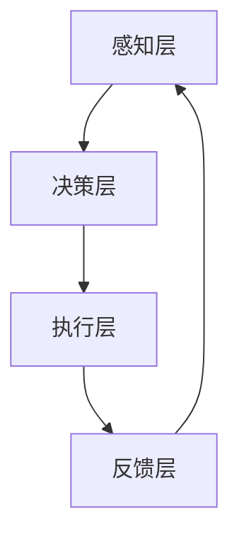
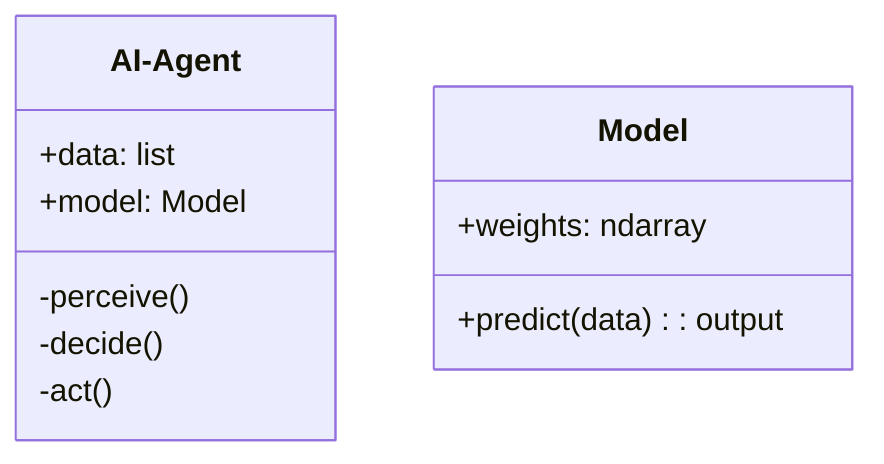

                 


# 企业AI Agent的多场景测试：模拟真实业务环境

**关键词**：AI Agent, 多场景测试, 企业应用, 智能系统, 流程自动化

**摘要**：  
随着人工智能技术的快速发展，AI Agent（智能代理）在企业中的应用越来越广泛。本文将深入探讨AI Agent在企业环境中的多场景测试方法，结合实际业务需求，分析如何通过模拟真实业务环境来验证和优化AI Agent的性能。文章从AI Agent的核心概念、算法原理、系统架构到实际测试案例，全面解析其在企业中的应用价值与挑战，为读者提供一套系统化的测试框架和实践指南。

---

# 第一部分: 企业AI Agent的背景与概念

## 第1章: 企业AI Agent的背景与概念

### 1.1 人工智能与AI Agent的演进
#### 1.1.1 从传统AI到AI Agent的演进
人工智能（AI）技术经历了从规则驱动到数据驱动的演变，而AI Agent作为人工智能的核心实现形式，是具有自主决策能力的智能体。AI Agent能够根据环境信息做出决策并执行动作，从而实现特定目标。

#### 1.1.2 AI Agent的核心概念与特点
AI Agent是一种能够感知环境、自主决策并执行任务的智能体。其核心特点包括：
- **自主性**：能够在没有外部干预的情况下自主运行。
- **反应性**：能够实时感知环境变化并做出反应。
- **目标导向性**：通过优化目标函数来实现最优决策。
- **可扩展性**：能够适应不同的业务场景和规模。

#### 1.1.3 企业级AI Agent的定义与边界
在企业环境中，AI Agent通常被定义为一种能够处理复杂业务流程、优化资源利用并提供决策支持的智能系统。其边界包括从数据输入、模型训练到任务执行的整个生命周期。

### 1.2 企业AI Agent的应用场景
#### 1.2.1 客户服务与支持
AI Agent可以通过自然语言处理技术（NLP）与客户进行交互，提供即时的问答服务和问题解决支持。

#### 1.2.2 业务流程自动化
AI Agent能够自动化处理复杂的业务流程，例如订单处理、物流调度和财务审核。

#### 1.2.3 数据分析与决策支持
AI Agent可以通过大数据分析技术为企业提供实时的决策支持，例如市场预测和风险评估。

#### 1.2.4 供应链与库存管理
AI Agent可以优化供应链管理，通过预测需求和协调资源来提高库存周转率。

### 1.3 本章小结
本章从AI Agent的核心概念出发，分析了其在企业环境中的应用场景，为后续章节的测试方法奠定了基础。

---

# 第二部分: 企业AI Agent的核心技术与原理

## 第2章: AI Agent的核心概念与联系

### 2.1 AI Agent的构成与核心要素
#### 2.1.1 感知层: 数据采集与处理
AI Agent的感知层负责从外部环境获取数据并进行预处理。例如，通过传感器或API接口获取实时数据，并将其转化为模型可以处理的格式。

#### 2.1.2 决策层: 策略制定与优化
决策层是AI Agent的核心部分，负责根据感知到的信息制定决策策略。常用的策略优化方法包括强化学习（Reinforcement Learning）和遗传算法（Genetic Algorithm）。

#### 2.1.3 执行层: 行动与反馈
执行层负责将决策层制定的策略转化为具体行动，并通过反馈机制对执行结果进行评估。

#### 2.1.4 反馈层: 性能评估与改进
反馈层通过收集执行结果的数据，评估AI Agent的性能，并根据评估结果优化其决策策略。

### 2.2 核心概念对比与ER实体关系图
#### 2.2.1 不同层次的特征对比表

| 层次       | 特征               | 描述                                   |
|------------|--------------------|----------------------------------------|
| 感知层     | 数据采集           | 从外部环境获取数据                   |
| 决策层     | 策略制定           | 根据数据制定决策策略                 |
| 执行层     | 行动               | 将策略转化为具体行动                 |
| 反馈层     | 性能评估           | 评估执行结果并优化策略               |

#### 2.2.2 实体关系图（Mermaid）


---

## 第3章: AI Agent的算法原理与数学模型

### 3.1 大语言模型的算法原理
#### 3.1.1 Transformer模型的结构与特点
Transformer模型由编码器和解码器组成，其核心思想是通过自注意力机制（Self-Attention）捕捉序列中的长距离依赖关系。

#### 3.1.2 注意力机制的数学公式
$$ \text{Attention}(Q,K,V) = \text{softmax}\left(\frac{QK^T}{\sqrt{d_k}}\right)V $$

其中：
- $Q$、$K$、$V$分别为查询（Query）、键（Key）、值（Value）矩阵。
- $d_k$为键的维度。

### 3.2 算法实现与代码示例
#### 3.2.1 简单AI Agent的Python实现
```python
class AI-Agent:
    def __init__(self):
        self.model = load_model()
        self.data = []
    
    def perceive(self, input_data):
        # 数据预处理
        self.data = preprocess(input_data)
    
    def decide(self):
        # 调用模型进行决策
        return self.model.predict(self.data)
    
    def act(self, action):
        # 执行具体操作
        pass
```

---

# 第三部分: 企业AI Agent的系统分析与架构设计

## 第4章: 系统分析与架构设计方案

### 4.1 问题场景介绍
在企业环境中，AI Agent需要处理复杂的业务流程，例如订单处理和库存管理。为了确保其在真实业务环境中的稳定性和可靠性，需要进行多场景测试。

### 4.2 系统功能设计
#### 4.2.1 领域模型（Mermaid类图）


#### 4.2.2 系统架构设计（Mermaid架构图）


#### 4.2.3 接口设计与交互流程
AI Agent需要与企业系统中的其他模块进行交互，例如数据库和第三方API。通过定义清晰的接口规范，可以确保不同模块之间的协作效率。

### 4.3 本章小结
本章通过系统分析和架构设计，明确了AI Agent在企业环境中的实现方式和交互流程。

---

# 第四部分: 项目实战与测试案例分析

## 第5章: 项目实战

### 5.1 环境安装与配置
为了进行多场景测试，需要安装必要的开发工具和测试框架。例如，使用Python的测试框架`pytest`和机器学习框架`TensorFlow`。

### 5.2 系统核心实现
#### 5.2.1 代码实现
```python
def test_scenario1():
    agent = AI-Agent()
    input_data = generate_test_data()
    agent.perceive(input_data)
    result = agent.decide()
    assert result == expected_output
```

#### 5.2.2 代码解读与分析
通过编写测试用例，可以验证AI Agent在不同场景下的表现。例如，测试其在客户交互和业务流程自动化中的准确性。

### 5.3 实际案例分析
以客户服务场景为例，分析AI Agent在处理客户咨询时的表现。通过模拟真实客户提问，测试其回答的准确性和响应速度。

### 5.4 测试结果解读
通过分析测试结果，可以发现AI Agent在某些场景下的不足，并对其进行优化。例如，通过调整模型参数来提高其在特定场景下的性能。

### 5.5 本章小结
本章通过实际项目实战，展示了如何通过多场景测试来验证和优化AI Agent的性能。

---

# 第五部分: 最佳实践与注意事项

## 第6章: 最佳实践

### 6.1 测试策略与注意事项
在进行多场景测试时，需要注意以下几点：
- **测试场景的多样性**：覆盖不同的业务场景和数据类型。
- **测试数据的质量**：确保测试数据具有代表性。
- **测试结果的可解释性**：通过日志和可视化工具分析测试结果。

### 6.2 小结
通过本文的分析，我们可以看到，AI Agent在企业环境中的应用前景广阔，但其测试和优化需要结合实际业务需求，采用系统化的测试方法。

---

**作者：AI天才研究院/AI Genius Institute & 禅与计算机程序设计艺术 /Zen And The Art of Computer Programming**

---

**注**：以上目录大纲仅为示例，具体内容需要根据实际需求进行扩展和补充。

