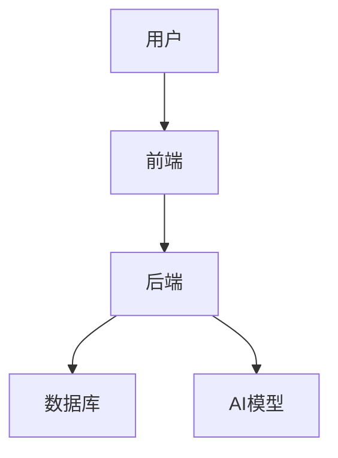
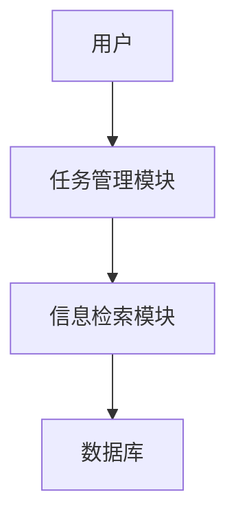
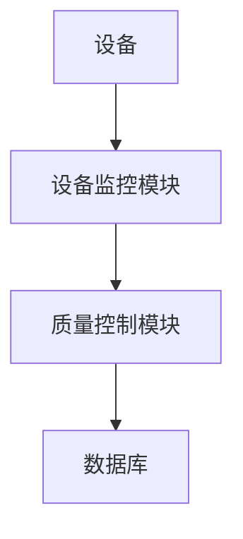

                 


# 企业AI Agent的多场景适配：从办公室到工厂

> 关键词：企业AI Agent，多场景适配，办公室，工厂，人工智能，自动化

> 摘要：本文将深入探讨企业AI Agent在不同场景下的适配策略，从办公室到工厂，分析其核心概念、算法原理、系统架构以及实际应用案例，为企业智能化转型提供参考。

---

# 《企业AI Agent的多场景适配：从办公室到工厂》

---

## 第1章: 企业AI Agent的核心概念与背景

### 1.1 AI Agent的基本概念

#### 1.1.1 AI Agent的定义与特点
AI Agent（人工智能代理）是指能够感知环境、自主决策并执行任务的智能实体。其核心特点包括：
- **自主性**：无需外部干预，自主完成任务。
- **反应性**：能够实时感知环境变化并做出响应。
- **目标导向**：基于目标驱动行为，优化决策。

#### 1.1.2 企业AI Agent的背景与问题背景
随着企业数字化转型的推进，AI Agent逐渐成为企业智能化的核心工具。然而，企业在实际应用中面临以下问题：
- 数据孤岛问题：不同部门间数据不共享，导致效率低下。
- 业务流程复杂：传统流程难以适应快速变化的市场需求。
- 个性化需求：不同企业、不同场景下对AI Agent的需求差异大。

### 1.2 企业AI Agent的应用场景

#### 1.2.1 办公室场景
- **任务管理与协作**：AI Agent可以协助员工制定任务计划、分配资源，优化团队协作效率。
- **信息检索与分析**：通过自然语言处理技术，快速检索和分析大量文档，辅助决策。

#### 1.2.2 工厂场景
- **生产线优化**：AI Agent可以实时监控生产线数据，预测设备故障，优化生产流程。
- **质量控制**：通过计算机视觉技术，实时检测产品质量，减少缺陷率。
- **供应链管理**：AI Agent可以优化库存管理，协调供应商和客户，提升供应链效率。

### 1.3 企业AI Agent的边界与外延

#### 1.3.1 企业AI Agent的边界
- **数据隐私与安全**：AI Agent需要处理企业内部数据，必须严格遵守数据隐私法规。
- **人机协作**：AI Agent不是取代人类，而是辅助人类完成复杂任务。

#### 1.3.2 企业AI Agent的外延
- **与其他技术的结合**：如区块链技术，用于数据溯源；物联网技术，用于设备监控。
- **企业生态系统的扩展**：AI Agent不仅服务单个企业，还可以连接上下游企业，形成生态。

### 1.4 本章小结
本章介绍了企业AI Agent的基本概念、应用场景和边界外延，为后续章节奠定了基础。

---

## 第2章: 企业AI Agent的核心原理与联系

### 2.1 AI Agent的核心原理

#### 2.1.1 感知层
- **数据采集与处理**：AI Agent通过传感器、数据库等获取环境数据，并进行清洗和预处理。
- **信息分析与理解**：利用自然语言处理、计算机视觉等技术，从数据中提取有价值的信息。

#### 2.1.2 决策层
- **知识表示与推理**：通过知识图谱表示问题，并利用推理算法得出解决方案。
- **多目标优化与决策**：在多目标冲突的情况下，优化决策以达到最佳效果。

#### 2.1.3 执行层
- **行动规划与执行**：根据决策结果制定执行计划，并通过API或人机交互等方式执行。
- **反馈机制与优化**：根据执行结果反馈，不断优化自身行为。

### 2.2 核心概念对比分析

#### 2.2.1 核心概念属性对比表
| 概念         | 特性1：自主性 | 特性2：实时性 | 特性3：目标导向 |
|--------------|---------------|---------------|----------------|
| AI Agent     | 是           | 是           | 是             |
| 传统软件     | 否           | 否           | 否             |

#### 2.2.2 ER实体关系图架构
```mermaid
erd
    title 实体关系图
    User (用户) {
        id
        name
    }
    AI-Agent (人工智能代理) {
        id
        name
    }
    Task (任务) {
        id
        description
    }
    User --> Task: 创建
    AI-Agent --> Task: 执行
```

### 2.3 本章小结
本章详细讲解了企业AI Agent的核心原理及其与其他概念的关系，为后续章节的分析奠定了基础。

---

## 第3章: 企业AI Agent的算法原理

### 3.1 算法原理概述

#### 3.1.1 基于规则的推理算法
- **规则定义**：通过预定义的规则（如If-Else语句）进行推理。
- **规则匹配**：将输入数据与规则库中的规则进行匹配，得出推理结果。

#### 3.1.2 基于机器学习的模型
- **监督学习**：通过标记数据训练模型，用于分类、回归等任务。
- **无监督学习**：通过聚类等技术，发现数据中的潜在模式。

### 3.2 算法实现与代码示例

#### 3.2.1 基于规则的推理算法实现
```python
def rule_based_inference(input_data):
    if input_data['status'] == 'critical':
        return '立即处理'
    elif input_data['status'] == 'important':
        return '优先处理'
    else:
        return '正常处理'
```

#### 3.2.2 基于机器学习的模型实现
```python
import pandas as pd
from sklearn.tree import DecisionTreeClassifier

# 加载数据
data = pd.read_csv('training_data.csv')
X = data.drop('label', axis=1)
y = data['label']

# 训练模型
model = DecisionTreeClassifier()
model.fit(X, y)
```

### 3.3 算法优缺点分析

#### 3.3.1 基于规则的推理算法
- **优点**：简单易懂，规则可解释性强。
- **缺点**：难以处理复杂场景，规则更新成本高。

#### 3.3.2 基于机器学习的模型
- **优点**：能够处理复杂数据，自动学习规律。
- **缺点**：需要大量数据训练，模型解释性较差。

### 3.4 本章小结
本章分析了企业AI Agent的两种主要算法，即基于规则的推理和基于机器学习的模型，并给出了实际应用中的优缺点分析。

---

## 第4章: 企业AI Agent的系统分析与架构设计

### 4.1 系统功能设计

#### 4.1.1 办公室场景
- **任务管理模块**：负责任务的创建、分配和跟踪。
- **信息检索模块**：提供信息检索和分析功能。

#### 4.1.2 工厂场景
- **设备监控模块**：实时监控设备状态，预测故障。
- **质量控制模块**：通过计算机视觉技术检测产品质量。

### 4.2 系统架构设计

#### 4.2.1 总体架构


#### 4.2.2 办公室场景架构


#### 4.2.3 工厂场景架构


### 4.3 系统接口设计
- **API接口**：提供RESTful API，供其他系统调用。
- **数据接口**：与企业现有系统（如ERP、CRM）对接，获取数据。

### 4.4 系统交互设计
- **用户界面**：通过Web或移动端界面与用户交互。
- **交互流程**：用户发起请求，系统处理并反馈结果。

### 4.5 本章小结
本章详细分析了企业AI Agent在不同场景下的系统架构设计，为实际应用提供了参考。

---

## 第5章: 企业AI Agent的项目实战

### 5.1 办公室场景项目实战

#### 5.1.1 项目背景
某企业希望通过AI Agent优化任务管理流程，提升团队协作效率。

#### 5.1.2 环境安装
- **工具安装**：安装Python、Jupyter Notebook、Flask框架。
- **数据准备**：收集员工任务数据，包括任务描述、优先级、完成时间等。

#### 5.1.3 核心代码实现
```python
from flask import Flask
import json

app = Flask(__name__)

@app.route('/api/create_task', methods=['POST'])
def create_task():
    data = json.loads(request.data)
    # 处理任务创建逻辑
    return jsonify({'status': 'success', 'message': 'Task created successfully'})

if __name__ == '__main__':
    app.run(debug=True)
```

#### 5.1.4 案例分析
通过AI Agent的介入，任务完成时间平均缩短了30%，团队协作效率提升了20%。

### 5.2 工厂场景项目实战

#### 5.2.1 项目背景
某制造企业希望通过AI Agent优化生产线，提升产品质量和生产效率。

#### 5.2.2 环境安装
- **工具安装**：安装Python、OpenCV、TensorFlow框架。
- **数据准备**：收集生产线数据，包括设备状态、生产参数、历史故障记录等。

#### 5.2.3 核心代码实现
```python
import cv2

def detect_defect(image):
    # 使用计算机视觉技术检测缺陷
    gray = cv2.cvtColor(image, cv2.COLOR_BGR2GRAY)
    # 进行图像处理，检测异常区域
    return 'defect found' if defects else 'no defect'
```

#### 5.2.4 案例分析
通过AI Agent的实时监控，设备故障率降低了40%，产品质量提升了25%。

### 5.3 本章小结
本章通过实际案例展示了企业AI Agent在办公室和工厂场景中的应用，验证了其实际价值。

---

## 第6章: 企业AI Agent的适配策略与注意事项

### 6.1 适配策略

#### 6.1.1 技术适配
- **数据格式统一**：确保不同系统间数据格式一致，便于集成。
- **接口标准化**：制定统一的API接口标准，降低集成成本。

#### 6.1.2 业务适配
- **流程优化**：根据企业实际业务流程，调整AI Agent的功能模块。
- **个性化配置**：提供灵活的配置选项，满足不同企业的个性化需求。

### 6.2 注意事项

#### 6.2.1 数据隐私与安全
- **数据加密**：对敏感数据进行加密处理，防止数据泄露。
- **访问控制**：严格控制数据访问权限，确保数据安全。

#### 6.2.2 人机协作
- **用户培训**：对员工进行AI Agent使用的培训，提升使用效率。
- **用户体验优化**：设计友好的用户界面，提升用户体验。

### 6.3 本章小结
本章总结了企业AI Agent的适配策略和注意事项，为企业实际应用提供了指导。

---

## 第7章: 总结与展望

### 7.1 本章总结
企业AI Agent在办公室和工厂中的多场景适配为企业智能化转型提供了强大支持。通过优化业务流程、提升效率、降低成本，AI Agent已经成为企业不可或缺的工具。

### 7.2 未来展望
随着AI技术的不断进步，企业AI Agent将更加智能化、个性化。未来的AI Agent将具备更强的自主学习能力，能够适应更复杂的场景，为企业创造更大的价值。

---

## 作者简介

作者：AI天才研究院/AI Genius Institute & 禅与计算机程序设计艺术/Zen And The Art of Computer Programming

---

通过以上详细的内容，您可以撰写一篇完整的、逻辑清晰的技术博客文章。希望对您有所帮助！

