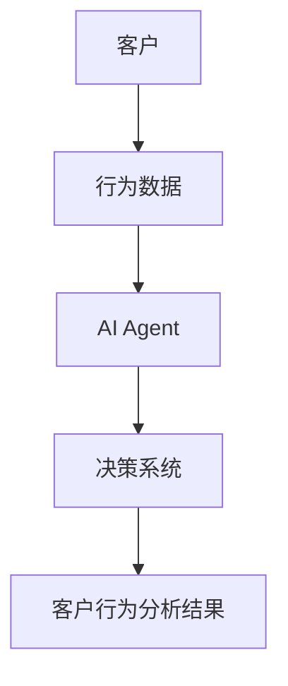
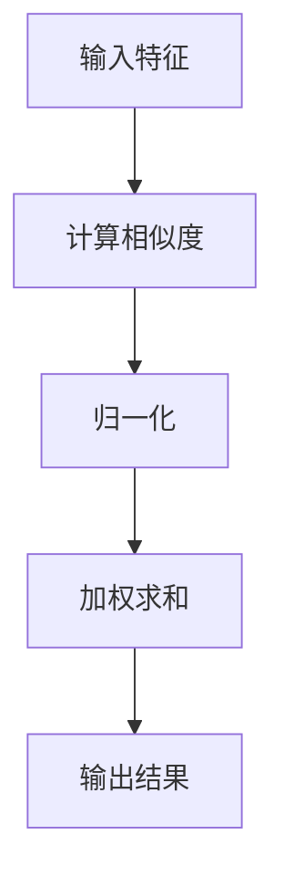
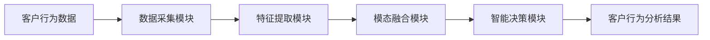
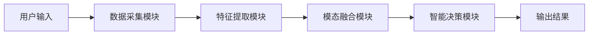

                 


# 企业AI Agent的多模态学习在客户行为分析中的深度应用

> **关键词**：AI Agent，多模态学习，客户行为分析，深度应用，系统架构，算法原理，项目实战

> **摘要**：本文深入探讨了企业AI Agent在客户行为分析中的多模态学习应用。从背景介绍、核心概念到算法原理、系统架构，再到项目实战和最佳实践，全面解析了AI Agent如何通过多模态学习技术提升客户行为分析的深度与广度。文章结合实际案例，详细阐述了AI Agent在企业中的具体应用场景、技术实现和实践价值。

---

## 第一部分：背景与概念

### 第1章：企业AI Agent与多模态学习概述

#### 1.1 问题背景与应用价值
现代企业在面对海量客户数据时，如何高效、准确地分析客户行为，成为了提升客户体验和业务决策的重要挑战。传统基于单一模态的数据分析方法（如仅依赖文本或仅依赖图像）已难以满足复杂场景下的需求。通过引入多模态学习技术，企业可以更全面地捕捉客户行为的多样性和复杂性，从而提升分析的准确性和深度。

AI Agent（人工智能代理）作为一种能够感知环境、自主决策的智能体，能够通过多模态学习技术整合来自文本、语音、图像等多种数据源的信息，从而更精准地理解和预测客户行为。这种技术的引入不仅能够提升企业的客户分析能力，还能通过自动化决策优化客户体验和业务流程。

#### 1.2 核心概念与问题描述
AI Agent的核心在于其能够通过多模态数据的融合，实现对客户行为的全面分析和智能决策。多模态学习则是指从多种数据模态（如文本、语音、图像等）中提取特征并进行联合学习，以提升模型的表达能力和泛化能力。

在企业客户行为分析中，常见的问题包括：
1. **数据异构性**：不同模态的数据格式和特征维度差异较大，难以直接融合。
2. **信息不完整性**：单一模态的数据可能无法全面捕捉客户的复杂行为。
3. **实时性要求**：客户行为分析需要快速响应，对模型的计算效率提出了较高要求。

AI Agent通过多模态学习技术，能够有效解决上述问题，实现对客户行为的深度分析和实时预测。

#### 1.3 问题解决与边界定义
AI Agent通过多模态学习技术，能够从文本、语音、图像等多种数据源中提取特征，并通过融合这些特征来提升客户行为分析的准确性和深度。具体来说，AI Agent可以通过以下方式解决客户行为分析中的问题：
1. **多模态数据融合**：通过将文本、语音、图像等多种数据进行融合，全面捕捉客户的复杂行为。
2. **智能决策支持**：基于融合后的多模态特征，AI Agent能够提供个性化的客户行为预测和决策支持。

在实际应用中，AI Agent的边界主要体现在以下几个方面：
1. **数据范围**：AI Agent仅处理与其集成的多模态数据相关的客户行为分析任务。
2. **决策范围**：AI Agent的决策能力受限于其训练数据和模型能力，无法处理超出训练范围的任务。
3. **实时性**：AI Agent的实时性取决于其计算能力和网络环境，复杂场景下的实时性可能受到限制。

#### 1.4 概念结构与核心要素
AI Agent的核心要素包括：
1. **感知模块**：负责从多模态数据源中提取特征。
2. **融合模块**：负责对多模态特征进行融合，形成统一的表示。
3. **决策模块**：基于融合后的特征，生成客户行为分析的结果或决策。

多模态学习的核心要素包括：
1. **数据模态**：包括文本、语音、图像等多种数据类型。
2. **特征提取**：对每种模态数据进行特征提取，形成中间表示。
3. **模态融合**：将不同模态的特征进行融合，形成统一的表示。

通过以上核心要素的协同工作，AI Agent能够实现对客户行为的深度分析和智能决策。

---

## 第二部分：核心概念与联系

### 第2章：AI Agent与多模态学习的原理

#### 2.1 AI Agent的核心原理
AI Agent的核心原理在于其能够通过多模态数据的融合，实现对客户行为的全面分析和智能决策。AI Agent的基本工作流程如下：
1. **数据感知**：通过多种数据源（如文本、语音、图像等）感知客户行为。
2. **特征提取**：对感知到的数据进行特征提取，形成中间表示。
3. **模态融合**：将不同模态的特征进行融合，形成统一的表示。
4. **智能决策**：基于融合后的特征，生成客户行为分析的结果或决策。

#### 2.2 多模态学习的特征对比
多模态学习的核心在于对不同模态数据的特征进行对比和融合。以下是几种常见模态的特征对比：

| 模态类型 | 特征维度 | 优点 | 缺点 |
|----------|----------|------|------|
| 文本      | 语义、情感 | 高语义信息 | 易受主观因素影响 |
| 语音      | 音调、语速 | 低语义信息 | 易受环境噪声影响 |
| 图像      | 颜色、形状 | 高空间信息 | 需要大量计算资源 |

通过对比不同模态的特征，可以更好地理解它们在客户行为分析中的优缺点，并为模态融合提供理论依据。

#### 2.3 实体关系与系统架构
以下是AI Agent与客户行为分析的实体关系图：



---

## 第三部分：算法原理与数学模型

### 第3章：AI Agent的多模态学习算法

#### 3.1 多模态融合算法
多模态融合的核心在于将不同模态的特征进行融合。一种常见的融合方法是交叉注意力机制，其数学表达式如下：

$$
\text{Attention}(Q, K, V) = \text{softmax}\left(\frac{QK^T}{\sqrt{d_k}}\right)V
$$

其中，$Q$、$K$、$V$分别表示查询、键、值矩阵，$d_k$为键的维度。

#### 3.2 注意力机制的实现
注意力机制的实现可以通过以下步骤完成：

1. **特征提取**：对每种模态数据进行特征提取，形成$Q$、$K$、$V$矩阵。
2. **计算相似度**：通过$QK^T$计算相似度，并将其归一化。
3. **加权求和**：通过softmax函数计算权重，并对$V$进行加权求和，得到最终的融合结果。

以下是注意力机制的流程图：



#### 3.3 Python实现示例
以下是注意力机制的Python实现示例：

```python
import torch

def attention(Q, K, V, d_k):
    # 计算相似度
    scores = torch.matmul(Q, K.transpose(-2, -1)) / torch.sqrt(torch.tensor(d_k, dtype=torch.float32))
    # 归一化
    scores = torch.softmax(scores, dim=-1)
    # 加权求和
    output = torch.matmul(scores, V)
    return output
```

通过上述算法，AI Agent可以实现对多模态数据的融合，从而提升客户行为分析的准确性。

---

## 第四部分：系统分析与架构设计

### 第4章：AI Agent系统架构

#### 4.1 系统功能设计
AI Agent系统的功能设计包括：
1. **数据采集**：从多种数据源采集客户行为数据。
2. **特征提取**：对采集到的数据进行特征提取，形成中间表示。
3. **模态融合**：将不同模态的特征进行融合，形成统一的表示。
4. **智能决策**：基于融合后的特征，生成客户行为分析的结果或决策。

#### 4.2 系统架构设计
以下是AI Agent系统的架构图：



#### 4.3 接口设计与交互
AI Agent系统需要与企业现有的业务系统进行对接，具体接口设计包括：
1. **数据接口**：与企业数据库对接，获取客户行为数据。
2. **决策接口**：与企业业务系统对接，输出客户行为分析结果或决策建议。

以下是系统交互的流程图：



---

## 第五部分：项目实战

### 第5章：AI Agent的客户行为分析实战

#### 5.1 环境安装
为了运行以下代码，需要安装以下依赖：
```bash
pip install numpy torch matplotlib
```

#### 5.2 核心代码实现
以下是AI Agent客户行为分析的核心代码实现：

```python
import torch
import torch.nn as nn
import torch.optim as optim

class MultiModalAgent(nn.Module):
    def __init__(self, input_size, hidden_size):
        super(MultiModalAgent, self).__init__()
        self.lstm = nn.LSTM(input_size, hidden_size, batch_first=True)
        self.fc = nn.Linear(hidden_size, 1)

    def forward(self, x):
        out, _ = self.lstm(x)
        out = self.fc(out[:, -1, :])
        return out

# 数据准备
X = torch.randn(100, 10, 5)  # 假设输入数据为100个样本，每个样本10个时间步，5个特征
y = torch.randn(100, 1)

# 模型训练
model = MultiModalAgent(5, 10)
criterion = nn.MSELoss()
optimizer = optim.Adam(model.parameters(), lr=0.001)

for epoch in range(100):
    outputs = model(X)
    loss = criterion(outputs, y)
    loss.backward()
    optimizer.step()
    print(f"Epoch {epoch+1}, Loss: {loss.item()}")
```

#### 5.3 案例分析
以下是AI Agent在客户行为分析中的一个实际案例：

**数据输入**：客户在电商平台上的行为数据，包括点击、浏览、加购、下单等行为。
**模型输出**：客户行为分析结果，包括客户的兴趣偏好、购买倾向等。
**业务价值**：帮助企业更好地理解客户行为，优化营销策略和客户体验。

---

## 第六部分：最佳实践

### 第6章：AI Agent的多模态学习应用总结

#### 6.1 小结
通过本文的深入探讨，我们可以看到，AI Agent通过多模态学习技术，能够实现对客户行为的深度分析和智能决策。这种技术的应用不仅能够提升企业的客户分析能力，还能通过自动化决策优化客户体验和业务流程。

#### 6.2 注意事项
在实际应用中，需要注意以下几点：
1. **数据质量**：确保多模态数据的准确性和完整性。
2. **模型泛化能力**：避免过拟合，确保模型的泛化能力。
3. **实时性要求**：根据实际需求，合理设计模型的计算效率。

#### 6.3 拓展阅读
1. **多模态学习**：深入学习多模态学习的理论和算法，探索其在其他领域的应用。
2. **AI Agent**：研究AI Agent的其他应用场景，探索其在智能决策中的潜力。

---

## 作者：AI天才研究院/AI Genius Institute & 禅与计算机程序设计艺术 /Zen And The Art of Computer Programming

---

以上是《企业AI Agent的多模态学习在客户行为分析中的深度应用》的技术博客文章的完整内容，希望对您有所帮助！

