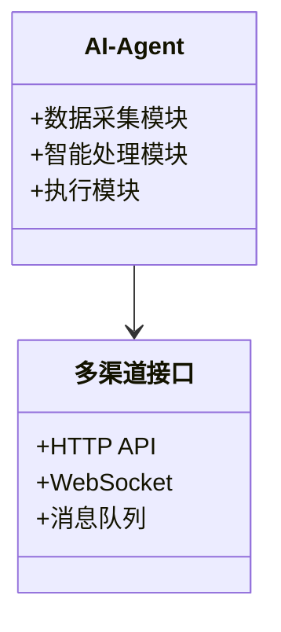

                 


# 企业AI Agent的多渠道集成：统一客户服务体验

## 关键词：AI Agent、多渠道集成、客户服务、自然语言处理、系统架构、项目实战

## 摘要：  
本文探讨了企业AI Agent在多渠道集成中的应用，分析了如何通过统一客户服务体验来提升企业竞争力。文章从AI Agent的基本概念入手，深入讲解了多渠道集成的必要性、核心算法原理、系统架构设计以及实际项目实现。通过详细的技术分析和实战案例，展示了如何利用AI Agent实现高效、一致的客户服务。

---

# 第1章: 企业AI Agent的定义与背景

## 1.1 AI Agent的基本概念

### 1.1.1 什么是AI Agent  
AI Agent（人工智能代理）是指能够感知环境、自主决策并执行任务的智能系统。它通过自然语言处理、机器学习等技术，模拟人类的思维过程，为企业提供自动化服务。

### 1.1.2 AI Agent的核心特征  
- **自主性**：无需人工干预，自动完成任务。  
- **反应性**：实时感知环境变化并做出响应。  
- **学习能力**：通过数据反馈不断优化性能。  

### 1.1.3 企业AI Agent的应用场景  
- 客户服务：通过聊天机器人提供咨询、解决问题。  
- 智能推荐：基于用户行为推荐产品或服务。  
- 运营支持：监控系统运行状态，预测潜在问题。  

## 1.2 多渠道集成的必要性

### 1.2.1 客户服务渠道的多样性  
- **传统渠道**：电话、邮件、传真。  
- **新兴渠道**：社交媒体、即时消息、在线聊天。  

### 1.2.2 统一客户体验的重要性  
- **减少客户流失**：通过一致的服务体验提高客户满意度。  
- **提升效率**：多渠道协同工作，减少重复劳动。  
- **增强品牌形象**：统一的响应风格提升品牌专业性。  

### 1.2.3 企业数字化转型的驱动力  
- **技术进步**：AI、大数据等技术的发展推动了多渠道集成。  
- **客户需求变化**：客户期望更快、更智能的服务体验。  

---

# 第2章: AI Agent与多渠道集成的核心概念

## 2.1 AI Agent的核心要素

### 2.1.1 感知层：数据采集与分析  
AI Agent通过传感器、API等渠道收集数据，利用NLP技术分析客户意图。  

### 2.1.2 决策层：智能决策与推理  
基于收集的数据，AI Agent通过决策树、贝叶斯网络等算法生成最优解决方案。  

### 2.1.3 执行层：行动与反馈  
根据决策结果，AI Agent执行操作（如发送邮件、更新数据库）并收集反馈以优化后续行为。  

## 2.2 多渠道集成的关键挑战

### 2.2.1 数据一致性与实时性  
- 数据格式不统一可能导致解析错误。  
- 实时性要求高，需快速响应客户请求。  

### 2.2.2 用户身份识别与切换  
- 不同渠道可能使用不同的身份验证方式。  
- 用户在不同渠道间切换时，需保持上下文一致。  

### 2.2.3 渠道间协同与冲突处理  
- 不同渠道可能有不同的优先级，需制定冲突处理规则。  

---

# 第3章: AI Agent的算法原理与实现

## 3.1 自然语言处理（NLP）基础

### 3.1.1 NLP的核心算法  
- **分词**：将文本分割成词或短语（如jieba算法）。  
- **句法分析**：分析句子结构（如依赖树）。  
- **情感分析**：判断文本情感倾向（如VADER算法）。  

### 3.1.2 意图识别与实体抽取  
- **意图识别**：确定用户的请求类型（如“查询订单状态”）。  
- **实体抽取**：提取关键信息（如订单号、客户姓名）。  

### 3.1.3 基于上下文的对话管理  
- 使用记忆网络（Memory Network）记录对话历史。  
- 根据上下文生成连贯的回复。  

## 3.2 智能决策算法

### 3.2.1 基于规则的决策树  
- 通过预定义规则构建决策树，适用于简单场景。  

### 3.2.2 基于概率的贝叶斯网络  
- 通过计算概率进行决策，适用于复杂场景。  

### 3.2.3 基于深度学习的强化学习  
- 使用深度神经网络（DNN）和强化学习（RL）优化决策过程。  

---

# 第4章: 多渠道集成的系统架构设计

## 4.1 系统功能设计

### 4.1.1 领域模型设计  
- 定义核心实体（如客户、订单、渠道）及其关系。  

### 4.1.2 功能模块划分  
- **数据采集模块**：收集多渠道数据。  
- **智能处理模块**：分析数据并生成响应。  
- **执行模块**：调用API执行操作。  

### 4.1.3 用户交互流程  
- 用户发起请求 → 数据采集 → 智能处理 → 执行操作 → 返回结果。  

## 4.2 系统架构图  



---

# 第5章: 项目实战与代码实现

## 5.1 环境搭建

### 5.1.1 开发工具安装  
- Python 3.8+  
- IDE（如PyCharm）  

### 5.1.2 依赖库安装  
- `pip install transformers`  
- `pip install websockets`  

## 5.2 核心代码实现

### 5.2.1 数据采集模块  

```python
import websockets
import asyncio

async def handle_message(message):
    # 数据处理逻辑
    return "Processed message"

async def receive_messages():
    async with websockets.connect('ws://localhost:8000') as websocket:
        while True:
            message = await websocket.recv()
            response = await handle_message(message)
            await websocket.send(response)

asyncio.run(receive_messages())
```

### 5.2.2 智能处理模块  

```python
from transformers import pipeline

nlp = pipeline("text-classification", model="bert-base-uncased")

def get_intent(text):
    return nlp(text)[0]['label']
```

---

# 第6章: 最佳实践与总结

## 6.1 小结  
企业AI Agent的多渠道集成能够显著提升客户服务体验，但实现过程中需克服数据一致性、用户识别等挑战。

## 6.2 注意事项  
- 确保数据安全与隐私保护。  
- 定期更新模型以应对客户需求变化。  

## 6.3 拓展阅读  
- 《深度学习实战》  
- 《自然语言处理入门》  

---

作者：AI天才研究院/AI Genius Institute & 禅与计算机程序设计艺术 /Zen And The Art of Computer Programming

