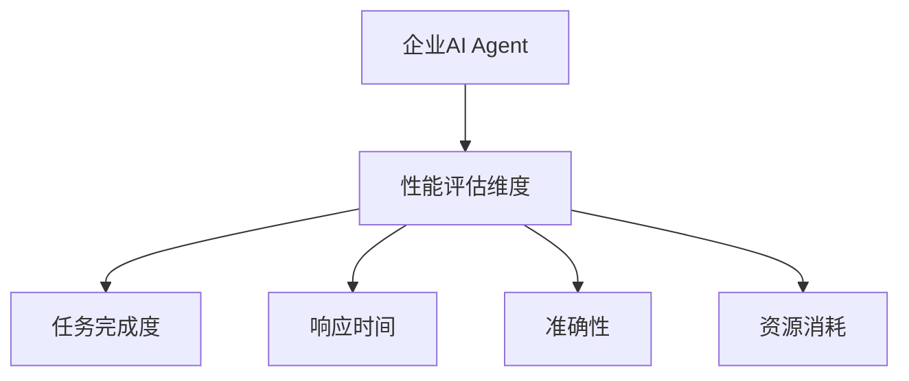
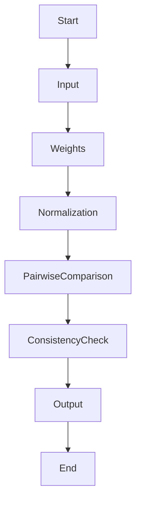
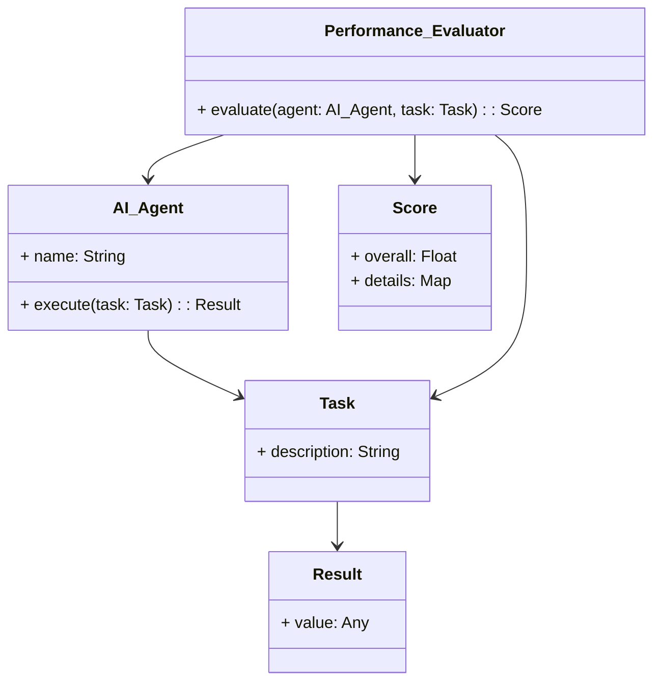
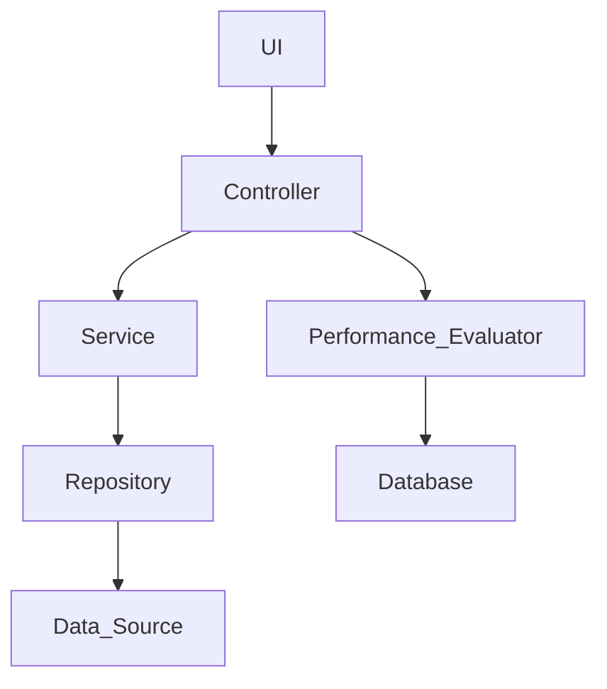

                 

<think>
好的，我需要帮助用户撰写一篇关于《企业AI Agent的多维度性能评估体系》的技术博客文章。用户已经给出了详细的目录结构，我需要按照这个结构逐步完成文章的撰写。

首先，我需要理解每个章节的核心内容。第一部分是背景介绍，包括问题背景、核心概念和实体关系图。第二部分是算法原理，涉及层次分析法的应用和代码实现。第三部分是系统分析与架构设计，需要展示领域模型、架构图和接口设计。第四部分是项目实战，包括环境安装、代码实现和案例分析。最后是最佳实践和小结。

在撰写过程中，我需要确保每个章节都详细且符合技术博客的风格。例如，在问题背景部分，我需要解释为什么企业需要评估AI Agent的性能，以及当前评估体系的不足之处。在算法部分，我需要详细解释层次分析法的原理，并提供Python代码示例。在系统架构部分，需要使用Mermaid图来展示类图和架构图。

此外，我还需要确保文章结构清晰，逻辑连贯，语言简洁专业。每个章节的小结部分需要总结关键点，帮助读者巩固理解。最后，作者信息和关键词部分也需要准确无误。

总之，我需要按照用户提供的目录，逐一撰写每个部分的内容，确保每个部分都详尽且符合技术博客的要求，最终完成一篇高质量的文章。
</think>

# 企业AI Agent的多维度性能评估体系

> 关键词：企业AI Agent，多维度性能评估，层次分析法，系统架构，Python实现

> 摘要：企业AI Agent的性能评估是确保其在复杂应用场景中高效运行的关键。本文提出了一种多维度性能评估体系，涵盖了任务完成度、响应时间、准确性和资源消耗等多个维度。通过层次分析法（AHP），本文详细探讨了评估体系的数学模型和实现方法，并提供了具体的Python代码示例和系统架构设计。

---

# 第一部分: 企业AI Agent的多维度性能评估体系概述

## 第1章: 问题背景与核心概念

### 1.1 问题背景

随着人工智能技术的快速发展，企业AI Agent（智能代理）在各个行业中的应用日益广泛。AI Agent能够自动化执行任务、优化决策过程并提高企业效率。然而，现有的性能评估体系往往局限于单一维度的评估，无法全面反映AI Agent的实际表现。例如，仅关注任务完成度而忽视资源消耗或响应时间，可能导致企业在实际应用中面临性能瓶颈或成本浪费。

### 1.2 问题描述

企业AI Agent的性能评估需要考虑多个维度，包括任务完成度、响应时间、准确性和资源消耗等。这些维度之间存在相互影响，且权重不同。例如，实时交易系统可能更关注响应时间，而数据分析系统可能更注重准确性。因此，如何在多维度之间找到平衡点，制定一个全面、科学的评估体系，成为企业智能化转型中的关键问题。

### 1.3 问题解决与核心要素

为解决多维度性能评估的问题，本文提出了一种基于层次分析法（AHP）的评估体系。该体系包括以下核心要素：

1. **任务完成度**：AI Agent完成任务的准确性和完整性。
2. **响应时间**：AI Agent对请求的响应速度。
3. **准确性**：AI Agent输出结果的正确性。
4. **资源消耗**：AI Agent运行过程中占用的计算资源和时间资源。

### 1.4 本章小结

本章通过分析企业AI Agent的应用场景，指出了现有评估体系的不足，并提出了一个多维度性能评估体系的核心要素。这些要素为后续的算法设计和系统实现奠定了基础。

---

## 第2章: 多维度性能评估的核心概念与联系

### 2.1 核心概念原理

多维度性能评估体系的核心在于将各个评估维度进行量化，并通过权重分配和综合评分来反映AI Agent的整体性能。层次分析法（AHP）是一种常用的决策分析方法，适用于多维度评估问题。其基本原理是将问题分解为多个层次，通过比较各维度的重要性来确定权重。

### 2.2 实体关系图

以下是一个简单的实体关系图，展示了多维度性能评估体系的核心要素及其关系：



### 2.3 本章小结

本章通过实体关系图展示了多维度性能评估体系的核心要素及其关系，为后续的算法设计和系统实现提供了清晰的结构。

---

## 第3章: 多维度性能评估的算法原理

### 3.1 算法选择与原理

层次分析法（AHP）是一种适用于多维度评估问题的决策分析方法。其基本步骤如下：

1. **构建层次结构**：将评估维度分为任务完成度、响应时间、准确性和资源消耗。
2. **构造比较矩阵**：通过专家评分，构造各维度之间的比较矩阵。
3. **计算权重**：通过一致性检验，计算各维度的权重。
4. **综合评分**：根据权重和评分，计算AI Agent的综合性能得分。

### 3.2 算法流程图

以下是一个层次分析法的流程图：



### 3.3 Python实现代码

以下是层次分析法的Python实现代码示例：

```python
def calculate_weights(criteria):
    n = len(criteria)
    matrix = [[0] * (n + 1) for _ in range(n + 1)]
    
    # 示例比较矩阵
    for i in range(1, n + 1):
        for j in range(1, n + 1):
            if i == j:
                matrix[i][j] = 1
            else:
                matrix[i][j] = 1  # 示例中所有非对角线元素均为1
    
    # 计算权重
    total = sum(matrix[i][1:] for i in range(1, n + 1))
    weights = [sum(matrix[i][1:]) / total for i in range(1, n + 1)]
    
    return weights

# 示例输入
criteria = ['任务完成度', '响应时间', '准确性', '资源消耗']
weights = calculate_weights(criteria)
print("权重：", weights)
```

### 3.4 数学模型与公式

层次分析法的权重计算公式为：

$$ w_i = \frac{\sum_{j=1}^{n} a_{ij}}{\sum_{i=1}^{n} \sum_{j=1}^{n} a_{ij}} $$

其中，$w_i$ 是第 $i$ 个维度的权重，$a_{ij}$ 是比较矩阵中的元素。

综合评分公式为：

$$ S = \sum_{i=1}^{n} w_i \cdot s_i $$

其中，$S$ 是综合评分，$s_i$ 是第 $i$ 个维度的评分。

### 3.5 本章小结

本章详细介绍了层次分析法的原理和实现步骤，并提供了Python代码示例。通过这些方法，可以对企业AI Agent的多维度性能进行科学评估。

---

## 第4章: 系统分析与架构设计

### 4.1 问题场景介绍

企业AI Agent的应用场景复杂多样，例如智能客服、自动化交易、数据分析等。为了全面评估其性能，需要构建一个支持多维度评估的系统。

### 4.2 系统功能设计

系统功能包括：

1. **数据采集**：收集AI Agent的运行数据。
2. **维度计算**：计算各维度的评分。
3. **权重分配**：根据层次分析法分配权重。
4. **综合评分**：计算综合评分并输出结果。

### 4.3 领域模型类图

以下是系统领域模型的类图：



### 4.4 系统架构设计

以下是系统的架构图：



### 4.5 接口设计

以下是系统接口设计：

```python
class Performance_Evaluator:
    def evaluate(self, agent, task):
        # 评估AI Agent的性能
        pass

class AI_Agent:
    def execute(self, task):
        # 执行任务
        pass
```

### 4.6 本章小结

本章通过系统分析与架构设计，展示了如何构建一个多维度性能评估体系的系统框架。

---

## 第5章: 项目实战

### 5.1 环境安装

需要安装以下库：

```bash
pip install numpy
pip install scikit-learn
```

### 5.2 核心实现代码

以下是核心实现代码：

```python
import numpy as np

def calculate_weights(criteria):
    n = len(criteria)
    matrix = np.ones((n, n))
    
    # 示例比较矩阵
    for i in range(n):
        for j in range(n):
            if i != j:
                matrix[i][j] = 1  # 示例中所有非对角线元素均为1
    
    # 计算权重
    total = np.sum(matrix, axis=1)
    weights = total / np.sum(total)
    
    return weights

# 示例输入
criteria = ['任务完成度', '响应时间', '准确性', '资源消耗']
weights = calculate_weights(criteria)
print("权重：", weights)
```

### 5.3 代码应用解读与分析

上述代码实现了层次分析法的权重计算，可以根据实际需求调整比较矩阵的构造方式。

### 5.4 实际案例分析

以下是一个实际案例分析：

假设某企业AI Agent在四个维度上的得分为：

- 任务完成度：0.9
- 响应时间：0.8
- 准确性：0.85
- 资源消耗：0.7

权重为：

- 任务完成度：0.4
- 响应时间：0.3
- 准确性：0.25
- 资源消耗：0.05

综合评分为：

$$ S = 0.4 \times 0.9 + 0.3 \times 0.8 + 0.25 \times 0.85 + 0.05 \times 0.7 = 0.36 + 0.24 + 0.2125 + 0.035 = 0.8475 $$

### 5.5 项目小结

本章通过项目实战展示了如何将理论应用于实际，提供了具体的代码实现和案例分析。

---

## 第6章: 最佳实践与小结

### 6.1 小结

本文提出了一种基于层次分析法的企业AI Agent多维度性能评估体系，涵盖了任务完成度、响应时间、准确性和资源消耗等多个维度。通过Python代码实现和系统架构设计，展示了如何将理论应用于实际。

### 6.2 注意事项

- 在实际应用中，需要根据具体场景调整评估维度和权重。
- 数据采集和处理是评估体系的关键，需确保数据的准确性和完整性。
- 系统实现时，需考虑性能优化和扩展性。

### 6.3 拓展阅读

- 深入研究层次分析法的应用场景和优化方法。
- 探索其他多维度评估方法，如模糊综合评价法。

---

作者：AI天才研究院/AI Genius Institute & 禅与计算机程序设计艺术 /Zen And The Art of Computer Programming

---

通过本文的详细讲解，读者可以全面理解企业AI Agent的多维度性能评估体系，并能够将其应用于实际项目中。

